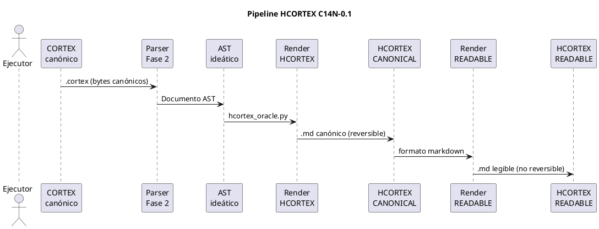

<!-- BLP:TITLE -->
# BLP-008: Fase 4 — Integracion HCORTEX Draft 0.1
<!-- /BLP:TITLE -->

---

<!-- BLP:1 -->
## §1: Planteamiento del Problema

La Fase 4 (HCORTEX Draft 0.1) tiene un paquete completo y validado en `UTILS/Codec-Cortex/CODEC_CORTEX_PHASE4/`. Este paquete completa el codec reversible CORTEX ↔ AST ↔ HCORTEX, cerrando además el bloqueo CE-7 del Gate F3 (HCORTEX-CANONICAL roundtrip estructural).

El paquete contiene:
- Especificación HCORTEX (`hcortex-0.1.md`) — representación humana canónica y reversible
- Especificación de diagnostics HCORTEX (`hcortex-errors-0.1.md`)
- Especificación de frontera VIEW (`view-extension-boundary-0.1.md`)
- Corpus: 40 fuentes canónicas, 40 ASTs, 40 HCORTEX-CANONICAL, 40 HCORTEX-READABLE
- 40 vectores CORTEX→HCORTEX, 40 HCORTEX→CORTEX, 40 roundtrip
- 16 casos inválidos con diagnostics esperados
- 40/40 roundtrip, 40/40 idempotencia, 0 dependencias VIEW
- Herramientas: `hcortex_oracle.py`, `validate_phase4.py`
- Documents de revisión: decisiones D4-001..D4-014, modelo de edición, security, protocolo Gate F4

**Evidencia:**
- Gate F3 bloqueado por CE-7 (HCORTEX-CANONICAL roundtrip) — este paquete lo resuelve
- Validación interna: 40/40 compile, 40/40 AST roundtrip, 40/40 CORTEX byte roundtrip, 40/40 idempotencia

**Impacto de no resolverlo:**
- CE-7 sigue bloqueando Gate F3
- El codec reversible no está completo
<!-- /BLP:1 -->

<!-- BLP:2 -->
## §2: Objetivo

Integrar HCORTEX Draft 0.1 desde UTILS/ al repositorio CODEC-CORTEX, verificar validación interna (40/40 roundtrip, 40/40 idempotencia), documentar el desbloqueo de CE-7 del Gate F3, y preparar el paquete para Gate F4 independiente.
<!-- /BLP:2 -->

<!-- BLP:3 -->
## §3: Precondiciones

- BLP-006 completado: C14N-0.1 integrado
- BLP-007 completado: CE-2 desbloqueado (Rust 40/40)
- CODEC_CORTEX_PHASE4/ disponible en UTILS/ con validación interna PASS
- Gate F3: CE-2 ✅, CE-7 ❌, REV ❌ — CE-7 se desbloquea con este BLP
<!-- /BLP:3 -->

<!-- BLP:4 -->
## §4: Principio Rector

**HCORTEX no oculta el AST.** Las tablas y fences visibles contienen el payload que el compilador reconstruye. No hay VIEW, perfiles de agente, runtime, aprendizaje, red ni LLM en la transformación.
<!-- /BLP:4 -->

<!-- BLP:5 -->
## §5: Contexto

El ecosistema CORTES tiene tres capas: (1) CORTEX canónico — archivos .cortex como los del corpus, (2) AST ideático — representación estructurada interna del parser, (3) HCORTEX — representación humana canónica y reversible en markdown.

Este BLP integra la tercera capa: el pipeline CORTEX → AST → HCORTEX-CANONICAL, más la representación HCORTEX-READABLE (explícitamente no reversible) que añade fences, tablas y formato markdown para humanos.

No hay VIEW, perfiles de agente, runtime, aprendizaje, red ni LLM. La transformación es puramente documental.
<!-- /BLP:5 -->

<!-- BLP:6 -->
## §6: Alcance y Exclusiones

**Dentro del alcance:**
- Integrar spec HCORTEX, diagnostics HCORTEX, y frontera VIEW en docs/standard/
- Integrar corpus (cortex, AST, HCORTEX-CANONICAL, HCORTEX-READABLE, loss reports, inválido)
- Integrar vectores (CORTEX→HCORTEX, HCORTEX→CORTEX, roundtrip)
- Integrar herramientas (hcortex_oracle.py, validate_phase4.py)
- Ejecutar validación interna y confirmar 40/40
- Documentar desbloqueo de CE-7 en GATE-F3-STATUS.md

**Fuera del alcance:**
- Certificar Gate F4 independiente (pendiente de revisión externa)
- Implementar segunda implementación HCORTEX
<!-- /BLP:6 -->

<!-- BLP:7 -->
## §7: Reglas Obligatorias

1. HCORTEX-CANONICAL es la representación humana reversible del AST — no una segunda ontología
2. HCORTEX-READABLE es explícitamente no reversible
3. VIEW es una extensión externa — no aparece en el corpus Gate
4. Los artefactos de F4 son COMPLETE_DRAFT — no se modifican, solo se integran
5. CE-7 se documenta como EXECUTED_PASS solo si validate_phase4.py pasa 40/40
<!-- /BLP:7 -->

<!-- BLP:8 -->
## §8: Diseño Técnico

El pipeline HCORTES tiene tres transformaciones documentales: CORTEX canónico → parse(AST) → render(HCORTEX-CANONICAL). La representación READABLE añade formato markdown (fences, tablas) que es explícitamente no reversible. No hay dependencia de VIEW, runtime, LLM, ni red.

<!-- /BLP:8 -->

<!-- BLP:9 -->
## §9: Diseño Operacional

1. Copiar specs: hcortex-0.1.md, hcortex-errors-0.1.md, view-extension-boundary-0.1.md → docs/standard/
2. Copiar F4-CHARTER.md → docs/standard/
3. Copiar tools → tools/
4. Copiar corpus → conformance/hcortex/
5. Copiar vectors → conformance/hcortex/vectors/
6. Copiar schemas → docs/schemas/
7. Copiar review docs → docs/review/
8. Ejecutar validate_phase4.py — confirmar 40/40
9. Actualizar GATE-F3-STATUS.md — CE-7 → EXECUTED_PASS
<!-- /BLP:9 -->

<!-- BLP:10 -->
## §10: Contratos

**Entrada:** CODEC_CORTEX_PHASE4/ en UTILS/ con 3 specs, corpus, tools, vectors, schemas, review docs.

**Salida:**
- `docs/standard/hcortex-0.1.md` — especificación HCORTEX
- `docs/standard/hcortex-errors-0.1.md` — diagnostics H4xx y pérdidas L4xx
- `docs/standard/view-extension-boundary-0.1.md` — frontera normativa con VIEW
- `docs/standard/F4-CHARTER.md` — principios y criterios de éxito
- `tools/hcortex_oracle.py`, `tools/validate_phase4.py`
- `conformance/hcortex/` — corpus de 40 casos + vectores + inválidos
- `docs/schemas/hcortex-*.schema.json` — schemas de metadata, vectores, loss reports
- `docs/review/` — decisiones D4, modelo de edición, security, protocolo Gate F4
<!-- /BLP:10 -->

<!-- BLP:11 -->
## §11: Procedimiento de Trabajo

1. `cp PHASE4/spec/hcortex-0.1.md docs/standard/`
2. `cp PHASE4/spec/hcortex-errors-0.1.md docs/standard/`
3. `cp PHASE4/spec/view-extension-boundary-0.1.md docs/standard/`
4. `cp PHASE4/F4-CHARTER.md docs/standard/`
5. `cp PHASE4/tools/*.py tools/`
6. `cp -r PHASE4/corpus conformance/hcortex/`
7. `cp -r PHASE4/vectors conformance/hcortex/vectors/`
8. `cp PHASE4/schemas/*.json docs/schemas/`
9. `cp PHASE4/review/*.md docs/review/`
10. `python3 tools/validate_phase4.py .` — confirmar 40/40
11. Actualizar GATE-F3-STATUS.md — CE-7 → EXECUTED_PASS
12. Actualizar SHA256SUMS.txt

**Reversión:** `git checkout` revierte integración. Originales en UTILS/ intactos.
<!-- /BLP:11 -->

<!-- BLP:12 -->
## §12: Criterios de Aceptación

AC-01: docs/standard/hcortex-0.1.md existe
AC-02: docs/standard/hcortex-errors-0.1.md existe
AC-03: docs/standard/view-extension-boundary-0.1.md existe
AC-04: validate_phase4.py existe y es ejecutable
AC-05: Validación: 40/40 compile, 40/40 AST roundtrip, 40/40 CORTEX byte roundtrip
AC-06: Validación: 40/40 HCORTEX idempotence, 40/40 hashes, 16/16 invalid
AC-07: 0 dependencias VIEW en el corpus Gate
AC-08: CE-7 documentado como EXECUTED_PASS en GATE-F3-STATUS.md
<!-- /BLP:12 -->

<!-- BLP:13 -->
## §13: Validaciones Requeridas

| Tipo | Descripción | Comando | Evidencia Esperada |
|---|---|---|---|---|
| test | Validación Python — roundtrip CORTEX→HCORTEX→CORTEX | `python3 tools/validate_phase4.py .` | 40/40 compile, 40/40 AST roundtrip, 40/40 CORTEX byte roundtrip |
| test | Validación Python — idempotencia y hashes | `python3 tools/validate_phase4.py .` | 40/40 HCORTEX idempotence, 40/40 hashes |
| test | Diagnostics inválidos HCORTEX | `python3 tools/validate_phase4.py .` | 16/16 invalid diagnostics |
| lint | 0 dependencias VIEW en el corpus Gate | `grep -c "view" conformance/hcortex/corpus/manifest.json` | 0 |
| integridad | SHA256SUMS | `sha256sum -c docs/standard/SHA256SUMS.txt` | OK |
<!-- /BLP:13 -->

<!-- BLP:14 -->
## §14: Tareas

- [ ] T-1: Copiar spec hcortex-0.1.md → docs/standard/
- [ ] T-2: Copiar spec hcortex-errors-0.1.md → docs/standard/
- [ ] T-3: Copiar spec view-extension-boundary-0.1.md → docs/standard/
- [ ] T-4: Copiar F4-CHARTER.md → docs/standard/
- [ ] T-5: Copiar tools (hcortex_oracle.py, validate_phase4.py) → tools/
- [ ] T-6: Copiar corpus → conformance/hcortex/
- [ ] T-7: Copiar vectores → conformance/hcortex/vectors/
- [ ] T-8: Copiar schemas → docs/schemas/
- [ ] T-9: Copiar review docs → docs/review/
- [ ] T-10: Ejecutar validate_phase4.py — confirmar 40/40
- [ ] T-11: Actualizar GATE-F3-STATUS.md — CE-7 → EXECUTED_PASS
- [ ] T-12: Actualizar SHA256SUMS.txt
<!-- /BLP:14 -->

<!-- BLP:15 -->
## §15: Riesgos

| ID | Descripción | Impacto | Mitigación |
|---|---|---|---|
| R-01 | validate_phase4.py requiere Python 3.12+ y puede fallar por dependencias | Medio — validación parcial | Python 3.12 disponible. Si falla, revisar imports de hcortex_oracle.py. |
| R-02 | Corpus de F4 tiene 303 archivos — copia puede fallar por espacio | Bajo | Verificar espacio antes de copiar. Si falla, copiar por grupos. |
| R-03 | validate_phase4.py espera rutas específicas (corpus/, vectors/) | Medio — symlinks rotos | Revisar rutas del script antes de ejecutar. Crear symlinks si es necesario. |
<!-- /BLP:15 -->

<!-- BLP:16 -->
## §16: Regla de Bloqueo

1. validate_phase4.py retorna FAIL con más de 5 errores
**Acción:** DETENER. Revisar rutas de corpus. Los paths del script pueden necesitar ajuste.

2. validate_phase4.py muestra dependencias VIEW (no 0)
**Acción:** DETENER_E_INFORMAR. El paquete de F4 no debe tener dependencias VIEW. Escalar al Arquitecto.

**Escalar a:** Arquitecto Principal
<!-- /BLP:16 -->

<!-- BLP:17 -->
## §17: Salida Esperada

HCORTEX Draft 0.1 integrado en CODEC-CORTEX. CE-7 desbloqueado: validación interna 40/40 compile, 40/40 AST roundtrip, 40/40 CORTEX byte roundtrip, 40/40 idempotencia, 40/40 loss reports, 16/16 inválidos. Gate F3: 2/3 bloqueos resueltos (CE-2 ✅, CE-7 ✅, REV ❌). Gate F4: internal functional PASS, independent gate PENDING.
<!-- /BLP:17 -->

<!-- BLP:18 -->
## §18: Contrato de Calidad

| Compuerta | Estado |
|---|---|
| has_clear_objective | ✅ |
| has_verifiable_preconditions | ✅ |
| has_scope_and_exclusions | ✅ |
| has_acceptance_criteria | ✅ |
| has_work_procedure | ✅ |
| has_required_validations | ✅ |
| has_learning_recorded | ✅ |
<!-- /BLP:18 -->

> Todas las compuertas deben estar en ✅ antes de blueprint.ready(). Ver blueprint-workflow skill.