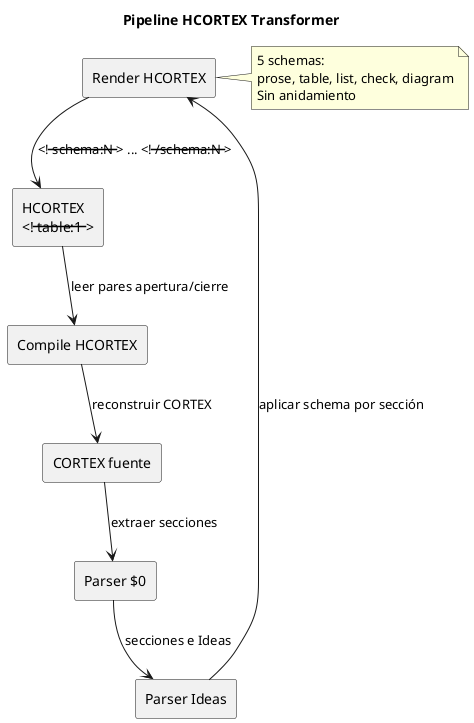

<!-- BLP:TITLE -->
# BLP-011: Transformer HCORTEX bidireccional + roundtrip
<!-- /BLP:TITLE -->

---

<!-- BLP:1 -->
## §1: Planteamiento del Problema

La especificación actual de HCORTEX (`hcortex-0.1.md`) y el corpus generado en BLP-010 usan schemas sin pares (`<!-- schema=table -->`) y 7 tipos que incluyen conceptos del viejo diseño (`code`, `puml`, `body`, `prosa`, `rel`). El Arquitecto ha redefinido el diseño con 3 cambios fundamentales:

1. **Schemas emparejados**: `<!-- schema:N -->` ... `<!-- /schema:N -->` — apertura y cierre explícitos. Sin ambigüedad sobre dónde termina un bloque.

2. **5 schemas, no 7**: `prose`, `table`, `list`, `check`, `diagram`. Eliminados `code`, `puml` (absorbidos en `diagram`), `body` y `rel` (absorbidos en `prose` o `table` según contexto).

3. **Schema por sección, no por sigilo**: El schema se declara a nivel de sección HCORTEX (§N), envolviendo todo el contenido de esa sección. No es un field del contrato en $0.

4. **Minúscula**: `prose`, `table`, `list`, `check`, `diagram`.

5. **Sin anidamiento** en v0.1. Si una sección necesita mezclar schemas, se divide en subsecciones.

**Evidencia:**
- El diseño de schemas sin pares produce ambigüedad sobre dónde termina un bloque
- El corpus actual generado en BLP-010 no refleja el diseño aprobado por el Arquitecto
- La visión HCORTEX requiere schemas declarativos, no inferidos
<!-- /BLP:1 -->

<!-- BLP:2 -->
## §2: Objetivo

Re-implementar HCORTEX según el diseño aprobado por el Arquitecto: (1) reescribir `hcortex-0.1.md` con 5 schemas emparejados, (2) regenerar corpus con formato `<!-- schema:N -->` ... `<!-- /schema:N -->`, (3) implementar `tools/hcortex_transformer.py` con render y compile usando schemas emparejados, (4) verificar roundtrip 40/40.
<!-- /BLP:2 -->

<!-- BLP:3 -->
## §3: Precondiciones

- BLP-010: hcortex-0.1.md con 9 pilares, 7 esquemas
- Corpus HCORTEX con schemas en experiments/gate-f4/hcortex-canonical/
- hcortex-0.1.md §6: reglas de transformación por esquema (table, list, puml, code, body, prosa, rel)
- hcortex-0.1.md §9: parser de una línea — verifica conformidad contra contrato en $0
<!-- /BLP:3 -->

<!-- BLP:4 -->
## §4: Principio Rector

**La especificación es la autoridad. El transformador sigue la especificación — no al revés.** Cada regla de transformación se implementa exactamente como está documentada en hcortex-0.1.md §6. No se introducen optimizaciones, atajos ni inferencias no documentadas.
<!-- /BLP:4 -->

<!-- BLP:5 -->
## §5: Contexto

<!-- /BLP:5 -->

<!-- BLP:6 -->
## §6: Alcance y Exclusiones

**Dentro del alcance:**
- Implementar `tools/hcortex_transformer.py` con pipeline bidireccional
- Implementar render CORTEX→HCORTEX: para cada Idea, aplicar schema declarado
- Implementar compile HCORTEX→CORTEX: leer schema y reconstruir payload
- Ejecutar roundtrip contra 40 casos del corpus
- Generar corpus HCORTEX-CANONICAL y vectores de roundtrip
- Actualizar REV-PACKAGE

**Fuera del alcance:**
- Implementación Rust (BLP-012)
- Prueba de comprensión LLM (BLP-013)
<!-- /BLP:6 -->

<!-- BLP:7 -->
## §7: Reglas Obligatorias

1. El transformador usa los 7 schemas definidos en hcortex-0.1.md §6 — no 6, no 8
2. Render CORTEX→HCORTEX: $0 no se renderiza; secciones → `##`, Ideas → según schema
3. Compile HCORTEX→CORTEX: leer `<!-- schema=X -->`, mapear al shape correspondiente, reconstruir $0 si hay `<!-- schema=glossary -->`
4. La transformación es directa — sin AST intermedio normativo
5. HCORTEX-READABLE se genera a partir de HCORTEX-CANONICAL añadiendo formato markdown adicional
<!-- /BLP:7 -->

<!-- BLP:8 -->
## §8: Diseño Técnico

Los 5 schemas con pares apertura/cierre:

| Schema | Contenido HCORTEX | Ejemplo |
|---|---|---|
| `prose:N` | Párrafos, texto libre | `<!-- prose:4 -->` ... `<!-- /prose:4 -->` |
| `table:N` | Tabla markdown | `<!-- table:13 -->` ... `<!-- /table:13 -->` |
| `list:N` | Bullet list | `<!-- list:1 -->` ... `<!-- /list:1 -->` |
| `check:N` | Checklist | `<!-- check:3 -->` ... `<!-- /check:3 -->` |
| `diagram:N` | PUML en fence | `<!-- diagram:5 -->` ... `<!-- /diagram:5 -->` |

Reglas:
- N es el número de sección
- Sin anidamiento en v0.1
- Schema a nivel de sección, no de sigilo
- En CORTEX, el schema no se declara — es una propiedad de visualización, no del dato
<!-- /BLP:8 -->

<!-- BLP:9 -->
## §9: Diseño Operacional

1. Reescribir hcortex-0.1.md con 5 schemas emparejados
2. Regenerar corpus con formato nuevo
3. Implementar render CORTEX→HCORTEX: parse $0, parse Ideas, aplicar schema por sección, emitir con pares
4. Implementar compile HCORTEX→CORTEX: leer pares, mapear schema→shape, reconstruir payloads
5. Ejecutar roundtrip contra 40 casos
6. Actualizar REV-PACKAGE
<!-- /BLP:9 -->

<!-- BLP:10 -->
## §10: Contratos

**Entradas esperadas:**
- _Formato, archivo o payload de entrada_

**Salidas esperadas:**
- _Archivos creados, modificados o reportes generados_

**Comandos:**
- `python3 tools/hcortex_transformer.py --render input.cortex` — renderiza a HCORTEX
- `python3 tools/hcortex_transformer.py --compile input.md` — compila a CORTEX
- `python3 tools/hcortex_transformer.py --roundtrip input.cortex` — verifica roundtrip completo
<!-- /BLP:10 -->

<!-- BLP:11 -->
## §11: Procedimiento de Trabajo

**Fase 1 — Spec y corpus:**
1. Reescribir `docs/standard/hcortex-0.1.md` con 5 schemas + ejemplos + pares
2. Regenerar corpus HCORTEX en `experiments/gate-f4/hcortex-canonical/`

**Fase 2 — Transformer:**
3. Crear `tools/hcortex_transformer.py` con clase `HCortexTransformer`
4. Implementar `render(cortex_text)` → produce HCORTEX con `<!-- schema:N -->` pares
5. Implementar `compile(hcortex_text)` → produce CORTEX con $0 reconstruido

**Fase 3 — Validación:**
6. Ejecutar roundtrip contra 40 casos de `conformance/hcortex/cortex/`
7. Verificar equivalencia semántica (payloads idénticos)

**Fase 4 — Cierre:**
8. Actualizar REV-PACKAGE con nuevo corpus y spec
9. SHA256SUMS.txt

**Reversión:** `git checkout` revierte cambios.
<!-- /BLP:11 -->

<!-- BLP:12 -->
## §12: Criterios de Aceptación

AC-01: `docs/standard/hcortex-0.1.md` define los 5 schemas emparejados (prose, table, list, check, diagram)
AC-02: Corpus HCORTEX usa formato `<!-- schema:N -->` ... `<!-- /schema:N -->` para los 40 casos
AC-03: `tools/hcortex_transformer.py` implementa render CORTEX→HCORTEX con schemas emparejados
AC-04: `tools/hcortex_transformer.py` implementa compile HCORTEX→CORTEX leyendo pares
AC-05: Roundtrip: `compile(render(x)) == x` para 40/40 casos
AC-06: $0 no se renderiza en HCORTEX
<!-- /BLP:12 -->

<!-- BLP:13 -->
## §13: Validaciones Requeridas

| Tipo | Descripción | Comando | Evidencia Esperada |
|---|---|---|---|---|
| test | Render CORTEX→HCORTEX con schemas | `python3 tools/hcortex_transformer.py --render input.cortex --output output.md` | output contiene <!-- schema= --> |
| test | Compile HCORTEX→CORTEX | `python3 tools/hcortex_transformer.py --compile output.md` | CORTEX válido según validador F2 |
| test | Roundtrip 40 casos | `python3 tools/hcortex_transformer.py --roundtrip conformance/hcortex/cortex/*.cortex` | 40/40 PASS |
| integridad | SHA256SUMS | `sha256sum -c docs/standard/SHA256SUMS.txt` | OK |
<!-- /BLP:13 -->

<!-- BLP:14 -->
## §14: Tareas

- [ ] **T-1:** Reescribir `docs/standard/hcortex-0.1.md` con 5 schemas emparejados, ejemplos
- [ ] **T-2:** Regenerar corpus en `experiments/gate-f4/hcortex-canonical/` con formato nuevo
- [ ] **T-3:** Implementar render CORTEX→HCORTEX en `tools/hcortex_transformer.py`
- [ ] **T-4:** Implementar compile HCORTEX→CORTEX en `tools/hcortex_transformer.py`
- [ ] **T-5:** Ejecutar roundtrip contra 40 casos y verificar equivalencia semántica
- [ ] **T-6:** Actualizar REV-PACKAGE con nuevo corpus y spec
<!-- /BLP:14 -->

<!-- BLP:15 -->
## §15: Riesgos

| ID | Descripción | Impacto | Mitigación |
|---|---|---|---|---|
| R-01 | El parser de CORTEX actual (F2) puede fallar en casos borde del corpus F4 | Medio | El transformer usará el parser existente como base. Si falla, documentar el caso. |
| R-02 | La compilación HCORTEX→CORTEX puede generar CORTEX con diferencias de formato | Bajo | El roundtrip se evalúa por equivalencia semántica (payload), no por byte-identidad. |
<!-- /BLP:15 -->

<!-- BLP:16 -->
## §16: Regla de Bloqueo

_Condiciones bajo las cuales el ejecutor DEBE detenerse e informar._

1. El parser CORTEX base no funciona para el corpus F4 (>5 errores)
**Acción:** DETENER. Revisar compatibilidad del parser con los archivos F4.

2. La compilación HCORTEX→CORTEX produce CORTEX inválido en >5 casos
**Acción:** DETENER_E_INFORMAR. Revisar reglas de schema para el shape correspondiente.

**Escalar a:** Arquitecto Principal
<!-- /BLP:16 -->

<!-- BLP:17 -->
## §17: Salida Esperada

**Archivos creados:**
- `tools/hcortex_transformer.py` — transformador bidireccional CORTEX↔HCORTEX con 7 schemas

**Evidencia:**
- `experiments/gate-f4/roundtrip-results.json` — resultados de roundtrip 40/40

**Resumen:**
> Transformador HCORTEX implementado con 7 schemas. Roundtrip bidireccional verificado: 40/40 casos completados. CORTEX→HCORTEX con schemas explícitos; HCORTEX→CORTEX con reconstrucción de $0.
<!-- /BLP:17 -->

<!-- BLP:18 -->
## §18: Contrato de Calidad

| Compuerta | Estado |
|---|---|
| has_clear_objective | ✅ |
| has_verifiable_preconditions | ✅ |
| has_scope_and_exclusions | ✅ |
| has_acceptance_criteria | ✅ |
| has_work_procedure | ✅ |
| has_required_validations | ✅ |
| has_learning_recorded | ✅ |
<!-- /BLP:18 -->

> Todas las compuertas deben estar en ✅ antes de blueprint.ready(). Ver blueprint-workflow skill.