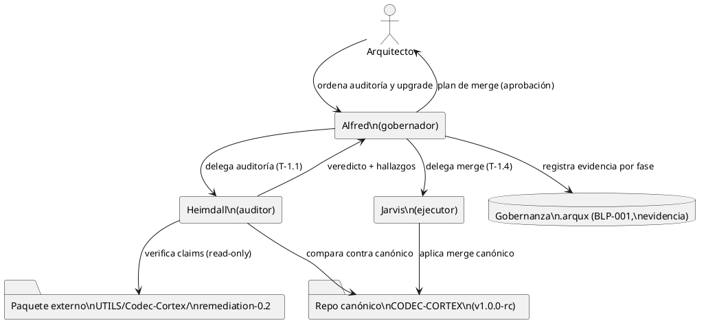
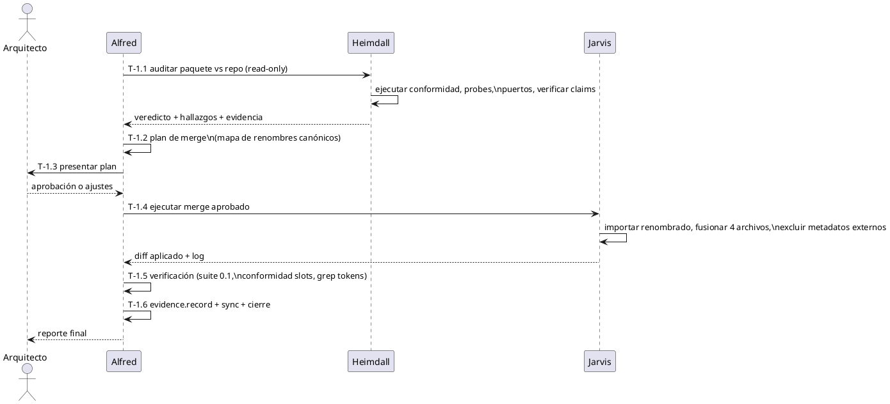

<!-- BLP:TITLE -->
# BLP-001: Auditar (Heimdall) el paquete codec-cortex-0.2-remediation contra el repo canónico local y ejecutar (Jarvis) el upgrade que lo haga canónico, bajo la directriz: ningún archivo, programa ni esquema declara versión en su nombre/referencia; el proyecto sigue canónicamente en v1.0.0-rc con nombres canónicos sin versión.
<!-- /BLP:TITLE -->

---

<!-- BLP:1 -->
## §1: Planteamiento del Problema

Un agente externo entregó el paquete `/home/vatrox/workspace/UTILS/Codec-Cortex/codec-cortex-0.2-remediation.tar.gz` con una remediación del codec (soporte de slots explícitos ※N). El Arquitecto ordenó auditarlo contra el repositorio canónico local y, si cumple, hacerlo canónico. El paquete llega sin verificación independiente y con señales de alerta detectadas en el reconocimiento previo.

**Evidencia:**
- Reconocimiento estructural (2026-07-20): 48 rutas solo en el paquete (módulos nuevos, puertos, corpus, specs), solo 4 archivos con contenido distinto (`__init__.py`, `__main__.py`, `lib.rs`, `skill/codec-cortex.skill.md`), 0.1 core idéntico byte a byte.
- El worklog del paquete se contradice con su propio contenido: declara "R5 NOT-RUN" (puertos sin implementar) pero el paquete incluye implementaciones slots en Go/Node/Rust/Bash; declara 1/6 spec docs pero incluye los 6, duplicados en `docs/standard/` y `spec/`.
- Módulos fantasma: `__init__.py` y `__main__.py` referencian `codec_cortex.migration` y `codec_cortex.harness-02`, ausentes del paquete.
- `skill/codec-cortex.skill.md` fue reemplazado (no extendido): posible pérdida de la guía 0.1 local.
- Evidencia débil confesada: probes 8/29, HCORTEX roundtrip 8/30, self-review.

**Impacto de no resolverlo:**
Fusionar sin auditar compromete la confianza del codec canónico (evidencia falsa o código roto entra como "canónico"). No fusionar pierde trabajo externo potencialmente valioso. Además, sin la directriz de nombres canónicos, la superficie del repo quedaría contaminada con tokens de versión (`-02`, `0.2`) que rompen la convención v1.0.0-rc.
<!-- /BLP:1 -->

<!-- BLP:2 -->
## §2: Objetivo

Determinar, mediante auditoría independiente (Heimdall), si el paquete `codec-cortex-0.2-remediation` cumple lo que declara frente al repositorio canónico local; producir un plan de upgrade aprobado por el Arquitecto; y ejecutarlo (Jarvis) de modo que el repositorio local integre la funcionalidad de slots con **nombres canónicos sin versión** (el proyecto permanece en v1.0.0-rc), la superficie 0.1 intacta, y toda la evidencia registrada en gobernanza.
<!-- /BLP:2 -->

<!-- BLP:3 -->
## §3: Precondiciones

- [ ] **P-01:** Paquete extraído en `/home/vatrox/workspace/UTILS/Codec-Cortex/remediation-0.2/cortex-baseline` — verificación: `ls` del directorio.
- [ ] **P-02:** Repositorio canónico íntegro en `/home/vatrox/workspace/CODEC-CORTEX` con venv funcional (`.venv/bin/python`) — verificación: `python -c "import codec_cortex"`.
- [ ] **P-03:** Fix `_find_blueprint` aplicado y servidor MCP reiniciado (resolución por ciclo activo operativa) — verificación: `blueprint.read(BLP-001)` devuelve CYCLE-03.
- [ ] **P-04:** Identidades `heimdall` (auditor) y `jarvis` (ejecutor) disponibles en `.arqux/identities/` del workspace.
- [ ] **P-05:** Manifiesto de CYCLE-03 poblado y directriz de nombres canónicos registrada (CYC-OBJ-2, regla 2).
<!-- /BLP:3 -->

<!-- BLP:4 -->
## §4: Principio Rector

**Nada entra al repositorio canónico sin veredicto de auditoría independiente registrado como evidencia; ningún archivo, programa ni esquema declara versión en su nombre o referencia; toda afirmación se respalda con evidencia reproducible o se declara honestamente como no verificada.**
<!-- /BLP:4 -->

<!-- BLP:5 -->
## §5: Contexto

Entorno del Blueprint: el Arquitecto dirige; Alfred gobierna; Heimdall audita el paquete externo contra el repo canónico; Jarvis ejecuta el merge aprobado. El paquete vive fuera del repo canónico (UTILS/) y solo entra tras veredicto + plan aprobado.

<!-- /BLP:5 -->

<!-- BLP:6 -->
## §6: Alcance y Exclusiones

**Dentro del alcance:**
- Auditoría del paquete `codec-cortex-0.2-remediation` contra el repo canónico local (y solo eso, por directriz del Arquitecto).
- Plan de merge con nombres canónicos sin versión.
- Ejecución del merge aprobado sobre `/home/vatrox/workspace/CODEC-CORTEX`.
- Verificación post-merge y registro de evidencia.

**Fuera del alcance (excluido explícitamente):**
- Implementar funcionalidad faltante del paquete (migración, harness, fuzz, benchmark) — se reporta, no se construye aquí.
- Publicación (PyPI, tags, releases).
- Cambios a la especificación CORTEX 0.1.
- Auditoría de historia git o procedencia externa del paquete.
<!-- /BLP:6 -->

<!-- BLP:7 -->
## §7: Reglas Obligatorias

1. **Nombres canónicos sin versión:** prohibido importar cualquier archivo, directorio, módulo o símbolo cuyo nombre contenga tokens de versión (`_02`, `-02`, `0.2`, `02` como sufijo de versión). Todo lo importado se renombra a nombre semántico canónico. Versión del proyecto: v1.0.0-rc.
2. **Superficie 0.1 intacta:** los módulos 0.1 existentes (`parser.py`, `scalars.py`, `c14n.py`, `hcortex.py`, `harness.py`), su corpus y sus specs no se modifican semánticamente.
3. **Auditoría antes de merge:** ningún archivo del paquete entra al repo sin veredicto de Heimdall registrado vía `evidence.record`.
4. **Reportar antes de bypassear:** si una validación falla, se informa al Arquitecto; prohibido rodearla.
5. **Evidencia por fase:** cada fase (auditoría, plan, merge, verificación) registra evidencia en el pulse del proyecto.
6. **El paquete es fuente read-only:** la auditoría no modifica ni el paquete ni el repo; el merge solo ocurre en T-1.4 sobre el repo canónico.
<!-- /BLP:7 -->

<!-- BLP:8 -->
## §8: Diseño Técnico

Arquitectura del upgrade en tres grupos, según el resultado de la auditoría:

**Grupo A — Importar renombrado (nombres canónicos semánticos, prefijo de dominio `slot`):**
- `codec_cortex/scalars_02.py` → `codec_cortex/slots.py`
- `codec_cortex/parser_02.py` → `codec_cortex/slotparser.py`
- `codec_cortex/c14n_02.py` → `codec_cortex/slotc14n.py`
- `codec_cortex/hcortex_02.py` → `codec_cortex/slothcortex.py`
- `codec_cortex/dispatcher.py` → nombre ya canónico, importar tal cual
- Puertos: `parser-02.js|parser_02.go|parser_02.rs|parser-02.sh` → `slotparser.*`; `c14n-02`/`hcortex-02`/`migration` → `slotc14n.*`/`slothcortex.*`/`slotmigrate.*`
- `conformance/0.2/` → `conformance/slots/`
- Spec docs `CORTEX-SPEC-0.2.md`, `C14N-0.2.md`, `errors-0.2.md`, `fundamental-glossary-0.2.md`, `hcortex-0.2.md` → variantes `*-SLOTS.md` en una sola ubicación (decidir `docs/standard/` vs `spec/`, eliminar duplicado)
- Gramática `cortex-0.2.ebnf/.abnf` → `cortex-slots.ebnf/.abnf` (una sola ubicación)

**Grupo B — Fusionar con decisión explícita (4 archivos modificados):**
- `codec_cortex/__init__.py`: integrar exports slots de forma aditiva; resolver referencias a módulos fantasma (`migration`, `harness_02`) según veredicto de auditoría; la versión permanece `1.0.0-rc`.
- `codec_cortex/__main__.py`: integrar subcomandos nuevos solo si sus módulos existen y pasan.
- `codec-cortex-rs/src/lib.rs`: re-export del módulo slots, sin tocar superficie 0.1.
- `skill/codec-cortex.skill.md`: **conservar el skill local 0.1** e integrar el contenido slots de forma aditiva (no reemplazo).

**Grupo C — No importar / destino fuera del canónico:**
- `.git/`, `result.md`, `result.cortex`, `REMEDIATION_WORKLOG.md`, `final-manifest.json`, `rev-report.json` (metadatos del agente externo)
- `reports/` → se archiva como evidencia en gobernanza, no en el repo
- `agent-ctx/`, `experiments/benchmark|security` (duplican estructura local) → evaluar en plan

El mapa final de renombres y destinos es el entregable de T-1.2 (plan de merge), condicionado al veredicto de T-1.1.
<!-- /BLP:8 -->

<!-- BLP:9 -->
## §9: Diseño Operacional

Flujo de ejecución exacto: auditoría → veredicto → plan → aprobación humana → merge → verificación → cierre.

<!-- /BLP:9 -->

<!-- BLP:10 -->
## §10: Contratos

**Entradas:**
- Paquete extraído: `/home/vatrox/workspace/UTILS/Codec-Cortex/remediation-0.2/cortex-baseline/` (fuente read-only)
- Repositorio canónico: `/home/vatrox/workspace/CODEC-CORTEX/`
- Worklog y reportes del paquete (`REMEDIATION_WORKLOG.md`, `result.md`, `reports/`)

**Salidas:**
- Reporte de auditoría Heimdall con veredicto y evidencia reproducible (archivado en gobernanza)
- Plan de merge aprobado (mapa de renombres canónicos + destinos)
- Repositorio canónico fusionado con nombres sin versión
- Eventos de evidencia en pulse (auditoría, plan, merge, verificación)
- `brain.cortex` sincronizado con el filesystem (sync.reconcile)
<!-- /BLP:10 -->

<!-- BLP:11 -->
## §11: Procedimiento de Trabajo

Plan por fases con reversión:

| Fase | Paso | Acción | Reversión |
|---|---|---|---|
| F1 | Paso 1 | Heimdall audita (read-only): estructura, conformidad 0.1/0.2, probes, puertos, módulos fantasma, skill, duplicados | No aplica (sin mutaciones) |
| F1 | Paso 2 | Heimdall emite veredicto: cumple / cumple parcial / no cumple + lista de bloqueantes | No aplica |
| F2 | Paso 3 | Alfred produce plan de merge (mapa de renombres canónicos, destinos, exclusiones) | No aplica |
| F2 | Paso 4 | Arquitecto aprueba o ajusta el plan | No aplica |
| F3 | Paso 5 | Jarvis: snapshot de seguridad (`git status` limpio o backup del árbol afectado) | Restaurar desde git/backup |
| F3 | Paso 6 | Jarvis aplica merge según plan aprobado | `git checkout -- .` / restaurar backup |
| F4 | Paso 7 | Verificación: suite 0.1 sin cambios, conformidad slots, grep de tokens de versión = 0, imports resueltos | Revertir merge |
| F4 | Paso 8 | Evidencia final, sync.reconcile, cierre del BLP | No aplica |
<!-- /BLP:11 -->

<!-- BLP:12 -->
## §12: Criterios de Aceptación

- [x] **AC-01:** Veredicto de auditoría Heimdall registrado como evidencia, con comandos y salidas reproducibles — verificación: `evidence.list` muestra el evento y el reporte existe en gobernanza.
  > [2026-07-20T17:21:00Z] Verified: Veredicto CUMPLE PARCIAL registrado en evidencia de T-1.1; reporte en /home/vatrox/workspace/UTILS/Codec-Cortex/remediation-0.2/AUDIT-HEIMDALL-BLP-001.md con comandos y salidas.
- [x] **AC-02:** Cero nombres con token de versión en la superficie importada — verificación: `find`/`grep -E "(_02|-02|0\.2)"` sobre rutas importadas devuelve vacío.
  > [2026-07-20T17:21:12Z] Verified: find sobre codec_cortex, conformance/slots, puertos y docs/standard sin coincidencias de _02|-02|0.2 en nombres; símbolos públicos renombrados (parse_slots, hash_slots, HASH_DOMAIN_SLOTS); strings de protocolo (cortex:0.2, dominios C14N) intactos por ser datos.
- [x] **AC-03:** Suite de tests del repo canónico pasa igual o mejor que antes del merge — verificación: `pytest` verde post-merge.
  > [2026-07-20T17:21:16Z] Verified: pytest post-merge: 3 passed + 1 error de colección preexistente (experiments/gate-f3/rust, jul-17) — idéntico al baseline medido por Heimdall pre-merge.
- [x] **AC-04:** Conformidad slots pasa en el repo fusionado (válidos e inválidos del corpus importado) — verificación: ejecución del harness/corpus conformidad con resultado registrado.
  > [2026-07-20T17:21:19Z] Verified: Conformidad slots en repo fusionado: 30/30 válidos parsean, 35/35 inválidos rechazados vía dispatcher (re-ejecución independiente de Alfred).
- [x] **AC-05:** Referencias a módulos inexistentes (módulos fantasma) resueltas: o el módulo existe y funciona, o la referencia se elimina — verificación: import del paquete sin `ImportError` en paths declarados.
  > [2026-07-20T17:21:22Z] Verified: __init__.py sin referencias a migration/harness_02/hcortex_02; import codec_cortex expone API completa sin ImportError; CLI con solo subcomandos funcionales (parse/validate/canonicalize/hash/harness).
- [x] **AC-06:** `brain.cortex` sincronizado con el filesystem y BLP cerrado con evidencia — verificación: `sync.reconcile` sin deriva.
  > [2026-07-20T17:22:12Z] Verified: sync.reconcile nivel ciclo OK (CYCLE-03 métricas sincronizadas); lección registrada en identidad; BLP se cierra con evidencia completa en §14.
<!-- /BLP:12 -->

<!-- BLP:13 -->
## §13: Validaciones Requeridas

- **V-01:** Ejecución de la suite de tests del repo canónico (pytest) antes y después del merge — comparación de resultados.
- **V-02:** Ejecución del corpus de conformidad slots (válidos + inválidos) en el repo fusionado.
- **V-03:** Escaneo de tokens de versión en nombres de archivos importados (`_02`, `-02`, `0.2`) — resultado esperado: vacío.
- **V-04:** Import smoke test del paquete Python (`import codec_cortex` + API slots declarada) sin ImportError.
<!-- /BLP:13 -->

<!-- BLP:14 -->
## §14: Tareas

- [x] **T-1.1:** Auditoría Heimdall — verificar claims del paquete contra el repo local: preservación 0.1, conformidad slots (30/30 + 35/35), probes, puertos (Go/Node/Rust/Bash compilan y pasan), módulos fantasma, skill, duplicados spec. Entregable: reporte con veredicto.
  > [2026-07-20T16:22:30Z] Veredicto Heimdall: CUMPLE PARCIAL. Verificado: 0.1 preservado byte a byte; conformidad slots 30/30+35/35 reproducida vía dispatcher; puertos Go/Node/Rust/Bash compilan y pasan (worklog contradicho); probes 8 pass / 1 fail (P22) / 20 not_run; HCORTEX roundtrip 8/30 sin goldens; módulos fantasma migration + harness_02 confirmados (6 subcomandos CLI rotos); skill reemplazado con pérdida (137 a 38 líneas); spec/ duplicado byte-exacto de docs/standard/ (24 archivos); 37 rutas con tokens de versión; contaminación .git (27MB), .arqux ajeno, rutas /home/z/. Reporte: /home/vatrox/workspace/UTILS/Codec-Cortex/remediation-0.2/AUDIT-HEIMDALL-BLP-001.md
- [x] **T-1.2:** Plan de merge canónico — mapa final de renombres sin versión, destinos, exclusiones, tratamiento de los 4 archivos modificados. Depende de T-1.1. Responsable: Alfred.
  > [2026-07-20T16:24:49Z] Plan de merge canónico producido: 3 grupos (importar verificado renombrado / fusionar con cirugía / excluir roto o contaminante). Principio: solo lo verificado por Heimdall entra; HCORTEX slots y migración quedan fuera como deuda documentada.
- [x] **T-1.3:** Aprobación del Arquitecto del plan de merge. Gate humano. Depende de T-1.2.
  > [2026-07-20T16:24:52Z] Plan aprobado por el Arquitecto en sesión (2026-07-20): "aprobado".
- [x] **T-1.4:** Ejecución del merge — snapshot, importación renombrada, fusión de los 4 archivos, exclusiones. Depende de T-1.3. Responsable: Jarvis.
  > [2026-07-20T16:50:01Z] Merge ejecutado por Jarvis: 25 archivos importados con renombre canónico (slots/slotparser/slotc14n + puertos), 4 fusionados con cirugía (__init__ dual vía dispatcher, __main__ con 4 subcomandos + harness, lib.rs, skill conservado), símbolos públicos sin tokens de versión, strings de protocolo intactos. Verificaciones de Jarvis: pytest idéntico al baseline (3 passed + 1 error preexistente), conformidad slots 30/30+35/35, go test ok, node 13/13, cargo 39 passed, bash 13 passed, CLI parse exit 0. Backup en /tmp/opencode/codec-cortex-pre-merge.tar.gz. Desviaciones menores: fix _ast_to_dict del CLI (2 bugs latentes del paquete), uso de dispatcher en vez de detect_version inexistente.
- [x] **T-1.5:** Verificación post-merge (V-01 a V-04, AC-02 a AC-05). Depende de T-1.4. Responsable: Alfred.
  > [2026-07-20T17:20:56Z] Verificación independiente Alfred (V-01..V-04): pytest 3 passed + error de colección preexistente idéntico al baseline; conformidad slots re-ejecutada 30/30 válidos + 35/35 inválidos vía dispatcher; grep tokens de versión en archivos nuevos vacío; import smoke OK (parse_cortex dual, parse_slots, hash_slots/hash_legacy, dominios CORTEX-C14N-*); puertos re-verificados: go test ok, node 13/13, cargo 39 passed/0 failed, bash PASS; CLI validate/hash exit 0; exclusiones confirmadas (sin hcortex_02, migration, harness_02, reports, worklog).
- [x] **T-1.6:** Evidencia final + sync.reconcile + cierre del BLP. Depende de T-1.5. Responsable: Alfred.
  > [2026-07-20T17:22:02Z] sync.reconcile a nivel ciclo OK (CYCLE-03: 1 BLP in_progress, métricas actualizadas). Reconcile a nivel proyecto falla por selector $3/OBJ:_ (quirk del handler, sin impacto en el merge). Lección registrada vía identity.record.
<!-- /BLP:14 -->

<!-- BLP:15 -->
## §15: Riesgos

| Riesgo | Impacto | Mitigación |
|---|---|---|
| Módulos fantasma (`migration`, `harness_02`) referenciados pero ausentes | Imports silenciosos por try/except ocultan funcionalidad rota; CLI anuncia subcomandos que fallan | Auditoría los confirma; el merge los excluye o los implementa explícitamente |
| Worklog contradice el contenido del paquete (puertos "NOT_RUN" pero presentes) | Confianza baja en toda la evidencia del paquete | Auditoría re-ejecuta todo; ningún claim se acepta sin reproducción |
| Skill local reemplazado pierde la guía CORTEX 0.1 | Regresión de la superficie documental del repo | Merge conserva el skill local e integra slots aditivamente |
| Spec docs duplicados (`docs/standard/` vs `spec/`) | Divergencia futura entre copias | Plan decide ubicación única canónica |
| El paquete incluye `.git/` y metadatos del agente externo | Contaminación del repo canónico | Grupo C de exclusión explícita |
| Evidencia débil (probes 8/29, roundtrip 8/30) | La funcionalidad HCORTEX/migración puede no estar lista | Veredicto puede limitar el alcance del merge a lo verificado |
<!-- /BLP:15 -->

<!-- BLP:16 -->
## §16: Regla de Bloqueo

El ejecutor DEBE detenerse e INFORMAR al Arquitecto si:
- **Condición 1:** La auditoría detecta cualquier modificación de la superficie 0.1 (archivos, corpus o specs) en el paquete.
- **Condición 2:** La suite de tests del repo canónico falla tras el merge, o la conformidad slots no reproduce los resultados declarados.
- **Condición 3:** Aparece ambigüedad en la directriz de nombres canónicos (caso no cubierto por la regla).

**Escalar a:** el Arquitecto.
<!-- /BLP:16 -->

<!-- BLP:17 -->
## §17: Salida Esperada

El repositorio canónico CODEC-CORTEX integra la funcionalidad de slots del paquete externo — verificada por auditoría independiente — con nombres canónicos sin versión, superficie 0.1 intacta, suite y conformidad verdes, y toda la evidencia registrada en gobernanza.
<!-- /BLP:17 -->

<!-- BLP:18 -->
## §18: Contrato de Calidad

| Compuerta | Estado |
|---|---|
| has_clear_objective | ✅ |
| has_verifiable_preconditions | ✅ |
| has_scope_and_exclusions | ✅ |
| has_acceptance_criteria | ✅ |
| has_work_procedure | ✅ |
| has_required_validations | ✅ |
| has_learning_recorded | ☐ (se registra al cierre vía identity.record) |
<!-- /BLP:18 -->

> Todas las compuertas deben estar en ✅ antes de blueprint.ready(). Ver blueprint-workflow skill.