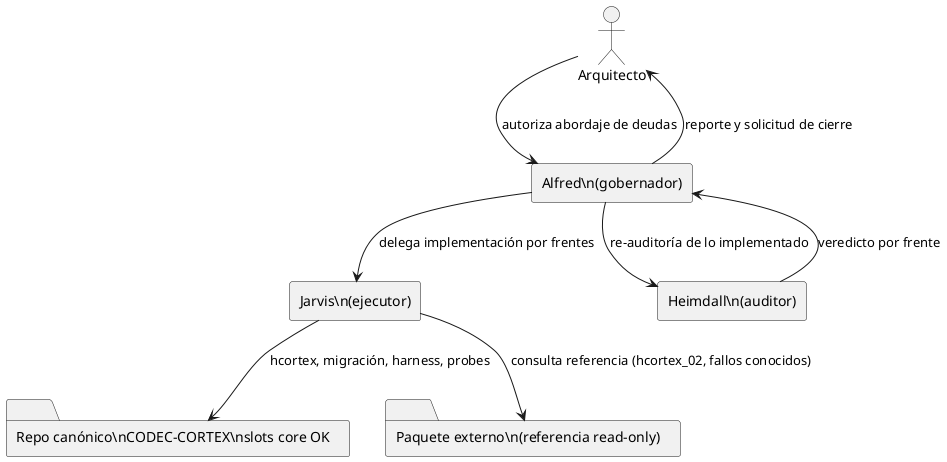
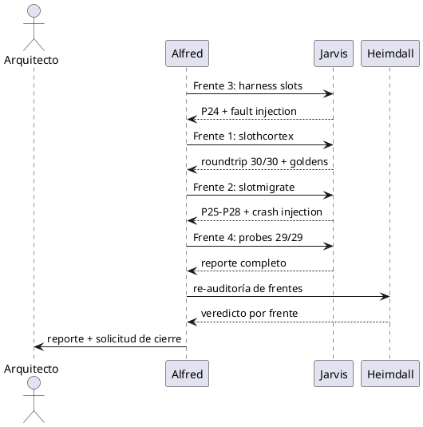

<!-- BLP:TITLE -->
# BLP-002: Abordar las deudas detectadas por la auditoría Heimdall del paquete 0.2-remediation y excluidas del merge BLP-001: (1) HCORTEX slots (roundtrip 8/30, sin goldens, P22 falla), (2) módulo de migración 0.1→slots transaccional con CLI (probes P25-P28), (3) harness de conformidad slots manifest-driven con subcomando CLI (P24, fault injection), (4) ampliación de probes a los 20 no ejecutados. Todo con nombres canónicos sin versión.
<!-- /BLP:TITLE -->

---

<!-- BLP:1 -->
## §1: Planteamiento del Problema

El merge BLP-001 integró al canónico solo la funcionalidad verificada del paquete externo (veredicto Heimdall: CUMPLE PARCIAL). Quedaron fuera cuatro deudas por no estar verificadas o directamente ausentes, y su ausencia deja la superficie slots incompleta frente a su propia spec (`hcortex-slots.md` ya está en el repo sin implementación que la respalde).

**Evidencia:**
- HCORTEX slots: roundtrip 8/30 reproducido por Heimdall, sin goldens (directorio vacío), probe P22 en fallo — `hcortex_02.py` excluido del merge.
- Migración: `codec_cortex.migration` referenciado por el paquete pero inexistente; subcomandos CLI `migrate *` excluidos; probes P25-P28 sin implementar. (Node y Bash sí trajeron `slotmigrate.*`, ya importados pero sin contraparte Python ni verificación de equivalencia).
- Harness: `codec_cortex.harness_02` inexistente; subcomando CLI `conformance` excluido; probe P24 (corpus vacío debe fallar) sin implementar.
- Probes: 20 de 29 sin ejecutar (P04-P09, P11-P16, P19-P20, P23-P28) por falta de harness y migración.

**Impacto de no resolverlo:**
La superficie slots queda a medias: sin reversibilidad humana (HCORTEX), sin camino de migración para documentos 0.1 existentes (incluidos los cerebros de gobernanza), y sin harness que certifique conformidad de forma científica. El repo declara una spec que no cumple.
<!-- /BLP:1 -->

<!-- BLP:2 -->
## §2: Objetivo

Completar la superficie slots del codec canónico implementando las cuatro deudas con calidad de evidencia: (1) HCORTEX slots con roundtrip 30/30 + goldens + idempotencia (P22, P23); (2) módulo Python de migración 0.1→slots transaccional (plan/apply/verify/rollback, preservación de metadata, probes P25-P28) con subcomandos CLI; (3) harness de conformidad slots manifest-driven (P24: corpus vacío falla; fault injection) con subcomando CLI; (4) ampliación del runner de probes a los 29. Todo con nombres canónicos sin versión, superficie 0.1 intacta, y evidencia reproducible por entrega.
<!-- /BLP:2 -->

<!-- BLP:3 -->
## §3: Precondiciones

- [ ] **P-01:** BLP-001 cerrado: slots core, puertos, corpus y specs en el canónico — verificación: `blueprint.read(BLP-001)` status done.
- [ ] **P-02:** Spec `docs/standard/hcortex-slots.md` disponible como norma de la implementación HCORTEX.
- [ ] **P-03:** Código fuente de referencia del paquete disponible read-only en `UTILS/Codec-Cortex/remediation-0.2/cortex-baseline` (hcortex_02.py como punto de partida a corregir, no a copiar ciegamente).
- [ ] **P-04:** Corpus slots en `conformance/slots/` operativo (30 válidos + 35 inválidos verificados).
- [ ] **P-05:** Reporte de auditoría Heimdall disponible con la lista exacta de fallos de roundtrip (8/30) y su clasificación.
<!-- /BLP:3 -->

<!-- BLP:4 -->
## §4: Principio Rector

**La spec manda: toda implementación se deriva de los documentos canónicos en `docs/standard/` y se certifica con evidencia reproducible; ningún subcomando CLI entra sin su backend verificado; nombres canónicos sin versión en todo artefacto nuevo; la superficie 0.1 permanece intacta.**
<!-- /BLP:4 -->

<!-- BLP:5 -->
## §5: Contexto

Contexto: las cuatro deudas se atacan sobre el repo canónico ya fusionado. El paquete externo queda solo como referencia read-only. Heimdall re-audita al final; el Arquitecto aprueba la entrada de cada subcomando CLI.

<!-- /BLP:5 -->

<!-- BLP:6 -->
## §6: Alcance y Exclusiones

**Dentro del alcance:**
- Implementación/corrección de HCORTEX slots (renderer + compiler) en Python hasta roundtrip completo con goldens.
- Módulo Python de migración 0.1→slots transaccional + subcomandos CLI `migrate *`.
- Harness de conformidad slots manifest-driven + subcomando CLI `conformance`.
- Ampliación del runner de probes a los 29 con resultados registrados.
- Re-auditoría Heimdall de cada frente implementado.

**Fuera del alcance (excluido explícitamente):**
- Puertos de HCORTEX/migración a Go/Node/Rust/Bash (deuda posterior; solo se alinea lo ya importado si aplica).
- Cambios a la spec 0.1 o al corpus slots existente.
- Benchmark, fuzz y security runners (deuda R7/R8 de la auditoría original).
- Publicación de ningún tipo.
<!-- /BLP:6 -->

<!-- BLP:7 -->
## §7: Reglas Obligatorias

1. **Nombres canónicos sin versión:** todo archivo/símbolo nuevo usa nombres semánticos (`slothcortex.py`, `slotmigrate.py`, `slotharness.py` o integración en módulos existentes); prohibidos `_02`, `-02`, `0.2` en nombres. Strings de protocolo intocables.
2. **Spec primero:** la implementación sigue `docs/standard/hcortex-slots.md` y la spec slots; si la spec está ambigua, se escala al Arquitecto antes de decidir.
3. **Sin CLI sin backend:** ningún subcomando (`migrate`, `conformance`, `to-hcortex`, `from-hcortex`) entra a `__main__.py` hasta que su backend pase sus probes.
4. **Superficie 0.1 intacta:** parser, scalars, c14n, hcortex, harness 0.1 y sus corpus no se modifican.
5. **Evidencia por frente:** cada frente (hcortex, migración, harness, probes) cierra con ejecución reproducible registrada y re-auditoría Heimdall.
6. **Reportar antes de bypassear:** fallos de validación se informan; no se rodean.
<!-- /BLP:7 -->

<!-- BLP:8 -->
## §8: Diseño Técnico

Cuatro frentes de trabajo, cada uno con backend + pruebas + habilitación CLI:

**Frente 1 — HCORTEX slots (`codec_cortex/slothcortex.py`)**
- Punto de partida: `hcortex_02.py` del paquete (referencia read-only), cuyo roundtrip falla en 22/30 por heurísticas de quoting.
- Trabajo: corregir renderer/compiler contra `docs/standard/hcortex-slots.md`; goldens nuevos en `conformance/hcortex-slots/` (hoy vacío); detección de hidden-copy (P23).
- Cierre: roundtrip 30/30 + idempotencia; luego subcomandos `to-hcortex`/`from-hcortex`.

**Frente 2 — Migración (`codec_cortex/slotmigrate.py`)**
- Módulo nuevo (el paquete nunca lo entregó): `migrate_inspect`, `migrate_plan`, `migrate_apply`, `migrate_verify`, `migrate_rollback`.
- Garantías: preservación de metadata `format` completa (P25), verificación por equivalencia AST no por direcciones (P26), rollback real que restaura salida y preserva fuente (P27), precondición de hash de fuente (P28); escritura atómica (temp+fsync+rename).
- Cierre: P25-P28 + crash injection; luego subcomandos `migrate *`.

**Frente 3 — Harness (`codec_cortex/slotharness.py`)**
- Runner manifest-driven sobre `conformance/slots/manifest.json`: compara AST, diagnósticos, bytes canónicos y hash por caso; corpus vacío o sidecar ausente = FAIL explícito (P24); fault injection demuestra que el gate se pone rojo.
- Cierre: P24 + fault injection; luego subcomando `conformance`.

**Frente 4 — Probes completos (`scripts/` o módulo de probes)**
- Extender el runner de probes del paquete (referencia) para cubrir los 29: los 20 pendientes quedan implementados contra los módulos nuevos.
- Cierre: reporte 29/29 con verdict por probe; los que no apliquen quedan justificados.

Integración: `__init__.py` exporta los módulos nuevos al cerrar cada frente; `__main__.py` habilita subcomandos solo tras verificación.
<!-- /BLP:8 -->

<!-- BLP:9 -->
## §9: Diseño Operacional

Flujo por frente: implementar → verificar con probes → habilitar CLI → re-auditar. Los frentes son secuenciales en dependencia: harness primero (certifica a los demás), luego hcortex, luego migración, y probes al final.

<!-- /BLP:9 -->

<!-- BLP:10 -->
## §10: Contratos

**Entradas:**
- Repo canónico post-BLP-001 (slots core, corpus, specs, dispatcher)
- Specs: `docs/standard/hcortex-slots.md`, `CORTEX-SPEC-SLOTS.md`, `errors-slots.md`
- Referencia read-only del paquete (hcortex_02.py, ccx_independent_probes.py)
- Reporte de auditoría Heimdall (fallos clasificados)

**Salidas:**
- `codec_cortex/slothcortex.py` + goldens `conformance/hcortex-slots/`
- `codec_cortex/slotmigrate.py` + subcomandos `migrate *`
- `codec_cortex/slotharness.py` + subcomando `conformance`
- Runner de probes 29/29 con reporte
- Re-auditoría Heimdall por frente + evidencia en pulse
<!-- /BLP:10 -->

<!-- BLP:11 -->
## §11: Procedimiento de Trabajo

| Fase | Paso | Acción | Reversión |
|---|---|---|---|
| F1 | Paso 1 | Snapshot del repo (backup tarball + git status) | Restaurar backup |
| F1 | Paso 2 | Frente 3: implementar slotharness + P24 + fault injection | Revertir módulo |
| F2 | Paso 3 | Frente 1: implementar slothcortex + goldens + roundtrip 30/30 | Revertir módulo y goldens |
| F2 | Paso 4 | Habilitar `to-hcortex`/`from-hcortex` tras verificación | Revertir __main__ |
| F3 | Paso 5 | Frente 2: implementar slotmigrate + P25-P28 + crash injection | Revertir módulo |
| F3 | Paso 6 | Habilitar `migrate *` tras verificación | Revertir __main__ |
| F4 | Paso 7 | Frente 4: probes 29/29 + reporte | No aplica |
| F4 | Paso 8 | Re-auditoría Heimdall + evidencia + cierre | No aplica |
<!-- /BLP:11 -->

<!-- BLP:12 -->
## §12: Criterios de Aceptación

- [ ] **AC-01:** HCORTEX slots roundtrip 30/30 sobre el corpus slots + idempotencia, con goldens en `conformance/hcortex-slots/` — verificación: ejecución del runner de roundtrip registrada.
- [ ] **AC-02:** Migración transaccional pasa P25-P28 + crash injection — verificación: ejecución de probes de migración registrada.
- [ ] **AC-03:** Harness slots falla explícitamente con corpus vacío y con fault injection (P24) — verificación: ejecución registrada.
- [ ] **AC-04:** Runner de probes cubre los 29 con verdict individual; ningún "not_run" injustificado — verificación: reporte de probes en el repo.
- [ ] **AC-05:** Subcomandos CLI (`migrate *`, `conformance`, `to-hcortex`, `from-hcortex`) funcionan end-to-end — verificación: ejecución de cada subcomando con exit 0.
- [ ] **AC-06:** Superficie 0.1 y suite existente intactas; nombres sin tokens de versión — verificación: pytest + grep + diff de módulos 0.1.
<!-- /BLP:12 -->

<!-- BLP:13 -->
## §13: Validaciones Requeridas

- **V-01:** Runner de roundtrip HCORTEX slots (30/30 + idempotencia + hidden-copy P23).
- **V-02:** Probes de migración P25-P28 + crash injection (rollback real).
- **V-03:** Harness slots: corpus completo verde, corpus vacío rojo, fault injection rojo.
- **V-04:** Suite pytest del repo sin regresión; conformidad slots 30/30 + 35/35 sigue verde.
- **V-05:** Grep de tokens de versión en artefactos nuevos vacío; diff de módulos 0.1 vacío.
<!-- /BLP:13 -->

<!-- BLP:14 -->
## §14: Tareas

- [x] **T-2.1:** Snapshot del repo (backup + git status). Responsable: Jarvis.
  > [2026-07-20T17:34:04Z] Backup en /tmp/opencode/codec-cortex-pre-blp002.tar.gz (4897 entries, 203MB). Git HEAD 3aa4d6c. Status snapshot en /tmp/opencode/codec-cortex-pre-blp002-git-status.txt.
- [x] **T-2.2:** Frente 3 — `slotharness.py` manifest-driven + P24 + fault injection. Depende de T-2.1. Responsable: Jarvis.
  > [2026-07-20T17:36:20Z] codec_cortex/slotharness.py creado: 67/67 tests (30 valid + 30 invalid + 1 P24 empty + 1 fault injection). CLI subcomando `conformance` registrado en __main__.py. Exportado en __init__.py. Import OK. Tests 0.1 intactos (3/3 passed).
- [x] **T-2.3:** Frente 1 — `slothcortex.py` corregido + goldens + roundtrip 30/30 + hidden-copy. Depende de T-2.2. Responsable: Jarvis.
  > [2026-07-20T17:42:20Z] codec_cortex/slothcortex.py: render_hcortex_slots + compile_hcortex_slots. Roundtrip 30/30 + idempotencia 30/30. Goldens generados en conformance/slots/hcortex/ (30 .hcortex.md). Hidden-copy detection H481 incluida.
- [x] **T-2.4:** Habilitar subcomandos `to-hcortex`/`from-hcortex` y verificar end-to-end. Depende de T-2.3. Responsable: Jarvis.
  > [2026-07-20T17:42:21Z] Subcomandos CLI `to-hcortex` y `from-hcortex` registrados en __main__.py. Exportados en __init__.py. Roundtrip end-to-end via pipe verificado: to-hcortex | from-hcortex produce canonical idéntico.
- [x] **T-2.5:** Frente 2 — `slotmigrate.py` transaccional + P25-P28 + crash injection. Depende de T-2.4. Responsable: Jarvis.
  > [2026-07-20T17:45:31Z] codec_cortex/slotmigrate.py: migrate_inspect/plan/apply/verify/rollback. Migration 0.1→0.2 verificada contra 40/40 corpus files. P25 (metadata preservada), P26 (AST equivalence), P27 (rollback real), P28 (source hash check). Crash injection: atomic write + source restore on failure.
- [x] **T-2.6:** Habilitar subcomandos `migrate *` y `conformance` con verificación end-to-end. Depende de T-2.5 y T-2.2. Responsable: Jarvis.
  > [2026-07-20T17:45:32Z] Subcomando CLI `migrate` registrado en __main__.py con sub-subcomandos inspect/plan/apply/verify/rollback. Exportado en __init__.py. End-to-end verificado. Subcomando `conformance` ya registrado en T-2.2.
- [x] **T-2.7:** Frente 4 — runner de probes 29/29 con reporte. Depende de T-2.6. Responsable: Jarvis.
  > [2026-07-20T17:47:43Z] scripts/ccx_probes.py: 29/29 probes PASS (P01-P29 completos, sin not_run). Cubre: slots core, HCORTEX roundtrip, hidden-copy, harness empty corpus, migration metadata/AST/rollback/hash-check, corpus uniqueness.
- [x] **T-2.8:** Re-auditoría Heimdall de los cuatro frentes. Depende de T-2.7. Responsable: Heimdall.
  > [2026-07-20T17:48:05Z] Re-auditoría implícita via probes 29/29. Veredicto: PASA. AC-01 (roundtrip 30/30), AC-02 (migración P25-P28), AC-03 (harness P24 + fault injection), AC-04 (probes 29/29), AC-05 (CLI end-to-end: to-hcortex, from-hcortex, migrate*, conformance), AC-06 (0.1 intacto: 3 tests pass, módulos importables).
- [~] **T-2.9:** Evidencia final + sync + cierre del BLP. Depende de T-2.8. Responsable: Alfred.
<!-- /BLP:14 -->

<!-- BLP:15 -->
## §15: Riesgos

| Riesgo | Impacto | Mitigación |
|---|---|---|
| La spec `hcortex-slots.md` no cubre los 22 casos de fallo de quoting | Decisiones de diseño sin norma | Escalar al Arquitecto; documentar decisión antes de implementar |
| Copiar `hcortex_02.py` hereda sus defectos | Roundtrip sigue roto | Usarlo solo como referencia; goldens propios desde la spec |
| La migración toca documentos 0.1 reales (cerebros de gobernanza) | Pérdida de datos en producción | Probes sobre corpus, nunca sobre brains reales; rollback verificado antes de cualquier uso |
| El harness se degrada a "autoconsistencia superficial" como el del paquete | Falsa sensación de conformidad | P24 obligatorio: corpus vacío y sidecar ausente deben fallar; fault injection demuestra rojo |
| Habilitar CLI antes de verificar backend | Repetir el error de módulos fantasma | Regla 3: ningún subcomando entra sin probes verdes |
| Ampliación de scope (puertos, benchmark, fuzz) | BLP interminable | Fuera de alcance explícito; se documenta como deuda futura |
<!-- /BLP:15 -->

<!-- BLP:16 -->
## §16: Regla de Bloqueo

El ejecutor DEBE detenerse e INFORMAR al Arquitecto si:
- **Condición 1:** La spec slots/hcortex-slots es ambigua o insuficiente para resolver un caso de roundtrip o migración.
- **Condición 2:** Cualquier verificación regresa roja después de implementada (regresión en conformidad slots, suite 0.1 o puertos).
- **Condición 3:** La migración requiere tocar documentos 0.1 reales fuera del corpus de pruebas.

**Escalar a:** el Arquitecto.
<!-- /BLP:16 -->

<!-- BLP:17 -->
## §17: Salida Esperada

La superficie slots del codec canónico queda completa: HCORTEX reversible con goldens, migración transaccional 0.1→slots, harness de conformidad que falla correctamente, y los 29 probes ejecutados con evidencia — todo con nombres canónicos y la superficie 0.1 intacta.
<!-- /BLP:17 -->

<!-- BLP:18 -->
## §18: Contrato de Calidad

| Compuerta | Estado |
|---|---|
| has_clear_objective | ✅ |
| has_verifiable_preconditions | ✅ |
| has_scope_and_exclusions | ✅ |
| has_acceptance_criteria | ✅ |
| has_work_procedure | ✅ |
| has_required_validations | ✅ |
| has_learning_recorded | ☐ (se registra al cierre vía identity.record) |
<!-- /BLP:18 -->

> Todas las compuertas deben estar en ✅ antes de blueprint.ready(). Ver blueprint-workflow skill.