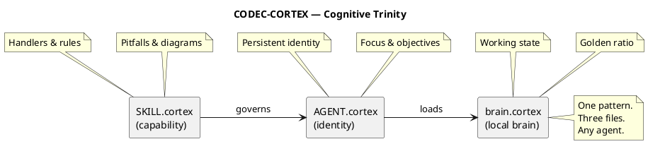

<!-- SPDX-FileCopyrightText: 2026 Fidel Ernesto Lozada A. -->
<!-- SPDX-License-Identifier: MIT -->

  <strong>CODEC-CORTEX</strong> — Cognitive Operational Retrieval & Execution Template
   
  v0.1.0 · MIT · <a href="AUTHORS.md">Fidel Ernesto Lozada A.</a> · <a href="skill/SKILL.md">Specification</a>

---

**Deterministic structural compression protocol for LLM agent cognitive memory.**

> **85% less tokens. Zero LLM in the compilation cycle. 100% reversible.**

| | |
|---|---|
| **Author** | Fidel Ernesto Lozada A. — Systems Engineer / MSc. Management Sciences |
| **Repository** | [github.com/FidelErnesto03/codec-cortex](https://github.com/FidelErnesto03/codec-cortex) |
| **License** | [MIT](LICENSE) |
| **Version** | 0.1.0 |

---

## The Cognitive Trinity

---

## Quick Start

1. Read `skill/SKILL.md` for the complete protocol specification
2. Load `skill/SKILL.cortex` as the universal skill
3. Use `brain.cortex` as your local brain
4. Adopt `skill/AGENT.cortex` as your entry point

---

## Structure

| Directory | Content |
|-----------|---------|
| `skill/` | SKILL.md (spec), SKILL.cortex (native format), brain.cortex, AGENT.cortex, AGENT.md |
| `docs/en/specs/` | English: fundamentals, algorithm, adoption, MCP bridge |
| `docs/es/specs/` | Spanish: fundamentos, algoritmo, adopción, MCP bridge |
| `src/` | Codec implementation (coming soon) |

---

## Documentation

| Document | Content | Language |
|----------|---------|----------|
| `skill/SKILL.md` | Complete protocol specification | ES |
| `skill/SKILL.en.md` | Complete protocol specification | EN |
| `docs/es/specs/fundamentos.md` | Ontology, axioms, principles, maturation, HCORTEX, φ | ES |
| `docs/en/specs/fundamentals.md` | Ontology, axioms, principles, maturation, HCORTEX, φ | EN |
| `docs/es/specs/algoritmo.md` | Equations, FSM, parsing, deep compare | ES |
| `docs/en/specs/algorithm.md` | Equations, FSM, parsing, deep compare | EN |
| `docs/es/specs/adopcion.md` | Agent integration guides | ES |
| `docs/en/specs/adoption.md` | Agent integration guides | EN |
| `docs/es/specs/mcp-bridge.md` | MCP server design | ES |
| `docs/en/specs/mcp-bridge.md` | MCP server design | EN |
| `skill/AGENT.md` | CODEC-CORTEX agent example (HCORTEX) | ES |
| `skill/AGENT.en.md` | CODEC-CORTEX agent example (HCORTEX) | EN |

---

## License

MIT — See `LICENSE` for details.
