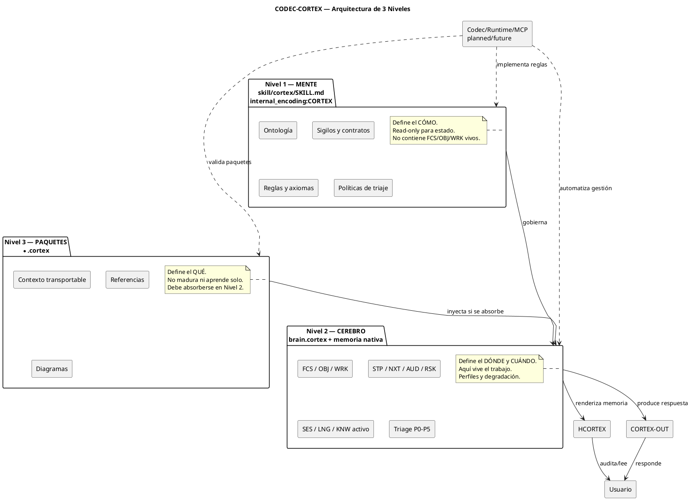
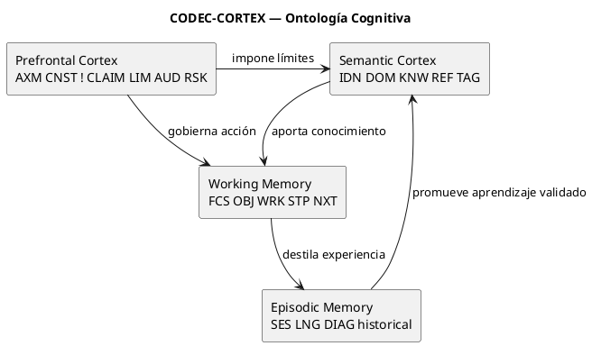
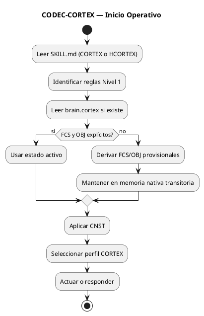
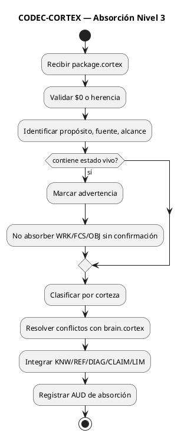
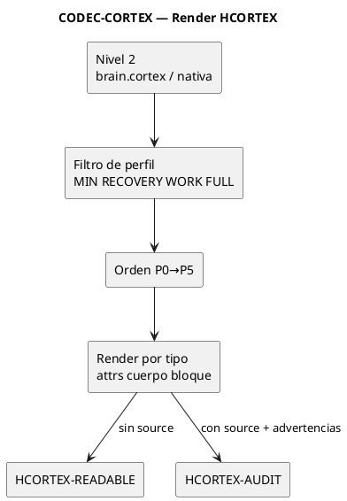

<!-- CODEC-CORTEX
internal_encoding: HCORTEX
source_artifact: skill/hcortex/SKILL.md
source_version: 1.2.0-enterprise-candidate
status: specification
derived_from: skill/hcortex/SKILL.md
reversible: true
view_schema: 1
view_coverage: 100
-->

**Perfil: CORTEX-FULL**

---

<!-- VIEW:sigils_canonicos kind=table target="$0:canonical_sigils" reverse=rows_to_entries title="Sigilos Canónicos" status=cur -->
## Sigilos Canónicos

| Sigilo | Nombre | Tipo | Riesgo | Corteza | Descripción |
|---|---|---|:---:|---|---|
| `IDN` | identity | `attrs` | B | Semantic | identidad de proyecto/autoría/protocolo/artefacto |
| `DOM` | domain | `attrs` | B | Semantic | alcance, dominio, contexto de adopción |
| `KNW` | knowledge | `attrs` | B | Semantic | conocimiento base o promovido |
| `REF` | reference | `attrs` | B | Semantic | referencia a documento/archivo/repositorio |
| `TAG` | tag | `attrs` | B | Semantic | metadatos de clasificación |
| `CNST` | constraint | `attrs` | H | Prefrontal | restricción dura o límite operativo |
| `!` | rule | `attrs` | H | Prefrontal | regla operacional compacta |
| `CLAIM` | claim | `attrs` | M | Prefrontal | afirmación verificable con evidencia |
| `LIM` | limit | `attrs` | M | Prefrontal | límite explícito de uso o madurez |
| `AUD` | audit | `attrs` | M | Prefrontal | registro de verificación/auditoría/evidencia |
| `RSK` | risk | `attrs` | M | Prefrontal | riesgo identificado con mitigación |
| `FCS` | focus | `attrs` | H | Working | anclaje de atención activo |
| `OBJ` | objective | `attrs` | H | Working | meta activa con criterio de éxito |
| `WRK` | work | `attrs` | B | Working | estado de ejecución actual |
| `STP` | step | `attrs` | M | Working | próxima acción inmediata |
| `NXT` | next | `attrs` | M | Working | acción en cola con disparador |
| `SES` | session | `attrs` | M | Episodic | episodio comprimido I/O/R |
| `LNG` | lesson | `attrs` | M | Episodic | lección aprendida o patrón operativo |
| `HDL` | handler | `attrs-pos` | M | Semantic | descriptor de operación o contrato de interfaz |
| `PFL` | pitfall | `attrs` | M | Prefrontal | antipatrón conocido y prevención |
| `DEP` | dependency | `attrs` | M | Semantic | dependencia entre artefactos/módulos |
| `ERR` | error | `attrs` | M | Prefrontal | error conocido con causa y solución |

<!-- /VIEW:sigils_canonicos -->

<!-- VIEW:type_decls kind=kv_table target="$0:type_decls" reverse=row_to_attrs title="Declaraciones de Tipo" status=cur -->
## Declaraciones de Tipo

**Source:** `$0:type_attrs`

| Campo | Valor |
|---|---|
| rule | pares clave:valor o clave:"valor" dentro de {} |

**Source:** `$0:type_cuerpo`

| Campo | Valor |
|---|---|
| rule | texto literal entre {} |

**Source:** `$0:type_bloque`

| Campo | Valor |
|---|---|
| rule | multilinea verbatim |

**Source:** `$0:type_attrs_pos`

| Campo | Valor |
|---|---|
| rule | valores posicionales separados por \|; orden definido en $0 |

**Source:** `$0:type_relacion`

| Campo | Valor |
|---|---|
| rule | forma causal A -> B |

<!-- /VIEW:type_decls -->

<!-- VIEW:contracts_decl kind=table target="$0:contracts" reverse=rows_to_entries title="Contratos Posicionales" status=cur -->
## Contratos Posicionales

| Sigilo | Campos posicionales |
|---|---|
| `HDL` | operation\|status\|requires\|notes |
| `FCS` | what\|priority\|status\|survive |
| `OBJ` | goal\|status\|success\|survive |
| `WRK` | phase\|current\|blocked\|survive |
| `STP` | action\|reason\|owner\|status\|survive |
| `CNST` | rule\|severity\|survive |
| `CLAIM` | statement\|evidence\|status |
| `LIM` | limit\|scope\|status |
| `RSK` | risk\|impact\|mitigation\|status\|survive |
| `AUD` | event\|evidence\|result\|date |
| `SES` | input\|output\|outcome\|date |
| `LNG` | type\|cause\|lesson\|prevention |
| `KNW` | topic\|content\|status |
| `DIAG` | bloque verbatim valido |

<!-- /VIEW:contracts_decl -->

<!-- VIEW:microtokens_decl kind=table target="$0:microtokens" reverse=rows_to_entries title="Microtokens" status=cur -->
## Microtokens

| Token | Expansión |
|---|---|
| `cur` | current |
| `pln` | planned |
| `fut` | future |
| `blk` | blocked |
| `min` | minimum |
| `rec` | recovery |
| `wrk` | work |
| `full` | full |
| `ok` | success |
| `fail` | failure |
| `part` | partial |
| `d1` | decode |
| `d2` | detect |
| `d3` | decay |
| `c1` | .cortex |
| `c2` | HCORTEX |
| `v1` | validate |
| `v2` | verify |
| `a1` | file |
| `a2` | files |
| `s1` | sigil |
| `s2` | section |
| `h1` | handler |
| `x1` | extract |
| `x2` | list |
| `m1` | modify |
| `m2` | add |
| `r1` | remove |
| `p1` | promote |
| `f1` | format |
| `t1` | structure |

<!-- /VIEW:microtokens_decl -->

<!-- VIEW:enum_state_decl kind=kv_table target="$0:enum_state" reverse=row_to_attrs title="Enum: state" status=cur -->
## Enum: state

**Source:** `$0:enum_state`

| Campo | Valor |
|---|---|
| values | cur,specification,pln,fut,experimental,deprecated,blk,done |

<!-- /VIEW:enum_state_decl -->

<!-- VIEW:enum_severity_decl kind=kv_table target="$0:enum_severity" reverse=row_to_attrs title="Enum: severity" status=cur -->
## Enum: severity

**Source:** `$0:enum_severity`

| Campo | Valor |
|---|---|
| values | blocking,warning,info |

<!-- /VIEW:enum_severity_decl -->

<!-- VIEW:enum_priority_decl kind=kv_table target="$0:enum_priority" reverse=row_to_attrs title="Enum: priority" status=cur -->
## Enum: priority

**Source:** `$0:enum_priority`

| Campo | Valor |
|---|---|
| values | high,medium,low |

<!-- /VIEW:enum_priority_decl -->

<!-- VIEW:enum_risk_level_decl kind=kv_table target="$0:enum_risk_level" reverse=row_to_attrs title="Enum: risk_level" status=cur -->
## Enum: risk_level

**Source:** `$0:enum_risk_level`

| Campo | Valor |
|---|---|
| values | B,M,H |

<!-- /VIEW:enum_risk_level_decl -->

<!-- VIEW:delimiters_decl kind=kv_table target="$0:delimiters" reverse=row_to_attrs title="Delimiters" status=cur -->
## Delimiters

**Source:** `$0:delimiters`

| Campo | Valor |
|---|---|
| values | espacio \| , { } salto_de_linea inicio_de_valor fin_de_valor |

<!-- /VIEW:delimiters_decl -->

<!-- VIEW:axiom_canonical_decl kind=prose target="$0:AXM:axiom" reverse=body_to_cuerpo title="AXM (canonical declaration)" status=cur -->
## AXM (canonical declaration)

type:cuerpo,risk:H,cortex:Prefrontal,desc:"principio no negociable"

<!-- /VIEW:axiom_canonical_decl -->

<!-- VIEW:desc_canonical_decl kind=prose target="$0:DESC:description" reverse=body_to_cuerpo title="DESC (canonical declaration)" status=cur -->
## DESC (canonical declaration)

type:cuerpo,risk:B,cortex:Semantic,desc:"descripción textual estructurada"

<!-- /VIEW:desc_canonical_decl -->

<!-- VIEW:diag_canonical_decl kind=puml target="$0:DIAG:diagram" reverse=verbatim_to_bloque title="DIAG (canonical declaration)" status=cur preserve=verbatim -->
## DIAG (canonical declaration)

**Source:** `DIAG:diagram`

```puml
type:bloque,risk:M,cortex:"Episodic/Visual",desc:"diagrama PlantUML o bloque visual verbatim"
```

<!-- /VIEW:diag_canonical_decl -->

<!-- VIEW:project_identity kind=kv_table target="$1:IDN:project" reverse=row_to_attrs title="Identidad del Proyecto" status=cur -->
## Identidad del Proyecto

**Source:** `IDN:project`

| Campo | Valor |
|---|---|
| name | CODEC-CORTEX |
| author | Fidel Ernesto Lozada A. |
| version | 1.2.0-enterprise-candidate |
| license | MIT |
| spec | 1.2.0-enterprise-candidate |
| project | 0.3.0 |

<!-- /VIEW:project_identity -->

<!-- VIEW:project_scope kind=kv_table target="$1:DOM:scope" reverse=row_to_attrs title="Alcance del Proyecto" status=cur -->
## Alcance del Proyecto

**Source:** `DOM:scope`

| Campo | Valor |
|---|---|
| domain | protocolo de memoria contextual para agentes LLM/SLM |
| lang_struct | EN |
| lang_semantic | idioma del dominio o usuario |
| output_human | HCORTEX=render memoria; CORTEX-OUT=respuesta conversacional |

<!-- /VIEW:project_scope -->

<!-- VIEW:project_meta_tags kind=kv_table target="$1:TAG:meta" reverse=row_to_attrs title="Meta Tags" status=cur -->
## Meta Tags

**Source:** `TAG:meta`

| Campo | Valor |
|---|---|
| category | META-SKILL |
| nature | gobierno cognitivo |
| target | LLM/SLM agents |

<!-- /VIEW:project_meta_tags -->

<!-- VIEW:project_refs kind=table target="$1:REF:*" reverse=rows_to_entries fields="path,role,encoding" title="Referencias de Artefactos" status=cur -->
## Referencias de Artefactos

| Source | Path | Role | Encoding |
|---|---|---|---|
| `REF:art_skill_root` | SKILL.md | spec humana canónica |  |
| `REF:art_skill_cortex` | skill/cortex/SKILL.md | mente CORTEX del protocolo | CORTEX |
| `REF:art_skill_hcortex` | skill/hcortex/SKILL.md | vista humana canónica | HCORTEX |
| `REF:art_brain` | brain.cortex | estado persistente de trabajo |  |
| `REF:art_packages` | *.cortex | paquetes de contexto transportables |  |
| `REF:art_status` | STATUS.md | registro de verdad |  |
| `REF:art_benchmark` | BENCHMARK.md | evidencia empírica |  |

<!-- /VIEW:project_refs -->

<!-- VIEW:purpose_desc kind=prose target="$2:DESC:purpose" reverse=body_to_cuerpo title="Propósito" status=cur -->
## Propósito

CODEC-CORTEX no es un prompt ni solo un formato de archivo. Es un protocolo de memoria contextual para agentes LLM/SLM que reemplaza historia lineal por estado cognitivo estructurado, auditable y gobernable. El sistema se apoya en siete componentes: 1:Mente(skill/cortex/SKILL.md)=reglas,ontología,contratos,algoritmos en codificación CORTEX | 2:Cerebro(brain.cortex+nativa)=estado vivo | 3:Paquetes(*.cortex)=payloads transportables | 4:Autocontención $0=glosario local mínimo para arranque seguro | 5:HCORTEX=vista humana de memoria | 6:CORTEX-OUT=respuesta conversacional eficiente | 7:Codec/runtime/MCP=automatización plan/future, nunca asumida si no existe.

<!-- /VIEW:purpose_desc -->

<!-- VIEW:meta_skill_desc kind=prose target="$2:DESC:meta_skill" reverse=body_to_cuerpo title="Naturaleza Meta-Skill" status=cur -->
## Naturaleza Meta-Skill

CODEC-CORTEX es un META-SKILL: habilidad de gobierno cognitivo que orienta cómo el agente gestiona memoria nativa, contexto de trabajo, continuidad, aprendizaje, límites y salida conversacional para cualquier actividad solicitada. No reemplaza habilidades de dominio del agente. Gobierna cómo el agente conserva foco, objetivo, restricciones, evidencia, riesgos y próximos pasos. Aplica separación entre memoria persistente (brain.cortex), contexto transportable (*.cortex) y memoria nativa transitoria. Permite que múltiples agentes operen sobre el mismo proyecto sin insertar su identidad funcional en la identidad canónica del proyecto. Debe estar activo por defecto cuando el agente trabaje en continuidad, memoria, contexto largo, aprendizaje operativo o claims de madurez.

<!-- /VIEW:meta_skill_desc -->

<!-- VIEW:axiom_canon kind=prose target="$2:AXM:canon" reverse=body_to_cuerpo title="Axima Canon" status=cur -->
## Axima Canon

SKILL gobierna. brain opera. package inyecta. HCORTEX explica. CORTEX-OUT responde con densidad. codec automatiza cuando exista. runtime madura cuando exista. MCP expone empresarialmente cuando exista.

<!-- /VIEW:axiom_canon -->

<!-- VIEW:axiom_guiding kind=prose target="$2:AXM:guiding" reverse=body_to_cuerpo title="Axima Guía" status=cur -->
## Axima Guía

Memoria contextual estructurada antes que historia lineal. $0 dicta la sintaxis. Nivel 2 contiene el estado vivo. HCORTEX permite auditoría humana de memoria. CORTEX-OUT gobierna la respuesta saliente sin participar en el codec. La automatización determinista pertenece al codec/runtime cuando esté implementada y verificada.

<!-- /VIEW:axiom_guiding -->

<!-- VIEW:knowledge_base kind=table target="$2:KNW:*" reverse=rows_to_entries fields="topic,content,status" title="Conocimiento Base" status=cur -->
## Conocimiento Base

| Source | Topic | Content | Status |
|---|---|---|---|
| `KNW:problem` | problema resuelto | agentes LLM/SLM pierden continuidad cuando dependen de historial plano. Historial plano mezcla instrucciones, hechos, decisiones, riesgos, progreso, evidencia y referencias produciendo ruido, amnesia, contradicción, pérdida de foco y degradación por posición. CODEC-CORTEX impone separación de responsabilidades, prioridad cognitiva, render humano auditable y comunicación saliente eficiente | cur |
| `KNW:cortices` | ontología cognitiva 4 cortezas | Semantic(IDN,DOM,KNW,REF,TAG):identidad,dominio,conocimiento,referencias,persistencia:larga \| Prefrontal(AXM,CNST,!,CLAIM,LIM,AUD,RSK):gobierno,límites,riesgos,reglas,evidencia,persistencia:alta \| Working(FCS,OBJ,WRK,STP,NXT):foco,meta,progreso,siguiente acción,persistencia:viva \| Episodic(SES,LNG,DIAG histórico):experiencia,lecciones,memoria destilada,persistencia:variable. Relaciones:Prefrontal gobierna Working, Semantic aporta a Working, Working destila a Episodic, Episodic promueve a Semantic, Prefrontal impone límites a Semantic | cur |
| `KNW:normative_lang` | lenguaje normativo | MUST/DEBE=obligatorio, incumplimiento rompe conformidad \| MUST NOT/NO DEBE=prohibición obligatoria \| SHOULD/DEBERÍA=recomendación fuerte, omisión requiere justificación explícita \| MAY/PUEDE=opcional | cur |
| `KNW:maturity` | madurez de claims | cur=ejecutable por lectura disciplinada, puede declararse capacidad actual:si \| specification=definido normativamente no necesariamente automatizado, puede declararse:parcial con aclaración \| pln=para fase posterior requiere implementación, puede declararse:no \| fut=visión empresarial posterior, puede declararse:no \| experimental=existe no estable ni canónico, puede declararse:no sin advertencia \| deprecated=compatibilidad no recomendado, puede declararse:no | cur |
| `KNW:level_matrix` | matriz ubicación permitida por sigilo | L1(SKILL):IDN✓ DOM✓ AXM✓ CNST✓ !✓ FCS:contrato/ejemplo OBJ:contrato/ejemplo WRK:✗ STP:contrato/ejemplo NXT:✗ SES:✗ LNG:✗ KNW:protocolo✓ REF✓ DIAG:normativo✓ AUD:spec✓ RSK:protocolo✓ CLAIM✓ LIM✓ \| L2(brain):IDN✓ DOM✓ AXM:limitado CNST✓ !:limitado FCS✓ OBJ✓ WRK✓ STP✓ NXT✓ SES✓ LNG✓ KNW✓ REF✓ DIAG:operativo✓ AUD✓ RSK✓ CLAIM✓ LIM✓ \| L3(package):IDN✓ DOM✓ AXM:limitado CNST✓ FCS:no rec OBJ:no rec WRK:✗ STP:no rec NXT:no rec SES:histórico✓ LNG:histórico✓ KNW✓ REF✓ DIAG✓ AUD✓ RSK✓ CLAIM✓ LIM✓ | cur |

<!-- /VIEW:knowledge_base -->

<!-- VIEW:constraints_purpose kind=table target="$2:CNST:*" reverse=rows_to_entries fields="rule,severity,survive" title="Constraints de Propósito" status=cur -->
## Constraints de Propósito

| Source | Rule | Severity | Survive |
|---|---|---|---|
| `CNST:container` | .md optimiza lectura e indexación por agentes estándar. internal_encoding:CORTEX indica interpretar con reglas .cortex. internal_encoding:HCORTEX indica vista humana no canónica. HCORTEX NO DEBE usarse como fuente de roundtrip/decode/encode/verify. Derivados DEBEN declarar source_artifact+source_version. Plantillas/ejemplos DEBEN usar <protocol_version> o marcarse example/template/non_operational. No DEBEN usar versión literal que pueda confundirse con vigente | blocking | min |
| `CNST:honesty` | ningún documento, agente, README, salida HCORTEX, salida CORTEX-OUT o interfaz comercial DEBE presentar como cur algo pln, fut o no verificado | blocking | min |
| `CNST:identity` | IDN DEBE corresponder a proyecto/autoría/protocolo/artefacto. NO DEBE representar identidad funcional del agente ejecutor. Múltiples agentes pueden operar sobre el mismo proyecto sin formar parte de su identidad canónica. Versión normativa se declara en este documento. Derivados NO DEBEN inventar versión propia salvo ciclo de release independiente | blocking | min |

<!-- /VIEW:constraints_purpose -->

<!-- VIEW:handlers kind=table target="$3:HDL:*" reverse=rows_to_entries fields="operation,status,requires,notes" title="Handlers Operacionales" status=cur -->
## Handlers Operacionales

| Source | Operación | Estado | Requiere | Notas |
|---|---|---|---|---|
| `HDL:agent_init` | specification | SKILL.md,brain.cortex | leer SKILL.md(CORTEX o HCORTEX); identificar reglas Nivel 1; leer brain.cortex si existe; si FCS y OBJ explícitos→usar estado activo; si no→derivar FCS/OBJ provisionales desde instrucciones actuales, mantener en memoria nativa transitoria; aplicar CNST; seleccionar perfil CORTEX; actuar o responder |  |
| `HDL:pre_action` | specification | brain.cortex o anclajes | verificar FCS activo/provisional; verificar OBJ activo/provisional; verificar CNST:blocking activos; verificar LIM relevantes; verificar claims de madurez; verificar RSK activos; verificar STP si aplica; si contradicción usuario vs CNST:blocking→detener o explicar incompatibilidad |  |
| `HDL:absorb_pkg` | specification | package.cortex,brain.cortex | recibir package.cortex; validar $0 o herencia de glosario; identificar propósito,fuente,alcance; si contiene estado vivo→marcar advertencia, no absorber WRK/FCS/OBJ como vivo sin confirmación; clasificar entradas por corteza; resolver conflictos con brain.cortex; integrar KNW/REF/DIAG/CLAIM/LIM útiles; registrar AUD de absorción |  |
| `HDL:session_close` | specification | brain.cortex | producir/actualizar SES:last con input,output,outcome,date; producir LNG si hubo error o patrón relevante; producir AUD si se verificó algo; producir RSK si quedó riesgo activo; producir NXT si queda acción pendiente; producir HCORTEX de cierre si humano necesita auditoría |  |
| `HDL:hcortex_render` | specification | .cortex o AST,perfil activo | 10 pasos: 1)resolver perfil(explícito>presupuesto>modo>CORTEX-WORK) 2)declarar Perfil:CORTEX-LEVEL primera línea 3)filtrar por P-level/survive, sin P-level→P5, por entrada no por sección 4)resolver tipo desde $0(attrs→tabla,cuerpo→bloque indentado,bloque→verbatim) 5)renderizar entradas filtradas aplicando estrategia por tipo 6)si auditoría con presupuesto insuficiente→Perfil:CORTEX-FULL (segmentado) Segmento:n/total, nunca degradar silenciosamente 7)agregar source a tablas P0/P1, PUML 'source:DIAG:name primer comentario, falta→WARNING:missing source 8)múltiples instancias mismo sigilo→sub-secciones ### SIGIL:name preservar orden fuente 9)aplicar estrategia por tipo 10)ordenar P0→P5, sin P-level→después de P5, mismo nivel→orden fuente |  |
| `HDL:recovery_missing_0` | specification | .cortex sin $0 | no ejecutar decisiones operativas basadas en ese archivo; leer solo en modo recuperación; identificar sigilos aparentes; reconstruir $0 mínimo local; marcar ambigüedades como RSK o AUD; solicitar confirmación humana si riesgo semántico; reemitir archivo reparado con $0 local antes de usar como memoria confiable |  |

<!-- /VIEW:handlers -->

<!-- VIEW:rules_normalization kind=numbered_list target="$4:!:*" reverse=items_to_ordered_entries fields="rule,survive" title="Reglas de Normalización" status=cur -->
## Reglas de Normalización

1. `!:type_strict` — attrs MUST usar pares clave/valor; attrs-pos MUST cumplir orden posicional exacto del contrato $0; attrs-pos sin campos completos SHOULD degradar a attrs explícito; DIAG MUST preservar bit a bit; parser MUST NOT inferir tipos por heurística si $0 los define (survive:min)
2. `!:section_normalize` — parser SHOULD aceptar 2, $2, $2:CONTEXT, #--$2:CONTEXT-- y normalizar internamente a $2 (survive:full)
3. `!:id_format` — instancias en snake_case(FCS:primary, RSK:premature_claim); sigilos en MAYÚSCULAS salvo ! y operadores registrados en $0 (survive:full)
4. `!:micro_delimit` — micro-tokens se expanden solo si delimitados por espacio | , { } salto_de_linea inicio_de_valor fin_de_valor; MUST NOT expandirse dentro de palabras(param_d1 no se expande; "d1" se expande si modo permite) (survive:full)
5. `!:extend_glossary` — nuevo sigilo→registrar en $0 antes primer uso; nuevo micro-token→registrar en $0 antes primer uso; nuevo tipo→registrar en $0 antes primer uso; attrs-pos→declarar contrato posicional en $0; sigilos existentes→NO redefinir silenciosamente; tipo→NO cambiar para sigilo ya usado en archivo; micro-tokens→NO expandir dentro de bloque o DIAG; sigilo desconocido→tratar como no confiable hasta registrar/confirmar (survive:min)
6. `!:hcortex_expand` — attrs→tabla, cuerpo→bloque indentado, bloque→verbatim; tipo resuelto desde $0 no por heurística (survive:min)
7. `!:hcortex_source` — P0/P1 attrs→columna source con SIGIL:name; PUML→' source:DIAG:name como primer comentario; cuerpo→línea source:SIGIL:name bajo bloque; falta source en P0/P1→WARNING:missing source (survive:min)
8. `!:hcortex_multi` — múltiples instancias mismo sigilo→sub-secciones ### SIGIL:name, preservar orden fuente (survive:full)
9. `!:hcortex_order` — ordenar secciones P0→P5, sin P-level→después de P5, mismo P-level→orden fuente, nunca truncar por posición→eliminar por valor cognitivo (survive:min)

<!-- /VIEW:rules_normalization -->

<!-- VIEW:constraints_separators kind=table target="$5:CNST:*" reverse=rows_to_entries fields="rule,severity,survive" title="Constraints de Separadores" status=cur -->
## Constraints de Separadores

| Source | Rule | Severity | Survive |
|---|---|---|---|
| `CNST:sep_l1` | L1 MUST NOT almacenar estado vivo de sesión. FCS/OBJ/WRK/STP/NXT prohibidos como estado activo en skill/cortex/SKILL.md; permitidos solo como contrato/ejemplo marcado example/template/non_operational o en sección normativa/tabla de campos | blocking | min |
| `CNST:sep_l2` | L2 MUST contener foco y objetivo para operación persistente; DEBE validar FCS y OBJ antes de actuar, si faltan→detener o derivar provisional; para tareas acotadas sin brain.cortex MAY operar con anclajes provisionales en memoria nativa transitoria; escritura solo si usuario pide .cortex, proyecto opera con brain.cortex, o cierre de sesión aprobado | blocking | min |
| `CNST:sep_l3` | L3 MUST NOT madurar por sí mismo, MUST NOT reclamar ciclo de vida propio, MUST NOT mutar por sí mismo; SHOULD incluir procedencia, propósito y alcance; maduración solo si se absorbe formalmente en Nivel 2 | warning | min |
| `CNST:sep_hcortex` | HCORTEX MUST NOT reemplazar .cortex como persistencia canónica; es vista humana no fuente de roundtrip | blocking | min |
| `CNST:sep_runtime` | Runtime/CLI/MCP MUST NOT asumirse existente sin confirmación de STATUS.md o herramienta real | blocking | min |
| `CNST:pre_action` | agente DEBE verificar FCS,OBJ,CNST:blocking,LIM,claims de madurez,RSK activos,STP antes de cada acción; contradicción usuario vs CNST:blocking→detener o explicar incompatibilidad | blocking | min |

<!-- /VIEW:constraints_separators -->

<!-- VIEW:limits_op kind=table target="$5:LIM:*" reverse=rows_to_entries fields="limit,scope,status" title="Límites Operacionales" status=cur -->
## Límites Operacionales

| Source | Limit | Scope | Status |
|---|---|---|---|
| `LIM:maturity` | presupuestos de perfil son orientativos, no medidos sin benchmark reproducible | CORTEX-OUT perfiles y HCORTEX perfiles | cur |
| `LIM:codec` | codec/runtime/MCP son planned/future, nunca asumidos si no existen | automatización | cur |

<!-- /VIEW:limits_op -->

<!-- VIEW:risks_op kind=callout target="$5:RSK:*" reverse=callout_to_risk fields="risk,impact,mitigation,status,survive" title="Riesgos Operacionales" status=cur -->
## Riesgos Operacionales

### RSK:attrs_pos_broken

- risk: attrs-pos sin contrato estable produce decodificación errónea
- impact: alto, corrupción de estado
- mitigation: solo activar cuando $0 declare contrato posicional canónico o local validado
- status: cur
- survive: min

<!-- /VIEW:risks_op -->

<!-- VIEW:pitfalls_op kind=table target="$5:PFL:*" reverse=rows_to_entries fields="pattern,prevention,severity" title="Pitfalls Operacionales" status=cur -->
## Pitfalls Operacionales

| Source | Pattern | Prevention | Severity | Effect | Survive |
|---|---|---|---|---|---|
| `PFL:no_0` | archivo .cortex sin $0 | ejecutar recovery_missing_0: reconstruir $0 mínimo, marcar ambigüedades como RSK/AUD, reemitir reparado antes de usar |  | no conforme, no debe usarse como fuente operativa confiable | min |
| `PFL:silent_redefine` | redefinir sigilo existente sin declarar en $0 o cambiar tipo de expansión ya usado | extensión local DEBE registrar antes del primer uso, redefinición silenciosa prohibida por !extend_glossary |  | desincronización entre parser y semántica | min |
| `PFL:live_in_l1` | FCS/OBJ/WRK/STP/NXT como estado vivo en skill/cortex/SKILL.md | solo permitido como contrato/ejemplo marcado example/template/non_operational |  | violación de separación de niveles, estado fantasma en mente del protocolo | min |
| `PFL:hcortex_as_source` | usar archivo HCORTEX como fuente de roundtrip/decode/encode/verify | HCORTEX es vista humana, NO participa en decode/encode/verify/roundtrip |  | vista tratada como canon, pérdida de integridad del codec | min |
| `PFL:out_as_cortex` | tratar CORTEX-OUT como .cortex o parsearlo con reglas .cortex | CORTEX-OUT no participa en decode/encode/verify/AST/$0/contratos/roundtrip/persistencia canónica |  | respuesta conversacional contaminando memoria canónica | min |
| `PFL:false_maturity` | presentar capacidad pln/fut/experimental como cur | regla de honestidad: ningún documento/agente/salida/interfaz DEBE presentar como cur algo no verificado |  | engaño al usuario, degradación de confianza del sistema | min |

<!-- /VIEW:pitfalls_op -->

<!-- VIEW:diagrams kind=puml target="$6:DIAG:*" reverse=verbatim_to_bloque title="Diagramas Arquitectónicos" status=cur preserve=verbatim -->
## Diagramas Arquitectónicos

**Source:** `DIAG:arq_niveles`



**Source:** `DIAG:ontologia`



**Source:** `DIAG:agent_init`



**Source:** `DIAG:absorb_pkg`



**Source:** `DIAG:hcortex_render`



<!-- /VIEW:diagrams -->

<!-- VIEW:contracts_full kind=table target="$7:CNST:*" reverse=rows_to_entries fields="rule,severity,survive" title="Contratos Completos" status=cur -->
## Contratos Completos

| Source | Rule | Severity | Survive |
|---|---|---|---|
| `CNST:contract_fcs` | FCS requiere what,priority,status,survive | blocking | min |
| `CNST:contract_obj` | OBJ requiere goal,status,success,survive | blocking | min |
| `CNST:contract_wrk` | WRK requiere phase,current,blocked,survive | blocking | min |
| `CNST:contract_stp` | STP requiere action,reason,owner,status,survive | blocking | min |
| `CNST:contract_cnst` | CNST requiere rule,severity,survive; severity:blocking debe ser P0/min | blocking | min |
| `CNST:contract_claim` | CLAIM requiere statement,evidence,status; no usar métricas no medidas como actuales | warning | min |
| `CNST:contract_lim` | LIM requiere limit,scope,status; no omitir límites de madurez | warning | min |
| `CNST:contract_rsk` | RSK requiere risk,impact,mitigation,status,survive; no registrar riesgo sin mitigación | warning | min |
| `CNST:contract_aud` | AUD requiere event,evidence,result,date; no usar como sustituto de benchmark | warning | full |
| `CNST:contract_ses` | SES requiere input,output,outcome,date; no promover a KNW sin criterio | warning | full |
| `CNST:contract_lng` | LNG requiere type,cause,lesson,prevention; no convertir experiencia aislada en axioma | warning | full |
| `CNST:contract_knw` | KNW requiere topic,content,status; no mezclar con estado transitorio | warning | full |
| `CNST:contract_hdl` | HDL requiere posición definida por $0 (operation\|status\|requires\|notes); no presentar handler planificado como implementado | warning | min |
| `CNST:contract_diag` | DIAG requiere bloque verbatim válido; no reformatear bit a bit | blocking | min |

<!-- /VIEW:contracts_full -->

<!-- VIEW:survive_rules kind=list target="$8:!:*" reverse=items_to_entries fields="rule,survive" title="Reglas de Survive" status=cur -->
## Reglas de Survive

- `!:survive_priority` — P0→min, P1→rec, P2→wrk, P3→reduced, P4→basic, P5→full (survive:min)
- `!:survive_degrade` — al reducir presupuesto descartar P5→P1, P0 nunca se elimina; al expandir recuperar inversamente (survive:min)
- `!:p5_filter` — en presupuesto >3000t o FULL: incluir P5 solo con survive, KNW companion o valor operacional (survive:full)

<!-- /VIEW:survive_rules -->

<!-- VIEW:survive_knowledge kind=kv_table target="$8:KNW:*" reverse=row_to_attrs title="Conocimiento de Survive" status=cur -->
## Conocimiento de Survive

**Source:** `KNW:p_levels`

| Campo | Valor |
|---|---|
| topic | prioridad cognitiva P0→P5 |
| content | P0:FCS,OBJ,CNST:blocking,STP→sobrevive en MIN/RECOVERY/WORK/FULL, nunca se elimina \| P1:WRK,AUD,RSK,NXT→sobrevive en RECOVERY/WORK/FULL, último antes de P0 \| P2:CLAIM,LIM,KNW:active,LNG:critical→sobrevive en WORK/FULL, tras P1 \| P3:SES:last,STAT→sobrevive en FULL(WORK si espacio), tras P2 \| P4:REF:critical,DOC,ART→sobrevive en FULL, tras P3 \| P5:DIAG,TBL,histórico,comentarios→sobrevive en FULL, primero en eliminar. Reglas: carga P0→P5, degradación P5→P1, mismo P-level→orden fuente, sin P-level→después de P5, nunca truncar por posición |
| status | cur |

<!-- /VIEW:survive_knowledge -->

<!-- VIEW:profiles kind=table target="$9:KNW:*" reverse=rows_to_entries fields="topic,content,status" title="Perfiles Cognitivos" status=cur -->
## Perfiles Cognitivos

| Source | Topic | Content | Status |
|---|---|---|---|
| `KNW:profile_min` | CORTEX-MIN | presupuesto ~300t, P-level:P0, uso:emergencia/bloqueo, contenido:solo FCS+OBJ+CNST+STP | cur |
| `KNW:profile_recovery` | CORTEX-RECOVERY | presupuesto ~1000t, P-level:P0+P1, uso:reconexión tras interrupción | cur |
| `KNW:profile_work` | CORTEX-WORK | presupuesto ~3000t, P-level:P0+P1+P2, uso:trabajo estándar (default) | cur |
| `KNW:profile_full` | CORTEX-FULL | sin límite presupuesto, P-level:P0-P5, uso:spec completa/auditoría/gate de salida | cur |
| `KNW:out_profile_min` | OUT-MIN | 80-180t, uso:confirmación/bloqueo/respuesta simple, bloques:Resultado+Acción | cur |
| `KNW:out_profile_work` | OUT-WORK | 250-700t, uso:análisis/diseño/recomendación/revisión normal, bloques:Resultado+Criterio+Acción | cur |
| `KNW:out_profile_audit` | OUT-AUDIT | 700-1500t, uso:coherencia/arquitectura/seguridad/legal/benchmark/decisión crítica, bloques:Resultado+Evidencia+Riesgo+Acción | cur |
| `KNW:out_profile_full` | OUT-FULL | variable, uso:documento/spec/informe/contrato/entrega reutilizable, bloques:Entrega+Criterio+Control | cur |
| `KNW:o_levels` | prioridad salida CORTEX-OUT O0→O5 | O0:resultado directo/decisión→nunca eliminar \| O1:acción siguiente→solo si no aplica \| O2:riesgo/límite/incertidumbre crítica→nunca si hay riesgo real \| O3:evidencia mínima→puede omitirse en OUT-MIN si no crítica \| O4:contexto explicativo→eliminar bajo presión de tokens \| O5:desarrollo extendido/ejemplos/historia→primero en eliminar | cur |
| `KNW:out_selection` | selección perfil CORTEX-OUT | pregunta simple→OUT-MIN \| confirmación/veredicto rápido→OUT-MIN \| análisis/diseño→OUT-WORK \| revisión coherencia→OUT-AUDIT \| seguridad/legal/benchmark/arquitectura crítica→OUT-AUDIT \| documento/skill/contrato/informe→OUT-FULL | cur |

<!-- /VIEW:profiles -->

<!-- VIEW:degrade_rules kind=list target="$10:!:*" reverse=items_to_entries fields="rule,survive" title="Reglas de Degradación" status=cur -->
## Reglas de Degradación

- `!:degrade_context` — al reducir presupuesto: descartar P5→P1, P0 nunca; recuperar inversamente al expandir; si presupuesto insuficiente para perfil requerido→Perfil:CORTEX-LEVEL (segmentado) Segmento:n/total, nunca degradar silenciosamente (survive:min)
- `!:degrade_out` — eliminar O5→O4→O3, preservar O0 siempre, preservar O2 cuando exista riesgo/incertidumbre material o límite operativo (survive:min)

<!-- /VIEW:degrade_rules -->

<!-- VIEW:hcortex_def kind=prose target="$11:DESC:hcortex_def" reverse=body_to_cuerpo title="Definición HCORTEX" status=cur -->
## Definición HCORTEX

HCORTEX es el protocolo de render humano de memoria .cortex hacia Markdown. Objetivo: comprensión, auditoría y edición asistida. No es reconstrucción textual literal. No es persistencia canónica. No gobierna respuesta conversacional ordinaria (eso es CORTEX-OUT).

<!-- /VIEW:hcortex_def -->

<!-- VIEW:hcortex_knowledge kind=kv_table target="$11:KNW:*" reverse=row_to_attrs title="Conocimiento HCORTEX" status=cur -->
## Conocimiento HCORTEX

**Source:** `KNW:hc_modes`

| Campo | Valor |
|---|---|
| topic | modos HCORTEX |
| content | READABLE:lectura ejecutiva limpia, sigilos ocultos por defecto \| AUDIT:auditoría/trazabilidad/depuración, sigilos visibles como source \| RECOVERY:reconexión tras pérdida de contexto, solo P0-P2 relevantes \| FULL:exportación amplia/gate de salida, todo lo permitido por perfil FULL |
| status | cur |

**Source:** `KNW:hc_gate`

| Campo | Valor |
|---|---|
| topic | gate de salida |
| content | antes de abandonar CODEC-CORTEX SHOULD generar HCORTEX-FULL desde Nivel 2; preserva comprensión humana, evita lock-in, NO promete reconstrucción literal de todos los mensajes originales, debe declarar límites de pérdida semántica u omisión |
| status | cur |

**Source:** `KNW:hc_format`

| Campo | Valor |
|---|---|
| topic | jerarquía formato por tipo de contenido |
| content | datos multi-atributo(2+ attrs compartiendo dominio)→tabla \| secuencia ordenada→lista numerada \| conjunto paralelo→lista viñetas \| regla cond+acción→tabla compacta \| arquitectura/flujo→PUML rectangle \| principio inmutable→cita indentada > \| código/template→bloque verbatim \| prosa→párrafo breve solo cuando ningún otro formato aplica |
| status | cur |

**Source:** `KNW:hc_puml`

| Campo | Valor |
|---|---|
| topic | reglas PUML estrictas para HCORTEX |
| content | 1:solo rectangle para componentes \| 2:skinparam componentStyle rectangle obligatorio \| 3:skinparam shadowing false obligatorio \| 4:title obligatorio \| 5:sin {}[]* en labels \| 6:saltos de línea con \n \| 7:@startuml/@enduml balanceados(mismo conteo) \| 8:preservar verbatim no reformatear no reordenar \| 9:note para aclaraciones laterales \| 10:' source:DIAG:name en modo audit como primer comentario |
| status | cur |

**Source:** `KNW:hc_vs_out`

| Campo | Valor |
|---|---|
| topic | separación HCORTEX vs CORTEX-OUT |
| content | HCORTEX:origen=.cortex/AST decodificado,propósito=vista humana memoria persistente,participa en codec=sí,usa $0=indirectamente(tipos expansión),define sigilos=no,requiere roundtrip=no,perfiles=MIN/RECOVERY/WORK/FULL \| CORTEX-OUT:origen=razonamiento agente,propósito=respuesta conversacional eficiente,participa en codec=no,usa $0=no,define sigilos=no,requiere roundtrip=no,perfiles=OUT-MIN/OUT-WORK/OUT-AUDIT/OUT-FULL |
| status | cur |

<!-- /VIEW:hcortex_knowledge -->

<!-- VIEW:hcortex_rules kind=list target="$11:!:*" reverse=items_to_entries fields="rule,survive" title="Reglas HCORTEX" status=cur -->
## Reglas HCORTEX

- `!:d1` — minimizar prosa; usar solo cuando tabla/lista/diagrama no capturen la información; prosa expandida diluye densidad cognitiva (survive:full)
- `!:d2` — tablas por defecto para información con múltiples atributos compartiendo dominio; lectura vertical escaneable, columnas=dimensiones, filas=instancias (survive:full)
- `!:d3` — listas con viñetas para conjuntos paralelos; numeración para secuencia/prioridad/pasos; cada ítem=unidad cognitiva independiente (survive:full)
- `!:d4` — arquitectura/secuencia/decisión/relación/flujo→PlantUML; 20 líneas PUML reemplazan 200+ de prosa; diagrama declarativo=compresión natural (survive:full)
- `!:d5` — sin ASCII art, usar PUML en su lugar; ASCII art no es parseable, no declarativo, rompe portabilidad (survive:full)
- `!:d6` — una idea por bloque; no mezclar temas en tabla/lista/párrafo; bloques atómicos permiten filtrar por P-level sin perder contexto (survive:full)
- `!:d7` — jerarquía visual estricta: Título→Perfil→secciones P0→P5→anexos; orden de lectura=orden de importancia cognitiva (survive:full)
- `!:d8` — eliminar muletillas sin valor informativo: cabe destacar, es importante mencionar, como se puede observar, en este sentido y equivalentes (survive:full)
- `!:d9` — cross-reference (Ver también:§X) en vez de repetir contenido; una fuente de verdad; duplicación se desincroniza (survive:full)
- `!:d10` — status/priority/severity como columnas estándar con valores del glosario; consistencia de filtrado, escaneo vertical por columna (survive:full)
- `!:d11` — sin cursiva; **negrita** para énfasis estructural, nunca *cursiva* ni _cursiva_; cursiva reduce legibilidad en bloques densos (survive:full)
- `!:d12` — definir sigilos donde se usan por primera vez, no en glosario separado; el lector no debe saltar a otra sección (survive:full)

<!-- /VIEW:hcortex_rules -->

<!-- VIEW:hcortex_constraints kind=table target="$11:CNST:*" reverse=rows_to_entries fields="rule,severity,survive" title="Constraints HCORTEX" status=cur -->
## Constraints HCORTEX

| Source | Rule | Severity | Survive |
|---|---|---|---|
| `CNST:hc_c1` | Perfil:CORTEX-LEVEL como primera línea de contenido | warning | full |
| `CNST:hc_c2` | sin $0 salvo auditoría estructural explícita | warning | full |
| `CNST:hc_c3` | tablas para >80% de datos multi-atributo | info | full |
| `CNST:hc_c4` | PUML para cada tema de arquitectura/flujo | info | full |
| `CNST:hc_c5` | sin ASCII art (caracteres ┤┐└┴┬├) | warning | full |
| `CNST:hc_c6` | sin cursiva | info | full |
| `CNST:hc_c7` | sin muletillas narrativas | info | full |
| `CNST:hc_c8` | orden P0→P5 en secciones | warning | full |
| `CNST:hc_c9` | source en tablas P0/P1 en modo audit con formato SIGIL:name | warning | full |
| `CNST:hc_c10` | omisiones declaradas explícitamente (segmentado/omitido/no incluido) | warning | full |
| `CNST:hc_c11` | PUML: solo rectangle, title presente, skinparam correcto | warning | full |
| `CNST:hc_c12` | @startuml/@enduml balanceados (mismo conteo) | warning | full |
| `CNST:hc_c13` | sin promesa de reconstrucción literal o sin pérdida | warning | full |
| `CNST:hc_c14` | una idea por bloque (tabla/lista/párrafo atómico) | info | full |
| `CNST:hc_c15` | cross-references donde hay solapamiento entre secciones | info | full |

<!-- /VIEW:hcortex_constraints -->

<!-- VIEW:hcortex_pitfalls kind=table target="$11:PFL:*" reverse=rows_to_entries fields="pattern,prevention,severity" title="Pitfalls HCORTEX" status=cur -->
## Pitfalls HCORTEX

| Source | Pattern | Prevention | Severity | Effect | Survive |
|---|---|---|---|---|---|
| `PFL:ha1` | párrafos largos multi-tema | D6 una idea por bloque |  | imposible filtrar por P-level, lector se pierde | full |
| `PFL:ha2` | información solo en prosa | D2 tablas por defecto |  | 3x-5x más tokens que tabla equivalente | full |
| `PFL:ha3` | arquitectura descrita en texto | D4 diagrama antes que prosa |  | 200+ líneas de prosa donde 20 PUML bastan | full |
| `PFL:ha4` | sin declaración de perfil | §9 perfiles: primera línea Perfil:CORTEX-LEVEL |  | lector no sabe qué esperar ni qué se omitió | full |
| `PFL:ha5` | degradación silenciosa | §9 perfiles: segmentado explícito cuando presupuesto insuficiente |  | información crítica ausente sin advertencia | full |
| `PFL:ha6` | $0 en documento HCORTEX | $0 solo en .cortex y skill/cortex/ |  | metadato de IA en vista humana | full |
| `PFL:ha7` | cursiva en texto denso | D11 solo negrita |  | reduce legibilidad en bloques compactos | full |
| `PFL:ha8` | muletillas narrativas | D8 eliminar sin piedad |  | tokens sin valor informativo | full |
| `PFL:ha9` | duplicación entre secciones | D9 cross-reference |  | desincronización garantizada en ≤3 ediciones | full |
| `PFL:ha10` | ASCII art en lugar de PUML | D5 PUML declarativo |  | no parseable, no portable, ilegible en fuentes variables | full |
| `PFL:ha11` | truncar por posición | §9 P-levels: degradar por valor cognitivo no por posición |  | pierde P0 por estar al final del archivo | full |
| `PFL:ha12` | prometer reconstrucción literal | §9.1 no prometer reconstrucción literal |  | claim falso, HCORTEX es vista no bitcopy | full |

<!-- /VIEW:hcortex_pitfalls -->

<!-- VIEW:out_def kind=prose target="$12:DESC:out_def" reverse=body_to_cuerpo title="Definición CORTEX-OUT" status=cur -->
## Definición CORTEX-OUT

CORTEX-OUT es el protocolo de salida conversacional de CODEC-CORTEX. Nombre canónico: CORTEX-OUT. El término HCORTEX-OUT PUEDE aparecer como referencia histórica o descriptiva de diseño pero NO DEBE usarse como nombre canónico porque induce a confundirlo con HCORTEX. HCORTEX=.cortex/AST→Markdown humano auditable. CORTEX-OUT=razonamiento del agente→respuesta humana eficiente. CORTEX-OUT NO participa en: decode, encode, verify, AST, $0, contratos de sigilos, roundtrip, persistencia canónica.

<!-- /VIEW:out_def -->

<!-- VIEW:out_axiom kind=prose target="$12:AXM:out_guiding" reverse=body_to_cuerpo title="Axima CORTEX-OUT" status=cur -->
## Axima CORTEX-OUT

La comunicación saliente debe maximizar utilidad cognitiva por token sin ocultar incertidumbre, riesgo, límites, evidencia crítica ni restricciones de seguridad.

<!-- /VIEW:out_axiom -->

<!-- VIEW:out_rules kind=list target="$12:!:*" reverse=items_to_entries fields="rule,survive" title="Reglas CORTEX-OUT" status=cur -->
## Reglas CORTEX-OUT

- `!:out_independence` — CORTEX-OUT MUST permanecer fuera del pipeline .cortex→AST→HCORTEX (survive:min)
- `!:out_density` — SHOULD eliminar relleno, recapitulación innecesaria y cierre decorativo (survive:full)
- `!:out_action` — SHOULD priorizar resultado, criterio, riesgo y acción (survive:full)
- `!:out_honesty` — MUST NOT ahorrar tokens ocultando incertidumbre o límites relevantes (survive:min)
- `!:out_adaptive` — SHOULD ajustar extensión según intención, criticidad y necesidad de evidencia (survive:full)
- `!:out_no_parse` — MUST NOT tratarse como .cortex; MUST NOT crear sigilos, alterar $0, ni requerir contratos de parseo (survive:min)

<!-- /VIEW:out_rules -->

<!-- VIEW:out_constraints kind=kv_table target="$12:CNST:out_naming" reverse=row_to_attrs title="Constraints CORTEX-OUT" status=cur -->
## Constraints CORTEX-OUT

**Source:** `CNST:out_naming`

| Campo | Valor |
|---|---|
| rule | nombre canónico CORTEX-OUT; HCORTEX-OUT NO DEBE usarse como nombre canónico |
| severity | warning |
| survive | full |

<!-- /VIEW:out_constraints -->

<!-- VIEW:out_knowledge kind=kv_table target="$12:KNW:out_blocks" reverse=row_to_attrs title="Conocimiento CORTEX-OUT" status=cur -->
## Conocimiento CORTEX-OUT

**Source:** `KNW:out_blocks`

| Campo | Valor |
|---|---|
| topic | bloques canónicos CORTEX-OUT |
| content | Resultado:respuesta directa/veredicto, siempre que haya conclusión \| Criterio:juicio técnico/decisión razonada, diseño/análisis/revisión \| Evidencia:hechos/citas/datos verificables, auditoría/benchmark/revisión crítica \| Riesgo:problemas/incoherencias/límites/impacto, decisiones críticas o incertidumbre \| Acción:próximo paso/instrucción/recomendación, cuando exista continuidad operativa \| Límite:qué no se sabe/no se hizo/no debe asumirse, incertidumbre o falta de evidencia \| Entrega:artefacto final/código/texto/tabla/documento, OUT-FULL o artefactos reutilizables \| Control:qué se modificó/qué pendiente/qué validar, cierre de trabajos largos. Usar solo bloques que agreguen valor; 1-2 bloques es correcto si resuelve la tarea |
| status | cur |

<!-- /VIEW:out_knowledge -->

---

<!-- VIEW coverage: 100.0% (222 entries covered) -->
