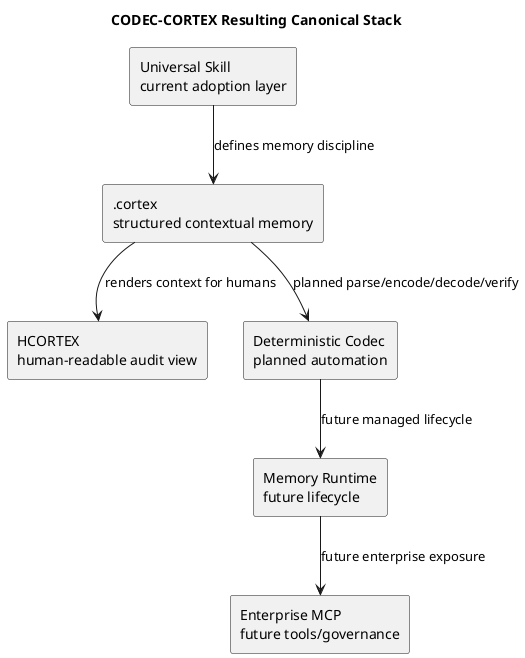

<!-- SPDX-FileCopyrightText: 2026 Fidel Ernesto Lozada A. -->
<!-- SPDX-License-Identifier: MIT -->

# CODEC-CORTEX - Resultado HCORTEX

## Identidad

| Campo | Valor |
|---|---|
| Archivo fuente | `docs/result.cortex` |
| Vista generada | HCORTEX Markdown |
| Fecha | 2026-06-24 |
| Zona horaria | America/Argentina/Cordoba |
| Repositorio auditado | `codec-cortex` |
| Rama | `main` |
| Proposito | Informe operativo completo para que un agente externo analice los ajustes aplicados desde `docs/ajustes.cortex` |

## Objetivo

| Campo | Valor |
|---|---|
| Objetivo principal | Hacer CODEC-CORTEX mas claro, honesto, Skill-first, alineado a roadmap y auditable externamente |
| Resultado | Completado |
| Prioridad | Critica |
| Fuente de ajuste | `../docs/ajustes.cortex` |
| Estado de la fuente | Aplicada |

## Foco Canonico

CODEC-CORTEX queda definido primero como un Skill universal de memoria y protocolo de memoria contextual para agentes LLM/SLM.

El orden canonico aplicado es:

1. Universal Skill como capa actual de adopcion.
2. `.cortex` como memoria contextual estructurada.
3. HCORTEX como vista humana auditable.
4. Codec determinista como automatizacion planificada.
5. Runtime de memoria como fase futura.
6. MCP empresarial como capa operativa futura.

## Principios Aplicados

| Principio | Resultado |
|---|---|
| Direccion | Universal Skill first; `.cortex` como memoria contextual; HCORTEX como reversibilidad contextual humana; codec como automatizacion; MCP como fase futura |
| Honestidad | El repositorio no debe sonar mas implementado de lo que esta |
| Separacion de capas | Skill, formato, vista humana, codec, runtime y MCP quedan diferenciados |
| Reversibilidad | Reversibilidad estructural para targets de roundtrip del codec; reversibilidad contextual para HCORTEX; sin promesa de reconstruccion literal de cada mensaje original |
| Benchmarks | Las metricas numericas requieren evidencia reproducible; sin evidencia, se expresan como target, ejemplo ilustrativo o se eliminan |

## Cambios Conceptuales

| Antes | Despues | Estado |
|---|---|---|
| Protocolo codec-first de compresion determinista | Skill universal de memoria y protocolo de memoria contextual | Aplicado |
| Claim publico de 85%, Zero LLM, 100% reversible | Alta densidad como target, codec determinista planificado, reversibilidad estructural/contextual acotada | Aplicado |
| Documentos que sonaban a implementacion disponible | Modelo de estados current/specification/planned/future | Aplicado |
| MCP podia sonar actual | MCP como diseno empresarial futuro | Aplicado |
| Templates podian parecer estado real | Notices de template, placeholders y metricas ilustrativas | Aplicado |

## Restricciones Cumplidas

| Restriccion | Regla | Estado |
|---|---|---|
| No external references | Remover referencias a proyectos externos o clientes no relacionados en docs publicos | Passed |
| Honestidad | No presentar codec, CLI, runtime o MCP planificados como implementados | Passed |
| Evidencia | No publicar metricas no medidas como probadas | Passed |
| Scope | Cambios dentro de archivos del repositorio `codec-cortex` durante el release | Passed |
| Seguridad Git | Stagear solo archivos del alcance y preservar cambios no relacionados | Passed |

## Acciones Realizadas

| Accion | Target | Resultado |
|---|---|---|
| Leer directiva | `../docs/ajustes.cortex` | Interpretada como mapa de reorientacion documental/especificacion repository-wide |
| Reescribir README | `README.md` | Entrada publica Skill-first con problema, etapa actual, stack canonico, quick start, estructura, claim policy y roadmap |
| Crear status | `STATUS.md` | Registro de madurez agregado |
| Crear roadmap | `ROADMAP.md` | Roadmap de seis fases agregado |
| Reescribir Skill | `skill/SKILL.md`, `skill/SKILL.en.md` | Adopcion progresiva y tabla de estado de operaciones agregadas |
| Reescribir Skill denso | `skill/SKILL.cortex` | Expresion densa del Skill con estados explicitos |
| Corregir ejemplos | `skill/AGENT.cortex`, `skill/brain.cortex`, `skill/AGENT.md`, `skill/AGENT.en.md` | Seguridad de templates, regla de memoria acotada y lenguaje CLI/runtime planificado |
| Alinear specs | `docs/*/specs/*.md` | Notas de estado agregadas; claims absolutos y metricas suavizadas |
| Corregir metadata | `pyproject.toml`, `src/codec_cortex/__init__.py`, `CITATION.cff`, `GOVERNANCE.md`, `AUTHORS.md`, `CHANGELOG.md` | Metadata alineada a release `v0.2.0` Skill-first |
| Crear reporte | `docs/review/project-reorientation-report.md` | Diagnostico humano y registro de riesgos agregado |
| Release | `origin/main` + `v0.2.0` | Commit, push y tag anotado completados |

## Inventario de Archivos Cambiados

| Archivo | Cambio | Estado |
|---|---|---|
| `AUTHORS.md` | Removido wording de proyecto externo en rol/historial de contribuidor | Modificado |
| `CHANGELOG.md` | Agregada entrada de release `0.2.0` | Modificado |
| `CITATION.cff` | Actualizados titulo, abstract, afiliacion, version y fecha de release | Modificado |
| `GOVERNANCE.md` | Actualizada version actual y removido wording de ciclo externo | Modificado |
| `README.md` | Reescrito como entrada Skill-first; agrega etapa, stack, claim policy y roadmap | Modificado |
| `ROADMAP.md` | Nuevo roadmap de seis fases | Agregado |
| `STATUS.md` | Nuevo registro de verdad para madurez de claims | Agregado |
| `docs/review/project-reorientation-report.md` | Nuevo reporte de auditoria | Agregado |
| `docs/en/specs/adoption.md` | Nota de estado; MCP/CLI marcados planned/future; nombres de clientes externos removidos | Modificado |
| `docs/en/specs/algorithm.md` | Compresion numerica reformulada como target con benchmark requerido; reversibilidad acotada | Modificado |
| `docs/en/specs/fundamentals.md` | Nota de estado; claims algoritmicos y de reversibilidad suavizados | Modificado |
| `docs/en/specs/mcp-bridge.md` | Diseno futuro explicitado; nombres de clientes generalizados | Modificado |
| `docs/es/specs/adopcion.md` | Nota de estado; MCP/CLI marcados planned/future; nombres de clientes externos removidos | Modificado |
| `docs/es/specs/algoritmo.md` | Compresion numerica reformulada como target con benchmark requerido; reversibilidad acotada | Modificado |
| `docs/es/specs/fundamentos.md` | Nota de estado; claims algoritmicos y de reversibilidad suavizados | Modificado |
| `docs/es/specs/mcp-bridge.md` | Diseno futuro explicitado; nombres de clientes generalizados | Modificado |
| `pyproject.toml` | Version a `0.2.0` y descripcion alineada | Modificado |
| `src/codec_cortex/__init__.py` | Placeholder aclarado y `__version__` a `0.2.0` | Modificado |
| `skill/AGENT.cortex` | Marcado como ejemplo/template; regla `.cortex-only` suavizada; refs corregidas | Modificado |
| `skill/AGENT.md` | Gate de salida y runtime futuro alineados | Modificado |
| `skill/AGENT.en.md` | Gate de salida y runtime futuro alineados | Modificado |
| `skill/SKILL.cortex` | Reescrito como especificacion/reporte denso con estados | Modificado |
| `skill/SKILL.md` | Adopcion progresiva, tabla de operaciones y claims de codec acotados | Modificado |
| `skill/SKILL.en.md` | Adopcion progresiva, tabla de operaciones y claims de codec acotados | Modificado |
| `skill/brain.cortex` | Notice de template, placeholders y metricas ilustrativas | Modificado |

## Metadata de Release

| Campo | Valor |
|---|---|
| Commit SHA | `1a7edad2199ce1e563eb83c2cedf8975f543c35d` |
| Commit corto | `1a7edad` |
| Rama | `main` |
| Mensaje | `spec: reorient project as universal memory skill` |
| Autor | `Fidel Lozada <fidel.lozada@vatrox.com>` |
| Fecha | `2026-06-24T06:48:00-03:00` |
| Tag | `v0.2.0` |
| Tipo de tag | Anotado |
| Estado remoto del tag | Pushed |
| Remote ref | `refs/tags/v0.2.0` |
| Remote | `origin` |
| URL | `https://github.com/FidelErnesto03/codec-cortex.git` |
| Rama pusheada | `main` |
| Version anterior | `0.1.0` |
| Version nueva | `0.2.0` |
| Razon SemVer | Reorientacion de especificacion/narrativa backward-compatible bajo reglas de `GOVERNANCE.md` |
| Convencion de commit | `spec:` mapea a cambio de especificacion; se eligio MINOR |

## Resumen de Diff

| Campo | Valor |
|---|---:|
| Archivos cambiados | 25 |
| Inserciones | 608 |
| Eliminaciones | 555 |

Archivos agregados:

- `ROADMAP.md`
- `STATUS.md`
- `docs/review/project-reorientation-report.md`

## Evidencia de Validacion

| Validacion | Comando | Resultado | Notas |
|---|---|---|---|
| Risk scan | `rg risky phrases across repository` | Passed | Sin matches para claims no soportados de 85%, reversibilidad generica 100%, Zero LLM, nombres externos, `decode --format` fantasma o bans absolutos Markdown/YAML/JSON |
| Diff check | `git diff --check` | Passed | Sin errores de whitespace o markers |
| Compile | `python3 -m compileall src` | Passed | `src/codec_cortex/__init__.py` compilo |
| Status antes de result | `git status -sb after push` | Passed | `main...origin/main` limpio antes de crear `result.cortex` |
| Tag remoto | `git ls-remote --tags origin v0.2.0` | Passed | `refs/tags/v0.2.0` presente en origin |
| Release log | `git log --oneline -3 --decorate` | Passed | HEAD en `main`, tag `v0.2.0`, `origin/main` en commit `1a7edad` |

## Gates de Aceptacion

| Gate | Condicion | Estado |
|---|---|---|
| No External References | Scan dirigido limpio para identificadores externos conocidos | Passed |
| Skill First | README abre describiendo Skill universal y protocolo de memoria contextual | Passed |
| Status Honesty | `STATUS.md` y README separan current/specification/planned/future | Passed |
| Reversibility Scoped | Lenguaje generico de 100% reversible removido o acotado | Passed |
| Benchmark Integrity | Claims numericos removidos o marcados como target/benchmark-required | Passed |
| CLI Availability | Ejemplos CLI retenidos estan marcados como planned | Passed |
| MCP Future | Docs MCP tienen notas de estado y lenguaje futuro | Passed |
| Examples Safe | AGENT y brain usan lenguaje de template/status/placeholders | Passed |
| Commit Push Tag | Commit pusheado a `origin/main` y tag `v0.2.0` pusheado | Passed |

## Riesgos Residuales

| Riesgo | Severidad | Estado | Nota |
|---|---|---|---|
| Documentos largos | Medium | Accepted | Los documentos de referencia aun contienen detalles algoritmicos planificados. `STATUS.md` y las notas por documento son autoritativas hasta que exista implementacion |
| Benchmarks | Medium | Open | No existe suite reproducible de benchmarks. Claims numericos de densidad deben permanecer ausentes o claramente como target hasta agregar tests |
| Codec | Medium | Open | El paquete Python sigue siendo placeholder. Implementar parser/AST/verify antes de publicitar CLI/API |
| Release artifact | Low | Open | Commit y tag fueron pusheados. No se creo objeto GitHub Release en esta sesion |
| Archivo result | Low | Moved outside repo | `result.cortex` fue movido a `CODEC-CORTEX/docs/` y no fue commiteado ni pusheado al repo remoto |

## Referencias de Auditoria

| Referencia | Path | Proposito |
|---|---|---|
| Ajustes fuente | `../docs/ajustes.cortex` | Mapa operativo original |
| Entrada publica | `README.md` | Narrativa Skill-first |
| Registro de verdad | `STATUS.md` | Fuente de verdad de madurez |
| Roadmap | `ROADMAP.md` | Modelo de fases |
| Reporte de revision | `docs/review/project-reorientation-report.md` | Reporte humano de reorientacion |
| Skill ES | `skill/SKILL.md` | Especificacion Spanish |
| Skill EN | `skill/SKILL.en.md` | Especificacion English |
| Skill denso | `skill/SKILL.cortex` | Expresion nativa densa |
| Agente ejemplo | `skill/AGENT.cortex` | Identidad de agente ejemplo/template |
| Brain template | `skill/brain.cortex` | Template de cerebro local |
| Metadata release | `CHANGELOG.md`, `CITATION.cff`, `pyproject.toml`, `src/codec_cortex/__init__.py` | Version y metadata de publicacion |

## Stack Canonico Resultante

## Estado Final

| Campo | Valor |
|---|---|
| Rama del repositorio | `main` |
| Tracking remoto | `origin/main` |
| Release tag | `v0.2.0` |
| Estado del release | Published |
| Estado antes de `result.cortex` | Limpio |
| Ubicacion actual de `result.cortex` | `CODEC-CORTEX/docs/result.cortex` |
| Ubicacion de esta vista HCORTEX | `CODEC-CORTEX/docs/result.md` |

## Resultado Primario

CODEC-CORTEX ahora presenta su documentacion y especificacion con este orden canonico:

1. Universal Skill como centro de adopcion actual.
2. `.cortex` como memoria contextual estructurada.
3. HCORTEX como vista humana para auditoria y correccion.
4. Codec determinista como automatizacion planificada.
5. Runtime de memoria como fase futura.
6. MCP empresarial como capa futura de herramientas, gobierno y auditoria.
