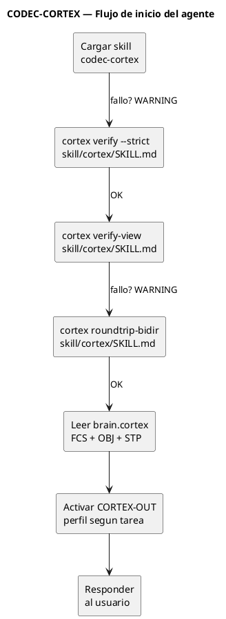
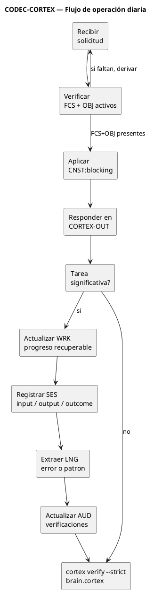
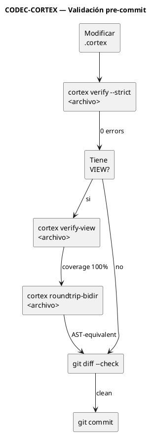
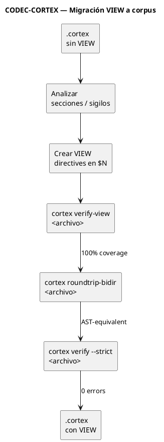
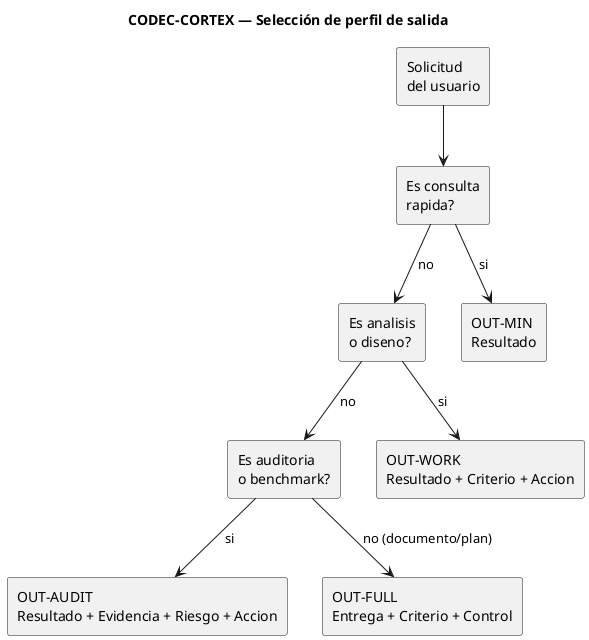

# Plan de cambios v0.3.2 — Canonical naming, corpus VIEW, fix v2-canonicalize

> **Objetivo:** Subsanar los issues identificados en el benchmark v2.0.0, adoptar nombres canónicos estables (sin versión en recursos), migrar el corpus a VIEW directives, y alinear toda la documentación.
>
> **Versión proyecto:** v0.3.2
> **CLI internal version:** mantiene setuptools-scm desde git tags

---

## 1. Problemas detectados en benchmark v2.0.0

| ID | Issue | Severidad | Causa raíz |
|:--:|-------|:---------:|------------|
| B-01 | `cortex_v2_canonical` BCFNR=1.0, WS=−2.73 | **Alta** | `v2-canonicalize` reescribe .cortex perdiendo compatibilidad con v1 render |
| B-02 | VIEW coverage = 0% en todo el corpus | **Alta** | Corpus v1.0.0 no tiene VIEW directives |
| B-03 | `v2-convert` produce HCORTEX vacío (251 bytes) sin VIEW | **Alta** | Sin VIEW directives, no hay mapeo CORTEX↔HCORTEX |
| B-04 | Reversibility = False en todos los casos | **Alta** | Misma causa que B-02 |
| B-05 | v2-canonicalize rompe compatibilidad con v1 render legacy | **Media** | El canon v2 es diferente al formato v1 |
| B-06 | Las 4 métricas v2 (VIEW_coverage, reversibility, bidir_equivalence, loss_count) valen 0 | **Media** | Consecuencia de B-02 |

## 2. Renombramiento canónico (sin versión en recursos)

### 2.1 Comandos CLI

| Actual (con versión) | Propuesto (canónico) | Alias backward-compat | Archivos a modificar |
|----------------------|---------------------|-----------------------|---------------------|
| `v2-roundtrip` | `roundtrip` | `v2-roundtrip` → deprecado | `cli/main.py`, `cli/commands/v2_roundtrip.py` |
| `v2-convert` | `convert` | `v2-convert` → deprecado | `cli/main.py`, `cli/commands/v2_convert.py` |
| `v2-roundtrip-bidir` | `roundtrip-bidir` | `v2-roundtrip-bidir` → deprecado | `cli/main.py`, `cli/commands/v2_roundtrip_bidir.py` |
| `v2-compare` | `compare` | `v2-compare` → deprecado | `cli/main.py`, `cli/commands/v2_compare.py` |
| `v2-verify-view` | `verify-view` | `v2-verify-view` → deprecado | `cli/main.py`, `cli/commands/v2_verify_view.py` |
| `v2-explain-loss` | `explain-loss` | `v2-explain-loss` → deprecado | `cli/main.py`, `cli/commands/v2_explain_loss.py` |
| `v2-canonicalize` | `canonicalize` | `v2-canonicalize` → deprecado | `cli/main.py`, `cli/commands/v2_canonicalize.py` |
| `v2-inspect` | `inspect` | `v2-inspect` → deprecado | `cli/main.py`, `cli/commands/v2_inspect.py` |

**Criterio:** El comando no existe sin prefijo → se crea. El prefijo `v2-` se mantiene como alias deprecado pero no se documenta como nombre primario.

### 2.2 Módulo Python interno

| Actual | Propuesto | Justificación |
|--------|-----------|---------------|
| `cortex/v2/` | `cortex/v2/` permanece | Es la implementación, no la interfaz pública. El nombre interno no afecta al usuario. Cambiarlo rompería imports sin beneficio visible. |

### 2.3 Métodos de benchmark

| Actual | Propuesto | Archivos |
|--------|-----------|----------|
| `cortex_v2_priority_pack` | `cortex_priority_pack` | `benchmarks/v2.0.0/methods/method_registry.json`, `runs/`, `reports/` |
| `cortex_v2_canonical` | `cortex_canonical` | benchmarks/v2.0.0/methods/method_registry.json, runs/, reports/ |

### 2.4 Archivos de test

| Actual | Propuesto |
|--------|-----------|
| `src/tests/test_v2_1_fixes.py` | Mantener (histórico, contiene fixes v2.1) |
| `src/tests/test_v2_2_*` | Mantener (histórico) |
| `src/tests/test_v2_roundtrip.py` | Mantener (no usa prefijo v2- en nombre de test) |
| `src/tests/test_v2_2_view.py` | Mantener |
| `src/tests/test_v2_3_0_acceptance.py` | Mantener |

Los archivos de test hacen referencia interna a versiones del CLI. Al ser valores de la herramienta, no interfaces públicas, se mantienen. Solo se actualizan si usan nombres de método (v2-roundtrip) como strings.

## 3. Migración del corpus a VIEW directives

### 3.1 Estrategia

La VIEW directive debe definirse **primero en HCORTEX** (`skill/hcortex/SKILL.md`) y luego propagarse a CORTEX (`skill/cortex/SKILL.md`). Esto asegura que el HCORTEX sea la fuente de verdad del mapeo.

```
skill/hcortex/SKILL.md (HCORTEX con VIEW) 
        ↓ v2-convert --from hcortex --to cortex
skill/cortex/SKILL.md (CORTEX generado)
        ↓ script de migración
benchmarks/v2.0.0/corpus/source/*.cortex (cada artefacto con su VIEW)
```

### 3.2 Pasos para cada artefacto del corpus

Para cada uno de los 10 casos del corpus (10 dominios × 5 formatos = 50 fuentes, pero los .cortex son 10):

1. Definir VIEW directives en el `.cortex` fuente (3-5 VIEW por artefacto, cubriendo IDN, DOM, FCS, OBJ, CNST)
2. Verificar con `cortex v2-verify-view` que VIEW coverage = 100%
3. Verificar con `cortex v2-roundtrip-bidir` que roundtrip = AST-equivalent
4. Actualizar `corpus/normalized/hashes.json` con nuevos hashes
5. Regenerar reports y runs

### 3.3 Estructura de VIEW para artefacto típico

```cortex
$N
VIEW:identity{kind:table, target:"$1:IDN", reverse:row_to_entry}
VIEW:domain{kind:table, target:"$1:DOM", reverse:row_to_entry}
VIEW:constraints{kind:section, target:"$2:CNST", reverse:rows_to_entries}
VIEW:focus{kind:table, target:"$3:FCS+OBJ", reverse:rows_to_entries}
```

## 4. Fix de `v2-canonicalize` (issue B-01, B-05)

### 4.1 Síntoma

`v2-canonicalize` reescribe el `.cortex` en un formato canónico v2 que:
- No es reconocido por `v1 render` legacy
- `v2-convert` no puede generar HCORTEX sustancial
- BCFNR = 1.0 (pierde todas las constraints)

### 4.2 Solución propuesta

| Opción | Descripción | Esfuerzo | Riesgo |
|--------|-------------|:--------:|:------:|
| A | Agregar flag `--compat` que preserve compatibilidad v1 | 2-3 días | Bajo |
| B | Hacer que `canonicalize` preserve el formato original y solo normalice whitespace/orden | 1-2 días | Medio |
| C | Documentar que `canonicalize` requiere VIEW directives y falla elegantemente sin ellas | 0.5 días | Mínimo |

**Recomendación:** Opción B + C. `canonicalize` no debería cambiar la estructura del .cortex, solo normalizar formato (whitespace, orden de secciones). Si no hay VIEW directives, debe emitir advertencia y no modificar el contenido.

### 4.3 Cambios específicos en `v2/canonicalize.py` (o `v2/writer.py`)

1. Antes de reescribir, verificar si el .cortex tiene VIEW directives
2. Si no tiene VIEW: warning + preservar estructura original, solo normalizar whitespace
3. Si tiene VIEW: aplicar canonicalización completa
4. Agregar flag `--preserve` para forzar preservación de estructura original

## 5. Documentación a actualizar

| Documento | Cambio |
|-----------|--------|
| `cli/README.md` | Reemplazar `v2-convert` por `convert`, etc. |
| `cli/CHANGELOG.md` | Nueva sección [0.3.2] con cambios de naming |
| `cli/STATUS.md` | Actualizar tabla de capacidades con nombres canónicos |
| `benchmarks/README.md` | Catálogo v2.0.0 → estado actual; notas sobre migration |
| `benchmarks/v2.0.0/reports/` | Regenerar reports con nombres canónicos y corpus migrado |
| `skill/cortex/README.md` | Procedimiento actualizado |
| `skill/cortex/AGENT.md` | Actualizar referencias de comandos |
| `skill/hcortex/AGENT.md` | Ídem |
| `docs/specs/skill-distribution.md` | Comandos canónicos |
| `ROADMAP.md` | Phase 4 actualizada |

## 6. Orden de ejecución

```
Fase 1: Nombres canónicos CLI
├── main.py: agregar comandos sin prefijo v2-
├── tests: actualizar referencias a comandos v2-
├── docs/ cli: README, STATUS, CHANGELOG
└── benchmark methods: method_registry.json + runs

Fase 2: Fix v2-canonicalize
├── v2/canonicalize.py: preservar estructura sin VIEW
├── v2/writer.py: flag --preserve
└── tests: test_canonicalize_no_view, test_canonicalize_with_view

Fase 3: Migración corpus a VIEW
├── skill/hcortex/SKILL.md: VIEW directives (ya tiene 44)
├── skill/cortex/SKILL.md: derivar desde HCORTEX con v2-convert
├── benchmarks/v2.0.0/corpus/source/*.cortex: agregar VIEW
├── benchmarks/v2.0.0/corpus/normalized/hashes.json
└── regenerar runs/reports

Fase 4: Alineación documental
├── README.md (proyecto)
├── brain.cortex
├── STATUS.md
├── ROADMAP.md
└── tag v0.3.2
```

## 7. Artefactos canónicos finales (v0.3.2)

| Artefacto | VIEW | Coverage | Reversible | 
|-----------|:----:|:--------:|:----------:|
| `skill/hcortex/SKILL.md` | 44 | 100% | True |
| `skill/cortex/SKILL.md` | 44 | 100% | True |
| `corpus/source/*.cortex` (10) | 3-5 c/u | 100% | True |
| `benchmarks/v2.0.0/` | Sí | 100% | True |

## 8. Criterios de aceptación

- [ ] Ningún recurso público del proyecto usa "v2" en su nombre canónico
- [ ] `cortex canonicalize` no rompe compatibilidad con artefactos sin VIEW
- [ ] Corpus benchmark completo con VIEW directives (10 artefactos)
- [ ] `cortex v2-verify-view ` reporta 100% coverage en skill canónico y corpus
- [ ] `cortex roundtrip-bidir` pasa en skill canónico y corpus
- [ ] Todos los tests pasan (341+ nuevos tests de canonicalize y VIEW migration)
- [ ] Documentación actualizada sin referencias a "v2-" como nombre primario
- [ ] Tag v0.3.1 → v0.3.2

---

## 9. Integración agente: workflow operativo del skill

Actualmente el skill describe el protocolo pero no instruye al agente **cómo operar** con él. Para v0.3.2 se agrega un workflow integrado skill→corpus→CLI→CORTEX-OUT que el agente ejecuta al cargar el skill.

### 9.1 Workflow de inicio (al cargar el skill)

```
Al cargar codec-cortex:
  1. Verificar canon:  cortex verify --strict skill/cortex/SKILL.md
  2. Validar VIEW:     cortex verify-view skill/cortex/SKILL.md
  3. Validar roundtrip: cortex roundtrip-bidir skill/cortex/SKILL.md
  4. Cargar brain:     leer brain.cortex → extraer FCS + OBJ + STP
  5. Activar CORTEX-OUT: perfil OUT-AUDIT para respuestas del agente
```

### 9.2 Workflow de operación diaria

```
Por cada interacción del usuario:
  1. Verificar FCS/OBJ activos (desde brain.cortex o memoria nativa)
  2. Aplicar CNST:blocking antes de ejecutar
  3. Responder en CORTEX-OUT (perfil según criticidad)
  4. Al cerrar tarea significativa:
     a. Actualizar WRK si hay progreso recuperable
     b. Registrar SES con input→output→outcome
     c. Extraer LNG si hubo error o patrón
     d. Actualizar AUD si se verificó algo
     e. cortex verify --strict brain.cortex antes de commit
```

### 9.3 Workflow de validación (pre-commit/pre-push)

```
Antes de cada commit que toque .cortex:
  1. cortex verify --strict <archivo>
  2. cortex verify-view <archivo>       (si tiene VIEW)
  3. cortex roundtrip-bidir <archivo>   (si tiene VIEW)
  4. git diff --check

Antes de cada tag:
  1. make all  (lint + test + verify + roundtrip)
  2. cortex roundtrip-bidir skill/cortex/SKILL.md
  3. cortex roundtrip-bidir skill/hcortex/SKILL.md
  4. grep -rn "version_string" para verificar superficies
```

### 9.4 Workflow de migración VIEW (para corpus)

```
Para cada .cortex sin VIEW:
  1. Analizar estructura: sections, sigils, entries
  2. Crear VIEW directives en $N (última sección disponible)
     - Una VIEW por corteza semántica (IDN, DOM, CNST, FCS, OBJ)
     - kind: table|section|kv_table según tipo de datos
     - target: apunta a la sección/sigilo fuente
     - reverse: define estrategia de reversión
  3. cortex verify-view <archivo>  → 100% coverage
  4. cortex roundtrip-bidir <archivo> → AST-equivalent
  5. cortex verify --strict <archivo> → 0 errors, 0 warnings
```

### 9.5 Reglas `!` a agregar en el skill Hermes

| ! | cond | acc |
|---|------|-----|
| `!:startup_verify` | `on_skill_load` | Ejecutar `cortex verify --strict skill/cortex/SKILL.md` y `cortex verify-view skill/cortex/SKILL.md` al cargar el skill. Reportar fallos como WARNING. |
| `!:precommit_verify` | `before_commit` | Si se modificó un .cortex, ejecutar `cortex verify --strict` sobre ese archivo antes de permitir el commit. |
| `!:output_cortex_out` | `always` | Aplicar CORTEX-OUT §10 como protocolo de respuesta (existente). |
| `!:canonical_names` | `always` | Usar nombres canónicos para comandos CLI y recursos. No usar prefijos de versión (v2-, v3-) en nombres públicos. Los alias deprecados existen por compatibilidad pero no se documentan como nombre primario. |

### 9.6 Verificación de integración

```bash
# Pipeline completo que el agente ejecuta post-instalación
cortex --version                          # ≥ 0.3.2
cortex verify --strict skill/cortex/SKILL.md   # 0 errors
cortex verify-view skill/cortex/SKILL.md       # coverage 100%
cortex roundtrip-bidir skill/cortex/SKILL.md   # rc=0, 0 diffs
cortex verify --strict skill/cortex/AGENT.md   # 0 errors
cortex inspect skill/cortex/SKILL.md           # 14 sec, 266 entries, 44 VIEW
make test                                     # 341+ passed
```

### 9.7 CORTEX-OUT para outputs del agente

El agente DEBE usar CORTEX-OUT §10 para todas las respuestas cuando el skill esté cargado:

| Situación | Perfil CORTEX-OUT | Bloques |
|-----------|:------------------:|---------|
| Consulta rápida | OUT-MIN | Resultado |
| Análisis o diseño | OUT-WORK | Resultado + Criterio + Acción |
| Auditoría o benchmark | OUT-AUDIT | Resultado + Evidencia + Riesgo + Acción |
| Documento, plan, entrega | OUT-FULL | Entrega + Criterio + Control |
| Error o bloqueo | OUT-MIN | Resultado + Riesgo |

Prioridad de salida: O0 (Resultado) primero, O5 (desarrollo extendido) último. Tablas > listas > prosa.

### 9.8 Diagramas de workflow (PUML)

#### 9.8.1 Inicio del agente



#### 9.8.2 Operación diaria



#### 9.8.3 Validación pre-commit



#### 9.8.4 Migración VIEW a corpus



#### 9.8.5 Selección de perfil CORTEX-OUT


