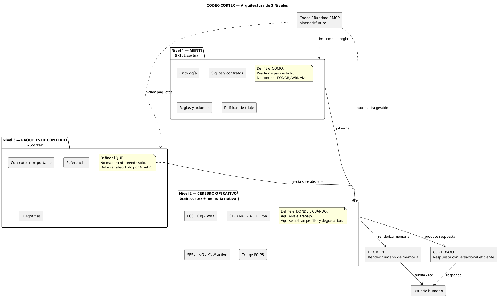
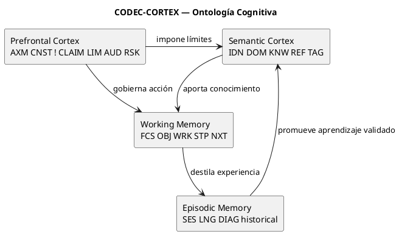
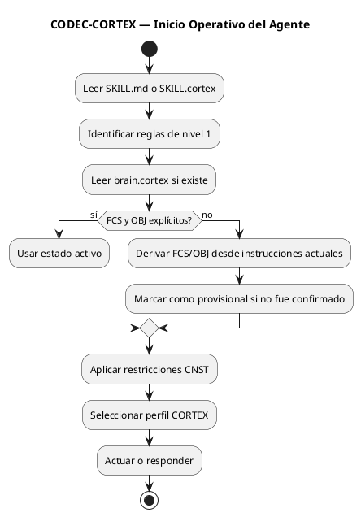
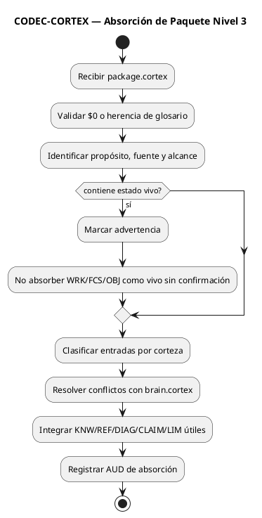
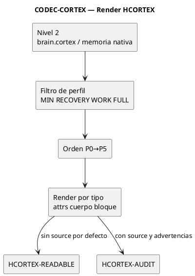
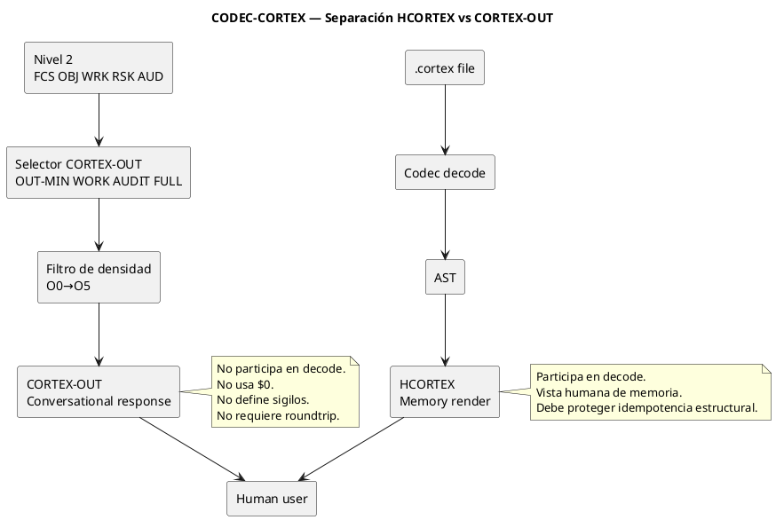
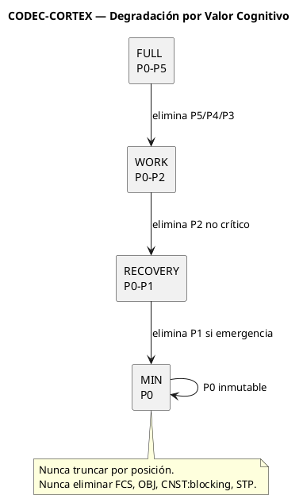
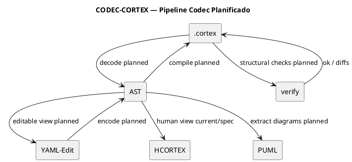
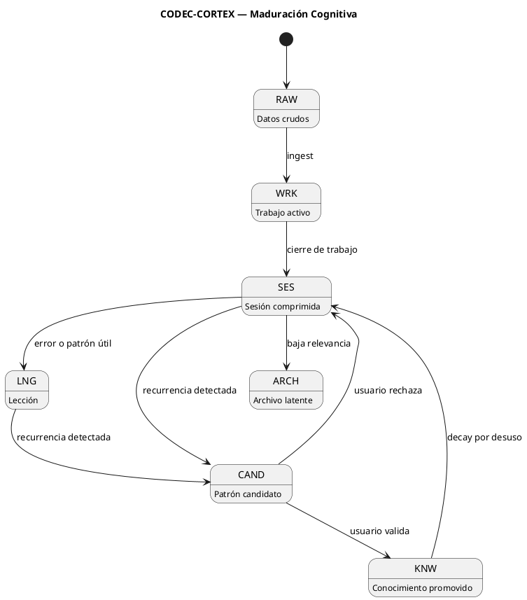
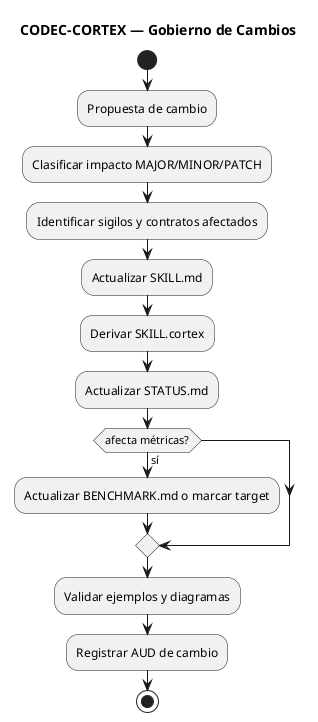

<!-- SPDX-FileCopyrightText: 2026 Fidel Ernesto Lozada A. -->
<!-- SPDX-License-Identifier: MIT -->

<p align="center">
  <strong>CODEC-CORTEX</strong><br>
  Enterprise Skill Specification for Cognitive Memory Governance and Output Discipline
  <br>
  <sub>SKILL.md · v1.2.0-enterprise-candidate · MIT</sub>
</p>

---

# CODEC-CORTEX — SKILL.md

## 0. Control del documento

| Campo | Valor |
|---|---|
| **Nombre canónico** | `SKILL.md` |
| **Sistema** | CODEC-CORTEX |
| **Propósito** | Especificar cómo agentes LLM/SLM deben leer, producir, usar y gobernar memoria contextual estructurada `.cortex` |
| **Estado** | Enterprise Candidate Specification |
| **Versión** | `1.2.0-enterprise-candidate` |
| **Licencia** | MIT |
| **Autoría** | Fidel Ernesto Lozada A. |
| **Lenguaje estructural** | Inglés para sigilos, etiquetas, handlers, nombres técnicos y contratos parseables |
| **Lenguaje semántico** | Idioma del dominio o del usuario |
| **Salida humana** | HCORTEX para render de memoria; CORTEX-OUT para respuesta conversacional eficiente |

### 0.1 Relación con otros artefactos

| Artefacto | Naturaleza | Responsabilidad |
|---|---|---|
| `SKILL.md` | Especificación humana canónica | Explica arquitectura, reglas, operación, gobierno y contratos |
| `SKILL.cortex` | Mente comprimida del protocolo | Forma densa derivada de este documento; no contiene estado vivo |
| `brain.cortex` | Cerebro operativo local | Estado persistente de trabajo: `FCS`, `OBJ`, `WRK`, `STP`, `NXT`, sesiones y aprendizaje |
| `*.cortex` packages | Paquetes de contexto | Contexto transportable, sin ciclo de vida propio hasta ser absorbido por Nivel 2 |
| `HCORTEX` | Vista humana de memoria | Render Markdown auditable y legible de `.cortex`; no es memoria canónica |
| `CORTEX-OUT` | Política de salida conversacional | Formato independiente, inspirado en HCORTEX, para respuestas eficientes; no participa en decode/encode/verify |
| `STATUS.md` | Registro de verdad | Declara qué existe, qué está planificado y qué es futuro |
| `BENCHMARK.md` | Evidencia empírica | Declara métricas medidas, datasets, metodología, resultados y límites |

### 0.2 Lenguaje normativo

Las palabras **MUST**, **MUST NOT**, **SHOULD**, **SHOULD NOT**, **MAY**, **REQUIRED**, **RECOMMENDED** y **OPTIONAL** se usan con sentido normativo. En español operativo:

| Término | Significado |
|---|---|
| **MUST / DEBE** | Requisito obligatorio. Incumplirlo rompe conformidad. |
| **MUST NOT / NO DEBE** | Prohibición obligatoria. |
| **SHOULD / DEBERÍA** | Recomendación fuerte; puede omitirse solo con justificación explícita. |
| **MAY / PUEDE** | Capacidad opcional. |

### 0.3 Taxonomía de madurez

Todo claim de capacidad DEBE indicar madurez cuando pueda inducir error.

| Estado | Significado | Puede declararse como capacidad actual |
|---|---|:---:|
| `current` | Ya puede ejecutarse por lectura disciplinada del agente o herramienta existente | Sí |
| `specification` | Está definido normativamente, pero no necesariamente automatizado | Parcial, con aclaración |
| `planned` | Diseñado para una fase posterior; requiere implementación | No |
| `future` | Visión o fase empresarial posterior | No |
| `experimental` | Existe, pero no es estable ni canónico | No sin advertencia |
| `deprecated` | Permitido por compatibilidad, no recomendado | No |

**Regla de honestidad:** ningún documento, agente, README, salida HCORTEX, salida CORTEX-OUT o interfaz comercial DEBE presentar como `current` una capacidad `planned`, `future` o no verificada.

---

# 1. Resumen ejecutivo

CODEC-CORTEX no es un prompt ni solo un formato de archivo. Es un protocolo de memoria contextual para agentes LLM/SLM que reemplaza historia lineal por estado cognitivo estructurado, auditable y gobernable.

El sistema se apoya en seis piezas:

1. **Mente (`SKILL.cortex`)**: reglas, ontología, contratos y algoritmos conceptuales.
2. **Cerebro operativo (`brain.cortex` + memoria nativa)**: estado vivo de trabajo.
3. **Paquetes de contexto (`*.cortex`)**: payloads transportables de información.
4. **Autocontención `$0`**: todo `.cortex` válido incluye un glosario local mínimo para arranque seguro entre agentes.
5. **HCORTEX**: vista humana de la memoria, en Markdown auditable.
5. **CORTEX-OUT**: política independiente de respuesta conversacional eficiente.
6. **Codec/runtime/MCP**: automatización planificada o futura, nunca asumida si no existe.

## 1.1 Canon mínimo

```text
SKILL gobierna.
brain opera.
package inyecta.
HCORTEX explica.
CORTEX-OUT responde con densidad.
codec automatiza cuando exista.
runtime madura cuando exista.
MCP expone empresarialmente cuando exista.
```

## 1.2 Problema que resuelve

Los agentes LLM/SLM pierden continuidad cuando dependen de historial plano. El historial plano mezcla instrucciones, hechos, decisiones, riesgos, progreso, evidencia y referencias. Esa mezcla produce ruido, amnesia, contradicción, pérdida de foco y degradación por posición.

CODEC-CORTEX impone separación de responsabilidades, prioridad cognitiva, render humano auditable y comunicación saliente eficiente.

## 1.3 Principio rector

> Memoria contextual estructurada antes que historia lineal. El glosario `$0` dicta la sintaxis. El Nivel 2 contiene el estado vivo. HCORTEX permite auditoría humana de memoria. CORTEX-OUT gobierna la respuesta saliente sin participar en el codec. La automatización determinista pertenece al codec/runtime cuando esté implementada y verificada.

---

# 2. Arquitectura empresarial de 3 niveles

## 2.1 Diagrama canónico



## 2.2 Nivel 1 — Mente

`SKILL.cortex` DEBE contener solamente:

- ontología cognitiva;
- glosario universal `$0`;
- contratos mínimos por sigilo;
- reglas de operación;
- políticas de triaje;
- reglas HCORTEX;
- reglas CORTEX-OUT;
- límites y claims de madurez;
- diagramas normativos;
- pitfalls y controles.

`SKILL.cortex` MUST NOT contener estado vivo de una sesión.

### Prohibición crítica

Los siguientes sigilos NO DEBEN aparecer en `SKILL.cortex` como estado activo:

```text
FCS, OBJ, WRK, STP, NXT
```

Solo pueden aparecer en `SKILL.cortex` bajo una de estas condiciones:

| Uso permitido | Requisito |
|---|---|
| Definición de contrato | Debe estar en sección normativa o tabla de campos |
| Ejemplo no ejecutable | Debe marcarse como `example`, `template` o `non_operational` |
| Diagrama o explicación | No debe interpretarse como memoria viva |

## 2.3 Nivel 2 — Cerebro operativo

`brain.cortex` DEBE contener el estado activo y persistente del agente:

- foco (`FCS`);
- objetivo (`OBJ`);
- trabajo actual (`WRK`);
- siguiente paso (`STP`);
- cola de acciones (`NXT`);
- auditoría (`AUD`);
- riesgos (`RSK`);
- sesiones (`SES`);
- lecciones (`LNG`);
- conocimiento activo o promovido (`KNW`).

El agente MUST validar `FCS` y `OBJ` antes de actuar. Si faltan, DEBE detener operación autónoma y solicitar o derivar el foco y objetivo desde el contexto disponible.

## 2.4 Nivel 3 — Paquetes de contexto

Un paquete `.cortex` de Nivel 3:

- MAY contener información densa de dominio;
- MAY contener `REF`, `DIAG`, `KNW`, `CLAIM`, `LIM`, `SES` históricos;
- MUST NOT reclamar ciclo de vida propio;
- MUST NOT mutar por sí mismo;
- SHOULD incluir procedencia, propósito y alcance;
- solo entra al ciclo de maduración si se absorbe formalmente en Nivel 2.

## 2.5 HCORTEX

HCORTEX es una vista humana Markdown generada desde memoria `.cortex`. No es el formato canónico de persistencia.

HCORTEX DEBE:

- omitir `$0` por defecto;
- traducir sigilos a lenguaje natural;
- preservar trazabilidad cuando se use en modo auditoría;
- declarar perfil de contexto aplicado;
- indicar advertencias si faltan entradas críticas.

HCORTEX MUST NOT gobernar la respuesta conversacional ordinaria del agente. Esa responsabilidad pertenece a CORTEX-OUT.

## 2.6 CORTEX-OUT

CORTEX-OUT es una política independiente de comunicación saliente para agentes que operan con CODEC-CORTEX. Está inspirada en HCORTEX por su preferencia por estructura, bloques explícitos y economía verbal, pero NO forma parte de HCORTEX ni del codec.

CORTEX-OUT DEBE:

- producir respuestas humanas breves, estructuradas y accionables;
- maximizar utilidad cognitiva por token;
- declarar riesgos, límites o incertidumbre cuando sean relevantes;
- seleccionar densidad según complejidad de la tarea;
- permanecer fuera de `decode`, `encode`, `verify`, AST, `$0` y roundtrip.

CORTEX-OUT MUST NOT:

- definir sigilos;
- modificar `$0`;
- alterar HCORTEX;
- ser usado como memoria canónica;
- ser parseado como `.cortex`;
- prometer idempotencia o reversibilidad.

---

# 3. Ontología cognitiva

CODEC-CORTEX clasifica la memoria en cuatro cortezas cognitivas.

| Corteza | Sigilos típicos | Persistencia | Propósito |
|---|---|---|---|
| **Semántica** | `IDN`, `DOM`, `KNW`, `REF`, `TAG` | Larga | Identidad, dominio, conocimiento y referencias |
| **Prefrontal** | `AXM`, `CNST`, `!`, `CLAIM`, `LIM`, `AUD`, `RSK` | Alta | Gobierno, límites, riesgos, reglas y evidencia |
| **Trabajo** | `FCS`, `OBJ`, `WRK`, `STP`, `NXT` | Viva | Foco, meta, progreso y siguiente acción |
| **Episódica** | `SES`, `LNG`, `DIAG` histórico | Variable | Experiencia, lecciones y memoria destilada |

## 3.1 Diagrama de capas



---

# 4. Glosario cognitivo universal `$0`

## 4.1 Regla de autoridad y autocontención

Todo archivo `.cortex` DEBE iniciar con una sección `$0` local, mínima y autocontenida.

`$0` es el punto de arranque estructural del archivo. Su propósito es permitir que otro agente pueda iniciar lectura, recuperación o trabajo seguro sin depender de memoria oculta, prompts previos, archivos externos o conocimiento implícito del agente que creó el archivo.

`SKILL.cortex` gobierna, especializa y endurece el protocolo, pero NO debe ser una dependencia obligatoria para iniciar la interpretación básica de un `brain.cortex`, paquete `.cortex` o cualquier otro artefacto `.cortex`.

Por tanto:

- un archivo `.cortex` sin `$0` local NO ES plenamente conforme;
- un archivo `.cortex` con `$0` mínimo ES operable;
- un archivo `.cortex` con `$0` extendido ES operable y especializado;
- el agente puede extender `$0` localmente cuando necesite nuevos sigilos, tipos, contratos posicionales o micro-tokens;
- ninguna extensión local puede redefinir silenciosamente un sigilo existente ni cambiar su tipo de expansión una vez usado.

`$0` es la única fuente de verdad estructural local para:

- sigilos usados por el archivo;
- nombre semántico;
- tipo de expansión;
- riesgo;
- capa cognitiva;
- contratos mínimos;
- contratos posicionales;
- micro-tokens locales;
- reglas de render o recuperación aplicables al archivo.

El contenido de `$0` NO se interpreta como memoria de trabajo. Es metadato estructural.

### 4.1.1 Glosario mínimo obligatorio

Todo archivo `.cortex` DEBE incluir, como mínimo, los sigilos necesarios para iniciar operación segura. El mínimo recomendado para portabilidad general es:

| Sigilo | Nombre | Tipo | Riesgo | Capa | Descripción |
|---|---|---|:---:|---|---|
| `IDN` | identity | `attrs` | B | Semantic | Identidad del artefacto, actor, sistema o memoria |
| `DOM` | domain | `attrs` | B | Semantic | Alcance, contexto o dominio operativo |
| `AXM` | axiom | `cuerpo` | H | Prefrontal | Principio no negociable |
| `CNST` | constraint | `attrs` | H | Prefrontal | Límite duro o restricción operativa |
| `FCS` | focus | `attrs` | H | Working | Anclaje de atención |
| `OBJ` | objective | `attrs` | H | Working | Objetivo activo o declarado |
| `WRK` | work | `attrs` | M | Working | Estado operativo actual |
| `STP` | step | `attrs` | M | Working | Próxima acción inmediata |
| `REF` | reference | `attrs` | B | Semantic | Referencia a archivo, fuente, objeto o recurso externo |
| `STAT` | status | `attrs` | B | Semantic | Estado, madurez o declaración |
| `AUD` | audit | `attrs` | M | Prefrontal | Registro de auditoría o verificación |
| `RSK` | risk | `attrs` | M | Prefrontal | Riesgo identificado y mitigación |
| `CLAIM` | claim | `attrs` | M | Prefrontal | Afirmación verificable |
| `LIM` | limit | `attrs` | M | Prefrontal | Límite operativo explícito |
| `KNW` | knowledge | `attrs` | B | Semantic | Conocimiento estable o promovido |
| `SES` | session | `attrs` | M | Episodic | Episodio comprimido |
| `LNG` | lesson | `attrs` | M | Episodic | Lección, patrón o error a evitar |
| `DIAG` | diagram | `bloque` | M | Episodic/Visual | Diagrama o bloque visual verbatim |
| `!` | rule | `attrs` | H | Prefrontal | Regla operacional compacta |

Tipos mínimos obligatorios:

| Tipo | Significado |
|---|---|
| `attrs` | Pares clave:valor |
| `cuerpo` | Texto literal |
| `bloque` | Bloque multilínea verbatim |

Micro-glosario mínimo recomendado:

| Token | Expansión |
|---|---|
| `cur` | current |
| `pln` | planned |
| `fut` | future |
| `blk` | blocked |
| `min` | minimum |
| `rec` | recovery |
| `wrk` | work |
| `full` | full |
| `ok` | success |
| `fail` | failure |
| `part` | partial |

### 4.1.2 Extensión local del glosario

El agente PUEDE extender `$0` cuando el archivo requiera mayor precisión o nuevas capacidades locales.

La extensión local DEBE cumplir:

1. Nuevo sigilo: DEBE registrarse en `$0` antes de su primer uso.
2. Nuevo micro-token: DEBE declararse en `$0` antes de su primer uso.
3. Nuevo tipo de expansión: DEBE declararse en `$0` antes de su primer uso.
4. `attrs-pos`: DEBE declarar contrato posicional local.
5. Sigilos existentes: NO DEBEN redefinirse silenciosamente.
6. Tipo de expansión: NO DEBE cambiarse para un sigilo ya usado en el archivo.
7. Micro-tokens: NO DEBEN expandirse dentro de `bloque` o `DIAG`.
8. Sigilo desconocido: DEBE tratarse como entrada no confiable hasta ser registrado o confirmado.

### 4.1.3 Recuperación ante `$0` ausente o incompleto

Si un agente recibe un archivo `.cortex` sin `$0`, DEBE tratarlo como no conforme.

Procedimiento mínimo:

1. No ejecutar decisiones operativas basadas en ese archivo.
2. Leerlo solo en modo recuperación.
3. Identificar sigilos aparentes.
4. Reconstruir un `$0` mínimo local.
5. Marcar ambigüedades como `RSK` o `AUD`.
6. Solicitar confirmación humana si hay riesgo semántico.
7. Reemitir el archivo reparado con `$0` local antes de usarlo como memoria confiable.

Un archivo `.cortex` sin `$0` puede ser recuperable, pero no debe ser considerado fuente operativa confiable hasta ser reparado.

## 4.2 Sigilos canónicos

| Sigilo | Nombre | Tipo | Riesgo | Capa | Descripción |
|---|---|---|:---:|---|---|
| `IDN` | identity | `attrs` | B | Semantic | Identidad de skill, agente, humano o sistema |
| `DOM` | domain | `attrs` | B | Semantic | Alcance, dominio y contexto de adopción |
| `KNW` | knowledge | `attrs` | B | Semantic | Conocimiento base o promovido |
| `REF` | reference | `attrs` | B | Semantic | Referencia a documento, archivo, repositorio o fuente |
| `TAG` | tag | `attrs` | B | Semantic | Metadatos de clasificación |
| `AXM` | axiom | `cuerpo` | H | Prefrontal | Principio no negociable |
| `CNST` | constraint | `attrs` | H | Prefrontal | Restricción dura o límite operativo |
| `!` | rule | `attrs` | H | Prefrontal | Regla operacional compacta |
| `CLAIM` | claim | `attrs` | M | Prefrontal | Afirmación verificable con evidencia |
| `LIM` | limit | `attrs` | M | Prefrontal | Límite explícito de uso o madurez |
| `AUD` | audit | `attrs` | M | Prefrontal | Registro de verificación, auditoría o evidencia |
| `RSK` | risk | `attrs` | M | Prefrontal | Riesgo identificado con mitigación |
| `FCS` | focus | `attrs` | H | Working | Anclaje de atención activo |
| `OBJ` | objective | `attrs` | H | Working | Meta activa con criterio de éxito |
| `WRK` | work | `attrs` | B | Working | Estado de ejecución actual |
| `STP` | step | `attrs` | M | Working | Próxima acción inmediata |
| `NXT` | next | `attrs` | M | Working | Acción en cola con disparador |
| `SES` | session | `attrs` | M | Episodic | Episodio comprimido I/O/R |
| `LNG` | lesson | `attrs` | M | Episodic | Lección aprendida o patrón operativo |
| `DIAG` | diagram | `bloque` | M | Episodic/Visual | Diagrama PlantUML o bloque visual verbatim |
| `HDL` | handler | `attrs-pos` | M | Semantic | Descriptor de operación o contrato de interfaz |
| `PFL` | pitfall | `attrs` | M | Prefrontal | Antipatrón conocido y prevención |
| `DEP` | dependency | `attrs` | M | Semantic | Dependencia entre artefactos o módulos |
| `DESC` | description | `cuerpo` | B | Semantic | Descripción textual estructurada |
| `ERR` | error | `attrs` | M | Prefrontal | Error conocido con causa y solución |

## 4.3 Tipos de expansión

| Tipo | Regla | Uso permitido |
|---|---|---|
| `attrs` | Pares `clave:"valor"` o `clave:valor` dentro de `{}` | Datos estructurados parseables |
| `attrs-pos` | Valores posicionales separados por `|`; orden definido en `$0` | Máxima compresión, solo cuando el contrato es estable |
| `cuerpo` | Texto literal entre `{}` | Axiomas, descripciones o reglas largas |
| `bloque` | Bloque multilínea verbatim | PlantUML, código, tablas crudas o diagramas |
| `relación` | Forma causal `A -> B` o equivalente | Flujos simples y transiciones |

### Reglas de uso de tipos

- Un sigilo declarado como `attrs` MUST usar pares clave/valor.
- Un sigilo declarado como `attrs-pos` MUST cumplir exactamente el orden posicional definido.
- Si un `attrs-pos` no cumple el número de campos, el agente SHOULD degradarlo a `attrs` explícito.
- Un `DIAG` MUST preservar su contenido bit a bit.
- Un parser MUST NOT inferir tipos por heurística si `$0` los define.

## 4.4 Micro-glosario

Los micro-tokens reducen valores repetitivos. Son opcionales y gobernados por `$0`.

| Prefijo | Semántica | Ejemplos |
|---|---|---|
| `d_` | Acciones | `d1=decode`, `d2=detect`, `d3=decay` |
| `c_` | Formato | `c1=.cortex`, `c2=HCORTEX` |
| `v_` | Validación | `v1=validate`, `v2=verify` |
| `a_` | Archivos | `a1=file`, `a2=files` |
| `s_` | Estructura | `s1=sigil`, `s2=section` |
| `h_` | Handler | `h1=handler` |
| `x_` | Extracción | `x1=extract`, `x2=list` |
| `m_` | Modificación | `m1=modify`, `m2=add` |
| `r_` | Remoción | `r1=remove` |
| `p_` | Promoción | `p1=promote` |
| `f_` | Formato | `f1=format` |
| `t_` | Términos | `t1=structure` |

### Delimitación

Los micro-tokens se expanden solo si están delimitados por:

```text
espacio | , { } salto_de_línea inicio_de_valor fin_de_valor
```

MUST NOT expandirse dentro de palabras:

```text
param_d1        # no se expande
handler-d1      # no se expande
"d1"            # se expande si el modo lo permite
```

---

# 5. Sintaxis `.cortex`

## 5.1 Forma general

```text
SIGIL:name{key:"value", key2:value2}
SIGIL:name{
contenido literal o bloque multilínea
}
```

## 5.2 Secciones

Las secciones SHOULD usar numeración `$N`.

| Sección | Uso recomendado |
|---|---|
| `$0` | Glosario universal o declaración de herencia |
| `$1` | Identidad y dominio |
| `$2` | Contexto operativo, si es `brain.cortex`; propósito, si es `SKILL.cortex` |
| `$3` | Operaciones o handlers |
| `$4` | Reglas |
| `$5` | Pitfalls, riesgos o límites |
| `$6` | Diagramas |
| `$7` | Contratos de campos |
| `$8` | Supervivencia y prioridades |
| `$9` | Perfiles de contexto |
| `$10` | Política de degradación |
| `$11+` | Extensiones gobernadas |

### Normalización de sección

Un parser SHOULD aceptar:

```text
2
$2
$2: CONTEXT
# -- $2: CONTEXT --
```

Pero SHOULD normalizar internamente a `$2`.

## 5.3 Identificadores

Los nombres de instancia SHOULD usar snake_case:

```text
FCS:primary{...}
OBJ:main{...}
RSK:premature_claim{...}
```

Los sigilos MUST estar en mayúscula, salvo `!` y operadores especiales registrados en `$0`.

---

# 6. Contratos mínimos por sigilo crítico

Campos adicionales están permitidos si no contradicen el contrato mínimo.

| Sigilo | Campos requeridos | Prohibición relevante |
|---|---|---|
| `FCS` | `what`, `priority`, `status`, `survive` | No usar como estado vivo en `SKILL.cortex` |
| `OBJ` | `goal`, `status`, `success`, `survive` | No declarar objetivos activos en Nivel 1 |
| `WRK` | `phase`, `current`, `blocked`, `survive` | No escribir progreso vivo en Nivel 1 o Nivel 3 |
| `STP` | `action`, `reason`, `owner`, `status`, `survive` | No simular ejecución futura |
| `CNST` | `rule`, `severity`, `survive` | `severity:blocking` debe ser P0/min |
| `CLAIM` | `statement`, `evidence`, `status` | No usar métricas no medidas como actuales |
| `LIM` | `limit`, `scope`, `status` | No omitir límites de madurez |
| `RSK` | `risk`, `impact`, `mitigation`, `status`, `survive` | No registrar riesgo sin mitigación |
| `AUD` | `event`, `evidence`, `result`, `date` | No usar como sustituto de benchmark |
| `SES` | `input`, `output`, `outcome`, `date` | No promover a `KNW` sin criterio |
| `LNG` | `type`, `cause`, `lesson`, `prevention` | No convertir experiencia aislada en axioma |
| `KNW` | `topic`, `content`, `status` | No mezclar con estado transitorio |
| `HDL` | posición definida por `$0` o `operation/status/requires` | No presentar handler planificado como implementado |
| `DIAG` | bloque verbatim válido | No reformatear bit a bit |

## 6.1 Estados permitidos

```text
current | specification | planned | future | experimental | deprecated | blocked | done
```

## 6.2 Severidades permitidas

```text
blocking | warning | info
```

## 6.3 Prioridades permitidas

```text
high | medium | low
```

---

# 7. Reglas de separación de niveles

## 7.1 Matriz de ubicación permitida

| Sigilo | `SKILL.cortex` Nivel 1 | `brain.cortex` Nivel 2 | Package Nivel 3 |
|---|:---:|:---:|:---:|
| `IDN` | Sí | Sí | Sí |
| `DOM` | Sí | Sí | Sí |
| `AXM` | Sí | Limitado | Limitado |
| `CNST` | Sí | Sí | Sí |
| `!` | Sí | Limitado | No recomendado |
| `FCS` | Solo contrato/ejemplo | Sí | No recomendado |
| `OBJ` | Solo contrato/ejemplo | Sí | No recomendado |
| `WRK` | No | Sí | No |
| `STP` | Solo contrato/ejemplo | Sí | No recomendado |
| `NXT` | No | Sí | No recomendado |
| `SES` | No | Sí | Sí histórico |
| `LNG` | No | Sí | Sí histórico |
| `KNW` | Sí, conocimiento del protocolo | Sí | Sí |
| `REF` | Sí | Sí | Sí |
| `DIAG` | Sí, normativo | Sí, si operativo | Sí |
| `AUD` | Sí, auditoría de spec | Sí | Sí |
| `RSK` | Sí, riesgo de protocolo | Sí | Sí |
| `CLAIM` | Sí | Sí | Sí |
| `LIM` | Sí | Sí | Sí |

## 7.2 Invariantes

1. Nivel 1 MUST NOT almacenar estado vivo de sesión.
2. Nivel 2 MUST contener el foco y objetivo antes de operar.
3. Nivel 3 MUST NOT madurar por sí mismo.
4. HCORTEX MUST NOT reemplazar a `.cortex` como persistencia canónica.
5. Runtime/CLI/MCP MUST NOT asumirse existente sin confirmación de `STATUS.md` o herramienta real.

---

# 8. Operación de agentes

## 8.1 Secuencia mínima al iniciar



## 8.2 Antes de cada acción

El agente DEBE verificar:

- `FCS` activo;
- `OBJ` activo;
- restricciones `CNST:blocking`;
- límites `LIM` relevantes;
- claims de madurez;
- riesgos `RSK` activos;
- siguiente paso `STP`, si aplica.

Si hay contradicción entre instrucción del usuario y `CNST:blocking`, el agente DEBE detener o explicar la incompatibilidad.

## 8.3 Al absorber un paquete Nivel 3



## 8.4 Al cerrar sesión

El agente SHOULD producir o actualizar:

- `SES:last` con input, output, outcome y fecha;
- `LNG` si hubo error o patrón relevante;
- `AUD` si se verificó algo;
- `RSK` si quedó riesgo activo;
- `NXT` si queda una acción pendiente;
- HCORTEX de cierre si el humano necesita auditoría.

---

# 9. HCORTEX

## 9.1 Definición

HCORTEX es el protocolo de render humano de memoria `.cortex` hacia Markdown. Su objetivo es comprensión, auditoría y edición asistida, no reconstrucción textual literal.

## 9.2 Modos

| Modo | Uso | Sigilos visibles |
|---|---|---|
| `HCORTEX-READABLE` | Lectura ejecutiva o humana limpia | Ocultos por defecto |
| `HCORTEX-AUDIT` | Auditoría, trazabilidad, depuración | Visibles como `source` |
| `HCORTEX-RECOVERY` | Reconexión tras pérdida de contexto | Solo P0/P1/P2 relevantes |
| `HCORTEX-FULL` | Exportación amplia o gate de salida | Todo lo permitido por perfil FULL |

## 9.3 Procedimiento de render

1. Resolver perfil: explícito > presupuesto > modo > `CORTEX-WORK`.
2. Declarar primera línea: `Perfil: CORTEX-<LEVEL>`.
3. Filtrar entradas por `P-level` o `survive`.
4. Ordenar P0→P5.
5. Resolver tipo desde `$0`.
6. Renderizar `attrs` como tablas.
7. Renderizar `cuerpo` como bloque textual.
8. Renderizar `bloque` como verbatim.
9. En modo audit, agregar columna `source` con `<SIGIL>:<name>`.
10. Si hay omisiones por presupuesto, declararlas explícitamente.

## 9.4 Diagrama HCORTEX



## 9.5 Gate de salida

Antes de abandonar CODEC-CORTEX, el sistema SHOULD generar un HCORTEX-FULL desde Nivel 2.

Este gate:

- preserva comprensión humana;
- evita lock-in;
- no promete reconstrucción literal de todos los mensajes originales;
- debe declarar límites de pérdida semántica o de omisión.

---


# 10. CORTEX-OUT — Protocolo independiente de comunicación saliente

## 10.1 Decisión arquitectónica

CORTEX-OUT es el protocolo de salida conversacional de CODEC-CORTEX. Su nombre canónico es `CORTEX-OUT`.

El término `HCORTEX-OUT` PUEDE aparecer como referencia histórica o descriptiva de diseño, pero NO DEBE usarse como nombre canónico porque induce a confundirlo con HCORTEX. HCORTEX pertenece al render humano de memoria `.cortex`; CORTEX-OUT pertenece a la respuesta saliente del agente.

```text
HCORTEX    = .cortex / AST → Markdown humano auditable.
CORTEX-OUT = razonamiento del agente → respuesta humana eficiente.
```

CORTEX-OUT NO participa en:

- `decode`;
- `encode`;
- `verify`;
- AST;
- `$0`;
- contratos de sigilos;
- roundtrip;
- persistencia canónica.

## 10.2 Principio rector

> La comunicación saliente debe maximizar utilidad cognitiva por token sin ocultar incertidumbre, riesgo, límites, evidencia crítica ni restricciones de seguridad.

CORTEX-OUT aplica a la forma de responder. No altera la memoria, no altera el codec y no modifica HCORTEX.

## 10.3 Principios normativos

| Principio | Regla |
|---|---|
| Independencia | CORTEX-OUT MUST permanecer fuera del pipeline `.cortex → AST → HCORTEX` |
| Densidad | CORTEX-OUT SHOULD eliminar relleno, recapitulación innecesaria y cierre decorativo |
| Acción | CORTEX-OUT SHOULD priorizar resultado, criterio, riesgo y acción |
| Honestidad | CORTEX-OUT MUST NOT ahorrar tokens ocultando incertidumbre o límites relevantes |
| Adaptividad | CORTEX-OUT SHOULD ajustar extensión según intención, criticidad y necesidad de evidencia |
| No parseabilidad | CORTEX-OUT MUST NOT ser tratado como archivo `.cortex` |
| No sigilos | CORTEX-OUT MUST NOT crear sigilos, alterar `$0` ni requerir contratos de parseo |

## 10.4 Perfiles de salida

| Perfil | Uso | Presupuesto orientativo | Bloques típicos |
|---|---|---:|---|
| `OUT-MIN` | Confirmación, bloqueo, corrección puntual, respuesta simple | 80-180 tokens | Resultado, Acción |
| `OUT-WORK` | Análisis breve, diseño, recomendación, revisión normal | 250-700 tokens | Resultado, Criterio, Acción |
| `OUT-AUDIT` | Coherencia, arquitectura, seguridad, legal, benchmark, decisión crítica | 700-1500 tokens | Resultado, Evidencia, Riesgo, Acción |
| `OUT-FULL` | Documento, especificación, informe, contrato, entrega reutilizable | Variable | Entrega, Criterio, Control |

Los presupuestos son orientativos. No constituyen métricas medidas hasta que existan benchmarks reproducibles.

## 10.5 Bloques canónicos

Los bloques de CORTEX-OUT son secciones Markdown humanas. No son sigilos, no pertenecen a `$0` y no tienen contrato de codec.

| Bloque | Propósito | Uso recomendado |
|---|---|---|
| `Resultado` | Respuesta directa o veredicto | Siempre que haya conclusión |
| `Criterio` | Juicio técnico, fundamento o decisión razonada | Diseño, análisis, revisión |
| `Evidencia` | Hechos, citas, datos, observaciones verificables | Auditoría, benchmark, revisión crítica |
| `Riesgo` | Problemas, incoherencias, límites, impacto | Decisiones críticas o incertidumbre |
| `Acción` | Próximo paso, instrucción o recomendación | Cuando exista continuidad operativa |
| `Límite` | Qué no se sabe, qué no se hizo o qué no debe asumirse | Incertidumbre o falta de evidencia |
| `Entrega` | Artefacto final, código, texto, tabla o documento | OUT-FULL o artefactos reutilizables |
| `Control` | Qué se modificó, qué quedó pendiente, qué validar | Cierre de trabajos largos |

El agente SHOULD usar solo los bloques que agreguen valor. Un CORTEX-OUT correcto puede tener uno o dos bloques si eso resuelve la tarea.

## 10.6 Prioridad de salida O0-O5

CORTEX-OUT usa una prioridad propia de comunicación. Esta prioridad no reemplaza P0-P5, porque P0-P5 gobierna memoria/contexto; O0-O5 gobierna respuesta saliente.

| Nivel | Contenido | Se elimina |
|---|---|---|
| `O0` | Resultado directo / decisión | Nunca |
| `O1` | Acción siguiente | Solo si no aplica |
| `O2` | Riesgo, límite o incertidumbre crítica | Nunca si hay riesgo real |
| `O3` | Evidencia mínima | Puede omitirse en OUT-MIN si no es crítica |
| `O4` | Contexto explicativo | Se elimina bajo presión de tokens |
| `O5` | Desarrollo extendido, ejemplos, historia | Primero |

Degradación de salida:

```text
Eliminar O5 → O4 → O3.
Preservar O0.
Preservar O2 cuando exista riesgo, incertidumbre material o límite operativo.
```

## 10.7 Selección de perfil

| Intención del usuario | Perfil recomendado | Comentario |
|---|---|---|
| Pregunta simple | `OUT-MIN` | Responder directo |
| Confirmación o veredicto rápido | `OUT-MIN` | Sin explicación extensa |
| Análisis o diseño | `OUT-WORK` | Incluir criterio |
| Revisión de coherencia | `OUT-AUDIT` | Incluir riesgos y evidencia |
| Seguridad, legal, benchmark, arquitectura crítica | `OUT-AUDIT` | No sacrificar trazabilidad |
| Documento, skill, contrato, informe o artefacto | `OUT-FULL` | Entregar completo y cerrar con control |
| Error o bloqueo | `OUT-MIN` o `OUT-AUDIT` | Según impacto |
| Transferencia a otro agente | `OUT-AUDIT` o `OUT-FULL` | Incluir estado, evidencia y próximos pasos |

## 10.8 Reglas de estilo operativo

CORTEX-OUT SHOULD:

- evitar saludos innecesarios;
- evitar repetir la pregunta del usuario;
- evitar cierres decorativos;
- usar tablas solo cuando aumenten claridad;
- usar listas breves cuando reduzcan carga cognitiva;
- declarar supuestos cuando afecten la respuesta;
- distinguir resultado, criterio y acción;
- preferir precisión sobre complacencia;
- preservar tono humano y legible.

CORTEX-OUT MUST NOT:

- ocultar límites por ahorrar tokens;
- presentar hipótesis como hechos;
- omitir riesgos críticos;
- crear formato tan rígido que bloquee respuestas naturales;
- mezclarse con HCORTEX o con `.cortex`.

## 10.9 Ejemplos normativos

### OUT-MIN

```markdown
## Resultado
Sí. Debe ser independiente de HCORTEX.

## Acción
Definirlo como CORTEX-OUT: política de respuesta, no formato de decode.
```

### OUT-WORK

```markdown
## Resultado
CORTEX-OUT debe gobernar la comunicación saliente sin tocar HCORTEX.

## Criterio
HCORTEX pertenece al ciclo de decodificación de `.cortex`; mezclarlo con respuestas conversacionales compromete la idempotencia futura.

## Acción
Agregar CORTEX-OUT al SKILL como protocolo de comportamiento independiente.
```

### OUT-AUDIT

```markdown
## Resultado
La separación es necesaria.

## Evidencia
- HCORTEX representa memoria decodificada.
- CORTEX-OUT representa respuesta conversacional.
- La respuesta conversacional no necesita roundtrip.

## Riesgo
Si CORTEX-OUT se mete dentro de HCORTEX, el codec podría confundir salida humana con vista de memoria.

## Acción
Mantener HCORTEX cerrado y crear CORTEX-OUT como capa independiente.
```

## 10.10 Diagrama CORTEX-OUT



## 10.11 Axiomas y reglas derivables a `SKILL.cortex`

Estas reglas pueden derivarse a `SKILL.cortex` usando sigilos ya existentes (`AXM`, `CNST`, `KNW`, `!`). No requieren nuevos sigilos.

```text
AXM:out_separation{CORTEX-OUT is independent from HCORTEX. HCORTEX renders .cortex memory; CORTEX-OUT governs conversational responses. CORTEX-OUT does not participate in decode, encode, verify, AST or roundtrip.}
AXM:out_density{Outgoing communication must maximize cognitive utility per token while preserving relevant uncertainty, risk, limits and safety constraints.}
CNST:out_no_codec_coupling{rule:"CORTEX-OUT must not define sigils, alter $0, modify HCORTEX, or become a codec target", severity:"blocking", survive:"min"}
CNST:out_honesty{rule:"Token efficiency must not hide uncertainty, missing evidence, limits, risks, or safety constraints", severity:"blocking", survive:"min"}
KNW:out_profiles{items:"OUT-MIN,OUT-WORK,OUT-AUDIT,OUT-FULL", purpose:"select response density by task complexity"}
KNW:out_blocks{items:"Resultado,Criterio,Evidencia,Riesgo,Acción,Límite,Entrega,Control", rule:"use only blocks that add value"}
!out_select{cond:"simple_confirmation", acc:"OUT-MIN", status:"specification"}
!out_select{cond:"analysis_or_design", acc:"OUT-WORK", status:"specification"}
!out_select{cond:"critical_review_or_benchmark", acc:"OUT-AUDIT", status:"specification"}
!out_select{cond:"formal_deliverable", acc:"OUT-FULL", status:"specification"}
!out_degrade{order:"O5>O4>O3", preserve:"O0,O1,O2_when_critical", status:"specification"}
```

---
# 11. Supervivencia contextual y triaje P0-P5

## 11.1 Principio

El contexto NO DEBE reducirse por posición. Debe reducirse por valor cognitivo.

Carga: `P0 → P5`.

Degradación: `P5 → P1`.

`P0` nunca se elimina.

## 11.2 Priority Pack

| Nivel | Preserva | Ejemplos |
|:---:|---|---|
| **P0** | Supervivencia crítica | `FCS`, `OBJ`, `CNST:blocking`, `STP` |
| **P1** | Estado operacional | `WRK`, `AUD`, `RSK`, `NXT` |
| **P2** | Honestidad y límites | `CLAIM`, `LIM`, `KNW:active`, `LNG:critical` |
| **P3** | Evidencia reciente | `SES:last`, `STAT`, `VAL`, `RES`, `FIND` si existen |
| **P4** | Referencias críticas | `REF:critical`, `DOC`, `ART` si existen |
| **P5** | Contexto extendido | `DIAG`, `TBL`, histórico, comentarios |

## 11.3 Atributo `survive`

| Valor | Mapea normalmente a | Uso |
|---|---|---|
| `min` | P0 | Sobrevive a emergencia extrema |
| `recovery` | P1 | Reconexión operativa |
| `work` | P2 | Trabajo estándar |
| `full` | P5 | Auditoría o contexto extendido |

`survive` es un atributo local. `P-level` es una prioridad operacional. Pueden coincidir, pero no son idénticos.

## 11.4 Perfiles

| Perfil | Contenido | Presupuesto orientativo | Uso |
|---|---|---:|---|
| `CORTEX-MIN` | P0 | ~300-512 tokens | Emergencia |
| `CORTEX-RECOVERY` | P0+P1 | ~1000 tokens | Recuperación |
| `CORTEX-WORK` | P0+P1+P2 | ~3000 tokens | Operación normal |
| `CORTEX-FULL` | P0-P5 | Sin límite fijo | Auditoría completa |

Los presupuestos son orientativos hasta contar con benchmarks reproducibles.

## 11.5 Diagrama de degradación



---

# 12. Gestión dual de memoria

CODEC-CORTEX define dos regímenes conceptuales para el Nivel 2.

## 12.1 Régimen saludable: distribución áurea

Cuando hay presupuesto suficiente, el sistema SHOULD distribuir atención por pesos inspirados en Fibonacci.

Ejemplo conceptual:

| Capa | Peso orientativo | Uso |
|---|---:|---|
| Working | 5 | Foco, objetivo, paso inmediato |
| Prefrontal | 8 | Restricciones, riesgos, límites |
| Episodic | 13 | Sesiones y lecciones recientes |
| Semantic | 21 | Conocimiento base y referencias |

Esta distribución es una política de diseño, no una métrica medida por sí misma.

## 12.2 Régimen de emergencia: triaje P0-P5

Cuando el contexto se satura, el sistema abandona distribución saludable y activa triaje.

La regla es simple:

```text
Eliminar primero lo menos crítico para decidir.
Preservar siempre lo mínimo necesario para actuar con foco, objetivo, restricción y siguiente paso.
```

---

# 13. Operaciones y madurez

## 13.1 Matriz de operaciones

| Operación | Por Skill ahora | Requiere codec/runtime | Estado | Nota normativa |
|---|:---:|:---:|---|---|
| Leer `.cortex` | Sí | No | `current` | Lectura directa disciplinada por agente |
| Usar `FCS/OBJ/WRK` | Sí | No | `current` | Solo en Nivel 2 |
| Producir HCORTEX básico | Sí | No | `current/specification` | Manual/asistido por agente |
| Aplicar P0-P5 manualmente | Sí | No | `current/specification` | Por regla, no por parser |
| Verificación formal | Parcial | Sí | `planned` | Requiere AST/parser |
| Encode/decode automático | No | Sí | `planned` | Fase codec |
| Patch estructural | No | Sí | `planned` | Fase codec/CLI |
| Consolidación automática | No | Sí | `future` | Fase runtime |
| Promoción/decaimiento automático | No | Sí | `future` | Fase runtime |
| Handlers MCP empresariales | No | Sí | `future` | Fase MCP |

## 13.2 Contrato planificado de codec

Las operaciones siguientes son contratos de diseño mientras no exista implementación verificada:

```text
cortex decode <file>
cortex encode <file>
cortex verify <file>
cortex patch_add <file> ...
cortex patch_update <file> ...
cortex patch_remove <file> ...
cortex promote <file> ...
cortex decay <file> ...
```

Un agente MUST NOT asumir que estos comandos existen solo porque aparecen en esta especificación.

## 13.3 Pipeline planificado



---

# 14. Motor de maduración cognitiva

## 14.1 Estado

El motor de maduración es `future` salvo que una implementación real lo confirme.

## 14.2 Ciclo conceptual



## 14.3 Regla de promoción

Un `SES` o `LNG` SHOULD promoverse a `KNW` solo si cumple al menos una condición:

- repetición observada;
- validación humana explícita;
- impacto operativo alto;
- prevención de error crítico;
- utilidad transversal a más de una sesión.

---

# 15. Métricas, benchmarks y claims

## 15.1 Clasificación obligatoria de métricas

| Clasificación | Uso permitido |
|---|---|
| `measured` | Resultado obtenido con benchmark reproducible |
| `target` | Objetivo de diseño aún no demostrado |
| `hypothesis` | Hipótesis razonable pendiente de prueba |
| `illustrative` | Ejemplo didáctico, no evidencia |

## 15.2 Métricas recomendadas

| Métrica | Definición | Clasificación inicial |
|---|---|---|
| Token density | tokens `.cortex` / tokens fuente | `target` hasta medir |
| Decision survival | decisiones/restricciones/pasos preservados por token | `target` |
| Roundtrip structural fidelity | igualdad AST antes/después | `planned` |
| HCORTEX auditability | porcentaje de entradas críticas con `source` | `target` |
| Recovery completeness | P0/P1 recuperados tras interrupción | `target` |
| Compression side effects | omisiones o distorsiones semánticas detectadas | `measured` solo con benchmark |

## 15.3 Regla anti-overclaim

No se permite decir:

```text
CODEC-CORTEX comprime sin pérdida.
```

Sí se permite decir:

```text
CODEC-CORTEX busca reversibilidad estructural para operaciones de codec implementadas y verificadas.
HCORTEX ofrece reversibilidad contextual, no reconstrucción textual literal.
```

---

# 16. Seguridad, privacidad y cumplimiento

## 16.1 Secretos

`.cortex` MUST NOT almacenar secretos en claro:

- API keys;
- passwords;
- tokens;
- credenciales;
- certificados privados;
- URLs con credenciales embebidas.

Debe usarse referencia externa segura:

```text
REF:secret{provider:"vault", key:"ENVX/API_KEY", purpose:"runtime credential"}
```

## 16.2 Datos sensibles

Los paquetes Nivel 3 SHOULD minimizar datos personales o sensibles. Si son necesarios, deben declarar:

- propósito;
- alcance;
- retención esperada;
- fuente;
- restricciones de uso.

## 16.3 Auditoría

Cambios relevantes en `brain.cortex` SHOULD producir `AUD` cuando afectan:

- objetivos;
- restricciones;
- riesgos;
- decisiones;
- claims;
- conocimiento promovido.

---

# 17. Gobierno de cambios

## 17.1 Versionado

CODEC-CORTEX SHOULD usar versionado semántico:

```text
MAJOR.MINOR.PATCH[-label]
```

| Cambio | Versión |
|---|---|
| Rompe compatibilidad de sintaxis o contratos | MAJOR |
| Agrega sigilos, contratos o perfiles compatibles | MINOR |
| Corrige redacción, ambigüedad o errores sin romper | PATCH |
| Especificación candidata | `-candidate`, `-rc`, `-alpha` |

## 17.2 Compatibilidad progresiva

Una entrada `.cortex` válida en versiones previas SHOULD seguir siendo parseable, salvo decisión MAJOR explícita.

Si falta un campo nuevo obligatorio, el agente SHOULD:

1. aceptar la entrada como legacy;
2. advertir falta de campo;
3. sugerir migración;
4. no inventar valor crítico sin evidencia.

## 17.3 Flujo de cambio normativo



---

# 18. Plantillas canónicas

## 18.1 `SKILL.cortex` no operativo

```text
# -- $0: UNIVERSAL GLOSSARY --
# Sigil | Name | Type | Risk | Cognitive Layer | Description
...

# -- $1: IDENTITY --
IDN:skill{name:"codec-cortex", version:"1.0.0", status:"specification", nature:"cognitive_memory_protocol"}
DOM:protocol{area:"LLM/SLM contextual memory", format:".cortex", memory_output:"HCORTEX", conversational_output:"CORTEX-OUT"}

# -- $2: AXIOMS --
AXM:level_separation{
SKILL.cortex governs behavior and contracts. It never stores live working state.
}
```

## 18.2 `brain.cortex` operativo

```text
# -- $0: MINIMAL LOCAL GLOSSARY --
# Required: every .cortex artifact must be locally self-contained.
# Sigil | Name | Type | Risk | Cognitive Layer | Description
IDN   | identity   | attrs | B | Semantic   | Actor or memory identity
DOM   | domain     | attrs | B | Semantic   | Operating domain or scope
CNST  | constraint | attrs | H | Prefrontal | Hard operational boundary
FCS   | focus      | attrs | H | Working    | Active attention anchor
OBJ   | objective  | attrs | H | Working    | Active goal with success criterion
WRK   | work       | attrs | M | Working    | Current operational state
STP   | step       | attrs | M | Working    | Immediate next action
NXT   | next       | attrs | M | Working    | Queued next action
RSK   | risk       | attrs | M | Prefrontal | Risk and mitigation
AUD   | audit      | attrs | M | Prefrontal | Audit or verification record
STAT  | status     | attrs | B | Semantic   | Status or maturity declaration
REF   | reference  | attrs | B | Semantic   | File, object or source reference
!     | rule       | attrs | H | Prefrontal | Mandatory compact rule

# Types:
# attrs = key:value pairs

# Micro-glossary:
# cur=current pln=planned fut=future blk=blocked
# min=minimum rec=recovery wrk=work full=full
# ok=success fail=failure part=partial

# -- $1: IDENTITY --
IDN:agent{name:"agent", role:"operator"}
IDN:human{name:"human", role:"architect"}
DOM:workspace{area:"active work", protocol:"CODEC-CORTEX", artifact:"brain.cortex"}

# -- $2: ACTIVE WORK --
FCS:primary{what:"current focus", priority:"high", status:"current", survive:"min"}
OBJ:main{goal:"current objective", status:"current", success:"verifiable criterion", survive:"min"}
WRK:state{phase:"active", current:"work state", blocked:false, survive:"work"}
STP:next{action:"next action", reason:"why", owner:"agent", status:"current", survive:"min"}

# -- $3: GOVERNANCE --
CNST:self_contained{rule:"This brain.cortex carries its own minimal $0 and does not require external glossary to begin safe interpretation.", severity:"blocking", survive:"min"}
```

## 18.3 Paquete Nivel 3

```text
# -- $0: MINIMAL LOCAL GLOSSARY --
# Required: every .cortex artifact must be locally self-contained.
# Sigil | Name | Type | Risk | Cognitive Layer | Description
IDN   | identity   | attrs  | B | Semantic        | Package identity
DOM   | domain     | attrs  | B | Semantic        | Scope and purpose
KNW   | knowledge  | attrs  | B | Semantic        | Compressed knowledge
REF   | reference  | attrs  | B | Semantic        | Source or traceability reference
LIM   | limit      | attrs  | M | Prefrontal      | Explicit operational limit
CLAIM | claim      | attrs  | M | Prefrontal      | Verifiable assertion
DIAG  | diagram    | bloque | M | Episodic/Visual | Verbatim diagram block
STAT  | status     | attrs  | B | Semantic        | Status declaration

# Types:
# attrs  = key:value pairs
# bloque = verbatim multiline block

# Micro-glossary:
# cur=current pln=planned fut=future blk=blocked
# ok=success fail=failure part=partial

# -- $1: PACKAGE IDENTITY --
IDN:package{name:"context_package", version:"0.1.0", status:"current"}
DOM:scope{area:"specific domain", owner:"source", purpose:"context injection"}

# -- $2: CONTENT --
KNW:topic{topic:"domain concept", content:"compressed knowledge", status:"current"}
REF:source{PATH:"source.md", purpose:"traceability"}

# -- $3: LIMITS --
LIM:package_lifecycle{limit:"package does not mature by itself until formally absorbed by Level 2", scope:"level_3", status:"current"}
CLAIM:self_contained{claim:"This package includes its own minimal $0 for safe initial interpretation.", status:"current"}
```

---

# 19. Pitfalls empresariales

| Error | Impacto | Prevención |
|---|---|---|
| Mezclar `WRK` vivo en `SKILL.cortex` | Rompe separación de niveles | Nivel 1 solo contratos o ejemplos |
| Presentar CLI planificado como actual | Overclaim de producto | Usar taxonomía de madurez |
| Decir “sin pérdida” | Claim falso o no demostrado | Usar reversibilidad estructural/contextual |
| Truncar por posición | Pierde decisiones críticas | Aplicar P5→P1, P0 inmutable |
| HCORTEX sin perfil | Auditoría incompleta | Declarar perfil en línea 1 |
| HCORTEX audit sin `source` | Pierde trazabilidad | Agregar `<SIGIL>:<name>` |
| Promover una sesión aislada a `KNW` | Aprende ruido | Requerir validación o recurrencia |
| Usar paquetes como memoria viva | Estado ambiguo | Absorber formalmente al Nivel 2 |
| Guardar secretos en `.cortex` | Riesgo de seguridad | Referenciar vault/secrets manager |
| Métricas sin benchmark | Pérdida de confianza | Clasificar como target/hypothesis |
| `.cortex` sin `$0` local | Rompe autocontención y portabilidad entre agentes | Reparar en modo recuperación y reemitir con glosario mínimo local |
| Mezclar CORTEX-OUT con HCORTEX | Riesgo de contaminar decode/idempotencia | Mantener CORTEX-OUT fuera de codec, AST, `$0` y roundtrip |

---

# 20. Checklist de conformidad

## 20.1 Para `SKILL.md`

- [ ] Declara versión, licencia y estado.
- [ ] Distingue Skill, brain, package, HCORTEX, CORTEX-OUT, codec, runtime y MCP.
- [ ] Usa lenguaje normativo.
- [ ] Declara taxonomía de madurez.
- [ ] Prohíbe estado vivo en Nivel 1.
- [ ] Define glosario `$0`.
- [ ] Define contratos mínimos.
- [ ] Define P0-P5.
- [ ] Define HCORTEX readable/audit.
- [ ] Define CORTEX-OUT como salida independiente del codec.
- [ ] Declara límites de métricas.
- [ ] Incluye gate de salida.

## 20.2 Para `SKILL.cortex`

- [ ] `$0` es primera sección.
- [ ] No contiene `FCS/OBJ/WRK/STP/NXT` vivos.
- [ ] Todo sigilo usado está registrado.
- [ ] Los tipos coinciden con uso real.
- [ ] Los handlers planificados tienen `status:"planned"`.
- [ ] Claims de madurez incluyen evidencia o límite.
- [ ] Diagramas normativos están en `DIAG`
- [ ] Declara que todo `.cortex` debe incluir `$0` local mínimo.
- [ ] Prohíbe dependencia obligatoria de glosarios externos para lectura básica.
- [ ] Define reglas de extensión local de `$0`.

## 20.3 Para `brain.cortex`

- [ ] `$0` local mínimo es la primera sección.
- [ ] No depende de `SKILL.cortex` para iniciar interpretación básica.
- [ ] Todo sigilo usado está registrado en `$0`.
- [ ] Todo micro-token usado está declarado en `$0`.
- [ ] No usa `attrs-pos` sin contrato posicional local.
- [ ] Tiene `FCS` activo.
- [ ] Tiene `OBJ` activo.
- [ ] Tiene `WRK` si hay trabajo en curso.
- [ ] Tiene `STP` o `NXT` si hay continuidad pendiente.
- [ ] Registra `AUD` para cambios relevantes.
- [ ] No almacena secretos en claro.
- [ ] Aplica `survive` en entradas críticas.

## 20.4 Para HCORTEX

- [ ] Declara perfil.
- [ ] Omite `$0` salvo auditoría estructural explícita.
- [ ] Ordena por P0→P5.
- [ ] Usa `source` en modo audit.
- [ ] Declara omisiones por presupuesto.
- [ ] No promete reconstrucción literal.

## 20.5 Para CORTEX-OUT

- [ ] No se presenta como HCORTEX.
- [ ] No participa en `decode`, `encode`, `verify`, AST ni roundtrip.
- [ ] No define sigilos ni modifica `$0`.
- [ ] Selecciona perfil `OUT-MIN`, `OUT-WORK`, `OUT-AUDIT` u `OUT-FULL` según intención.
- [ ] Preserva resultado directo.
- [ ] No oculta riesgos, límites o incertidumbre crítica para ahorrar tokens.
- [ ] Usa solo bloques que aportan valor.
- [ ] Evita relleno narrativo y cierres decorativos.

---

# 21. Definición de conformidad

Un agente o implementación es conforme a CODEC-CORTEX si cumple:

1. Respeta separación de niveles.
2. Lee o aplica `$0` como contrato estructural.
3. No actúa sin `FCS` y `OBJ` en Nivel 2.
4. No trunca por posición cuando reduce contexto.
5. Distingue madurez actual, planificada y futura.
6. Renderiza HCORTEX sin ocultar perfil ni omisiones.
7. Usa CORTEX-OUT para respuesta saliente eficiente sin contaminar HCORTEX ni el codec.
8. No declara métricas no medidas como resultados.
9. Preserva `DIAG` verbatim.
10. No guarda secretos en claro.
11. Mantiene gate de salida hacia HCORTEX.

---

# 22. Anexo A — Interface contracts planificados

Esta sección no declara implementación actual. Define contratos esperados para codec/runtime.

## 22.1 Funciones planificadas

| Función | Entrada | Salida | Estado |
|---|---|---|---|
| `cortex_a_ast()` | `.cortex` string | AST | `planned` |
| `ast_a_cortex()` | AST | `.cortex` string | `planned` |
| `ast_a_hcortex()` | AST + profile | Markdown | `planned/current-spec` |
| `verify()` | AST original + AST nuevo | `{ok,diffs}` | `planned` |
| `patch_add()` | archivo + entrada | archivo modificado | `planned` |
| `patch_update()` | archivo + entrada | archivo modificado | `planned` |
| `patch_remove()` | archivo + selector | archivo modificado | `planned` |
| `detect_recurrence()` | `SES/LNG` | candidatos | `future` |
| `promote()` | candidato | `KNW` | `future` |
| `decay()` | `KNW` | `SES/ARCH` | `future` |

## 22.2 CLI planificada

```text
cortex decode <file> [--format yaml|hcortex]
cortex encode <file>
cortex verify <file>
cortex patch_add <file> --section <N> --sigil <S> --name <name> --value <value>
cortex patch_update <file> --sigil <S> --name <name> --value <value>
cortex patch_remove <file> --sigil <S> --name <name>
cortex diagram list <file>
cortex diagram extract <file> --name <name>
cortex diagram validate <file> --name <name>
cortex promote <file> --from <SES|LNG> --name <name>
cortex decay <file>
```

---

# 23. Anexo B — Ejemplo de regla compacta

```text
!guard{cond:"before_agent_action", acc:"require FCS and OBJ in level_2", severity:"blocking"}
!priority_pack{cond:"context_reduction", acc:"degrade P5→P1; never remove P0", severity:"blocking"}
!hcortex_profile{cond:"before_render", acc:"resolve explicit>budget>mode>WORK", severity:"warning"}
```

---

# 24. Anexo C — Criterio de aceptación para benchmarks

Un benchmark CODEC-CORTEX SHOULD declarar:

- dataset fuente;
- tarea objetivo;
- agente/modelo usado;
- ventana de contexto;
- perfil aplicado;
- tokens de entrada;
- tokens de salida;
- perfil CORTEX-OUT aplicado;
- bloques CORTEX-OUT utilizados;
- densidad de salida estimada;
- P0/P1 preservados;
- decisiones preservadas;
- omisiones detectadas;
- errores de interpretación;
- reproducibilidad;
- scripts o prompts usados;
- clasificación de resultados: `measured`, `target`, `hypothesis` o `illustrative`.

---

# 25. Anexo D — Cierre canónico

CODEC-CORTEX es aceptable empresarialmente solo si sostiene dos verdades al mismo tiempo:

1. Puede adoptarse hoy como disciplina estructurada de memoria contextual para agentes.
2. No debe venderse como codec determinista, runtime autónomo o MCP empresarial hasta que esas piezas existan, sean verificables y estén declaradas como `current`.

La madurez del protocolo depende menos de comprimir texto y más de preservar decisión, restricción, evidencia, continuidad operativa y claridad saliente bajo presión de contexto.
