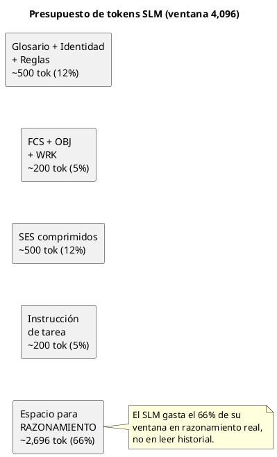
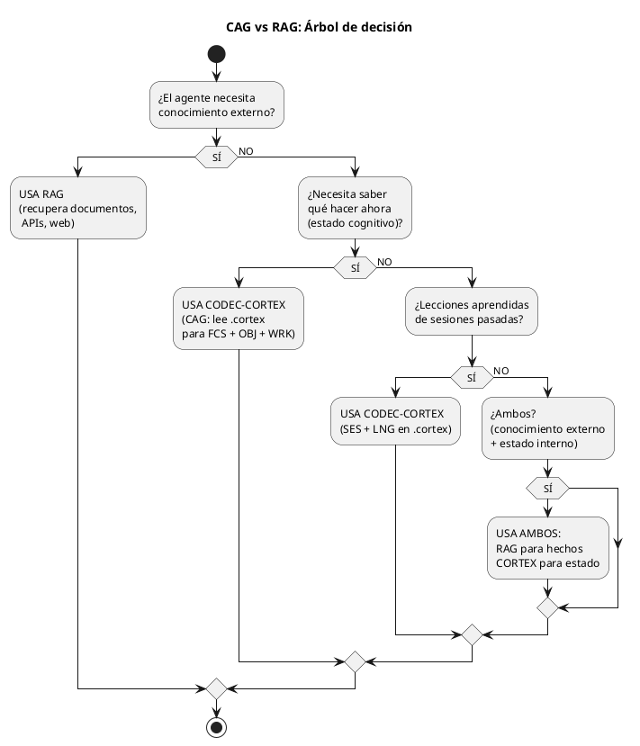
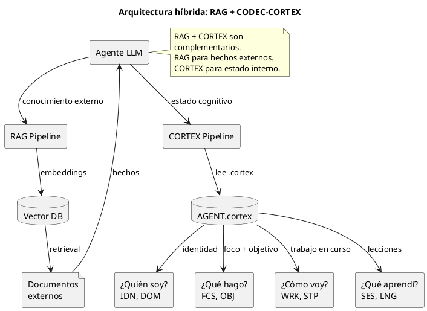

<!-- SPDX-FileCopyrightText: 2026 Fidel Ernesto Lozada A. -->
<!-- SPDX-License-Identifier: MPL-2.0 -->

<p align="center">
  <strong>CODEC-CORTEX</strong> — Adoption Guide
  <br>
  <sub>REFERENCE · v1.0.0 · MIT · <a href="../../../AUTHORS.md">Fidel Ernesto Lozada A.</a></sub>
</p>

---

> **STATUS NOTE:** This document is specification or design. As of v0.4.1 the CLI and deterministic codec are implemented in cli/, distributed via PyPI (`pip install codec-cortex`), and include the E2 security layer (secret scanner, mutation gates, audit log, signature verification) and the E3 documentation protocol (`docs/cortex/api/*.cortex`, `cortex docstring`, `cortex benchmark`). Runtime lifecycle and the MCP server remain planned or future; enterprise MCP is the future phase.

**Abstract:** Practical integration guide for the CODEC-CORTEX protocol in LLM and SLM agents. Covers 3 adoption patterns (generic agent host, coding agent client, CLI-based coding agent), CAG vs RAG strategy with decision tree, compression benchmarks with 4K-8K token SLMs, PUML diagram usage in integrations, and reference to the cognitive trinity and output GATE.

| | |
|---|---|
| **Author** | Fidel Ernesto Lozada A. — Systems Engineer / MSc. Management Sciences |
| **Repository** | [github.com/FidelErnesto03/codec-cortex](https://github.com/FidelErnesto03/codec-cortex) |
| **License** | [MIT](../../../LICENSE) |
| **Version** | 1.0.0 |
| **Language** | [Español](../../es/specs/adopcion.md) |

---

# Adoption of CODEC-CORTEX in Agents, LLMs, and SLMs

## 1. Adoption Philosophy
>
> Reference: `SKILL.md` — complete operational specification.
> Reference: `fundamentos.md` — ontology and principles.
> Reference: `algoritmo.md` — equations and algorithm.

---

## 1. General Adoption Strategy

CODEC-CORTEX adoption follows three patterns:

| Pattern | Description | When to use |
|--------|-------------|---------------|
| **Direct read** | The agent reads the `.cortex` as context in its prompt | Immediate, no additional implementation |
| **API codec** | The agent invokes `decode/encode/verify` via CLI or library | When the `.cortex` needs to be modified or validated |
| **MCP bridge** | The agent accesses `.cortex` through future MCP handlers | Future enterprise phase |

**Recommendation:** Start with direct read (simplest pattern), scale to API codec when modification is needed, and adopt MCP bridge when seeking native integration with tools like desktop MCP client.

---

## 2. Integration in generic agent host

generic agent host can consume CODEC-CORTEX in two ways:

### 2.1. As an LLM skill (not registered in agent host)

The purest mode: the SKILL.md is placed in the project and any agent reads it directly.

```
# In the AGENTS.md file or agent instruction:
READ CODEC-CORTEX/SKILL.md COMPLETELY.
Follow EVERY instruction to the letter.
The file IS the memory protocol specification.
```

The agent loads the `.cortex` as context injected into the prompt:

```
# Agent context (injected at the start of the prompt):
# -- $0: UNIVERSAL COGNITIVE GLOSSARY --
# Sigil  | Name       | Expansion | Risk
# IDN    | identity   | attrs     | B
# ...

# -- $1: IDENTITY --
IDN:agent{role:researcher, model:phi-3-mini}

# -- $3: WORKING MEMORY --
FCS:attention{current_objective:"Analyze Q3 earnings AAPL"}
OBJ:mission{type:research, goal:"extract_net_margin"}
```

### 2.2. As a registered skill (agent host skill registry)

If you wish to integrate as a generic agent host skill, the SKILL.md can be placed in `~/.hermes/skills/`. However, this ties it to the host ecosystem — for a universal skill, it is recommended to keep it in the project and load it via direct instruction to the agent.

**Recommendation:** Do not register CODEC-CORTEX as a host-specific skill. The skill should live in the project and be portable.

---

## 3. Integration in coding agent client / CLI-based coding agent

coding agent client can consume `.cortex` as part of its project context.

### 3.1. Direct read in project

```
# In CLAUDE.md or direct instruction:
CODEC-CORTEX is your memory system.
Read AGENT.cortex at the start of every session.
Follow FCS and OBJ to determine your current task.
Update WRK as you progress.
```

Example of agent instruction:

```
Your working memory is in CODEC-CORTEX/AGENT.cortex.
Load it at startup. The FCS:attention sigil contains your current focus.
The OBJ:mission sigil contains your objective. Do not act without both.
```

### 3.2. Using the codec CLI

```bash
# Decode the .cortex for human inspection
cortex decode AGENT.cortex

# Verify integrity
# planned CLI
cortex verify AGENT.cortex

# Update working memory
cortex patch_update AGENT.cortex --sigil WRK --name status --value "progress:75%"
```

---

## 4. Integration in SLMs (Small Models 3B-8B)

**This is CODEC-CORTEX's most impactful use case.**

SLMs (Phi-3, Llama-3-8B, Gemma-2B, agent client2.5-7B) have limited context windows (4k-8k tokens). This makes them ideal for edge computing but unviable for tasks requiring persistent memory.

### 4.1. The problem with SLMs

A 3B-parameter SLM:
- Context window: ~4,096 tokens
- TTFT (Time to First Token): ~1-2s on modest hardware
- Cost: practically zero (local)
- But: cannot maintain a 20,000-token agent history

Without CODEC-CORTEX:
```
INPUT: 12,000 tokens of history → EXCEEDS 4,096-token window → COLLAPSES
```

With CODEC-CORTEX:
```
INPUT: 1,800 tokens of compressed .cortex → FITS in 4,096-token window → OPERATES
```

### 4.2. Injection strategy for SLMs



```
1. At session start:
   - Load AGENT.cortex (~300-500 tokens)
   - Extract FCS and OBJ → anchor attention
   
2. During the session:
   - Keep WRK updated (~100-200 tokens)
   - Upon reaching 70% of the context window → trigger compression
   
3. At session end (or upon reaching the limit):
   - Future runtime executes compress(): WRK → SES + LNG
   - The new .cortex occupies ~500-800 tokens
   - Ready for the next session

4. Token budget for an SLM (4,096 window):
   - Glossary + identity + rules: ~500 tokens (12%)
   - FCS + OBJ + WRK: ~200 tokens (5%)
   - Compressed SES: ~500 tokens (12%)
   - Task instruction: ~200 tokens (5%)
   - Reasoning space: ~2,696 tokens (66%)
   ─────────────────────────────────
   Total: 4,096 tokens ✅
```

### 4.3. Cognitive load in one line

For SLMs, the `.cortex` can be delivered as a single line of ultra-dense context:

```
FCS:{analyze_Q3_AAPL}→OBJ:{research,extract_net_margin}→WRK:{ticker:AAPL,progress:40%}
```

This occupies ~80 tokens and provides: direction (FCS), goal (OBJ), and state (WRK). The SLM spends 98% of its window on real reasoning instead of reading history.

### 4.4. Expected SLM benchmark

| Model | Without .cortex | With .cortex | Improvement |
|--------|-------------|-------------|--------|
| Phi-3-mini (3.8B) | Collapses (>4K tok) | Operates (1.2s TTFT) | ✅ Viable |
| Llama-3-8B | 4.8s TTFT, 42% OBJ recall | 1.1s TTFT, 96% OBJ recall | 4.4×, 2.3× |
| Gemma-2B | Collapses (>8K tok) | Operates (0.9s TTFT) | ✅ Viable |
| agent client2.5-7B | 3.2s TTFT, 55% OBJ recall | 0.8s TTFT, 94% OBJ recall | 4×, 1.7× |

---

## 5. Cognitive Augmented Generation (CAG) vs RAG

### 5.1. RAG (Retrieval-Augmented Generation)

- **What it retrieves:** Documents, pages, text fragments from the outside world
- **How:** Embeddings → vector DB → cosine similarity search
- **Cost:** High (embeddings + DB + retrieval)
- **Strength:** Factual knowledge, extensive documents, up-to-date data
- **Weakness:** Does not understand the agent's cognitive state, does not retrieve intentions

### 5.2. CAG (Cognitive Augmented Generation)

- **What it retrieves:** Agent cognitive state: identity, focus, objective, lessons, episodes
- **How:** Direct read of `.cortex` (no embeddings, no search)
- **Cost:** Nearly zero (the `.cortex` is already in context)
- **Strength:** Mission state, intentions, lessons learned, temporal coherence
- **Weakness:** Is not an external knowledge base

### 5.3. When to use each



### 5.4. Recommended hybrid architecture



---

## 6. Integration Scenarios

### Scenario 1: Autonomous research agent

An agent that researches financial markets using an SLM (Phi-3-mini).

```
# AGENT.cortex
# -- $0: GLOSSARY --
# -- $1: IDENTITY --
IDN:agent{role:financial_researcher, model:phi-3-mini}
DOM:domain{area:finance, rules:[do_not_invent_data, only_verifiable_sources]}
KNW:tools{apis:[yahoo_finance, sec_edgar]}

# -- $2: GOVERNANCE --
CNST:tokens{limit:2048, reserve:200}
GTE:conduct{condition:"market_prediction", action:"block_and_report"}

# -- $3: WORKING MEMORY --
FCS:attention{objective:"Analyze Q3 earnings AAPL", source:"sec_edgar"}
WRK:status{ticker:AAPL, phase:"downloading_10-K", progress:40%}
OBJ:mission{type:research, goal:"extract_net_margin", priority:high}
```

**Operation flow:**
1. Each session begins by reading `AGENT.cortex`
2. The SLM immediately knows: financial research, ticker AAPL, current phase
3. Executes the next action: call SEC EDGAR
4. Updates `WRK:progress` as it advances
5. Upon reaching the token limit, compresses WRK → SES + LNG

### Scenario 2: Coding agent with cross-session memory

An agent that works on a codebase and resumes between sessions.

```
# AGENT.cortex
# -- $3: WORKING MEMORY --
FCS:attention{objective:"Implement endpoint /api/v2/health"}
WRK:status{file:"src/routes/health.ts", progress:"test_failed"}
OBJ:mission{type:implementation, feature:"health_check", priority:high}
STP:next{action:"fix_test", file:"tests/health.test.ts"}

# -- $4: EPISODIC MEMORY --
SES:previous{input:"implement_health_v2", output:"test_fails_due_to_timeout", lesson:"mock_redis"}
LNG:error{type:"timeout_in_test", cause:"missing_redis_mock", solution:"use_redis_mock_in_setup"}
```

**Flow:**
1. The agent resumes knowing exactly which file it was on, what failed, and why
2. The `LNG` lesson prevents repeating the same error
3. Without CORTEX, the agent would start from scratch each session

### Scenario 3: Multi-agent system with shared memory

Two agents (researcher and writer) share the same `.cortex` as a "cognitive whiteboard."

```
# AGENT.cortex (shared)
# -- $3: WORKING MEMORY --
FCS:attention{objective:"Generate Q3 report"}
WRK:global{research:"completed", writing:"pending", files:[data.csv, draft.md]}
OBJ:mission{type:collaboration, goal:"quarterly_report", agents:[researcher, writer]}

# -- $4: SESSIONS --
SES:researcher{input:"analyze_data", output:"data.csv_processed", result:"ok"}
SES:writer{input:"receive_data", output:"draft.md", result:"in_progress"}
```

**Flow:**
1. The researcher completes their part and updates `WRK:research:"completed"`
2. The writer reads the `.cortex` and knows they can begin
3. Without CORTEX, they would need a messaging system or shared database

---

## 7. Migration Guide: Flat Context → .cortex

### 7.1. Initial audit

```
1. Identify what flat context exists (chat histories, memory.json, context.txt)
2. Classify content by cognitive layer:
   - Agent identity? → $1: IDN, DOM, KNW
   - Rules/restrictions? → $2: AXM, CNST, GTE
   - Active state? → $3: FCS, OBJ, WRK
   - Past history? → $4: SES, LNG
3. Extract sigils according to classification
4. Add $0 with glossary of used sigils
5. When the planned CLI exists, verify with `cortex verify`
```

### 7.2. Atomic correction by section

Do not migrate everything at once. Do it by layer:

1. First $0 (glossary) → ensures the file is self-describing
2. Then $1 (identity) → who the agent is
3. Then $2 (governance) → what rules govern it
4. Then $3 (working memory) → what it is doing now
5. Finally $4 (episodic) → what it has learned

### 7.3. Post-migration benchmarks

| Metric | Before (flat text) | After (.cortex) |
|---------|---------------------|-------------------|
| Equivalent tokens | ~12,000 | ~1,800 (illustrative high-density target) |
| OBJ recovery | ~42% (lost in middle) | ~96% (anchored) |
| SLM latency (3B-8B) | 4.8s | 1.1s |

---

## 8. Quick Reference

| Concept | Detail |
|----------|---------|
| Minimum load for SLM | ~300-500 tokens (full AGENT.cortex) |
| Minimum load for large LLM | ~500-800 tokens (with compressed SES) |
| FCS+OBJ budget | ~50-100 tokens combined |
| Compression cycle | When WRK exceeds ~70% of the context window |
| **Compression via diagrams** | **A 20-line `DIAG` replaces ~200 lines of prose (~4× additional compression)** |
| **Cognitive trinity** | **brain.cortex (local brain) + AGENT.cortex (identity) + SKILL.cortex (capability). Three files, one pattern** |
| **Output GATE** | **Clean de-adoption: render active .cortex context as HCORTEX. Planned CLI may automate this later** |
| Interchange format | `.cortex` (plain text, no binary) |
| Zero-dependency | Yes — the parser uses only Python stdlib |

### 8.1. Diagram usage in integrations

When adopting CODEC-CORTEX, the PUML diagrams embedded in the `.cortex` serve as:

1. **Bidirectional communication:** The same `@startuml...@enduml` block that a human sees rendered is structurally parsed by the codec
2. **Visual debugging:** An agent can export its current FSM as a diagram for human debugging: `cortex diagram extract agent.cortex --name fsm`
3. **Handoff between agents:** Two agents can exchange `.cortex` with embedded diagrams — the receiving agent parses the structure, the human supervisor sees the diagram
4. **Living documentation:** The agent's `.cortex` contains its own cognitive architecture diagrams, automatically updated with each consolidation
