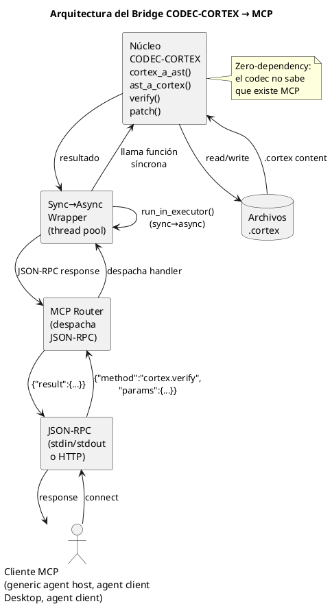
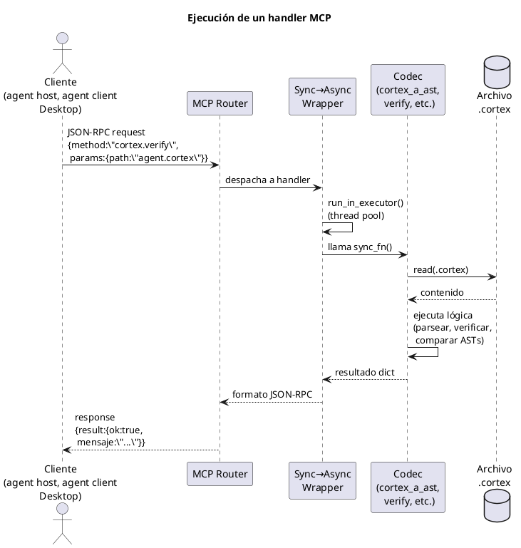

<!-- SPDX-FileCopyrightText: 2026 Fidel Ernesto Lozada A. -->
<!-- SPDX-License-Identifier: MPL-2.0 -->

<p align="center">
  <strong>CODEC-CORTEX</strong> — Bridge SKILL → MCP Server
  <br>
  <sub>REFERENCE · v1.0.0 · MIT · <a href="../../../AUTHORS.md">Fidel Ernesto Lozada A.</a></sub>
</p>

---

> **NOTA DE ESTADO:** Este documento es especificacion o diseno. A v0.4.1 el codec, el CLI (incluida la seguridad E2 y el protocolo de documentacion E3) y el render HCORTEX estan implementados en cli/. El runtime y el servidor MCP en si siguen siendo planificados o futuros; el handler map siguiente es el contrato de diseno que el futuro servidor MCP expondra.

**Abstract:** Diseño arquitectónico del bridge entre el SKILL de CODEC-CORTEX y un servidor MCP (Model Context Protocol). Incluye handler map completo con schemas JSON-RPC para las 18 operaciones del codec, wrapper sync→async con captura de closure, diagramas de flujo de ejecución, y guía de registro para clientes de agente.

| | |
|---|---|
| **Author** | Fidel Ernesto Lozada A. — Ing. Sistemas / MSc. Ciencias Gerenciales |
| **Repository** | [github.com/FidelErnesto03/codec-cortex](https://github.com/FidelErnesto03/codec-cortex) |
| **License** | [MIT](../../../LICENSE) |
| **Version** | 1.0.0 |

---

# Bridge SKILL → MCP Server para CODEC-CORTEX

## 1. Arquitectura del Bridge
>
> **Estado:** Diseño — pendiente de implementación.
> **Futuro:** Este diseño se convertirá en una RE de implementación en un ciclo posterior.
>
> Referencia: `SKILL.md` — comandos CLI y módulos.
> Referencia: `algoritmo.md` — funciones core del codec.

---

## 1. Arquitectura del Bridge



### 1.1. Principios de diseño

1. **Zero-dependency en el núcleo.** El servidor MCP importa el codec como librería; el codec no sabe que existe MCP.
2. **Handlers delgados.** Cada handler MCP es un wrapper de ~10-20 líneas que valida entrada, llama al codec, y formatea salida.
3. **Bridge, no rewrite.** No reescribir el codec para MCP. El bridge adapta, no transforma.
4. **Sync→Async obligatorio.** Los handlers del codec son síncronos; MCP espera async. El wrapper captura closures correctamente para evitar late-binding.

---

## 2. Mapa de Handlers

### 2.1. Mapeo CLI → MCP Handler

| Comando CLI | Handler MCP | Descripción |
|-------------|-------------|-------------|
| `cortex decode` | `cortex.decode` | Decodificar .cortex a YAML-Edit |
| `cortex encode` | `cortex.encode` | Codificar contexto a .cortex |
| `cortex verify` | `cortex.verify` | Validar estructura y glosario |
| `cortex patch_add` | `cortex.patch_add` | Añadir entrada a sección |
| `cortex patch_remove` | `cortex.patch_remove` | Eliminar entrada por sigilo+nombre |
| `cortex patch_update` | `cortex.patch_update` | Modificar valor de entrada |
| `cortex glossary_add` | `cortex.glossary_add` | Añadir sigilo al $0 |
| `cortex glossary_remove` | `cortex.glossary_remove` | Eliminar sigilo del $0 |
| `cortex glossary_update` | `cortex.glossary_update` | Modificar sigilo en $0 |
| — | `cortex.inspect` | Obtener AST completo como JSON |
| — | `cortex.summary` | Resumen del .cortex: secciones, sigilos, cobertura |
 | `cortex.diagram_extract` | Extraer diagrama PUML del .cortex |
 | `cortex.diagram_list` | Listar diagramas disponibles |
 | `cortex.diagram_validate` | Validar sintaxis PUML de un diagrama |

### 2.2. Handler Map (formato de registro MCP)

```yaml
handlers:
  cortex.decode:
    description: "Decodificar un archivo .cortex a YAML-Edit legible por humanos. LLAMAR cuando necesites inspeccionar el contenido completo de un .cortex en formato estructurado."
    input_schema: cortex_decode_input
    output_schema: cortex_decode_output

  cortex.encode:
    description: "Codificar contexto estructurado (YAML/JSON/texto) a formato .cortex comprimido. LLAMAR cuando quieras comprimir un estado de agente o contexto a .cortex."
    input_schema: cortex_encode_input
    output_schema: cortex_encode_output

  cortex.verify:
    description: "Validar integridad estructural de un archivo .cortex. Handler planificado; usar despues de modificaciones para revisar roundtrip estructural."
    input_schema: cortex_verify_input
    output_schema: cortex_verify_output

  cortex.patch_add:
    description: "Añadir una nueva entrada (sigilo:nombre{valor}) a una sección del .cortex. LLAMAR para agregar un nuevo nodo cognitivo. AUTO-CREA la sección si no existe."
    input_schema: cortex_patch_add_input
    output_schema: cortex_patch_add_output

  cortex.patch_remove:
    description: "Eliminar una entrada por sigilo+nombre de TODAS las secciones del .cortex. LLAMAR para remover un nodo cognitivo obsoleto."
    input_schema: cortex_patch_remove_input
    output_schema: cortex_patch_remove_output

  cortex.patch_update:
    description: "Modificar el valor de una entrada existente en el .cortex. LLAMAR para actualizar el estado de un nodo cognitivo (ej: progreso, estado, resultado)."
    input_schema: cortex_patch_update_input
    output_schema: cortex_patch_update_output

  cortex.glossary_add:
    description: "Añadir un nuevo sigilo al glosario $0 del .cortex. LLAMAR para extender el vocabulario del protocolo con un nuevo sigilo personalizado. FALLA si el sigilo ya existe."
    input_schema: cortex_glossary_add_input
    output_schema: cortex_glossary_add_output

  cortex.glossary_remove:
    description: "Eliminar un sigilo del glosario $0 del .cortex. LLAMAR para limpiar sigilos no utilizados."
    input_schema: cortex_glossary_remove_input
    output_schema: cortex_glossary_remove_output

  cortex.glossary_update:
    description: "Modificar nombre y/o expansión de un sigilo existente en el glosario $0. LLAMAR para corregir o refinar la definición de un sigilo."
    input_schema: cortex_glossary_update_input
    output_schema: cortex_glossary_update_output

  cortex.inspect:
    description: "Obtener el AST completo de un .cortex como JSON estructurado. LLAMAR cuando necesites inspeccionar programáticamente la estructura interna."
    input_schema: cortex_inspect_input
    output_schema: cortex_inspect_output

  cortex.summary:
    description: "Obtener un resumen del .cortex: número de secciones, sigilos por sección, cobertura cognitiva. LLAMAR para un diagnóstico rápido del estado de un .cortex."
    input_schema: cortex_summary_input
    output_schema: cortex_summary_output
```

---

## 3. Schemas JSON-RPC

### 3.1. cortex.decode

```json
{
  "input": {
    "type": "object",
    "required": ["path"],
    "properties": {
      "path": {
        "type": "string",
        "description": "Ruta al archivo .cortex"
      }
    }
  },
  "output": {
    "type": "object",
    "properties": {
      "yaml_edit": {
        "type": "string",
        "description": "Contenido en formato YAML-Edit"
      },
      "meta": {
        "type": "object",
        "description": "Metadatos del archivo (secciones, sigilos totales)"
      },
      "ok": {
        "type": "boolean"
      }
    }
  }
}
```

### 3.2. cortex.encode

```json
{
  "input": {
    "type": "object",
    "required": ["content"],
    "properties": {
      "content": {
        "type": "string",
        "description": "Contenido en YAML-Edit, JSON estructurado o texto con sigilos"
      },
      "format": {
        "type": "string",
        "enum": ["yaml", "json", "raw"],
        "description": "Formato del contenido de entrada (default: raw)",
        "default": "raw"
      },
      "output_path": {
        "type": "string",
        "description": "Ruta opcional donde escribir el .cortex resultante"
      }
    }
  },
  "output": {
    "type": "object",
    "properties": {
      "cortex": {
        "type": "string",
        "description": "Contenido .cortex compilado"
      },
      "tokens_estimate": {
        "type": "integer",
        "description": "Estimación de tokens del .cortex resultante"
      },
      "ok": {
        "type": "boolean"
      }
    }
  }
}
```

### 3.3. cortex.verify

```json
{
  "input": {
    "type": "object",
    "required": ["path"],
    "properties": {
      "path": {
        "type": "string",
        "description": "Ruta al archivo .cortex a verificar"
      },
      "strict": {
        "type": "boolean",
        "description": "Si true, falla en advertencias (glosario faltante, etc.)",
        "default": false
      }
    }
  },
  "output": {
    "type": "object",
    "properties": {
      "ok": {
        "type": "boolean",
        "description": "True si el archivo es estructuralmente válido"
      },
      "mensaje": {
        "type": "string",
        "description": "Mensaje descriptivo del resultado"
      },
      "diff": {
        "type": "array",
        "items": {
          "type": "string"
        },
        "description": "Diferencias encontradas (solo si ok=false)"
      },
      "secciones": {
        "type": "integer",
        "description": "Número de secciones encontradas"
      },
      "sigilos": {
        "type": "integer",
        "description": "Número total de sigilos"
      }
    }
  }
}
```

### 3.4. cortex.patch_add

```json
{
  "input": {
    "type": "object",
    "required": ["path", "sigilo", "nombre"],
    "properties": {
      "path": {
        "type": "string",
        "description": "Ruta al archivo .cortex"
      },
      "section": {
        "type": ["integer", "string"],
        "description": "Sección destino (número o nombre, ej: 3 o '3_MEMORIA_TRABAJO'). Si no existe, se auto-crea."
      },
      "sigilo": {
        "type": "string",
        "description": "Sigilo de la entrada (IDN, FCS, OBJ, etc.)"
      },
      "nombre": {
        "type": "string",
        "description": "Nombre de la entrada"
      },
      "valor": {
        "type": "object",
        "description": "Pares clave:valor del contenido. String plano para tipo 'cuerpo'."
      }
    }
  },
  "output": {
    "type": "object",
    "properties": {
      "path": {
        "type": "string",
        "description": "Ruta del archivo modificado"
      },
      "section_created": {
        "type": "boolean",
        "description": "True si la sección fue auto-creada"
      },
      "ok": {
        "type": "boolean"
      }
    }
  }
}
```

### 3.5. cortex.summary — Salida

```json
{
  "output": {
    "type": "object",
    "properties": {
      "path": {
        "type": "string"
      },
      "secciones": {
        "type": "integer"
      },
      "sigilos_por_seccion": {
        "type": "object",
        "additionalProperties": {
          "type": "integer"
        }
      },
      "total_sigilos": {
        "type": "integer"
      },
      "cobertura_cognitiva": {
        "type": "object",
        "properties": {
          "has_glosario": {"type": "boolean"},
          "has_fcs": {"type": "boolean"},
          "has_obj": {"type": "boolean"},
          "has_wrk": {"type": "boolean"},
          "has_ses": {"type": "boolean"},
          "has_lng": {"type": "boolean"},
          "has_axm": {"type": "boolean"},
          "has_cnst": {"type": "boolean"}
        }
      },
      "tokens_estimate": {
        "type": "integer"
      },
      "ok": {
        "type": "boolean"
      }
    }
  }
}
```

---

## 4. Wrapper Sync→Async

### 4.1. Problema

Las funciones del codec (`cortex_a_ast()`, `ast_a_cortex()`, `verify()`) son **síncronas**. El registro de handlers en MCP espera funciones **asíncronas** (que retornan `await`).

### 4.2. Wrapper genérico

```python
import asyncio
from functools import wraps

def async_wrapper(sync_fn):
    """
    Convierte una función síncrona en un handler MCP async.
    Ejecuta la función síncrona en un thread pool para no bloquear
    el event loop de MCP.
    """
    @wraps(sync_fn)
    async def wrapper(*args, **kwargs):
        loop = asyncio.get_event_loop()
        return await loop.run_in_executor(
            None,  # usa default ThreadPoolExecutor
            lambda: sync_fn(*args, **kwargs)
        )
    return wrapper
```

### 4.3. Registro de handlers

```python
import codec_cortex
from mcp.server import Server

server = Server("cortex-bridge")

# Importar funciones del codec
from codec_cortex import (
    cortex_a_ast, ast_a_cortex, ast_a_yaml_edit,
    yaml_edit_a_ast, verify,
    patch_add, patch_remove, patch_update,
    glossary_add, glossary_remove, glossary_update
)

# Registrar handlers con wrapper sync→async
server.add_handler({
    "name": "cortex.decode",
    "description": "Decodificar .cortex a YAML-Edit. LLAMAR para inspeccionar contenido estructurado.",
    "handler": async_wrapper(handle_decode),
})

server.add_handler({
    "name": "cortex.encode",
    "description": "Codificar contexto a .cortex comprimido. LLAMAR para comprimir estado de agente.",
    "handler": async_wrapper(handle_encode),
})

# ... (registrar los 11 handlers)
```

### 4.4. Captura de closure (late-binding)

⚠️ **Pitfall crítico:** Al registrar handlers en un loop, las closures capturan la última iteración.

```python
# ❌ MAL — late-binding: todos los handlers apuntan a la última función
handlers = ["decode", "encode", "verify"]
for h in handlers:
    server.add_handler({
        "name": f"cortex.{h}",
        "handler: async_wrapper(getattr(codec, h))  # OK — evalúa en cada iteración
    })
```

**Regla:** Evaluar el binding en cada iteración, no al final del loop. El wrapper debe capturar la referencia en el momento del registro.

---

## 5. Registro en Servidor MCP

### 5.1. Configuración del servidor

```yaml
# mcp-servers/cortex-bridge/config.yaml
server:
  name: cortex-bridge
  version: 1.0.0
  description: "Servidor MCP futuro para operaciones de memoria contextual CODEC-CORTEX"
  transport: stdio  # o http para despliegue remoto

handlers:
  - name: cortex.decode
    enabled: true
  - name: cortex.encode
    enabled: true
  - name: cortex.verify
    enabled: true
  - name: cortex.patch_add
    enabled: true
  - name: cortex.patch_remove
    enabled: true
  - name: cortex.patch_update
    enabled: true
  - name: cortex.glossary_add
    enabled: true
  - name: cortex.glossary_remove
    enabled: true
  - name: cortex.glossary_update
    enabled: true
  - name: cortex.inspect
    enabled: true
  - name: cortex.summary
    enabled: true
  - name: cortex.diagram_extract
    enabled: true
  - name: cortex.diagram_list
    enabled: true
  - name: cortex.diagram_validate
    enabled: true
```

### 5.2. Integración con generic agent host

Para que generic agent host descubra los handlers automáticamente, registrar el servidor en la configuración:

```yaml
# ~/.hermes/config.yaml (fragmento)
mcp_servers:
  cortex-bridge:
    command: python3
    args: ["-m", "cortex_bridge.server"]
    transport: stdio
```

### 5.3. Integración con desktop MCP client

```json
{
  "mcpServers": {
    "cortex-bridge": {
      "command": "python3",
      "args": ["-m", "cortex_bridge.server"],
      "transport": "stdio"
    }
  }
}
```

---

## 6. Flujo de Ejecución de un Handler



```
1. Cliente MCP envía JSON-RPC request
   {"jsonrpc":"2.0","method":"cortex.verify","params":{"path":"agent.cortex"},"id":1}

2. MCP Router recibe y despacha al handler registrado

3. Sync→Async Wrapper ejecuta la función síncrona en thread pool

4. Handler del bridge:
   a. Valida parámetros de entrada contra el schema
   b. Lee el archivo .cortex
   c. Llama a codec_cortex.verify(content)
   d. Formatea el resultado como JSON-RPC response

5. MCP Router envía respuesta
   {"jsonrpc":"2.0","result":{"ok":true,"mensaje":"Estructuralmente equivalentes",...},"id":1}
```

---

## 7. Consideraciones de Seguridad

| Aspecto | Recomendación |
|---------|---------------|
| Path traversal | Validar que `path` no escape del directorio permitido (usar `os.path.abspath` + prefijo) |
| Escritura concurrente | Usar locks por archivo: `threading.Lock` por path absoluto |
| Archivos grandes | Limitar tamaño de .cortex a 1MB (el formato es denso, excede ese tamaño solo si hay abuso) |
| Inyección de sigilos | No validar contenido semántico — el codec solo valida estructura. Los sigilos son solo texto |

---

## 8. Próximos Pasos (Implementación)

1. **Fase 1:** Crear el paquete `cortex_bridge` con los 11 handlers envueltos
2. **Fase 2:** Implementar el servidor MCP stdio + HTTP
3. **Fase 3:** Registrar en clientes de agente
4. **Fase 4:** Tests de integración: cliente MCP ↔ servidor ↔ codec
5. **Fase 5:** Documentación de uso para desarrolladores

> Este diseño se materializará como una RE de implementación en un ciclo futuro.
> Por ahora, es el plano arquitectónico para cuando llegue el momento.
