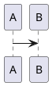

<!-- HCORTEX v=0.1 t=canonical -->

<!-- glossary
$0:format{cortex:0.1,encoding:UTF-8}
D:diagram{type:bloque,weight:H,desc:"Diagram"}
-->

## §4: Diagram

<!-- diagram:4 -->
<!-- D:d -->

<!-- /diagram:4 -->

