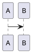

<!-- HCORTEX v=0.1 t=canonical -->

<!-- glossary
$0:format{language:es,encoding:UTF-8,cortex:0.1}
$0:enum_state{values:"open|closed"}
$0:micro_done{expand:closed}
$0:namespace_agent{id:agent,version:1.0,required:true,desc:"Agente"}
$0:extension_demo{namespace:agent,id:demo,version:0.1,required:false,desc:"Demo"}
$0:author{role:architect,name:"Fidel"}:KERNEL
TASK:tarea{desc:"Tarea",open:true,focus:content,fields:"content:text|status:%state?|count:integer?|tags:any?",weight:M,type:attrs}
POS:pos{desc:"Pos",focus:left,pos:"left:text|right:text|flag:boolean?",weight:B,type:attrs-pos}
BODY:body{desc:"Body",weight:H,type:cuerpo}
BLK:block{desc:"Block",weight:H,type:bloque}
REL:relation{desc:"Rel",focus:verb,pos:"from:atom|verb:atom|to:atom",weight:M,type:relacion}
agent::NOTE:nota{type:attrs,weight:B,fields:"text:text",focus:text,desc:"Nota"}
-->

## §1: Atributos

<!-- table:1 -->
<!-- TASK:a --> | "hola mundo" | done | 0 | [alpha,"beta gamma",3] |
<!-- /table:1 -->

## §2: Posicional

<!-- table:2 -->
<!-- POS:p --> | "izquierda simple" | derecha | true |
<!-- /table:2 -->

## §3: Prosa

<!-- prose:3 -->
<!-- BODY:b -->
primera línea
segunda línea
<!-- /prose:3 -->

## §4: Diagrama

<!-- diagram:4 -->
<!-- BLK:d -->

<!-- /diagram:4 -->

## §5: Relación

<!-- table:5 -->
<!-- REL:r --> | source | depends | target |
<!-- /table:5 -->

## §6: Namespace

<!-- table:6 -->
<!-- agent::NOTE:n --> | "nota estable" |
<!-- /table:6 -->

