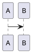

<!-- HCORTEX v=0.1 t=canonical -->

<!-- glossary
$0:format{language:es,encoding:UTF-8,cortex:0.1}
$0:enum_state{values:"todo|done"}
$0:micro_t{expand:todo}
$0:namespace_agent{id:agent,version:1.0,required:true,desc:"Agent"}
$0:extension_view{namespace:agent,id:view,version:1.0,required:false,desc:"View"}
$0:meta{z:"é",a:1}
ACT:Acción{desc:"Acción",focus:topic,open:true,fields:"topic:text|status:%state?|tags:list?",weight:H,type:attrs}
POS:Posicional{desc:"Pos",focus:topic,pos:"topic:text|count:integer",weight:M,type:attrs-pos}
TXT:Texto{desc:"Texto",weight:B,type:cuerpo}
BLK:Bloque{desc:"Bloque",weight:B,type:bloque}
REL:Relación{desc:"Rel",focus:type,pos:"from:atom|type:atom|to:atom",weight:H,type:relacion}
agent::NST:Namespaced{desc:"NS",focus:content,fields:"content:text",weight:M,type:attrs}
-->

## §1: Datos

<!-- table:1 -->
<!-- ACT:first --> | "hola mundo" | todo | [a,"b c",1,true,null] |
<!-- /table:1 -->

## §2: Posicional

<!-- table:2 -->
<!-- POS:p1 --> | "texto seguro" | 2 |
<!-- /table:2 -->

## §3: Cuerpo

<!-- prose:3 -->
<!-- TXT:t1 -->
línea uno
línea dos
<!-- /prose:3 -->

## §4: Bloque

<!-- diagram:4 -->
<!-- BLK:b1 -->

<!-- /diagram:4 -->

## §5: Relaciones

<!-- table:5 -->
<!-- REL:r1 --> | a | links | b |
<!-- /table:5 -->

## §6: Namespace

<!-- table:6 -->
<!-- agent::NST:n1 --> | "contenido" |
<!-- /table:6 -->

