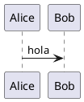

<!-- HCORTEX v=0.1 t=canonical -->

<!-- glossary
$0:format{language:es,encoding:UTF-8,cortex:0.1}
$0:enum_state{values:"open|closed|blocked"}
$0:micro_ok{expand:accepted}
$0:namespace_agent{id:"urn:cortex:agent",version:1.0,required:true,desc:"Agente"}
$0:extension_trace{namespace:agent,id:trace,version:1.0,required:false,desc:"Trazas"}
$0:zeta{b:2,a:"á"}
ATT:Attribute{desc:"Atributos",open:true,focus:content,fields:"topic:text|content:text|status:%state?|count:integer?|tags:list?",weight:H,type:attrs}
POS:Position{desc:"Posicional",focus:content,pos:"topic:text|content:text|enabled:boolean?",weight:M,type:attrs-pos}
REL:Relation{desc:"Relación",focus:target,pos:"source:text|verb:text|target:text",weight:H,type:relacion}
TXT:Text{desc:"Texto",weight:B,type:cuerpo}
BLK:Block{desc:"Bloque",weight:M,type:bloque}
agent::NS:Namespaced{desc:"Con namespace",focus:value,fields:"value:text",weight:B,type:attrs}
-->

## §1: Atributos

<!-- table:1 -->
<!-- ATT:first --> | demo | "Texto principal" | open | 0 | [alpha,"beta gamma",2,true,null] |
<!-- ATT:second --> | unicode | "Café" | accepted |
<!-- agent::NS:qualified --> | "valor" |
<!-- /table:1 -->

## §2: Posicionales

<!-- table:2 -->
<!-- POS:p1 --> | tema | "contenido libre" | true |
<!-- POS:p2 --> | "con | barra" | " texto " | false |
<!-- /table:2 -->

## §3: Relaciones

<!-- table:3 -->
<!-- REL:r1 --> | origen | depende_de | destino |
<!-- /table:3 -->

## §4: Prosa

<!-- prose:4 -->
<!-- TXT:t1 -->
Línea uno
Línea dos con á
<!-- /prose:4 -->

## §5: Diagrama

<!-- diagram:5 -->
<!-- BLK:b1 -->

<!-- /diagram:5 -->

