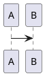

<!-- HCORTEX v=0.1 t=canonical -->

<!-- glossary
$0:format{language:es,encoding:UTF-8,cortex:0.1}
$0:enum_state{values:"active|done|blocked"}
$0:micro_q{expand:active}
$0:namespace_agent{id:"urn:cortex:agent",version:0.1,required:false,desc:"Agent vocabulary"}
$0:extension_trace{namespace:agent,id:trace,version:1.0,required:false,desc:"Trace extension"}
$0:document{owner:"CODEC-CORTEX",purpose:"reference"}
OBJ:Object{desc:"Structured object",open:true,focus:topic,fields:"topic:text|count:integer|status:%state?|tags:list?",weight:H,type:attrs}
POS:Position{type:attrs-pos,weight:M,pos:"title:text|priority:atom|score:decimal",focus:title,desc:"Positional object"}
REL:Relation{type:relacion,weight:M,pos:"from:atom|kind:atom|to:atom",focus:kind,desc:"Typed relation"}
TXT:Text{type:cuerpo,weight:B,desc:"Semantic prose"}
BLK:Block{type:bloque,weight:B,desc:"Verbatim block"}
agent::ACT:Action{type:attrs,weight:H,fields:"name:text|enabled:boolean",focus:name,desc:"Namespaced action"}
-->

## §1: Attributes

<!-- table:1 -->
<!-- OBJ:first --> | "Café" | 0 | q | [a,"b c"] |
<!-- agent::ACT:run --> | "Deploy" | true |
<!-- /table:1 -->

## §2: Positional

<!-- table:2 -->
<!-- POS:rank --> | "A useful title" | high | 1.50 |
<!-- /table:2 -->

## §3: Relations

<!-- table:3 -->
<!-- REL:edge --> | first | depends | second |
<!-- /table:3 -->

## §4: Prose

<!-- prose:4 -->
<!-- TXT:note -->
Line one.
Line two with café.
<!-- /prose:4 -->

## §5: Diagram

<!-- diagram:5 -->
<!-- BLK:flow -->

<!-- /diagram:5 -->

