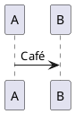

<!-- HCORTEX v=0.1 t=canonical -->

<!-- glossary
$0:KERNEL
$0:format{language:es,encoding:UTF-8,cortex:0.1}
$0:enum_state{values:"open|closed|blocked"}
$0:micro_HI{expand:high}
$0:namespace_agent{id:agent,uri:"urn:cortex:agent",version:1.0,required:true,desc:"Agent namespace"}
$0:extension_trace{namespace:agent,id:trace,version:1.0,required:false,desc:"Trace extension"}
$0:owner{name:"CODEC-CORTEX"}:KERNEL
OBJ:Object{type:attrs,weight:H,fields:"topic:text|count:integer|state:%state?|tags:list?",focus:topic,desc:"Object",open:false}
POS:Position{type:attrs-pos,weight:M,pos:"topic:text|count:integer|enabled:boolean",focus:topic,desc:"Position"}
REL:Relation{type:relacion,weight:H,pos:"from:atom|verb:atom|to:atom",focus:verb,desc:"Relation"}
TXT:Text{type:cuerpo,weight:M,desc:"Text body"}
BLK:Block{type:bloque,weight:B,desc:"Verbatim block"}
agent::CTX:Context{type:attrs,weight:H,fields:"topic:text|priority:atom",focus:topic,desc:"Namespaced context"}
-->

## §1: Attributes

<!-- table:1 capa:CORE -->
<!-- OBJ:first --> | "Hello world" | 2 | open | [alpha,"beta gamma"] |
<!-- OBJ:micro --> | HI | 0 | blocked | [] |
<!-- /table:1 -->

## §2: Positional

<!-- table:2 capa:DATA -->
<!-- POS:row --> | "Plain text" | 12 | true |
<!-- /table:2 -->

## §3: Relations

<!-- table:3 capa:DATA -->
<!-- REL:edge --> | source | connects | target |
<!-- /table:3 -->

## §4: Prose

<!-- prose:4 capa:DATA -->
<!-- TXT:single -->
Café
<!-- TXT:multi -->
Line one
Line two
<!-- /prose:4 -->

## §5: Verbatim

<!-- diagram:5 capa:DATA -->
<!-- BLK:diagram -->

<!-- /diagram:5 -->

## §6: Namespace

<!-- table:6 capa:DATA -->
<!-- agent::CTX:primary --> | "Agent context" | high |
<!-- /table:6 -->

