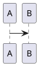

# Authoring HCORTEX — Plantillas bidireccionales

Guía para humanos que quieren escribir HCORTEX que compile de vuelta a CORTEX.

---

## ¿Qué es HCORTEX?

HCORTEX es la representación humana de CORTEX. La IA lee CORTEX directamente; el humano lee HCORTEX. Pero HCORTEX también se puede **compilar de vuelta** a CORTEX — eso es el roundtrip.

Esta guía explica cómo escribir HCORTEX que compile correctamente.

## Estructura de un HCORTEX

```markdown
<!-- HCORTEX v=0.1 t=canonical k=TIPO -->

## §1: TITULO DE SECCION

<!-- schema:N -->
...contenido...
<!-- /schema:N -->
```

Donde:
- `v=0.1` — versión del formato (obligatorio)
- `t=canonical` — canonical (reversible) o readable (solo visual)
- `k=TIPO` — tipo de documento: brain, mission, corpus, test, etc.
- `N` — debe coincidir con el número de sección

## Los 5 esquemas emparejados

### prose:N — Texto libre

```markdown
## §4: REGLAS

<!-- prose:4 -->
Esta es una regla importante. Se compila a cuerpo.
El texto puede ocupar múltiples líneas.
<!-- /prose:4 -->
```

Compila a: `AXM:nombre{Texto completo como cuerpo}`

### table:N — Tabla de datos

```markdown
## §1: OBJETIVOS

<!-- table:1 -->
| Escribir documentacion | current |
| Validar corpus         | done    |
<!-- /table:1 -->
```

Compila a: dos ideas attrs con campos en orden posicional.

Reglas para que compile bien:
- La tabla debe tener el **mismo número de columnas** que fields declara
- Las columnas corresponden al **orden** de declaración en fields
- No uses cabeceras de tabla (|---|) si esperas compilar

### list:N — Lista de items

```markdown
## §2: TAREAS

<!-- list:2 -->
- Preparar informe
- Revisar código
<!-- /list:2 -->
```

Compila a: ideas attrs-pos con un valor cada una.

### check:N — Checklist

```markdown
## §3: PRECONDICIONES

<!-- check:3 -->
- [ ] BLP anterior completado
- [ ] Todo listo
<!-- /check:3 -->
```

Compila a: ideas attrs-pos con estado booleano.

### diagram:N — Diagrama PUML

```markdown
## §5: ARQUITECTURA

<!-- diagram:5 -->

<!-- /diagram:5 -->
```

Compila a: una idea bloque con el contenido PUML.

## Incluir el glosario (opcional pero recomendado)

Si quieres que el HCORTEX compile de vuelta a CORTEX con $0 correcto, incluye el glosario:

```markdown
<!-- glossary
OBJ:objective{type:attrs,fields:"goal:text|status:%state",focus:goal,schema:table}
KNW:knowledge{type:attrs,fields:"topic:text|content:text",focus:content,schema:table}
-->
```

Si no incluyes glosario, el compilador intentará inferir $0 de los schemas — pero puede no ser exacto.

## Reglas para un roundtrip exitoso

1. **Schema y sección deben coincidir:** `<!-- table:1 -->` debe estar en `## §1`
2. **Sin anidamiento:** Una sección = un schema. Usa subsecciones para variar
3. **No mezcles contenido dentro/fuera de los pares:** Todo el contenido de la sección debe estar entre `<!-- schema:N -->` y `<!-- /schema:N -->`
4. **$0 no se renderiza:** No pongas el glosario como texto visible
5. **El glosario va en `<!-- glossary -->`** si necesitas recompilar

## Ejemplo completo

```markdown
<!-- HCORTEX v=0.1 t=canonical k=ejemplo -->

<!-- glossary
OBJ:task{type:attrs,fields:"desc:text|status:%state",focus:desc,schema:table}
NOTA:note{type:cuerpo,weight:M,schema:prose}
-->

## §1: TAREAS

<!-- table:1 -->
| Preparar informe | current |
| Revisar codigo   | planned |
<!-- /table:1 -->

## §2: NOTAS

<!-- prose:2 -->
Recordatorio: revisar la documentación antes de entregar.
<!-- /prose:2 -->
```

Este HCORTEX compila de vuelta a CORTEX válido con $0 reconstruido.
