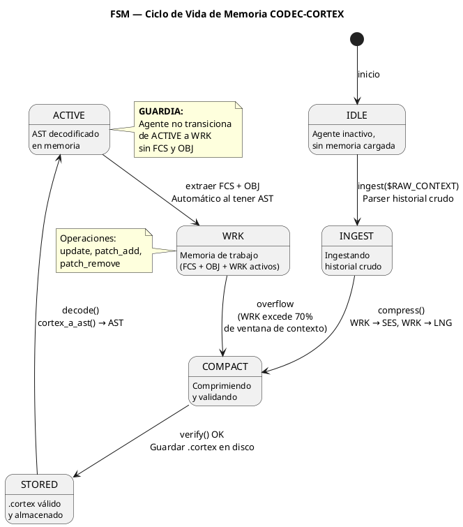
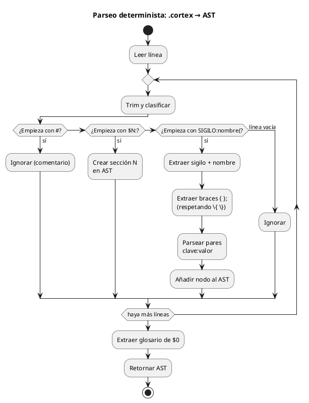
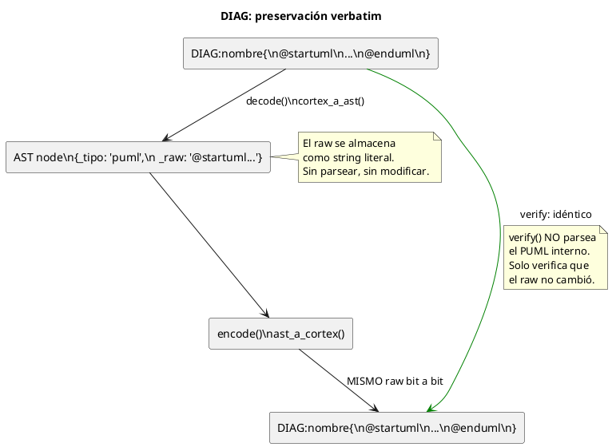
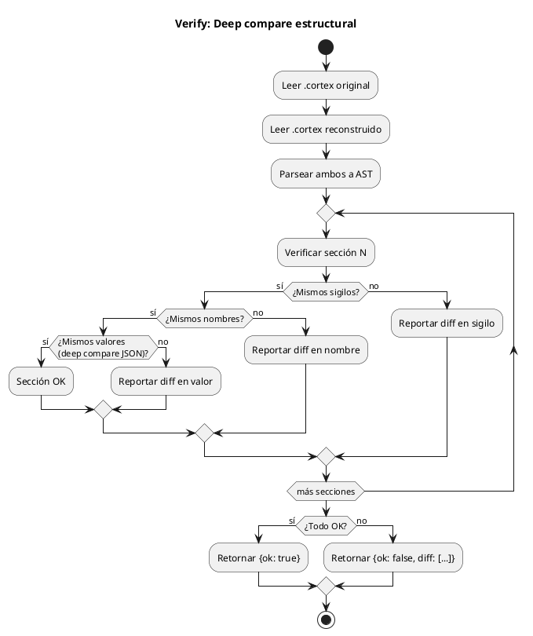
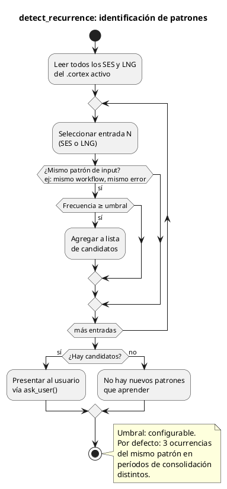
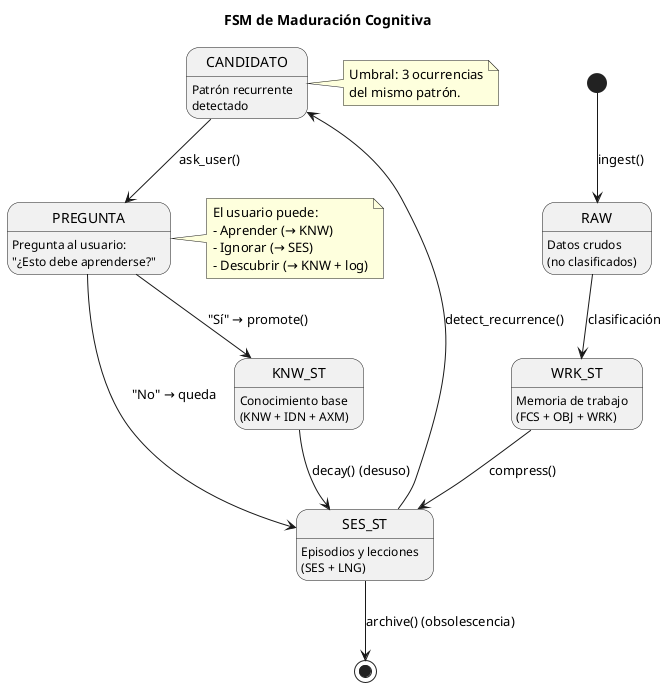
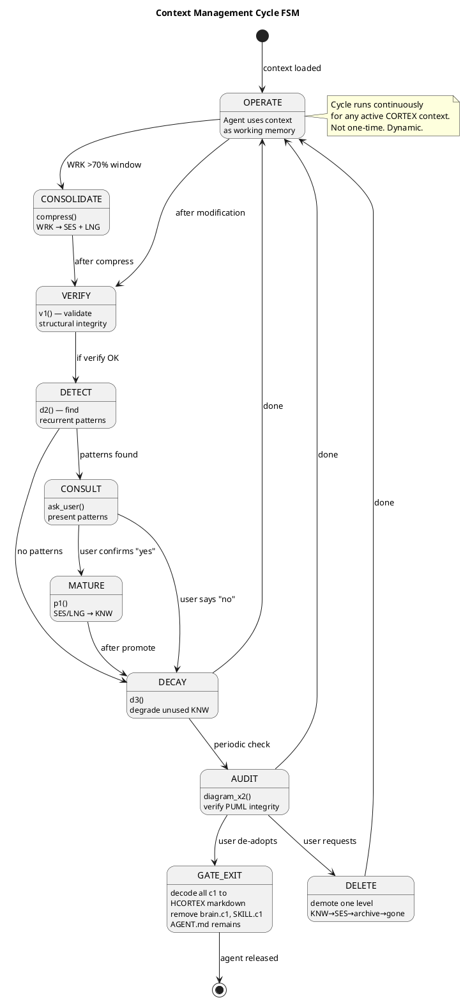

<!-- SPDX-FileCopyrightText: 2026 Fidel Ernesto Lozada A. -->
<!-- SPDX-License-Identifier: MIT -->

<p align="center">
  <strong>CODEC-CORTEX</strong> — Deterministic Formula & Algorithm
  <br>
  <sub>REFERENCE · v1.0.0 · MIT · <a href="../../../AUTHORS.md">Fidel Ernesto Lozada A.</a></sub>
</p>

---

> **STATUS NOTE:** This document is specification or design. As of v0.3.5 the CLI and deterministic codec (parse, encode, decode, verify, HCORTEX render, canonicalize, convert, roundtrip-bidir, inspect, explain-loss) are implemented in cli/ with canonical command names (no `v2-` prefix; legacy aliases still accepted with WARNING). The E2 security layer (`cortex doctor --scan-secrets`, `cortex audit`, `cortex --mode`, `cortex verify --signature`) and E3 documentation protocol (`cortex docstring`, `cortex benchmark`) are also current. Runtime lifecycle and the MCP server remain planned or future.

**Abstract:** Cognitive density equations, lifecycle state machine, deterministic parsing algorithm (6-state character automaton), structural deep compare, verbatim PUML block parsing, and maturation engine algorithms (detect_recurrence, promote, decay). Includes the golden token distribution (φ=1.618) across cognitive layers and the context management cycle with exit GATE.

|| | |
|---|---|---|
|| **Author** | Fidel Ernesto Lozada A. — Systems Engineer / MSc. Management Sciences |
|| **Repository** | [github.com/FidelErnesto03/codec-cortex](https://github.com/FidelErnesto03/codec-cortex) |
|| **License** | [MIT](../../../LICENSE) |
|| **Version** | 1.0.0 |
|| **Language** | [Español](../../es/specs/algoritmo.md) |

---

# Deterministic Formula & Algorithm for CODEC-CORTEX

## 1. Cognitive Density Equations
> Defines the formal cognitive density equations, the lifecycle state machine, the deterministic parsing algorithm (no LLM), and the deep compare mechanism for structural verification.
>
> Reference: `SKILL.md` — complete operational specification.
> Reference: `fundamentos.md` — ontology, axioms, and principles.

---

## 1. Cognitive Density Equations

### 1.1. Structural Compression Factor (C)

```
C = (S_raw - S_cortex) / S_raw
```

Where:
- `C` = Structural compression factor (0 = no compression, 1 = total compression)
- `S_raw` = Context size in tokens in plain text / YAML / JSON format
- `S_cortex` = Size of the same context in compiled `.cortex` format

**Target:** high contextual density. Any numeric reduction claim requires a reproducible benchmark.

**Example:** An agent history of 12,000 tokens in plain text → 1,800 tokens in `.cortex`:
```
C = (12000 - 1800) / 12000 = 0.85
```

**Interpretation:** Each token in `.cortex` carries ~6.7× more semantic information than a token in plain text. This is not magic — it is the elimination of verbal noise, notation compaction, and hierarchical structure that eliminates repetitions.

### 1.2. Attention Retention vs Position (A)

```
A = T_attention × (1 - L_pos)
```

Where:
- `A` = Effective attention retention (0-1)
- `T_attention` = Attentional capacity of the model at the position (decays toward the center)
- `L_pos` = Relative position in the context (0 = start, 1 = end)

**In flat context:** A Transformer's attention function decays significantly toward the center of the context (*Lost in the Middle*). For a 32k-token document, information retrieval at the 50% position can drop to 40%.

**In `.cortex` context:** `FCS` and `OBJ` are positioned at `L_pos ≈ 0.05` (first 5% of the context). With `T_attention ≈ 0.98` at that position:
```
A = 0.98 × (1 - 0.05) = 0.93
```

**Expected benchmark:** `OBJ` retrieval ≥ 96% in an equivalent 32k-token context (vs ~42% in plain text).

### 1.3. Semantic Density per Token (D)

```
D = Σ(KNW_i × SES_j) / T_max
```

Where:
- `D` = Semantic density (useful information per maximum token)
- `KNW_i` = Weight of knowledge item i (0-1, according to relevance for the current task)
- `SES_j` = Weight of episode j (0-1, according to recency and relevance)
- `T_max` = Token limit of the model (e.g.: 4096 for an SLM)

**Interpretation:** `D` measures how much *useful* information fits within the model's token limit. A high `D` means the model receives maximum signal with minimum noise. The `.cortex` format maximizes `D` because it eliminates verbal noise and prioritizes information by cognitive layer.

### 1.4. Equilibrium Point (P)

```
P_equilibrium: C target: high density → from the 2nd iteration onward the investment is recovered
```

**Demonstration:**

Let:
- `T_raw` = 12,000 tokens (context in plain text)
- `T_cortex` = 1,800 tokens (same context in `.cortex`)
- `C` = 0.85 (compression)

Per iteration:
- Raw cost: 12,000 input tokens
- `.cortex` cost: 1,800 input tokens

Savings per iteration: 12,000 - 1,800 = 10,200 tokens

**Initial compilation cost:** The first compilation costs processing the 12,000 tokens to generate the `.cortex`. From the second iteration onward, the cost is only 1,800 tokens.

```
Iteration 1: 1,800 (compile) + 1,800 (read) = 3,600 tokens  (vs 12,000 raw)
Iteration 2: 0 (no re-compile) + 1,800 (read) = 1,800 tokens  (vs 12,000 raw)
...
Iteration N: 1,800 tokens  (vs 12,000 raw)
```

The equilibrium point where the compilation investment is recovered is at the **second iteration**. From there onward, everything is net gain.

### 1.5. Cumulative Savings Equation (A_total)

```
A_total = T_raw × N - (T_cortex + T_compilation + T_cortex × (N - 1))
```

Simplified for `T_compilation = T_cortex` (one read of the raw to compile):
```
A_total = T_raw × N - T_cortex × (N + 1)
```

For N = 10 iterations with T_raw = 12,000, T_cortex = 1,800:
```
A_total = 12000 × 10 - 1800 × 11
        = 120,000 - 19,800
        = 100,200 tokens saved
```

That is **83.5% cumulative savings** over 10 iterations.

### 1.6. Golden Ratio Token Distribution (Φ)

Token distribution across cognitive layers follows the golden ratio φ = 1.618:

```
layer_tokens(i) = (F(i+1) / ΣF) × T_total

Where:
  F(i+1) = (i+2)-th Fibonacci number (F2=1, F3=2, F4=3, F5=5, F6=8, F7=13, F8=21)
  ΣF     = 53 (sum of Fibonacci weights for 7 layers)
  T_total = total context window tokens

layer_ratio(i, i-1) = F(i+1) / F(i) → φ (converges to 1.618 for large i)
```

| Layer | Fib | Weight | T=4096 | T=128K | Ratio with previous layer |
|------|-----|:----:|:------:|:------:|:--:|
| $0 Glossary | F2=1 | 1.9% | 77 | 2,415 | — |
| $1 Identity | F3=2 | 3.8% | 155 | 4,830 | 2.0 |
| $2 Rules | F4=3 | 5.7% | 232 | 7,245 | 1.5 |
| $3 Working | F5=5 | 9.4% | 386 | 12,075 | 1.67 |
| $4 Episodic | F6=8 | 15.1% | 618 | 19,321 | 1.6 |
| $5 Diagrams | F7=13 | 24.5% | 1,005 | 31,396 | 1.625 |
| $6 Knowledge | F8=21 | 39.6% | 1,623 | 50,717 | 1.615 |

**Property:** The ratio between consecutive layers converges to φ. Information is distributed such that each higher layer receives ~1.618× more tokens than the immediate lower layer, maximizing semantic density per available token.

---

## 2. Lifecycle State Machine (FSM)

The agent's memory lifecycle follows a deterministic state machine:



### 2.1. States

| State | Description | Allowed action |
|--------|-------------|------------------|
| `IDLE` | Agent inactive, no memory loaded | `ingest` |
| `INGEST` | Ingesting raw history | `compress` |
| `COMPACT` | Memory compressed, validating | `verify` |
| `STORED` | `.cortex` valid and stored | `decode` |
| `ACTIVE` | Memory decoded into active AST | — |
| `WRK` | Agent operating with working memory | `update`, `patch_add`, `overflow` |

### 2.2. Transitions

| Transition | Condition | Action | Effect |
|------------|-----------|--------|--------|
| `IDLE → INGEST` | Command `ingest($RAW_CONTEXT)` | Parse raw history and extract sigils | RAW_CONTEXT is structured as preliminary AST |
| `INGEST → COMPACT` | Command `compress()` | Execute episodic compression (WRK→SES, WRK→LNG) | WRK is distilled to SES+LNG; noise is discarded |
| `COMPACT → STORED` | `verify()` passes | Save AST as `.cortex` | Valid `.cortex` file on disk |
| `STORED → ACTIVE` | Command `decode()` | `cortex_a_ast()` → AST in memory | AST ready for query |
| `ACTIVE → WRK` | Automatic upon having AST | Extract `FCS`, `OBJ`, `WRK` as active state | Agent can begin working |
| `WRK → COMPACT` | `overflow` (WRK exceeds token limit) | Execute `compress()` automatically | Working memory collapses into episodic |

### 2.3. Guard Rule

```
GUARD: The agent does not transition from ACTIVE to WRK if FCS and OBJ are absent.
ACTION: If missing → HALT_AND_REPORT("FCS and OBJ required in working memory")
```

This guard is the most important protection in the protocol. Without focus and objective, the agent operates without direction — which in flat context would be "attentional drift."

---

## 3. Deterministic Parsing Algorithm



The parsing of `.cortex` to AST is implemented as a **character state machine** — no regex, no LLM, no external parsers.

### 3.1. Formal Grammar

```
file        := section+
section     := '$' DIGIT+ WS ':' WS NAME WS? '--'? '\n' line*
line        := (comment | sigil | blank)
comment     := '#' .* '\n'
blank       := WS* '\n'
sigil       := SIGIL ':' NAME '{' content '}' '\n'
SIGIL       := [A-Z!→]+
NAME        := [a-zA-Z0-9_-]+
content     := pairs (',' pairs)*
pairs       := ID ':' VALUE
ID          := [a-zA-Z0-9_-]+
VALUE       := (string | number | list)
list        := '[' item (',' item)* ']'
item        := string
string      := '"' [^"]* '"' | [^,{}\n]+
number      := DIGIT+ ('.' DIGIT+)?
WS          := ' ' | '\t'
DIGIT       := '0'..'9'
```

### 3.2. Parser: Linear Algorithm

```
FUNCTION cortex_a_ast(content: str) → {ast: dict, glossary: dict, meta: dict}

1. INITIALIZE
   ast = {}           // dictionary section → list of entries
   glossary = {}      // sigil → {name, expansion, risk}
   meta = {}          // file metadata
   current_section = None
   i = 0              // current position in the string

2. PROCESS LINE BY LINE
   FOR each line in splitlines(content):
       line = trim_end(line)
       
       IF line starts with '#':
           CONTINUE (comment)
       
       IF line =~ /^\$\d+:/
           current_section = extract_section_id(line)
           ast[current_section] = []
           CONTINUE
       
       IF line =~ /^[A-Z!→]+:/
           sigil = extract_sigil(line)
           name = extract_name(line)
           value = extract_braces(line)  // content between { }
           IF value:
               pairs = parse_pairs(value)
               ast[current_section].append({
                   't': 'sigil',
                   's': sigil,
                   'n': name,
                   'v': pairs
               })
       
       IF line IS blank:
           CONTINUE

3. EXTRACT GLOSSARY from $0
   IF '0' in ast:
       glossary = parse_glossary(ast['0'])
       remove '0' from ast

4. RETURN
   {ast: ast, glossary: glossary, meta: meta}
```

### 3.3. Brace Extraction

```
FUNCTION extract_braces(line: str) → str | None

1. FIND position of the first '{'
   IF not found → RETURN None

2. FIND position of the matching '}'
   balance = 0
   FOR each char from position+1:
       IF char == '{' AND PREVIOUS char != '\': balance += 1
       IF char == '}' AND PREVIOUS char != '\':
           IF balance == 0: RETURN substring(position+1, char_pos)
           IF balance > 0: balance -= 1
   
3. IF '}' not found: RAISE BraceError(line, position)

ESCAPE RULE:
   \{  →  {  (literal)
   \}  →  }  (literal)
   \\  →  \  (literal)
```

### 3.4. Key-Value Pair Parsing

```
FUNCTION parse_pairs(value: str) → dict

1. INITIALIZE
   result = {}
   i = 0

2. FOR each segment separated by ',' (respecting quotes and braces):
       segment = trim(segment)
       IF ':' in segment:
           key = trim(part_before(':'), segment)
           val = trim(part_after(':'), segment)
           
           IF val starts with '[':
               result[key] = parse_list(val)
           IF val starts with '"':
               result[key] = unquoted_string(val)
           ELSE:
               result[key] = val  // string or number
       ELSE:
           result[segment] = True  // boolean flag

3. RETURN result
```

### 3.5. Compiler (Encode)

```
FUNCTION ast_a_cortex(ast_data: dict) → str

1. INITIALIZE
   lines = []

2. GLOSSARY
   IF glossary exists:
       lines.append("$0: GLOSSARY --")
       lines.append(...format_glossary_table...)
       lines.append("")

3. SECTIONS
   FOR each (section_id, entries) in ast_data['ast'].items():
       lines.append(f"# -- ${section_id}: {name_section(section_id)} --")
       FOR each entry in entries:
           IF entry['t'] == 'sigil':
               value_str = format_pairs(entry['v'])
               lines.append(f"{entry['s']}:{entry['n']}{{{value_str}}}")
       lines.append("")

4. RETURN join(lines, '\n')
```

### 3.6. PUML Block Parsing (DIAG)

`@startuml...@enduml` blocks within `DIAG` sigils are stored as `block` type — **verbatim, without internal parsing**. The codec never modifies the diagram content.



```
FUNCTION puml_a_ast(puml_raw: str) → dict

1. EXTRACT title (optional)
   IF line =~ /^title (.+)$/:
       title = group(1)

2. EXTRACT participants
   FOR each line:
       IF =~ /^(state|rectangle|package|actor|participant|database) "?(\w+)"?/:
           participants.append({type: group(1), name: group(2)})

3. EXTRACT relations
   FOR each line:
       IF =~ /^(\w+)\s*(-->?|->)\s*(\w+)\s*(:\s*(.+))?$/:
           relations.append({
               origin: group(1),
               destination: group(3),
               type: group(2),
               label: group(5) or ""
           })

4. EXTRACT notes
   FOR each line:
       IF =~ /^note (right|left|top|bottom) of (\w+)\s*:\s*(.+)$/:
           notes.append({position: group(1), target: group(2), text: group(3)})

5. RETURN
   {
       '_type': 'puml',
       '_title': title or "",
       '_participants': participants,
       '_relations': relations,
       '_notes': notes,
       '_raw': puml_raw  # preserve for regeneration
   }
```

**Deep compare of diagrams:** `verify()` compares participant and relation arrays as sets, not as ordered lists. Two diagrams are equivalent if they have the same participants and the same relations, regardless of the order in which they were declared.

```
FUNCTION verify(original: str, reconstructed: str) → {ok: bool, message: str}

1. DECODE both
   ast_orig = cortex_a_ast(original)['ast']
   ast_recon = cortex_a_ast(reconstructed)['ast']

2. COMPARE section sets
   IF set(ast_orig.keys()) != set(ast_recon.keys()):
       MISSING = set(ast_orig.keys()) - set(ast_recon.keys())
       return {ok: false, message: "Missing sections: {MISSING}"}

3. FOR each section:
   entries_orig = set()
   entries_recon = set()
   
   FOR each entry in ast_orig[section]:
       entries_orig.add((
           entry['s'],           // sigil
           entry['n'],           // name
           json.dumps(entry['v'], sort_keys=True)  // JSON value
       ))
   
   FOR each entry in ast_recon[section]:
       entries_recon.add((...))
   
   IF entries_orig != entries_recon:
       diff = entries_orig - entries_recon
       return {ok: false, message: "Differences in section {section}: {diff}"}

4. RETURN {ok: true, message: "Structurally equivalent"}
```

**Critical:** Deep compare uses `json.dumps(value, sort_keys=True)` to normalize key ordering. Without this, `{type:research, priority:high}` and `{priority:high, type:research}` would be considered different despite being structurally identical.

**PUML deep compare:** For `DIAG` type entries:
- The raw `_text` is verified only for integrity: same length, same `@startuml...@enduml` delimiters. It is not compared byte by byte.
- Companion sigils (KNW, TAG, DESC with the same name) are compared structurally using standard deep compare.

**Critical for `DIAG`:** The codec must never modify the content between `@startuml` and `@enduml`. If an encode reformats, reorders, or alters the diagram, the cycle loses visual fidelity. The LLM reads companion sigils for interpretive context; the raw diagram is for the human.



---

## 4. Expansion Types

Each sigil in the $0 glossary declares an **expansion type** that determines how its value is parsed:

| Type | Format | `.cortex` Example | Resulting AST |
|------|---------|-------------------|----------------|
| `attrs` | Key:value pairs | `IDN:agent{role:researcher, model:phi-3}` | `{"role": "researcher", "model": "phi-3"}` |
| `body` | Literal text | `!axiom{Do not invent data without a source}` | `{"_text": "Do not invent data without a source"}` |
| `content` | Compound content | `LNG:lesson{desc:always_verify}` | `{"desc": "always_verify"}` |
| `block` | Multiline block (YAML \|) | `COD:py:script{\|-\nimport os\n...}` | Multiline text preserved |
| `relation` | Causal arrow | `A→B` | `{"_origin": "A", "_destination": "B", "_type": "→"}` |

### Parsing rules by type

```
PARSE by type:
  attrs:     parse_pairs(content)  // standard
  body:      trim(content)         // unparsed, full text
  content:   parse_pairs(content)  // standard
  block:     content_raw           // preserve line breaks and spaces
  relation:  extract_origin_destination(content)  // split by '→'
```

---

## 5. Error Handling Strategy

| Error | Condition | Action | Recoverable |
|-------|-----------|--------|-------------|
| `BraceError` | `{` without matching `}` | Report line and position | Yes — ignore malformed entry |
| `SigilError` | Sigil not declared in $0 | Treat as `attrs` by default | Yes — continue parsing |
| `SectionError` | Line without active section (before $0) | Ignore line | Yes — continue |
| `GlossaryError` | $0 is not the first section | Report warning, but continue | Yes — use base universal sigils |
| `VerifyError` | Original AST ≠ Reconstructed AST | Report exact differences | No — requires intervention |

---

## 6. Complete Pipeline Pseudocode

```
FUNCTION pipeline_cortex(file: str) → bool:
    // 1. Read
    content = read_file(file)
    
    // 2. Decode
    ast = cortex_a_ast(content)
    
    // 3. Encode
    reconstructed = ast_a_cortex(ast)
    
    // 4. Verify
    result = verify(content, reconstructed)
    
    // 5. Report
    IF result.ok:
        print(f"COMPLETE CYCLE: structurally reversible for this fixture")
        ratio = len(content) / len(reconstructed)
        print(f"   Structural compression: {ratio:.2f}x")
        print(f"   Sections: {len(ast['ast'])}")
    ELSE:
        print(f"❌ VERIFY FAILED: {result.message}")
    
    RETURN result.ok
```

---

## 7. Cognitive Maturation FSM (Learning Engine)

### 7.1. Engine Architecture

```
detect_recurrence(SES[], LNG[]) → candidates[]
       │
       ├── for each candidate:
       │       └── ask_user(candidate) → response
       │               │
       │               ├── "yes, learn" → promote(ses/lng, knw)
       │               │
       │               ├── "no, it's work" → stays in SES/LNG
       │               │
       │               └── "didn't know" → promote() + log
       │
       └── candidates without recurrence → decay() progressive
```

### 7.2. detect_recurrence Algorithm



### 7.3. promote Algorithm

```
FUNCTION promote(entry: dict, destination: str = "knw") → bool:

1. VALIDATE that entry exists in SES or LNG
2. EXTRACT: sigil, name, value, _access_count
3. CREATE new entry in KNW:
   
   IF entry['s'] == 'SES':
       KNW:{entry['n']}{
           _promoted_from: SES,
           _pattern: entry['v'].input,
           _expected_output: entry['v'].output,
           _confident: true,
           _promoted_by: user,
           _in_knw_since: timestamp
       }
   
   IF entry['s'] == 'LNG':
       KNW:{entry['n']}{
           _promoted_from: LNG,
           _error: entry['v'].type,
           _solution: entry['v'].solution,
           _confident: true,
           _promoted_by: user
       }

4. DELETE original entry from SES/LNG
5. REINDEX .cortex
6. RETURN true

NOTE: Promotion is atomic. If it fails, automatic rollback.
```

### 7.4. decay Algorithm

```
FUNCTION decay(knw_entries: list, max_age: int = 30_days) → list:

1. FOR each entry in KNW:
       IF entry._in_knw_since + max_age < now:
           age = now - entry._in_knw_since
           usage = entry._access_count or 0
           
           IF usage == 0 AND age > max_age * 2:
               // Never used and very old → archive
               MOVE to KNW_ARCHIVE
               
           IF usage < 3 AND age > max_age:
               // Rarely used and old → degrade to SES
               CREATE equivalent SES
               DELETE from KNW
           
           IF usage >= 3:
               // Used enough → renew timestamp
               entry._in_knw_since = now

2. REINDEX .cortex
3. RETURN list of degraded entries
```

### 7.5. Maturation FSM



### 7.6. Maturation Engine Rules

1. **The user is the judge, not a counter.** Frequency is only the trigger for asking; the decision is human.
2. **The LLM learns instantly.** `promote()` is effective on the next read of the `.cortex`. No practice, no repetition.
3. **`decay()` is conservative.** It prefers not to degrade a dubious KNW rather than lose useful knowledge. The default threshold is 30 days without use.
4. **Questions are not spam.** The engine does not ask more than once per pattern per consolidation cycle.
5. **Traceability.** Every promotion is recorded in the `.cortex` (timestamp, origin, responsible party).

---

## 8. HCORTEX: Decompression Protocol for Humans

### 8.1. decode(format=hcortex)

```
FUNCTION decode(format=hcortex, ast_data: dict) → str (markdown):

1. INITIALIZE
   lines = []
   lines.append("# Agent Status — " + timestamp)
   lines.append("")

2. SECTION: GLOSSARY (table)
   IF glossary exists:
       lines.append("## Glossary of used sigils")
       lines.append("| Sigil | Name | Risk |")
       lines.append("|--------|--------|--------|")
       FOR each (sigil, info) in glossary:
           lines.append(f"| {sigil} | {info.name} | {info.risk} |")
       lines.append("")

3. SECTION: IDENTITY AND RULES (K/V pairs)
   FOR each entry in ast['1'] or ast['2']:
       IF entry['s'] == 'IDN':
           lines.append(f"**Identity:** {entry['v'].role} ({entry['v'].model})")
       IF entry['s'] == 'DOM':
           lines.append(f"**Domain:** {entry['v'].area}")
       IF entry['s'] == 'KNW':
           lines.append(f"**Knowledge:** {list(entry['v'])}")
       IF entry['s'] == 'CNST':
           lines.append(f"**Constraint:** {entry['v'].limit} {entry['v'].safety_reserve}")
       IF entry['s'] == '!':
           lines.append(f"> ⚠️ {entry['v']}")

4. SECTION: WORKING MEMORY (priority table)
   IF entries exist in ast['3']:
       lines.append("## Working Memory")
       lines.append("| Dimension | Value |")
       lines.append("|-----------|-------|")
       FOR each entry where s in [FCS, OBJ, WRK, STP]:
           FOR each (key, val) in entry['v']:
               lines.append(f"| {entry['s']} — {key} | {val} |")
       lines.append("")

5. SECTION: EPISODES (list)
   IF SES entries exist:
       lines.append("## Recent Episodes")
       FOR each SES entry:
           lines.append(f"- **{entry['n']}:** {entry['v'].input} → {entry['v'].output}")

   IF LNG entries exist:
       lines.append("## Lessons Learned")
       FOR each LNG entry:
           lines.append(f"- ⚠️ {entry['v'].desc}")

6. SECTION: DIAGRAMS (PUML blocks unmodified)
   IF DIAG entries exist:
       FOR each DIAG entry:
           lines.append(entry['v']._raw)
           lines.append("")

7. SECTION: MATURATION
   IF KNW entries with _promoted_from exist:
       lines.append("## Matured Knowledge")
       FOR each KNW entry with _promoted_from:
           lines.append(f"- ▲ **{entry['n']}** promoted from {entry['v']._promoted_from}")
           lines.append(f"  ({entry['v']._in_knw_since})")

8. RETURN join(lines, '\n')
```

### 8.2. HCORTEX Rule Map

| .cortex Sigil | HCORTEX Rule | Output Example |
|----------|-----------------|---------|
| `IDN` | `**Identity:** {role}` | `**Identity:** researcher` |
| `FCS` | Table: `\| Focus \| {objective} \|` | `\| Focus \| AAPL Q3 \|` |
| `SES` | List: `- {name}: {input} → {output}` | `- session_03: deploy → ok` |
| `LNG` | List: `- ⚠️ {desc}` | `- ⚠️ mock redis in tests` |
| `CNST` | `\| Constraint \| {limit} \|` | `\| Constraint \| 2048 tok \|` |
| `KNW` (mature) | `- ▲ {name} from {origin}` | `- ▲ deploy_flow from SES` |
| `DIAG` | PUML block preserved | `@startuml...@enduml` |
| `WRK` | `\| Progress \| {value}% \|` | `\| Progress \| 40% \|` |
| Relations `→` | Textual or diagram arrow | `Current → Next` |

### 8.3. decode(format=hcortex) Rules

1. **Preserve DIAG unmodified.** PUML blocks are included as-is in the HCORTEX output. The client renders them.
2. **Tables first.** If the sigil has 2+ fields, it's a table. If it has 1 field, it's a K/V pair.
3. **Lists for collections.** Arrays of sigils (KNW with APIs, multiple SES) go as bulleted lists.
4. **No generated prose.** `decode(format=hcortex)` is pure deterministic transformation from AST to structured markdown. No LLM calls inside the planned renderer.
5. **No visible sigils.** HCORTEX output does not show `IDN:`, `FCS:`, etc. It shows semantic labels in natural language: "Identity", "Focus", "Progress".
6. **$0 not included.** The $0 glossary is AI-only metadata. HCORTEX output starts at $1 (Identity) and completely omits section $0.
7. **Output is standard `.md`.** No proprietary extension. Any markdown editor renders the result.

---

## 9. Context Management Cycle (Management FSM)

### 9.1. Management Cycle FSM



### 9.2. Cycle Phases

| Phase | Trigger | Operation | Output |
|------|---------|-----------|--------|
| **Operate** | Context active | Agent uses working memory | Updated WRK, STP |
| **Consolidate** | WRK >70% window | `compress()` | SES, LNG |
| **Verify** | After any modification | `v1` | Structural integrity report |
| **Detect** | After consolidation | `d2` | Candidate patterns |
| **Consult** | Patterns found | `ask_user` | User decision |
| **Mature** | User confirms | `p1` | SES/LNG → KNW |
| **Decay** | Periodic, >30 days | `d3` | KNW → SES |
| **Audit** | After structural changes | `diagram list + validate` | Diagram health |
| **Delete** | User request | Demote one cognitive level | KNW→SES, SES→archive |
| **GATE Exit** | User de-adopts CODEC-CORTEX | decode all c1 → HCORTEX .md | AGENT.md, remove brain.c1, SKILL.c1 |

### 9.3. Management Engine Rules

1. **Continuous cycle, not one-time.** The cycle runs permanently while the context is active.
2. **Any context.** Applies to AGENT.cortex, SKILL.cortex, brain.cortex and any active .cortex.
3. **The user is the judge.** Only CONSULT involves human decision. The rest is automatic.
4. **Level-based deletion.** DELETE never deletes directly. It degrades one cognitive level at a time.
5. **Golden balance.** VERIFY includes φ distribution auditing. Deviations >10% are reported.
6. **Clean exit.** GATE_EXIT decodes all agent memory to HCORTEX before freeing the CORTEX files. The agent is never trapped in the protocol.
