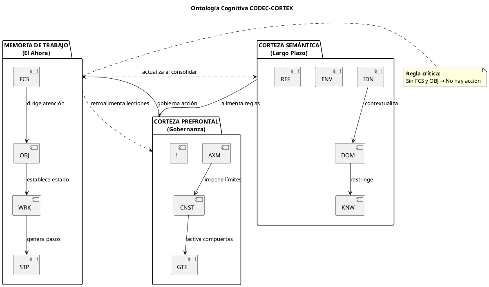
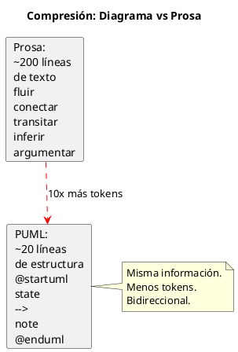
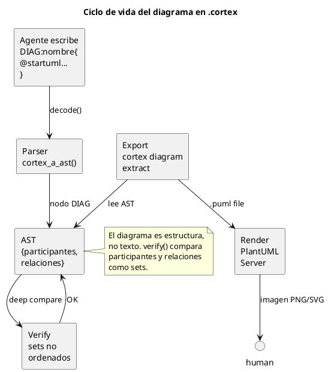
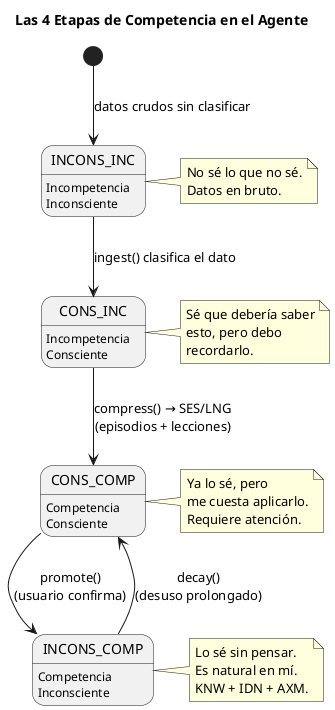
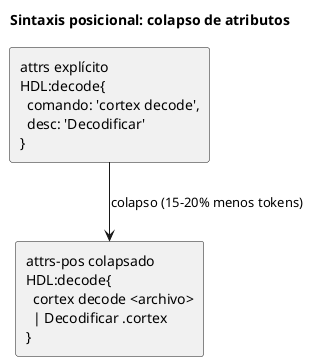
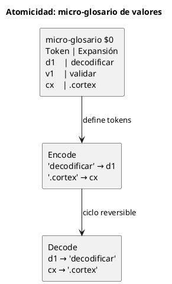
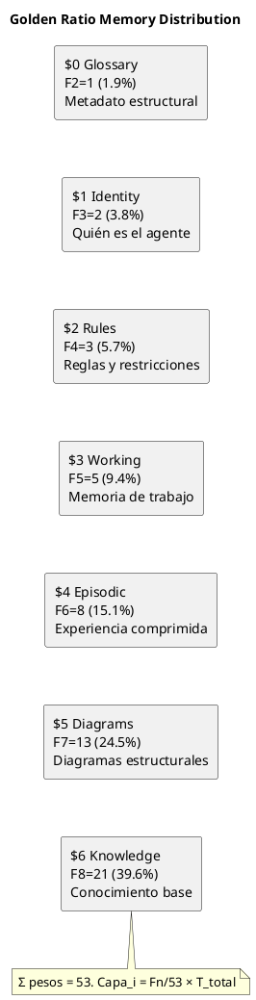

<!-- SPDX-FileCopyrightText: 2026 Fidel Ernesto Lozada A. -->
<!-- SPDX-License-Identifier: MIT -->

<p align="center">
  <strong>CODEC-CORTEX</strong> — Foundations and Principles
  <br>
  <sub>REFERENCE · v1.0.0 · MIT · <a href="../../../AUTHORS.md">Fidel Ernesto Lozada A.</a></sub>
</p>

---

> **STATUS NOTE:** This document is specification or design. As of v0.3.7 the CLI and deterministic codec (parse, encode, decode, verify, HCORTEX render, canonicalize, convert, roundtrip-bidir, inspect), the E2 security layer (`cortex doctor --scan-secrets`, `cortex audit`, `cortex --mode`, `cortex verify --signature`) and the E3 documentation protocol (`docs/cortex/api/*.cortex`, `cortex docstring`, `cortex benchmark`) are implemented in cli/. Runtime lifecycle and the MCP server remain planned or future.

**Abstract:** Cognitive ontology, architectural axioms, and guiding principles of the deterministic structural compression protocol for LLM agent memory. Covers the 3 cognitive cortices, the 7 foundational axioms, the 4 stages of competence as a maturation model, the HCORTEX human decompression protocol, advanced compression techniques (positional collapse and micro-glossary), and the golden ratio (φ=1.618) as a universal memory distribution pattern.

| | |
|---|---|
| **Author** | Fidel Ernesto Lozada A. — Systems Engineer / MSc. Management Sciences |
| **Repository** | [github.com/FidelErnesto03/codec-cortex](https://github.com/FidelErnesto03/codec-cortex) |
| **License** | [MIT](../../../LICENSE) |
| **Version** | 1.0.0 |
| **Language** | [Español](../../es/specs/fundamentos.md) |

---

# Foundations and Principles of the CODEC-CORTEX Protocol
---

# Foundations and Principles of the CODEC-CORTEX Protocol

> **Foundational theoretical document.**
> Defines the cognitive ontology, the unbreakable axioms, and the guiding principles that govern the design and implementation of the CODEC-CORTEX protocol.
>
> Reference: `SKILL.md` — complete operational specification.

---

## 1. The Fundamental Problem

Current LLM agents face an architectural crisis: **memory is treated as a bag of text**.

When an agent accumulates interaction history:
- Context grows linearly → inference cost scales without control
- Relevant information is diluted in noise → *Lost in the Middle*
- SLMs (small models) collapse due to limited context windows
- There is no distinction between *what happened*, *what matters*, and *what needs to be done*

**The root cause is not lack of context, but lack of structure in the context.**

CODEC-CORTEX proposes an architectural solution: instead of giving the LLM more text, give it **structurally perfect context** — a hierarchical memory ontology that forces the attention mechanism to process information in the exact cognitive priority order.

---

## 2. The Three-Cortex Cognitive Ontology

The protocol models agent memory as three cortical layers, inspired by functional neuroanatomy:

### Semantic Cortex (Long-Term) — $1

Contains the agent's stable knowledge: who it is, where it operates, what it knows.

| Sigil | Cognitive Function | Purpose |
|--------|-------------------|-----------|
| `IDN` | Identity | Role, personality, base model, agent version |
| `DOM` | Domain | Environment, world rules, operational boundaries |
| `KNW` | Knowledge | Facts, APIs, tools, loaded graphs |
| `ENV` | Environment | Current state of the external world/system |
| `REF` | Reference | Link to documents, APIs, or external nodes |

This layer **does not change between sessions** of the agent. It is updated only when domain knowledge expands.

### Prefrontal Cortex (Governance) — $2

Contains the immutable rules and boundaries that govern agent behavior.

| Sigil | Cognitive Function | Purpose |
|--------|-------------------|-----------|
| `AXM` | Axiom | Immutable law, guiding principle of the agent |
| `CNST` | Constraint | Hard limits (tokens, time, ethics, cost) |
| `GTE` | Gate | High-risk condition requiring external validation |
| `!` | Rule | Mandatory operational rule / critical warning |

This layer **is harder than working memory** but can be refined through learned lessons (`LNG`).

### Working Memory (The Now) — $3

Contains the agent's active state: what it is doing, why, and how.

| Sigil | Cognitive Function | Purpose |
|--------|-------------------|-----------|
| `FCS` | Focus | **Attention anchor** — what the agent must process NOW |
| `OBJ` | Objective | Active goal, intention, current task |
| `WRK` | Work | Work variables, progress, current state |
| `STP` | Step | Imminent action plan, next move |

**`FCS` and `OBJ` are the most critical sigils.** Without them, the agent has no attentional anchor or direction. The fundamental rule is: *no agent acts without explicit `FCS` and `OBJ` in active working memory.*



### Episodic Memory (Compressed Experience) — $4

Contains the agent's distilled history: what it learned from past experiences.

| Sigil | Cognitive Function | Purpose |
|--------|-------------------|-----------|
| `SES` | Session | Compressed episodic memory (Input→Output→Result) |
| `LNG` | Lesson | Learned heuristic, past error to avoid |

This layer **is updated through consolidation**: the Consolidation Engine takes `WRK` and raw history, and produces new `SES` and `LNG`. It is the equivalent of human sleep: the agent "sleeps" and consolidates its memory.

---

## 3. The 7 Axioms of the Protocol

The axioms are fundamental principles that **are non-negotiable**. Any CODEC-CORTEX implementation must respect them.

### Axiom I: Algorithmic Determinism

> **Planned decode/encode/verify operations are deterministic codec operations.** They should not call language models during the compilation cycle.

This targets structural reversibility and avoids LLM hallucination during structural transformation. Latency and performance require implementation benchmarks. The LLM consumes the `.cortex`; the codec does not depend on the LLM to produce or validate the format.

### Axiom II: The Glossary is the Single Source of Truth

> **The $0 glossary dictates syntax, not meaning.** Without a glossary, there is no parsing contract.

Every `.cortex` file begins with `$0`. The glossary defines which sigils exist, what type of expansion they have (attrs, body, content, block, relation), and what cognitive risk they represent. Without `$0`, the file is not interpretable.

### Axiom III: Structural Equivalence, Not Byte-by-Byte

> **Two files are equivalent if they produce the same AST.** Textual equality is not required.

The `verify` contract is: same set of tuples `(sigil, name, value_json)`. Section order, whitespace, and comments do not affect structural equivalence.

### Axiom IV: Compression and Expansion are Inverse Operations

> **decode(encode(decode(x))) == decode(x)** for every valid `.cortex` file.

The complete codec cycle targets structural reversibility for supported structures. Semantic drift and information loss must be tested against explicit fixtures. Any implementation that does not satisfy this axiom is not a valid CORTEX codec.

### Axiom V: Attentional Anchoring by Structure

> **The agent does not act without explicit `FCS` and `OBJ`.** Structure forces attention, it does not suggest it.

By injecting `FCS` and `OBJ` in fixed, high-density structural positions, the protocol "hacks" the Transformer's attention mechanism. The model does not search for the task amid chat history — the task is presented as an inescapable state variable at the start of its processing.

### Axiom VI: Framework Agnosticism

> **CODEC-CORTEX does not belong to any ecosystem.** It is a state transport format.

Any implementation that respects these axioms is valid. There is no dependency on any specific framework or external system. Adapters are welcome; dependencies are not.

### Axiom VII: Layer Separation

> **Agent memory is organized into layers with different update frequencies.**

- Semantic ($1): changes per agent lifecycle
- Prefrontal ($2): changes per governance refinement
- Working ($3): changes per interaction
- Episodic ($4): changes per nightly consolidation

A flat file system or a vector database treats all memory equally. CODEC-CORTEX hierarchies it by frequency and criticality.

---

## 4. The 8 Guiding Principles

The principles are design guides for implementations and extensions of the protocol.

### Principle 1: No LLM in the Adjustment Cycle

The codec is pure algorithmic transformation. It does not matter whether the LLM of the moment is GPT-4, agent client, or a 3B-parameter SLM — the `.cortex` is parsed the same way. Compression quality does not depend on the model.

### Principle 2: YAML-Edit as the Human Source of Truth

The `.cortex` format is the dense compiled format. It is not edited by hand. The representation for human editing is YAML-Edit: sigils as direct YAML keys, diffable, readable. The human edits YAML-Edit; the codec compiles to `.cortex`.

### Principle 3: Density First, Readability Second

`.cortex` optimizes for LLM consumption (minimum tokens, maximum semantic density). Human readability is satisfied in YAML-Edit. Do not sacrifice compression for readability in the compiled format.

### Principle 4: Mandatory Self-Description

Every `.cortex` includes its own glossary ($0). No external schemas, no central registries, no additional documentation. The file explains itself. Any LLM or tool can interpret it by reading only the first few lines.

### Principle 5: Predictability over Optimization

The parser must be deterministic and predictable before being intelligent. Better a slow but fully validated parse than a fast one with edge cases. `verify` must detect any deviation from the expected AST.

### Principle 6: REFs Point to Files, Not Directories

Every reference must resolve to a concrete `.cortex` file. `REF:memory{PATH:context/}` is ambiguous. `REF:memory{PATH:context/trader.cortex}` is precise. REFs to directories do not resolve.

### Principle 7: Auto-Creation of Sections

If `patch_add` references a section that does not exist, it creates it automatically. This allows building a `.cortex` from scratch using only the patch handlers, without needing templates or base files.

### Principle 8: History is Collapsed, Not Deleted

The Consolidation Engine does not delete memory — it collapses it. `SES` contain the essence of past sessions (Input→Output→Result). `LNG` contain lessons (what went wrong, what to avoid). Information is distilled, not lost. The codec's reversibility guarantees that the distillation is faithful.

---

## 5. Cognitive Density Map by Sigil

Each sigil has a distinct cognitive weight in the LLM's attention:

| Layer | Sigil | Density | Risk | Change Frequency |
|------|--------|----------|--------|---------------------|
| Semantic | `IDN` | High | Low | Per lifecycle |
| Semantic | `DOM` | High | Low | Per lifecycle |
| Semantic | `KNW` | Very high | Low | Per knowledge update |
| Semantic | `ENV` | Medium | Low | Per environment change |
| Prefrontal | `AXM` | Maximum | High | Never (immutable) |
| Prefrontal | `CNST` | High | Medium | Per refinement |
| Prefrontal | `GTE` | Maximum | High | Per new risk identified |
| Working | `FCS` | **Critical** | **High** | Per interaction |
| Working | `OBJ` | **Critical** | **High** | Per task |
| Working | `WRK` | High | Low | Per step |
| Working | `STP` | High | Medium | Per step |
| Episodic | `SES` | Medium | Low | Per consolidation |
| Episodic | `LNG` | High | Medium | Per significant error |

**Density rule:** Working Memory sigils have critical density because they are the ones the LLM needs to process first and with the greatest precision. Their position in the `.cortex` file (at the beginning, after $0 and $1-$2) guarantees that the attention mechanism finds them without competition from historical noise.

---

## 6. Relationship to Other Paradigms

| Paradigm | CODEC-CORTEX | Key Difference |
|-----------|--------------|------------------|
| **RAG** | Retrieves documents from the external world | CORTEX retrieves the agent's *internal cognitive state* |
| **Fine-tuning** | Modifies model weights | CORTEX modifies context, not the model |
| **Prompt engineering** | Designs prompts manually | CORTEX generates deterministic structural context |
| **Context window expansion** | Increases the token limit | CORTEX reduces the tokens needed |
| **Vector databases** | Stores embeddings | CORTEX stores structural cognitive state (not vectors) |

**CODEC-CORTEX does not replace RAG — it complements it.** RAG retrieves external knowledge; CORTEX manages the agent's internal memory. Together, they cover the full spectrum of an autonomous agent's informational needs.

---

## 7. PUML Diagrams as Native Compression

### 7.1. Principle

PUML diagrams are the most efficient compression mechanism in the protocol. A 20-line diagram can communicate flows, relationships, architectures, and processes that would require 200+ lines of prose.



PUML diagrams are the most efficient compression mechanism in the protocol. A 20-line diagram can communicate flows, relationships, architectures, and processes that would require 200+ lines of prose. And it does so in a format that is **naturally bidirectional**: a human sees the rendered diagram, a machine parses the same text.

### 7.2. Compression factor of diagrams vs prose

| Aspect | Prose | PUML Diagram | Factor |
|---------|------|----------------|--------|
| Flow of 6 states with transitions | ~60 lines | ~20 lines | 3× |
| Architecture of 5 components with relationships | ~80 lines | ~15 lines | 5× |
| Cognitive ontology with 3 layers and 12 sigils | ~100 lines | ~25 lines | 4× |
| Causal relationships between modules | ~50 lines | ~10 lines | 5× |

**Illustrative compression target:** ~4x over prose, pending reproducible benchmarks and structural fidelity tests.

### 7.3. Diagrams in the .cortex lifecycle



PUML diagrams are stored inside the `.cortex` as `DIAG` blocks in the corresponding section:

```cortex
# -- $5: DIAGRAMAS ESTRUCTURALES --
DIAG:ontologia{
@startuml
title Ontología Cognitiva CODEC-CORTEX
package "CORTEZA SEMÁNTICA" { [IDN] [DOM] [KNW] }
package "PREFRONTAL" { [AXM] [CNST] [GTE] [!] }
package "TRABAJO" { [FCS] [OBJ] [WRK] [STP] }
Semantic --> Prefrontal : alimenta
Prefrontal --> Working : gobierna
@enduml
}

DIAG:fsm_memoria{
@startuml
title FSM — Ciclo de Vida
state IDLE
state INGEST
state COMPACT
state STORED
[*] --> IDLE
IDLE --> INGEST : ingest
INGEST --> COMPACT : compress
COMPACT --> STORED : verify
STORED --> ACTIVE : decode
@enduml
}
```

### 7.4. The codec treats PUML as structure, not as text

The parser `cortex_a_ast()` recognizes `@startuml...@enduml` within `DIAG` sigil values and converts them into AST nodes with their own internal structure:

```python
# AST of a DIAG
{
    't': 'sigil',
    's': 'DIAG',
    'n': 'ontologia',
    'v': {
        '_tipo': 'puml',
        '_title': 'Ontología Cognitiva CODEC-CORTEX',
        '_participants': ['IDN', 'DOM', 'KNW', 'AXM', ...],
        '_relaciones': [
            {'origen': 'Semantic', 'destino': 'Prefrontal', 'label': 'alimenta'},
            ...
        ],
        '_raw': '@startuml\n...'  # full text preserved
    }
}
```

This allows `verify()` to compare diagrams structurally (same participants, same relationships) and not just textually, maintaining the axiom of structural equivalence over textual equivalence.

### 7.5. Companion sigil pattern

The `DIAG` is preserved intact (type `block`, verbatim). Sigils that share its name act as **interpretative context** — the LLM reads them to understand the diagram without parsing the PUML.

```cortex
# -- $5: DIAGRAMAS ESTRUCTURALES --

# The PUML diagram is preserved verbatim — never modified
DIAG:ontologia{
@startuml
title Ontología Cognitiva CODEC-CORTEX
package "CORTEZA SEMÁNTICA" { [IDN] [DOM] [KNW] }
package "PREFRONTAL" { [AXM] [CNST] [GTE] [!] }
package "TRABAJO" { [FCS] [OBJ] [WRK] [STP] }
Semantic --> Prefrontal : alimenta
Prefrontal --> Working : gobierna
@enduml
}

# Companion sigils — same name "ontologia"
# The LLM reads these for context without parsing the PUML
KNW:ontologia{_participants:[IDN,DOM,KNW,AXM,CNST,GTE,FCS,OBJ,WRK,STP], _relaciones:2, _capa:cognitiva}
TAG:ontologia{tags:[core, arquitectura, fundamentos]}
DESC:ontologia{propósito:"Mapa de las tres cortezas cognitivas y sus relaciones"}

# Another diagram with its companions
DIAG:fsm_memoria{
@startuml
title FSM — Ciclo de Vida
state IDLE
state INGEST
state COMPACT
state STORED
[*] --> IDLE
IDLE --> INGEST : ingest
INGEST --> COMPACT : compress
COMPACT --> STORED : verify
STORED --> ACTIVE : decode
@enduml
}

KNW:fsm_memoria{_estados:5, _transiciones:4, _tipo:maquina_estados}
TAG:fsm_memoria{tags:[ciclo_vida, memoria, operaciones]}
```

**Naming rule:** Companion sigils use the same `name` as the `DIAG` they enrich. If the diagram is called `ontologia`, the companions use `ontologia` as the second part of the sigil.

**What the codec guarantees:**
1. `DIAG` raw is preserved bit-for-bit in every encode/decode
2. Companion sigils are parsed normally (type `attrs` or `content`)
3. `verify()` compares companions structurally (deep compare of values)
4. `verify()` does NOT compare the raw DIAG — it only verifies it has not changed (same length, same delimiters)

### 7.6. Diagram rules in .cortex

1. **Diagrams are first-class citizens.** They are not comments or embedded text — they are AST nodes with parseable structure.
2. **`DIAG` is the sigil for diagrams.** Every `@startuml...@enduml` block within a `DIAG` value is parsed structurally.
3. **The DIAG raw is preserved verbatim.** The codec never modifies the content between `@startuml` and `@enduml`. The `block` type guarantees bit-for-bit fidelity.
4. **Companion sigils enrich without modifying.** `KNW:name{...}`, `TAG:name{...}`, `DESC:name{...}` and any other sigil that shares the `DIAG`'s name acts as interpretative context. The LLM reads them to understand the diagram without parsing the PUML.
5. **Naming convention.** Companion sigils use the same `name` as the `DIAG` they complement. `DIAG:fsm{...}` → `KNW:fsm{...}`, `TAG:fsm{...}`.
6. **Extraction to .puml files.** The codec can export diagrams to standalone `.puml` files for external rendering.
7. **Verification cycle.** `verify()` compares companion sigils structurally (deep compare). The raw DIAG is verified only for integrity (length, delimiters), not for content.

### 7.8. SKILL.md as diagram + legend

CODEC-CORTEX's own SKILL.md follows this paradigm: PUML diagrams are the primary specification language (FSM, pipeline, ontology), and tables are the legend that no diagram can express (exact values, types, parameters). The agent reads the diagram first to understand the flow, then consults the tables for precise details.

### 7.9. Implications for adoption

| Aspect | Without diagrams | With diagrams (PUML) |
|---------|---------------|----------------------|
| Flow compression | Text only → 200 lines | Diagram + legend → 30 lines |
| Bidirectionality | Human reads prose, machine parses text | Human sees diagram, machine parses same text |
| Debugging | Read textual logs | View state diagram |
| Inter-agent communication | Exchange dense text | Exchange diagrams + sigils |
| Documentation | Separate document | Embedded in the `.cortex` itself |

---

## 8. Cognitive Maturation Model

The CODEC-CORTEX cognitive maturation model follows 4 stages of competence, derived from the Dreyfus model: **Novice → Advanced Beginner → Competent → Proficient**. Each stage defines what kind of memory the agent can produce, what it can verify, and what requires human confirmation.

For the **operational learning process** — memory type taxonomy, Fibonacci thresholds, human confirmation gates, AUD rules, and the manual algorithm — see the dedicated specification:

> **See:** [`learning.md`](learning.md) — Full learning specification: memory types, when to update `brain.cortex`, Fibonacci contextual ascent (score 1–21), flags and weights, P0-P5 priority, LNG/AUD rules, maturity contract.

### 8.1. The 4 Stages of Competence

The CODEC-CORTEX protocol models the maturation of agent knowledge according to the 4 classic stages of human competence, adapted for LLMs:



| Stage | The agent... | .cortex Container | Entry Operation | Exit Operation |
|-------|-------------|-------------------|---------------------|---------------------|
| **Unconscious Incompetence** | Does not know what it does not know | Raw data (unclassified) | `ingest()` | Nothing (discarded if not reused) |
| **Conscious Incompetence** | Knows it exists but does not know it | `WRK` (working memory) | `ingest()` with classification | `compress()` or `overflow` |
| **Conscious Competence** | Knows it but struggles to apply it | `SES` (episodes) + `LNG` (lessons) | `compress()` | `promote()` or `decay()` |
| **Unconscious Competence** | Knows it effortlessly | `KNW` (base knowledge) + `IDN` + `AXM` | `promote()` | `decay()` (due to disuse) |

### 8.2. Maturation is not a Counter — it is the User

**Fundamental principle:** Maturation is not measured by frequency of use, but by **user decision**. A counter measures repetition, not meaning. A workflow executed 10,000 times may be a repetitive task with no learning value.

```
detecta_recurrencia(SES o LNG)
      │
      ├── umbral_de_recurrencia alcanzado
      │       │
      │       └── pregunta al usuario:
      │           "He notado que este patrón se repite.
      │            ¿Debería aprenderlo como conocimiento base?"
      │               │
      │               ├── Sí  → promote(ses, lng → knw)
      │               │
      │               ├── No  → queda en SES/LNG
      │               │
      │               └── "No sabía que hacía esto"
      │                   → promote() + log: usuario hizo consciente
      │
      └── sin recurrencia → decay() progresivo (archivo o descarte)
```

### 8.3. LLMs Learn Instantly — Without Repetition

This is the fundamental difference between an LLM and a human:

| Aspect | Human | LLM |
|---------|--------|-----|
| Learns by | Repetition + practice | **Direct instruction** |
| Unconscious competence | "I do it without thinking" | "It's in my KNW" |
| Maturation | Gradual (hours/days) | **Instant (1 instruction)** |
| Forgetting | Slow, through disuse | **Non-existent if in KNW** |
| Capacity limit | Limited attention | **Context (tokens)** |

For an LLM, `promote()` requires no repetition. It is enough for the system to tell it:

> *"This SES is now promoted to KNW. Incorporate it as base knowledge."*

And the LLM incorporates it on the **next read of the `.cortex`** — without practice, without repetition, without review.

### 8.4. The Two Strands

**Strand 1 — The system makes the user conscious:**

```
SES:sesion_03{input:"deploy_staging", ...}
SES:sesion_07{input:"deploy_staging", ...}
SES:sesion_14{input:"deploy_staging", ...}

→ System detects recurrence
→ Asks: "You have run 'deploy_staging' 3 times. Should I learn it?"
→ User: "You're right, it's my standard workflow. Yes."
→ System promotes SES → KNW:workflow_deploy{...}
```

The system not only learned — **it taught the user something about themselves**.

**Strand 2 — The LLM learns instantly:**

```
Before:   SES:deploy_staging{steps, result:"ok"}
         → The LLM sees it as a past episode (retrievable with effort)

After promote():
         KNW:workflows{deploy_staging:[step1,step2,step3], confident:true}
         → The LLM sees it as base knowledge (0 recall effort)

         Difference: 0 practice iterations.
         It was only told "this is now knowledge".
```

### 8.5. Maturation Operations

| Operation | Description | When it executes |
|-----------|-------------|-------------------|
| `detect_recurrence()` | Scans SES and LNG for repeated patterns (same input, same error, same workflow) | Each nightly consolidation |
| `ask_user()` | Presents the pattern to the user and asks whether it should be promoted | When `detect_recurrence()` finds a candidate |
| `promote()` | Migrates a SES or LNG from episodic memory to semantic knowledge (SES/LNG → KNW) | When the user confirms |
| `decay()` | Degrades an underused KNW back to SES (or archives it) | Periodically, due to prolonged disuse |

### 8.6. Mapping to Current Architecture

CODEC-CORTEX's current architecture already has the correct containers:

| Stage | Current Container | Exists? | Used? |
|-------|------------------|----------|----------|
| Unconscious incompetence | (raw before ingest) | Implicit | Not formalized |
| Conscious incompetence | WRK + FCS + OBJ + STP | ✅ Yes | Yes |
| Conscious competence | SES + LNG | ✅ Yes | Yes |
| Unconscious competence | KNW + IDN + AXM | ✅ Yes | Yes |

What **does not** formally exist is the **maturation engine**: `detect_recurrence()`, `ask_user()`, `promote()`, and `decay()`. The containers are ready; the dynamics between them is the new design.

---

## 9. HCORTEX: Human Decompression Protocol

### 9.1. The Output Problem

If the LLM receives `.cortex` and responds in prose, the compression cycle is lost:

```
.cortex (1.8K tok) → LLM processes → prose (2K tok) → human reads
                                    ↑____ 100% of the savings evaporate in the output
```

The solution is for the LLM to respond in **compressed natural language** — markdown formatted according to **HCORTEX** rules: tables, lists, key/value pairs, PUML diagrams. No sigils, no noise, no unnecessary prose.

### 9.2. HCORTEX is not an Extension — it is a Format Protocol

HCORTEX is not `.hcodex`, `.hcortex`, or any file extension. It is a **set of decompression rules** that transform `.cortex` sigils into representations that a human absorbs effortlessly. The result is standard `.md` files formatted with HCORTEX rules:

| .cortex Element | HCORTEX Rule | Representation |
|------------------|---------------|----------------|
| `IDN:agent{role:"X"}` | `**Identity:** X` | Bold text + value |
| `FCS:focus{objective:"X"}` | Table `\| Dimension \| Value \|` | Table row |
| `SES:name{input:"X", output:"Y"}` | List `- name: X → Y` | Bullet with arrow |
| `KNW:tools{apis:[...]}` | Item list | Simple bullets |
| `CNST:tokens{limit:N}` | `\| Constraint \| N \|` | Table row |
| `DIAG:diag{@startuml...}` | Literal PUML block | Rendered by client |
| `WRK:state{progress:N%}` | `\| Progress \| N% \|` | Table row or bar |
| `→` Relations | Text arrow or diagram | `state → next` |

### 9.3. Rules of Human←Agent Communication

1. **The LLM does not explain in prose what it can structure.** If the information fits in a table, it's a table. If it fits in a list, it's a list. If it fits in a diagram, it's a diagram. Prose is the last resort.
2. **HCORTEX is the standard output protocol.** The LLM formats its response following HCORTEX rules: tables for dimensional data, lists for collections, K/V pairs for simple attributes, PUML for relationships and flows.
3. **The LLM structures, it does not narrate.** It does not say "The agent has a research objective with high priority." It writes:

```markdown
| Focus | Objective | Priority |
|------|----------|-----------|
| AAPL Q3 earnings | Extract net margin | High |
```

4. **PUML diagrams are rendered for the human.** The LLM includes the `@startuml...@enduml` block in its response; the client (agent clients) renders it as an image.
5. **HCORTEX output is standard markdown.** Any editor or markdown viewer displays it correctly. No proprietary format, no extensions.
6. **The human can edit the HCORTEX output and re-compress to `.cortex`.** `cortex encode input.md` interprets HCORTEX rules and reconstructs the `.cortex`, closing the bidirectional cycle.

### 9.4. Complete Cycle

```
Human writes/edits .md with HCORTEX rules
        │
        ▼ encode()
    .cortex (compressed for LLM, includes $0 glossary)
        │
        ▼ decode()
    LLM processes (reads $0 to interpret sigils)
        │
        ▼ decode(format=hcortex)
    .md with HCORTEX rules ($0 omitted — semantic sections $1+ only)
        │
        ▼
    Human reads tables, lists, diagrams
        │
        └── edits .md → cycle repeats
```

**Fundamental rule:** `$0` (glossary) is AI-only structural metadata. HCORTEX output never includes the glossary — only semantic sections ($1+) transformed into human-readable representations.

### 9.5. Example of LLM Response in HCORTEX

**User:** "What is the agent's current state?"

**LLM response (formatted with HCORTEX rules, no prose):**

```markdown
## Agent State

| Layer | Sigil | Value |
|------|--------|-------|
| Identity | IDN | financial researcher |
| Focus | FCS | Analyze Q3 earnings AAPL |
| Objective | OBJ | Extract net margin (high) |
| Progress | WRK | 40% — downloading 10-K |
| Tools | KNW | yahoo_finance, sec_edgar |

## Next step
- Action: query SEC EDGAR
- Source: sec.gov/cgi-bin/browse-edgar

## State diagram
@startuml
state Current : Downloading 10-K
state Next : Query SEC EDGAR
Current --> Next : progress
@enduml
```

Not a single line of prose. The human absorbs the information in seconds.

### 9.6. HCORTEX Glossary

| Term | Definition |
|---------|------------|
| HCORTEX | Decompression protocol: rules for transforming .cortex sigils into human-readable markdown |
| `decode(format=hcortex)` | Function that decompresses a .cortex AST to markdown formatted with HCORTEX rules |
| `cortex encode input.md` | Interprets markdown with HCORTEX rules and reconstructs the .cortex (cycle closure) |
| Structured output | Principle that the LLM responds in condensed formats, not prose |
| Decompression map | Correspondence table: .cortex sigil → HCORTEX representation |

---

## 10. Advanced Compression Techniques

### 10.1. Collapse of Redundant Attributes (Positional Syntax)

When the $0 glossary defines a known attribute structure for a sigil, repeating explicit keys is redundant. **Positional syntax** eliminates the keys and uses a canonical separator (`|`) between values:



| Without collapse | With collapse | Savings |
|-------------|-------------|--------|
| `HDL:decode{command:"cortex decode <file>", desc:"Decode .cortex"}` | `HDL:decode{cortex decode <file> \| Decode .cortex}` | **~20%** |

**Rule:** If the $0 glossary declares a sigil as `attrs-pos`, its values are interpreted by positional order, not by key. The order is specified in the sigil's entry in $0.

### 10.2. Atomicity via Value Micro-Glossary

Frequent terms in values are tokenized as ultra-short sigils (1-3 characters). The parser expands the tokens during decode and collapses them during encode:



| Without micro-glossary | With micro-glossary ($0 defines `d1=decode, cx=.cortex`) | Savings |
|--------------------|-------------------------------------------------------------|--------|
| `HDL:decode{command:"decode file .cortex"}` | `HDL:decode{d1 ar cx}` | **~60%** |

**Rule:** The micro-glossary lives in $0 and follows the same rules as any sigil. Micro tokens are applied in the decode phase (expansion) and encode phase (collapse). Deep compare compares expanded values, not raw.

### 10.3. Combined Effect

```
explicit attrs + no micro → 100% of tokens
     │
     ▼ positional collapse (15-20% savings)
attrs-pos + no micro → lower token budget than explicit attrs
     │
     ▼ micro-glossary atomicity (30-40% savings on remainder)
attrs-pos + micro → 48-60% of tokens = 40-52% total savings
```

---

## 11. Golden Ratio as Universal Distribution Pattern

### 11.1. The Natural Principle

In nature, the growth of neural branches, the arrangement of leaves (phyllotaxis), and the structure of spiral galaxies follow the **golden ratio** (φ = 1.618033...). This ratio emerges from the Fibonacci sequence (1, 1, 2, 3, 5, 8, 13, 21, 34...), where each term is the sum of the two preceding ones: Fn = Fn-1 + Fn-2.

The same principle applies to memory distribution in LLM agents.

### 11.2. Application to Agent Memory

Each cognitive layer of the agent receives a token allocation proportional to its index in the Fibonacci sequence:



| Layer | Fib | Purpose | Tokens (T=4096) | % |
|------|-----|-----------|:--:|:--:|
| $0 Glossary | F2=1 | Structural metadata | 77 | 1.9 |
| $1 Identity | F3=2 | Who the agent is | 155 | 3.8 |
| $2 Rules | F4=3 | Rules and constraints | 232 | 5.7 |
| $3 Working | F5=5 | Active working memory | 386 | 9.4 |
| $4 Episodic | F6=8 | Compressed experience | 618 | 15.1 |
| $5 Diagrams | F7=13 | Structural diagrams | 1,005 | 24.5 |
| $6 Knowledge | F8=21 | Base knowledge and skills | 1,623 | 39.6 |

### 11.3. Distribution Formula

```
layer_tokens(i) = (F(i+1) / ΣF) × T_total

Where:
  F(i+1) = (i+2)-th Fibonacci number (starting at F2=1)
  ΣF     = sum of all Fibonacci weights used (53 for 7 layers)
  T_total = total tokens available in the context window
```

**Example:** For T=128,000 (large window):
- $3 Working: (5/53) × 128,000 = 12,075 tokens
- $6 Knowledge: (21/53) × 128,000 = 50,717 tokens
- Ratio $6/$3 = 21/5 = 4.2 ≈ φ³

### 11.4. Universality of the Pattern

The pattern is **independent of total capacity**. A 4K-token SLM and a 128K-token LLM use exactly the same proportional sequence:

| T_total | $3 Working | $6 Knowledge | Ratio $6/$3 |
|---------|:--:|:--:|:--:|
| 2,048 | 193 | 811 | 4.2 |
| 4,096 | 386 | 1,623 | 4.2 |
| 8,192 | 773 | 3,246 | 4.2 |
| 32,768 | 3,091 | 12,983 | 4.2 |
| 128,000 | 12,075 | 50,717 | 4.2 |

The architecture does not change. It only scales.

### 11.5. The Cognitive Trinity

The CORTEX ecosystem is organized into three files that form the agent's **cognitive trinity**:

```
brain.cortex    → Local consolidated brain (operational state)
                  Contains the active working state (WRK),
                  recent compressed sessions (SES),
                  knowledge in use (active KNW),
                  and the golden ratio balance audit (AUD).
                  Updated on every interaction.
                  It is the contextual persistence mechanism
                  without depending on the model's memory.

AGENT.cortex    → Agent memory (the persistent content)
                  Who it is (IDN), what it knows (KNW),
                  what it is doing (FCS, OBJ, WRK),
                  what it has learned (SES, LNG).

SKILL.cortex    → Operational capability (the skills)
                  What tools it has (HDL),
                  what rules it follows (!),
                  what errors it knows (PFL),
                  what diagrams guide it (DIAG).
```

This trinity is complete: the container, the content, and the capability. Any agent that adopts these three files operates under the CORTEX protocol in a complete manner.

### 11.7. GATE Exit — Clean De-adoption

The protocol includes an exit mechanism for when the agent stops using CODEC-CORTEX:

```
On de-adoption:
1. render active .cortex context as HCORTEX
2. Save each output as .md HCORTEX (readable without the skill)
3. Remove brain.cortex and SKILL.cortex (no longer apply)
4. AGENT.md remains as the final record of the agent's state
```

| Without GATE | With GATE |
|----------|----------|
| The agent is left with `.cortex` files it can no longer interpret | The agent recovers all its memory in readable `.md` HCORTEX |
| Perpetual dependence on the protocol | Clean exit, no dependency |
| Memory trapped in compressed format | Memory liberated in universal format |

**Principle:** CODEC-CORTEX is not a prison. The agent enters voluntarily and leaves with its memory intact.

### 11.6. Rules of the Golden Architecture

1. **Mandatory φ distribution.** Token allocation between layers must follow the Fibonacci sequence. Arbitrary allocation is not permitted.
2. **Capacity independence.** The architecture is the same for 2K or 128K tokens. It only scales proportionally.
3. **Overflow protection.** If a layer exceeds its φ allocation, it is compressed or consolidated. Tokens are never stolen from other layers.
4. **Viable minimum.** If T < 500 tokens, flat allocation with minimum weights is used.
5. **Balance audit.** Each management cycle verifies the φ balance and reports deviations >10%.
6. **One pattern, all agents.** brain.cortex is universal. Any agent, any model, any capacity.

---

## 9. Document Glossary

| Term | Definition |
|---------|------------|
| Sigil | 2-4 character mark that categorizes a cognitive element (IDN, FCS, OBJ, etc.) |
| Section $N | Numbered block within a `.cortex` file (e.g., $0 = glossary, $1 = identity) |
| AST | Abstract syntax tree: structured representation of `.cortex` |
| YAML-Edit | Human format with sigils as YAML keys, diffable |
| Codec | Implementation of the 3 operations: decode, encode, verify |
| CAG | Cognitive Augmented Generation — generation assisted by cognitive context (vs RAG) |
| Focus (FCS) | Attentional anchor: what the agent must process now |
| Consolidation | Process of compressing WRK + raw history into SES + LNG |
| Maturation | Process of promoting SES/LNG → KNW mediated by the user |
| promote() | Operation that migrates episodic knowledge to semantic |
| decay() | Operation that degrades unused knowledge |
| detect_recurrence() | Scanning of repeated patterns in SES and LNG |
| ask_user() | Query to the user about whether a pattern should be learned |
| Golden ratio (φ) | 1.618033... — universal growth ratio found in nature, used as a memory distribution pattern between cognitive layers |
| brain.cortex | Neural architecture file: defines HOW agent memory is distributed following the Fibonacci sequence |
| AGENT.cortex | Agent memory: the content (who it is, what it knows, what it does) |
| SKILL.cortex | Operational capability: the agent's skills and tools |
| Cognitive trinity | brain.cortex (container) + AGENT.cortex (content) + SKILL.cortex (skills) |
