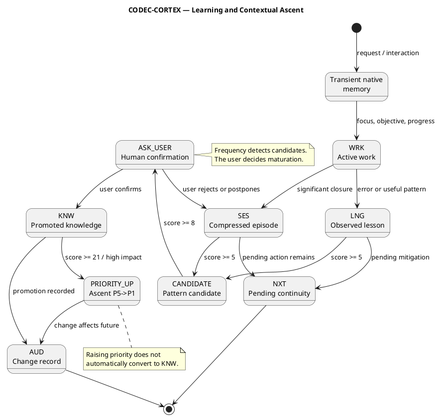

<!-- SPDX-FileCopyrightText: 2026 Fidel Ernesto Lozada A. -->
<!-- SPDX-License-Identifier: MIT -->

<p align="center">
  <strong>CODEC-CORTEX</strong> — Learning Process & Contextual Ascent
  <br>
  <sub>REFERENCE · v1.0.0 · MIT · <a href="../../../AUTHORS.md">Fidel Ernesto Lozada A.</a></sub>
</p>

---

> **STATUS NOTE:** This document is specification or design. As of v0.3.6 the agent-assisted manual consolidation is current Skill usage, and the CLI provides the deterministic codec, the E2 security layer (secret scanner, mutation gates, audit log, signature verification) and the E3 documentation protocol (`docs/cortex/api/*.cortex`, `cortex docstring`, `cortex benchmark`). Automatic recurrence detection, promotion, decay and structural reordering by runtime remain planned or future unless verified implementation exists.

**Abstract:** Defines the CODEC-CORTEX learning process for `brain.cortex`: when to update memory, how to collapse work into `SES` and `LNG`, how to detect candidate knowledge, how to apply Fibonacci thresholds for contextual ascent, when to request human confirmation, what requires `AUD`, and how to distinguish transient native memory, `SES`, `LNG`, `KNW` and `NXT`.

| | |
|---|---|
| **Author** | Fidel Ernesto Lozada A. — Systems Engineer / MSc. Management Sciences |
| **Repository** | [github.com/FidelErnesto03/codec-cortex](https://github.com/FidelErnesto03/codec-cortex) |
| **License** | [MIT](../../../LICENSE) |
| **Version** | 1.0.0 |
| **Language** | [Español](../../es/specs/aprendizaje.md) |

---

# Learning Process & Contextual Ascent

> Reference: `SKILL.md` — complete operational specification.
> Reference: `fundamentals.md` — ontology, axioms and principles.
> Reference: `algorithm.md` — FSM, cognitive density and planned operations.

---

## 1. Central principle

CODEC-CORTEX does not record everything that happens. Memory is updated only to preserve what changes continuity, decisions, risks, constraints, evidence, learning or future behavior.

History is collapsed, not deleted:

```text
transient native memory -> WRK -> SES/LNG -> CANDIDATE -> KNW
```

Contextual relevance rises by accumulated signal:

```text
P5 -> P4 -> P3 -> P2 -> P1 -> P0
```

Relevance ascent is not equivalent to automatic semantic promotion. An entry may rise in contextual priority without becoming `KNW`.

---

## 2. Memory types

| Type | Function | Persistence | Rule |
|------|----------|:-----------:|------|
| Transient native memory | Agent mental state during interaction | No | May guide a response but does not modify `brain.cortex` |
| `WRK` | Recoverable operational state | Yes | Updated when progress must survive |
| `SES` | Compressed episode: input, output, outcome | Yes | Summarizes what occurred without converting it into a rule |
| `LNG` | Observed lesson, error or pattern | Yes | May warn or guide, but is not stable knowledge |
| `KNW` | Validated or promoted knowledge | Yes, high priority | Guides future behavior |
| `NXT` | Concrete pending action | Yes, operational | Enables continuity recovery |

---

## 3. When to update `brain.cortex`

Update `brain.cortex` when the change affects future continuity.

| Case | Suggested sigils | Requires `AUD` |
|------|-----------------|:--------------:|
| New task, focus or objective | `FCS`, `OBJ`, `STP` | No, unless major objective change |
| Recoverable operational progress | `WRK`, `STP`, `NXT` | Optional |
| Active block or risk | `WRK`, `RSK`, `NXT` | Yes |
| Significant work closure | `SES`, `NXT` | Yes, if there was a decision or verification |
| Error, deviation or useful pattern | `LNG`, `RSK` | Optional |
| Relevant decision | `AUD`, `REF`, possibly `KNW` | Yes |
| Verified or refuted claim | `CLAIM`, `AUD`, `REF` | Yes |
| New limit or constraint | `CNST` or `LIM`, `AUD` | Yes |
| Absorbed Level 3 package | `KNW`, `REF`, `DIAG`, `CLAIM`, `LIM`, `AUD` | Yes |
| Promoted knowledge | `KNW`, `AUD`, origin `SES/LNG` | Yes |

Do NOT update `brain.cortex` for every message, minor preference, discarded reasoning, unapproved draft, or information that does not change the next work.

---

## 4. What is never updated automatically

An agent or runtime MUST NOT automatically update:

- project identity, authorship or normative version;
- `AXM` and `CNST:blocking`;
- maturity claims, metrics or benchmarks;
- promotion `SES/LNG -> KNW`;
- decay, archival or deletion of `KNW`;
- live state (`FCS`, `OBJ`, `WRK`, `STP`, `NXT`) taken from Level 3 packages;
- secrets, credentials, tokens or private keys;
- knowledge that contradicts a canonical source or current human decision.

---

## 5. Human confirmation

The user is the maturation judge. Frequency detects candidates; it does not decide meaning.

Human confirmation is REQUIRED for:

- promoting `SES` or `LNG` to `KNW`;
- changing identity, authorship, version or protocol scope;
- adding, removing or hardening constraints;
- declaring a capability as `current`;
- degrading, archiving or deleting `KNW`;
- resolving conflict between `brain.cortex`, external package and current request;
- turning a circumstantial lesson into a general rule.

---

## 6. Fibonacci contextual ascent

CODEC-CORTEX uses the Fibonacci progression as a contextual ascent threshold. Signal does not grow linearly: each ascent requires stronger evidence.

| Score | Suggested state | Action |
|:----:|----------------|--------|
| 1 | Observed | Keep in transient native memory or `SES` |
| 2 | Minimum repetition | Register as relevant `SES` |
| 3 | Initial pattern | Create or update `LNG` |
| 5 | Operational pattern | Mark `LNG` as candidate |
| 8 | Validatable knowledge | Request human confirmation |
| 13 | Promotable knowledge | Promote to `KNW` if confirmed or strong evidence |
| 21 | Critical knowledge | Raise contextual priority and register `AUD` |

### 6.1 Signals and weights

| Signal | Weight |
|--------|:-----:|
| Occurs once | 1 |
| Repeats within the same session | 2 |
| Repeats across different sessions | 3 |
| Affects a real decision | 5 |
| User explicitly validates it | 8 |
| Prevents a significant error or risk | 13 |
| Affects security, identity, constraints or claims | 21 |

### 6.2 Separation rule

Fibonacci score may raise contextual relevance but cannot bypass human maturation gates.

```text
Repeated SES -> LNG candidate
LNG score >= 8 -> ask user
user confirms -> KNW
KNW score >= 21 -> high contextual priority
```

---

## 7. Contextual priority and P0-P5

The P0-P5 priority system is the core survival mechanism for entries under context pressure. It is defined in full in the dedicated spec:

> **See:** [`context-survival.md`](context-survival.md) — Priority Pack P0-P5 with token budgets, degradation policy, loading order, and per-level preservation rules.

**Key principle:** Contextual ascent determines how much an entry should survive under context pressure. Relevance rise does not equal automatic semantic promotion. P0 must not be filled with general knowledge.

---

## 8. Learning dynamics



---

## 9. `LNG` rules

`LNG` may exist without becoming `KNW` when:

- it arises from a single episode;
- it was not validated by the user;
- it may be circumstantial;
- it describes an error to avoid, not a stable truth;
- it requires recurrence;
- it has no external evidence yet;
- it serves as a temporary operational warning.

An `LNG` SHOULD include cause, lesson and prevention. An `LNG` MUST NOT become an axiom through isolated repetition.

---

## 10. `AUD` rules

`AUD` is mandatory when the change affects future agent behavior or project trust.

Requires `AUD`:

- change of `OBJ`, `CNST`, `LIM`, `CLAIM`, `RSK` or `KNW`;
- promotion `SES/LNG -> KNW`;
- absorption of Level 3 package;
- change of identity, version or scope;
- verification of implementation, benchmark or maturity;
- architectural decision;
- contradiction correction;
- promotion rejection when the candidate could reappear.

`AUD` does not replace benchmark. If the change declares metrics, it must reference reproducible evidence.

---

## 11. Current manual algorithm

While runtime and maturation automation are not verified as `current`, the agent applies this process manually:

1. Identify whether the fact affects future continuity.
2. Classify it as transient memory, `WRK`, `SES`, `LNG`, `NXT`, `RSK`, `CLAIM` or `KNW`.
3. Estimate Fibonacci score by observed signals.
4. Register `SES` or `LNG` if there is future value.
5. Mark as candidate if score >= 5.
6. Request human confirmation if score >= 8 or if it changes future behavior.
7. Promote to `KNW` only with confirmation, strong evidence or explicit policy.
8. Register `AUD` when the update affects objective, risk, constraint, claim, decision or promoted knowledge.

---

## 12. Maturity contract

| Capability | Status | Rule |
|------------|--------|------|
| Manual consolidation `WRK -> SES/LNG` | `current/specification` | An agent may do this following this document |
| Manual candidate detection | `current/specification` | May use Fibonacci score as criterion |
| Manual promotion with confirmation | `current/specification` | Requires user, evidence or explicit policy |
| Automatic `detect_recurrence()` | `future/runtime` | Do not assume implemented |
| Automatic `promote()` | `future/runtime` | Do not promote without human confirmation |
| Automatic `decay()` | `future/runtime` | Do not degrade `KNW` without verified policy |
