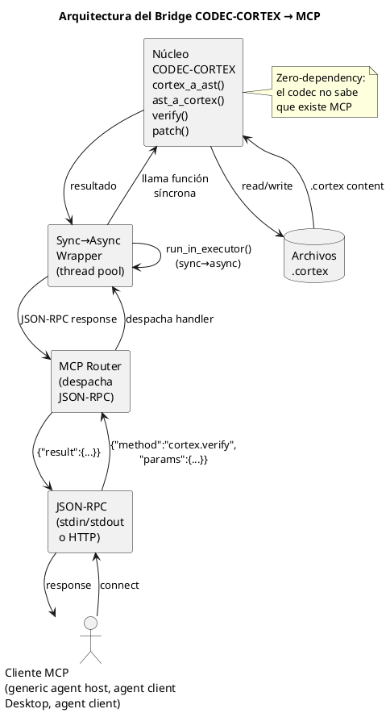
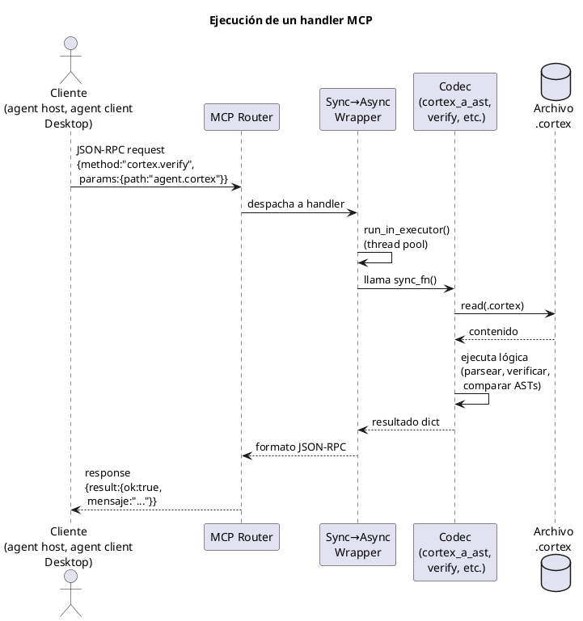

<!-- SPDX-FileCopyrightText: 2026 Fidel Ernesto Lozada A. -->
<!-- SPDX-License-Identifier: MIT -->

<p align="center">
  <strong>CODEC-CORTEX</strong> — Bridge SKILL → MCP Server
  <br>
  <sub>REFERENCE · v1.0.0 · MIT · <a href="../../../AUTHORS.md">Fidel Ernesto Lozada A.</a></sub>
</p>

---

> **STATUS NOTE:** This document is specification or design. Codec, CLI, runtime and MCP operations are planned or future unless STATUS.md marks them implemented now.

**Abstract:** Architectural design of the bridge between the CODEC-CORTEX SKILL and an MCP (Model Context Protocol) server. Includes a complete handler map with JSON-RPC schemas for the 18 codec operations, a sync→async wrapper with closure capture, execution flow diagrams, and a registration guide for agent clients.

|| | |
|---|---|---|
|| **Author** | Fidel Ernesto Lozada A. — Systems Engineer / MSc. Management Sciences |
|| **Repository** | [github.com/FidelErnesto03/codec-cortex](https://github.com/FidelErnesto03/codec-cortex) |
|| **License** | [MIT](../../../LICENSE) |
|| **Version** | 1.0.0 |
|| **Language** | [Español](../../es/specs/mcp-bridge.md) |

---

# Bridge SKILL → MCP Server for CODEC-CORTEX

## 1. Bridge Architecture
>
> **Status:** Design — implementation pending.
> **Future:** This design will become an implementation RE in a later cycle.
>
> Reference: `SKILL.md` — CLI commands and modules.
> Reference: `algoritmo.md` — core codec functions.

---

## 1. Bridge Architecture



### 1.1. Design Principles

1. **Zero-dependency in the core.** The MCP server imports the codec as a library; the codec does not know MCP exists.
2. **Thin handlers.** Each MCP handler is a ~10-20 line wrapper that validates input, calls the codec, and formats output.
3. **Bridge, not rewrite.** Do not rewrite the codec for MCP. The bridge adapts, it does not transform.
4. **Sync→Async mandatory.** Codec handlers are synchronous; MCP expects async. The wrapper captures closures correctly to avoid late-binding.

---

## 2. Handler Map

### 2.1. CLI → MCP Handler Mapping

| CLI Command | MCP Handler | Description |
|-------------|-------------|-------------|
| `cortex decode` | `cortex.decode` | Decode .cortex to YAML-Edit |
| `cortex encode` | `cortex.encode` | Encode context to .cortex |
| `cortex verify` | `cortex.verify` | Validate structure and glossary |
| `cortex patch_add` | `cortex.patch_add` | Add entry to section |
| `cortex patch_remove` | `cortex.patch_remove` | Remove entry by sigil+name |
| `cortex patch_update` | `cortex.patch_update` | Modify entry value |
| `cortex glossary_add` | `cortex.glossary_add` | Add sigil to $0 |
| `cortex glossary_remove` | `cortex.glossary_remove` | Remove sigil from $0 |
| `cortex glossary_update` | `cortex.glossary_update` | Modify sigil in $0 |
| — | `cortex.inspect` | Get full AST as JSON |
| — | `cortex.summary` | Summary of .cortex: sections, sigils, coverage |
| | `cortex.diagram_extract` | Extract PUML diagram from .cortex |
| | `cortex.diagram_list` | List available diagrams |
| | `cortex.diagram_validate` | Validate PUML syntax of a diagram |

### 2.2. Handler Map (MCP registration format)

```yaml
handlers:
  cortex.decode:
    description: "Decode a .cortex file to human-readable YAML-Edit. CALL when you need to inspect the full content of a .cortex in structured format."
    input_schema: cortex_decode_input
    output_schema: cortex_decode_output

  cortex.encode:
    description: "Encode structured context (YAML/JSON/text) to compressed .cortex format. CALL when you want to compress an agent state or context to .cortex."
    input_schema: cortex_encode_input
    output_schema: cortex_encode_output

  cortex.verify:
    description: "Validate structural integrity of a .cortex file. Planned handler; use after modifications to check structural roundtrip."
    input_schema: cortex_verify_input
    output_schema: cortex_verify_output

  cortex.patch_add:
    description: "Add a new entry (sigil:name{value}) to a .cortex section. CALL to add a new cognitive node. AUTO-CREATES the section if it doesn't exist."
    input_schema: cortex_patch_add_input
    output_schema: cortex_patch_add_output

  cortex.patch_remove:
    description: "Remove an entry by sigil+name from ALL sections of the .cortex. CALL to remove an obsolete cognitive node."
    input_schema: cortex_patch_remove_input
    output_schema: cortex_patch_remove_output

  cortex.patch_update:
    description: "Modify the value of an existing entry in the .cortex. CALL to update the state of a cognitive node (e.g., progress, status, result)."
    input_schema: cortex_patch_update_input
    output_schema: cortex_patch_update_output

  cortex.glossary_add:
    description: "Add a new sigil to the $0 glossary of the .cortex. CALL to extend the protocol vocabulary with a new custom sigil. FAILS if the sigil already exists."
    input_schema: cortex_glossary_add_input
    output_schema: cortex_glossary_add_output

  cortex.glossary_remove:
    description: "Remove a sigil from the $0 glossary of the .cortex. CALL to clean up unused sigils."
    input_schema: cortex_glossary_remove_input
    output_schema: cortex_glossary_remove_output

  cortex.glossary_update:
    description: "Modify the name and/or expansion of an existing sigil in the $0 glossary. CALL to correct or refine a sigil's definition."
    input_schema: cortex_glossary_update_input
    output_schema: cortex_glossary_update_output

  cortex.inspect:
    description: "Get the complete AST of a .cortex as structured JSON. CALL when you need to programmatically inspect the internal structure."
    input_schema: cortex_inspect_input
    output_schema: cortex_inspect_output

  cortex.summary:
    description: "Get a summary of the .cortex: number of sections, sigils per section, cognitive coverage. CALL for a quick diagnostic of a .cortex's state."
    input_schema: cortex_summary_input
    output_schema: cortex_summary_output
```

---

## 3. JSON-RPC Schemas

### 3.1. cortex.decode

```json
{
  "input": {
    "type": "object",
    "required": ["path"],
    "properties": {
      "path": {
        "type": "string",
        "description": "Path to the .cortex file"
      }
    }
  },
  "output": {
    "type": "object",
    "properties": {
      "yaml_edit": {
        "type": "string",
        "description": "Content in YAML-Edit format"
      },
      "meta": {
        "type": "object",
        "description": "File metadata (sections, total sigils)"
      },
      "ok": {
        "type": "boolean"
      }
    }
  }
}
```

### 3.2. cortex.encode

```json
{
  "input": {
    "type": "object",
    "required": ["content"],
    "properties": {
      "content": {
        "type": "string",
        "description": "Content in YAML-Edit, structured JSON, or text with sigils"
      },
      "format": {
        "type": "string",
        "enum": ["yaml", "json", "raw"],
        "description": "Input content format (default: raw)",
        "default": "raw"
      },
      "output_path": {
        "type": "string",
        "description": "Optional path where to write the resulting .cortex"
      }
    }
  },
  "output": {
    "type": "object",
    "properties": {
      "cortex": {
        "type": "string",
        "description": "Compiled .cortex content"
      },
      "tokens_estimate": {
        "type": "integer",
        "description": "Token estimate of the resulting .cortex"
      },
      "ok": {
        "type": "boolean"
      }
    }
  }
}
```

### 3.3. cortex.verify

```json
{
  "input": {
    "type": "object",
    "required": ["path"],
    "properties": {
      "path": {
        "type": "string",
        "description": "Path to the .cortex file to verify"
      },
      "strict": {
        "type": "boolean",
        "description": "If true, fails on warnings (missing glossary, etc.)",
        "default": false
      }
    }
  },
  "output": {
    "type": "object",
    "properties": {
      "ok": {
        "type": "boolean",
        "description": "True if the file is structurally valid"
      },
      "mensaje": {
        "type": "string",
        "description": "Descriptive message of the result"
      },
      "diff": {
        "type": "array",
        "items": {
          "type": "string"
        },
        "description": "Differences found (only if ok=false)"
      },
      "secciones": {
        "type": "integer",
        "description": "Number of sections found"
      },
      "sigilos": {
        "type": "integer",
        "description": "Total number of sigils"
      }
    }
  }
}
```

### 3.4. cortex.patch_add

```json
{
  "input": {
    "type": "object",
    "required": ["path", "sigilo", "nombre"],
    "properties": {
      "path": {
        "type": "string",
        "description": "Path to the .cortex file"
      },
      "section": {
        "type": ["integer", "string"],
        "description": "Target section (number or name, e.g., 3 or '3_WORKING_MEMORY'). If it doesn't exist, it is auto-created."
      },
      "sigilo": {
        "type": "string",
        "description": "Entry sigil (IDN, FCS, OBJ, etc.)"
      },
      "nombre": {
        "type": "string",
        "description": "Entry name"
      },
      "valor": {
        "type": "object",
        "description": "Key:value pairs of the content. Plain string for 'body' type."
      }
    }
  },
  "output": {
    "type": "object",
    "properties": {
      "path": {
        "type": "string",
        "description": "Path of the modified file"
      },
      "section_created": {
        "type": "boolean",
        "description": "True if the section was auto-created"
      },
      "ok": {
        "type": "boolean"
      }
    }
  }
}
```

### 3.5. cortex.summary — Output

```json
{
  "output": {
    "type": "object",
    "properties": {
      "path": {
        "type": "string"
      },
      "secciones": {
        "type": "integer"
      },
      "sigilos_por_seccion": {
        "type": "object",
        "additionalProperties": {
          "type": "integer"
        }
      },
      "total_sigilos": {
        "type": "integer"
      },
      "cobertura_cognitiva": {
        "type": "object",
        "properties": {
          "has_glosario": {"type": "boolean"},
          "has_fcs": {"type": "boolean"},
          "has_obj": {"type": "boolean"},
          "has_wrk": {"type": "boolean"},
          "has_ses": {"type": "boolean"},
          "has_lng": {"type": "boolean"},
          "has_axm": {"type": "boolean"},
          "has_cnst": {"type": "boolean"}
        }
      },
      "tokens_estimate": {
        "type": "integer"
      },
      "ok": {
        "type": "boolean"
      }
    }
  }
}
```

---

## 4. Sync→Async Wrapper

### 4.1. Problem

The codec functions (`cortex_a_ast()`, `ast_a_cortex()`, `verify()`) are **synchronous**. The handler registration in MCP expects **asynchronous** functions (that return `await`).

### 4.2. Generic Wrapper

```python
import asyncio
from functools import wraps

def async_wrapper(sync_fn):
    """
    Converts a synchronous function into an async MCP handler.
    Executes the synchronous function in a thread pool to avoid blocking
    the MCP event loop.
    """
    @wraps(sync_fn)
    async def wrapper(*args, **kwargs):
        loop = asyncio.get_event_loop()
        return await loop.run_in_executor(
            None,  # uses default ThreadPoolExecutor
            lambda: sync_fn(*args, **kwargs)
        )
    return wrapper
```

### 4.3. Handler Registration

```python
import codec_cortex
from mcp.server import Server

server = Server("cortex-bridge")

# Import codec functions
from codec_cortex import (
    cortex_a_ast, ast_a_cortex, ast_a_yaml_edit,
    yaml_edit_a_ast, verify,
    patch_add, patch_remove, patch_update,
    glossary_add, glossary_remove, glossary_update
)

# Register handlers with sync→async wrapper
server.add_handler({
    "name": "cortex.decode",
    "description": "Decode .cortex to YAML-Edit. CALL to inspect structured content.",
    "handler": async_wrapper(handle_decode),
})

server.add_handler({
    "name": "cortex.encode",
    "description": "Encode context to compressed .cortex. CALL to compress agent state.",
    "handler": async_wrapper(handle_encode),
})

# ... (register the 11 handlers)
```

### 4.4. Closure Capture (late-binding)

⚠️ **Critical pitfall:** When registering handlers in a loop, closures capture the last iteration.

```python
# ❌ WRONG — late-binding: all handlers point to the last function
handlers = ["decode", "encode", "verify"]
for h in handlers:
    server.add_handler({
        "name": f"cortex.{h}",
        "handler: async_wrapper(getattr(codec, h))  # OK — evaluates on each iteration
    })
```

**Rule:** Evaluate the binding on each iteration, not at the end of the loop. The wrapper must capture the reference at registration time.

---

## 5. MCP Server Registration

### 5.1. Server Configuration

```yaml
# mcp-servers/cortex-bridge/config.yaml
server:
  name: cortex-bridge
  version: 1.0.0
  description: "Future MCP server for CODEC-CORTEX contextual memory operations"
  transport: stdio  # or http for remote deployment

handlers:
  - name: cortex.decode
    enabled: true
  - name: cortex.encode
    enabled: true
  - name: cortex.verify
    enabled: true
  - name: cortex.patch_add
    enabled: true
  - name: cortex.patch_remove
    enabled: true
  - name: cortex.patch_update
    enabled: true
  - name: cortex.glossary_add
    enabled: true
  - name: cortex.glossary_remove
    enabled: true
  - name: cortex.glossary_update
    enabled: true
  - name: cortex.inspect
    enabled: true
  - name: cortex.summary
    enabled: true
  - name: cortex.diagram_extract
    enabled: true
  - name: cortex.diagram_list
    enabled: true
  - name: cortex.diagram_validate
    enabled: true
```

### 5.2. Integration with generic agent host

For generic agent host to automatically discover the handlers, register the server in the configuration:

```yaml
# ~/.hermes/config.yaml (fragment)
mcp_servers:
  cortex-bridge:
    command: python3
    args: ["-m", "cortex_bridge.server"]
    transport: stdio
```

### 5.3. Integration with desktop MCP client

```json
{
  "mcpServers": {
    "cortex-bridge": {
      "command": "python3",
      "args": ["-m", "cortex_bridge.server"],
      "transport": "stdio"
    }
  }
}
```

---

## 6. Handler Execution Flow



```
1. MCP Client sends JSON-RPC request
   {"jsonrpc":"2.0","method":"cortex.verify","params":{"path":"agent.cortex"},"id":1}

2. MCP Router receives and dispatches to the registered handler

3. Sync→Async Wrapper executes the synchronous function in a thread pool

4. Bridge handler:
   a. Validates input parameters against the schema
   b. Reads the .cortex file
   c. Calls codec_cortex.verify(content)
   d. Formats the result as a JSON-RPC response

5. MCP Router sends response
   {"jsonrpc":"2.0","result":{"ok":true,"mensaje":"Structurally equivalent",...},"id":1}
```

---

## 7. Security Considerations

| Aspect | Recommendation |
|---------|---------------|
| Path traversal | Validate that `path` does not escape the allowed directory (use `os.path.abspath` + prefix) |
| Concurrent writes | Use per-file locks: `threading.Lock` per absolute path |
| Large files | Limit .cortex size to 1MB (the format is dense; it only exceeds that size under abuse) |
| Sigil injection | Do not validate semantic content — the codec only validates structure. Sigils are just text |

---

## 8. Next Steps (Implementation)

1. **Phase 1:** Create the `cortex_bridge` package with the 11 wrapped handlers
2. **Phase 2:** Implement the MCP server (stdio + HTTP)
3. **Phase 3:** Register in agent clients
4. **Phase 4:** Integration tests: MCP client ↔ server ↔ codec
5. **Phase 5:** Usage documentation for developers

> This design will materialize as an implementation RE in a future cycle.
> For now, it is the architectural blueprint for when the time comes.
