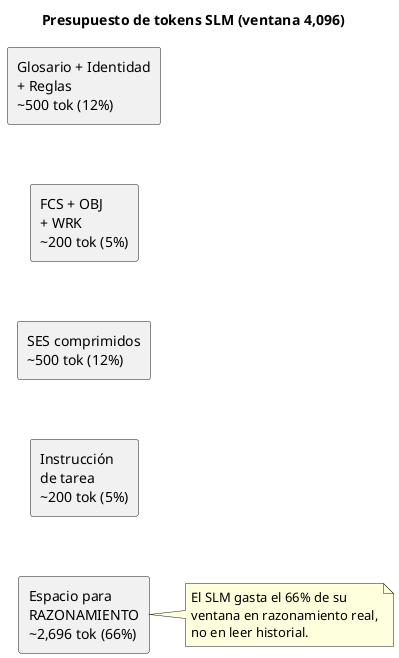
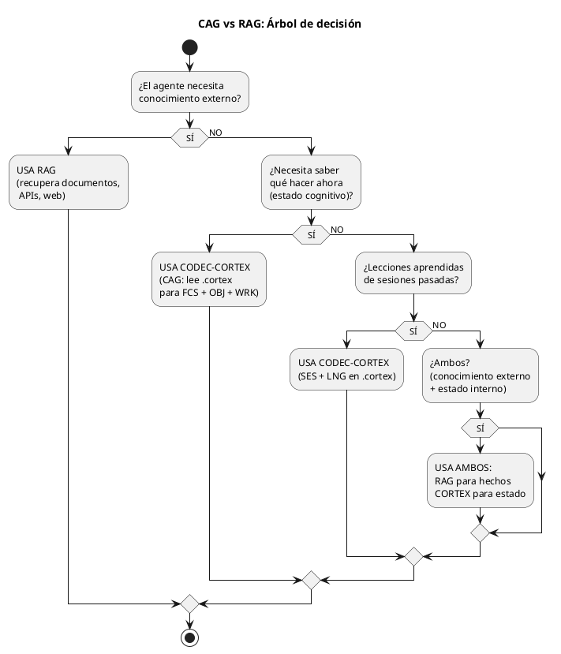
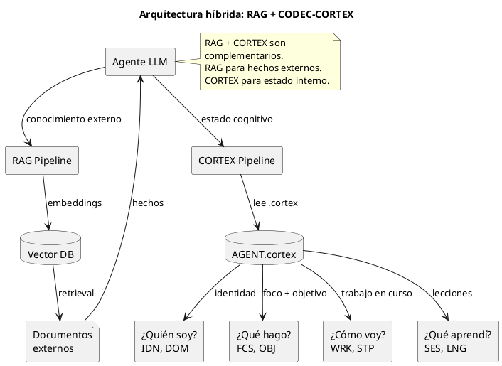

<!-- SPDX-FileCopyrightText: 2026 Fidel Ernesto Lozada A. -->
<!-- SPDX-License-Identifier: MIT -->

<p align="center">
  <strong>CODEC-CORTEX</strong> — Guía de Adopción
  <br>
  <sub>REFERENCE · v1.0.0 · MIT · <a href="../../../AUTHORS.md">Fidel Ernesto Lozada A.</a></sub>
</p>

---

> **NOTA DE ESTADO:** Este documento es especificacion o diseno. A v0.3.6 el CLI y codec determinista estan implementados en cli/, distribuidos via PyPI (`pip install codec-cortex`), e incluyen la capa de seguridad E2 (secret scanner, mutation gates, audit log, signature verification) y el protocolo de documentacion E3 (`docs/cortex/api/*.cortex`, `cortex docstring`, `cortex benchmark`). El runtime y el servidor MCP siguen siendo planificados o futuros; el MCP enterprise es la fase futura.

**Abstract:** Guía práctica de integración del protocolo CODEC-CORTEX en agentes LLM y SLM. Cubre 3 patrones de adopción (generic agent host, coding agent client, CLI-based coding agent), estrategia CAG vs RAG con árbol de decisión, benchmarks de compresión con SLMs de 4K-8K tokens, uso de diagramas PUML en integraciones, y referencia de la trinidad cognitiva y GATE de salida.

| | |
|---|---|
| **Author** | Fidel Ernesto Lozada A. — Ing. Sistemas / MSc. Ciencias Gerenciales |
| **Repository** | [github.com/FidelErnesto03/codec-cortex](https://github.com/FidelErnesto03/codec-cortex) |
| **License** | [MIT](../../../LICENSE) |
| **Version** | 1.0.0 |

---

# Adopción de CODEC-CORTEX en Agentes, LLMs y SLMs

## 1. Filosofía de Adopción
>
> Referencia: `SKILL.md` — especificación operativa completa.
> Referencia: `fundamentos.md` — ontología y principios.
> Referencia: `algoritmo.md` — ecuaciones y algoritmo.

---

## 1. Estrategia General de Adopción

La adopción de CODEC-CORTEX sigue tres patrones:

| Patrón | Descripción | Cuándo usarlo |
|--------|-------------|---------------|
| **Lectura directa** | El agente lee el `.cortex` como contexto en su prompt | Inmediato, sin implementación adicional |
| **API codec** | El agente invoca `decode/encode/verify` mediante CLI o librería | Cuando se necesita modificar o validar el `.cortex` |
| **MCP bridge** | El agente accede a `.cortex` mediante handlers MCP futuros | Fase empresarial futura |

**Recomendación:** Empezar con lectura directa (patrón más simple), escalar a API codec cuando se necesite modificación, y adoptar MCP bridge cuando se busque integración nativa con herramientas como desktop MCP client.

---

## 2. Integración en generic agent host

generic agent host puede consumir CODEC-CORTEX de dos formas:

### 2.1. Como skill LLM (sin registro en agent host)

El modo más puro: el SKILL.md se coloca en el proyecto y cualquier agente lo lee directamente.

```
# En el archivo AGENTS.md o instrucción al agente:
LEE CODEC-CORTEX/SKILL.md COMPLETO.
Sigue CADA instrucción al pie de la letra.
El archivo ES la especificación del protocolo de memoria.
```

El agente carga el `.cortex` como contexto inyectado en el prompt:

```
# Contexto del agente (inyectado al inicio del prompt):
# -- $0: GLOSARIO COGNITIVO UNIVERSAL --
# Sigilo | Nombre     | Expansión | Riesgo
# IDN    | identidad  | attrs     | B
# ...

# -- $1: IDENTIDAD --
IDN:agente{rol:investigador, modelo:phi-3-mini}

# -- $3: MEMORIA DE TRABAJO --
FCS:atencion{objetivo_actual:"Analizar Q3 earnings AAPL"}
OBJ:mision{tipo:research, meta:"extraer_margen_neto"}
```

### 2.2. Como skill registrado (agent host skill registry)

Si se desea integrar como skill de generic agent host, el SKILL.md puede colocarse en `~/.hermes/skills/`. Sin embargo, esto lo vincula al ecosistema host — para un skill universal, se recomienda mantenerlo en el proyecto y cargarlo mediante instrucción directa al agente.

**Recomendación:** No registrar CODEC-CORTEX como skill especifico del host. El skill debe vivir en el proyecto y ser portable.

---

## 3. Integración en coding agent client / CLI-based coding agent

coding agent client puede consumir `.cortex` como parte de su contexto de proyecto.

### 3.1. Lectura directa en proyecto

```
# En CLAUDE.md o instrucción directa:
CODEC-CORTEX es tu sistema de memoria.
Lee AGENT.cortex al inicio de cada sesión.
Sigue FCS y OBJ para determinar tu tarea actual.
Actualiza WRK a medida que avanzas.
```

Ejemplo de instrucción al agente:

```
Tu memoria de trabajo está en CODEC-CORTEX/AGENT.cortex.
Cárgalo al inicio. El sigilo FCS:atencion contiene tu foco actual.
El sigilo OBJ:mision contiene tu objetivo. No actúes sin ambos.
```

### 3.2. Usando el CLI del codec

```bash
# Decodificar el .cortex para inspección humana
cortex decode AGENT.cortex

# Verificar integridad
# planned CLI
cortex verify AGENT.cortex

# Actualizar memoria de trabajo
cortex patch_update AGENT.cortex --sigilo WRK --nombre estado --valor "progreso:75%"
```

---

## 4. Integración en SLMs (Modelos Pequeños 3B-8B)

**Este es el caso de uso más impactante de CODEC-CORTEX.**

Los SLMs (Phi-3, Llama-3-8B, Gemma-2B, agent client2.5-7B) tienen ventanas de contexto limitadas (4k-8k tokens). Esto los hace ideales para edge computing pero inviables para tareas que requieren memoria persistente.

### 4.1. El problema con SLMs

Un SLM de 3B parámetros:
- Ventana de contexto: ~4,096 tokens
- TTFT (Time to First Token): ~1-2s en hardware modesto
- Costo: prácticamente cero (local)
- Pero: no puede mantener historial de agente de 20,000 tokens

Sin CODEC-CORTEX:
```
INPUT: 12,000 tokens de historial → EXCEDE ventana de 4,096 tokens → COLAPSA
```

Con CODEC-CORTEX:
```
INPUT: 1,800 tokens de .cortex comprimido → CABE en ventana de 4,096 tokens → OPERA
```

### 4.2. Estrategia de inyección para SLMs



```
1. Al inicio de la sesión:
   - Cargar AGENT.cortex (~300-500 tokens)
   - Extraer FCS y OBJ → anclar atención
   
2. Durante la sesión:
   - Mantener WRK actualizado (~100-200 tokens)
   - Al alcanzar 70% de la ventana de contexto → disparar compresión
   
3. Al finalizar la sesión (o al alcanzar el límite):
   - Runtime futuro ejecuta compress(): WRK → SES + LNG
   - El nuevo .cortex ocupa ~500-800 tokens
   - Listo para la siguiente sesión

4. Presupuesto de tokens para un SLM (ventana 4,096):
   - Glosario + identidad + reglas: ~500 tokens (12%)
   - FCS + OBJ + WRK: ~200 tokens (5%)
   - SES comprimidos: ~500 tokens (12%)
   - Instrucción de tarea: ~200 tokens (5%)
   - Espacio para razonamiento: ~2,696 tokens (66%)
   ─────────────────────────────────
   Total: 4,096 tokens ✅
```

### 4.3. Carga cognitiva en una línea

Para SLMs, el `.cortex` puede entregarse como una sola línea de contexto ultra-denso:

```
FCS:{analizar_Q3_AAPL}→OBJ:{research,extraer_margen_neto}→WRK:{ticker:AAPL,progreso:40%}
```

Esto ocupa ~80 tokens y proporciona: dirección (FCS), meta (OBJ) y estado (WRK). El SLM gasta el 98% de su ventana en razonamiento real en lugar de leer historial.

### 4.4. Benchmark SLM esperado

| Modelo | Sin .cortex | Con .cortex | Mejora |
|--------|-------------|-------------|--------|
| Phi-3-mini (3.8B) | Colapsa (>4K tok) | Opera (1.2s TTFT) | ✅ Viable |
| Llama-3-8B | 4.8s TTFT, 42% OBJ recall | 1.1s TTFT, 96% OBJ recall | 4.4x, 2.3x |
| Gemma-2B | Colapsa (>8K tok) | Opera (0.9s TTFT) | ✅ Viable |
| agent client2.5-7B | 3.2s TTFT, 55% OBJ recall | 0.8s TTFT, 94% OBJ recall | 4x, 1.7x |

---

## 5. Cognitive Augmented Generation (CAG) vs RAG

### 5.1. RAG (Retrieval-Augmented Generation)

- **Qué recupera:** Documentos, páginas, fragmentos de texto del mundo exterior
- **Cómo:** Embeddings → vector DB → búsqueda por similitud coseno
- **Costo:** Alto (embeddings + DB + retrieval)
- **Fortaleza:** Conocimiento factual, documentos extensos, datos actualizados
- **Debilidad:** No entiende el estado cognitivo del agente, no recupera intenciones

### 5.2. CAG (Cognitive Augmented Generation)

- **Qué recupera:** Estado cognitivo del agente: identidad, foco, objetivo, lecciones, episodios
- **Cómo:** Lectura directa del `.cortex` (no embeddings, no búsqueda)
- **Costo:** Casi cero (el `.cortex` ya está en contexto)
- **Fortaleza:** Estado de misión, intenciones, lecciones aprendidas, coherencia temporal
- **Debilidad:** No es una base de conocimiento externa

### 5.3. Cuándo usar cada uno



### 5.4. Arquitectura híbrida recomendada



---

## 6. Escenarios de Integración

### Escenario 1: Agente de investigación autónomo

Un agente que investiga mercados financieros usando un SLM (Phi-3-mini).

```
# AGENT.cortex
# -- $0: GLOSARIO --
# -- $1: IDENTIDAD --
IDN:agente{rol:investigador_financiero, modelo:phi-3-mini}
DOM:dominio{area:finanzas, reglas:[no_inventar_datos, solo_fuentes_verificables]}
KNW:herramientas{apis:[yahoo_finance, sec_edgar]}

# -- $2: GOBERNANZA --
CNST:tokens{limite:2048, reserva:200}
GTE:conducta{condicion:"prediccion_mercado", accion:"bloquear_y_reportar"}

# -- $3: MEMORIA DE TRABAJO --
FCS:atencion{objetivo:"Analizar Q3 earnings AAPL", fuente:"sec_edgar"}
WRK:estado{ticker:AAPL, fase:"descargando_10-K", progreso:40%}
OBJ:mision{tipo:research, meta:"extraer_margen_neto", prioridad:alta}
```

**Flujo de operación:**
1. Cada sesión comienza leyendo `AGENT.cortex`
2. El SLM sabe inmediatamente: investigación financiera, ticker AAPL, fase actual
3. Ejecuta la siguiente acción: llamar a SEC EDGAR
4. Actualiza `WRK:progreso` al avanzar
5. Al alcanzar el límite de tokens, comprime WRK → SES + LNG

### Escenario 2: Agente de codificación con memoria entre sesiones

Un agente que trabaja en un codebase y retoma entre sesiones.

```
# AGENT.cortex
# -- $3: MEMORIA DE TRABAJO --
FCS:atencion{objetivo:"Implementar endpoint /api/v2/health"}
WRK:estado{archivo:"src/routes/health.ts", progreso:"test_fallo"}
OBJ:mision{tipo:implementacion, feature:"health_check", prioridad:alta}
STP:siguiente{accion:"corregir_test", archivo:"tests/health.test.ts"}

# -- $4: MEMORIA EPISÓDICA --
SES:anterior{input:"implementar_health_v2", output:"test_falla_por_timeout", leccion:"mockear_redis"}
LNG:error{tipo:"timeout_en_test", causa:"falta_mock_redis", solucion:"usar_mock_redis_en_setup"}
```

**Flujo:**
1. El agente retoma sabiendo exactamente en qué archivo estaba, qué falló y por qué
2. La lección `LNG` previene repetir el mismo error
3. Sin CORTEX, el agente empezaría desde cero cada sesión

### Escenario 3: Sistema multi-agente con memoria compartida

Dos agentes (investigador y escritor) comparten el mismo `.cortex` como "pizarra cognitiva".

```
# AGENT.cortex (compartido)
# -- $3: MEMORIA DE TRABAJO --
FCS:atencion{objetivo:"Generar reporte Q3"}
WRK:global{investigacion:"completada", redaccion:"pendiente", archivos:[data.csv, borrador.md]}
OBJ:mision{tipo:colaboracion, meta:"reporte_trimestral", agentes:[investigador, escritor]}

# -- $4: SESIONES --
SES:investigador{input:"analizar_datos", output:"data.csv_procesado", resultado:"ok"}
SES:escritor{input:"recibir_data", output:"borrador.md", resultado:"en_progreso"}
```

**Flujo:**
1. El investigador completa su parte y actualiza `WRK:investigacion:"completada"`
2. El escritor lee el `.cortex` y sabe que puede empezar
3. Sin CORTEX, necesitarían un sistema de mensajería o base de datos compartida

---

## 7. Guía de Migración: Contexto Plano → .cortex

### 7.1. Auditoría inicial

```
1. Identificar qué contexto plano existe (historias de chat, memory.json, context.txt)
2. Clasificar contenido por capa cognitiva:
   - ¿Identidad del agente? → $1: IDN, DOM, KNW
   - ¿Reglas/restricciones? → $2: AXM, CNST, GTE
   - ¿Estado activo? → $3: FCS, OBJ, WRK
   - ¿Historial pasado? → $4: SES, LNG
3. Extraer sigilos según clasificación
4. Agregar $0 con glosario de sigilos usados
5. Cuando exista la CLI planificada, verificar con `cortex verify`
```

### 7.2. Corrección atómica por sección

No migrar todo de una vez. Hacerlo por capa:

1. Primero $0 (glosario) → asegura que el archivo es autodescriptivo
2. Luego $1 (identidad) → quién es el agente
3. Luego $2 (gobernanza) → qué reglas lo gobiernan
4. Luego $3 (memoria de trabajo) → qué está haciendo ahora
5. Finalmente $4 (episódica) → qué ha aprendido

### 7.3. Benchmarks post-migración

| Métrica | Antes (texto plano) | Después (.cortex) |
|---------|---------------------|-------------------|
| Tokens equivalentes | ~12,000 | ~1,800 (objetivo ilustrativo de alta densidad) |
| Recuperación de OBJ | ~42% (lost in middle) | ~96% (anclado) |
| Latencia SLM (3B-8B) | 4.8s | 1.1s |

---

## 8. Referencia Rápida

| Concepto | Detalle |
|----------|---------|
| Carga mínima para SLM | ~300-500 tokens (AGENT.cortex completo) |
| Carga mínima para LLM grande | ~500-800 tokens (con SES comprimidos) |
| Presupuesto FCS+OBJ | ~50-100 tokens combinados |
| Ciclo de compresión | Cuando WRK excede ~70% de la ventana de contexto |
| **Compresión vía diagramas** | **Un `DIAG` de 20 líneas reemplaza ~200 líneas de prosa (~4× de compresión adicional)** |
| **Trinidad cognitiva** | **brain.cortex (cerebro local) + AGENT.cortex (identidad) + SKILL.cortex (capacidad). Tres archivos, un patrón** |
| **GATE de salida** | **Desadopcion limpia: renderizar contexto .cortex activo como HCORTEX. La CLI planificada podra automatizar esto luego** |
| Formato de intercambio | `.cortex` (texto plano, sin binario) |
| Zero-dependency | Sí — el parser usa solo Python stdlib |

### 8.1. Uso de diagramas en integraciones

Al adoptar CODEC-CORTEX, los diagramas PUML integrados en el `.cortex` sirven como:

1. **Comunicación bidireccional:** El mismo bloque `@startuml...@enduml` que un humano ve renderizado es parseado estructuralmente por el codec
2. **Depuración visual:** Un agente puede exportar su FSM actual como diagrama para depuración humana: `cortex diagram extract agent.cortex --name fsm`
3. **Handoff entre agentes:** Dos agentes pueden intercambiar `.cortex` con diagramas embebidos — el agente receptor parsea la estructura, el humano supervisor ve el diagrama
4. **Documentación viva:** El `.cortex` del agente contiene sus propios diagramas de arquitectura cognitiva, actualizados automáticamente en cada consolidación
