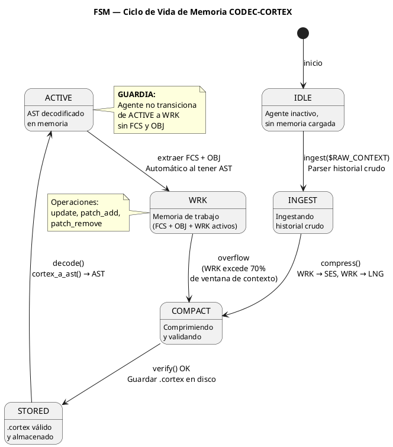
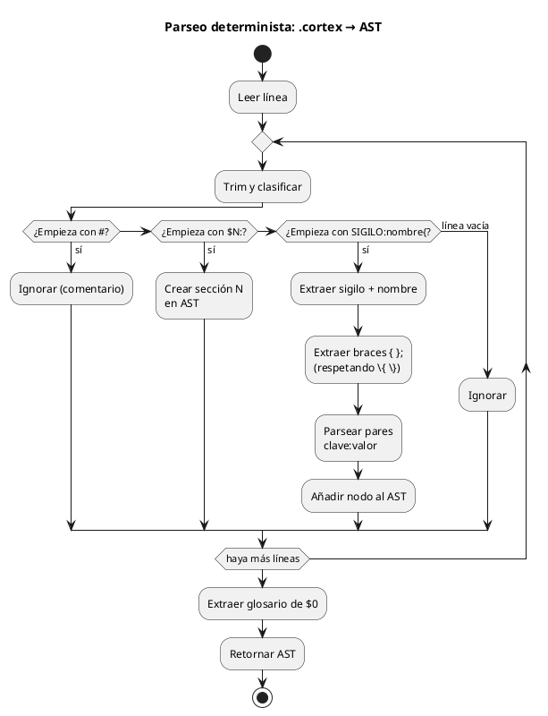
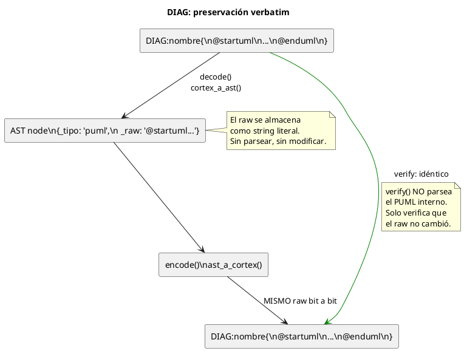
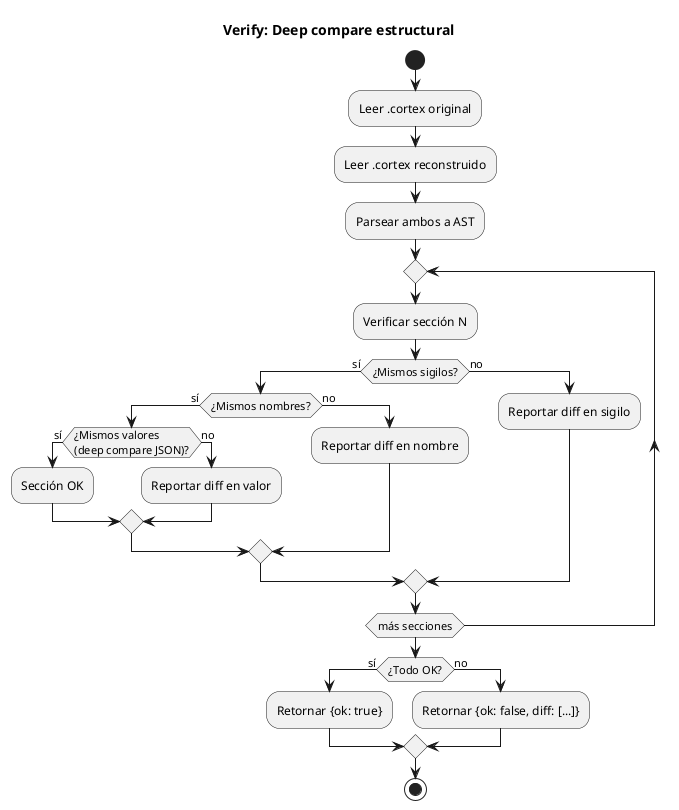
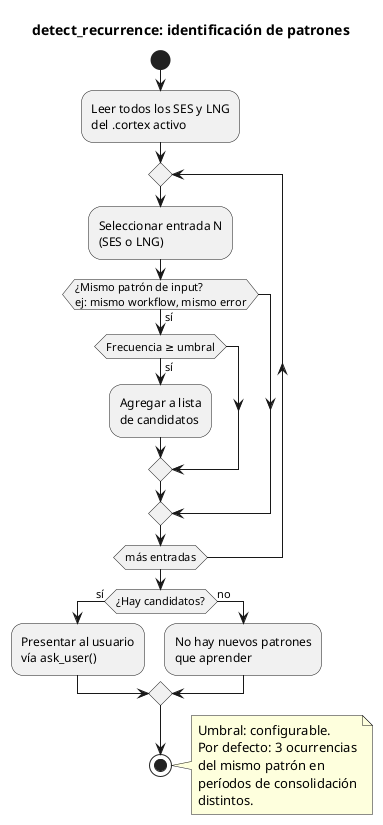
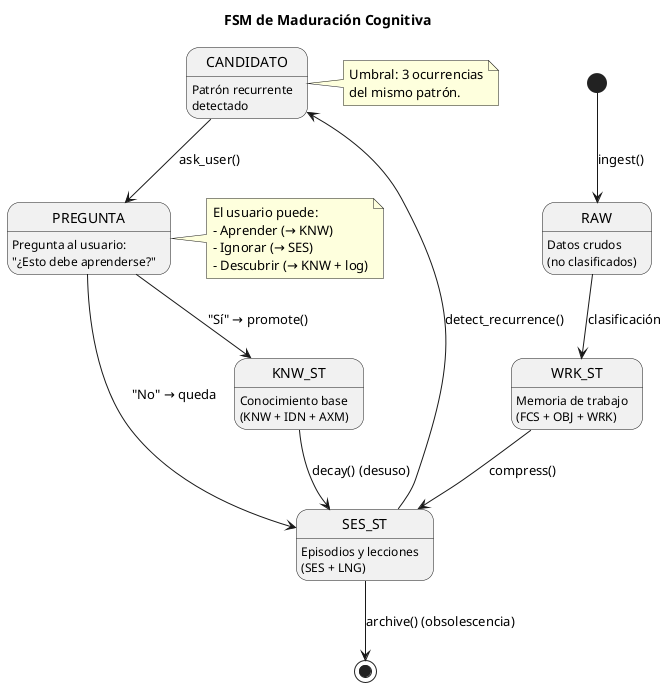
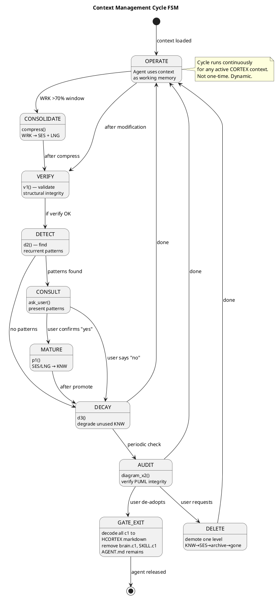

<!-- SPDX-FileCopyrightText: 2026 Fidel Ernesto Lozada A. -->
<!-- SPDX-License-Identifier: MIT -->

<p align="center">
  <strong>CODEC-CORTEX</strong> — Fórmula y Algoritmo Determinista
  <br>
  <sub>REFERENCE · v1.0.0 · MIT · <a href="../../../AUTHORS.md">Fidel Ernesto Lozada A.</a></sub>
</p>

---

> **NOTA DE ESTADO:** Este documento es especificacion o diseno. Las operaciones de codec, CLI, runtime y MCP son planificadas o futuras salvo que STATUS.md indique implementacion actual.

**Abstract:** Ecuaciones de densidad cognitiva, máquina de estados del ciclo de vida de memoria, algoritmo de parseo determinista (autómata de caracteres de 6 estados), deep compare estructural, parseo de bloques PUML verbatim, y algoritmos del motor de maduración (detect_recurrence, promote, decay). Incluye la distribución áurea de tokens (φ=1.618) entre capas cognitivas y el ciclo de gestión de contextos con GATE de salida.

| | |
|---|---|
| **Author** | Fidel Ernesto Lozada A. — Ing. Sistemas / MSc. Ciencias Gerenciales |
| **Repository** | [github.com/FidelErnesto03/codec-cortex](https://github.com/FidelErnesto03/codec-cortex) |
| **License** | [MIT](../../../LICENSE) |
| **Version** | 1.0.0 |

---

# Fórmula y Algoritmo Determinista de CODEC-CORTEX

## 1. Ecuaciones de Densidad Cognitiva
> Define las ecuaciones formales de densidad cognitiva, la máquina de estados del ciclo de vida, el algoritmo de parseo determinista (sin LLM), y el mecanismo de deep compare para verificación estructural.
>
> Referencia: `SKILL.md` — especificación operativa completa.
> Referencia: `fundamentos.md` — ontología, axiomas y principios.

---

## 1. Ecuaciones de Densidad Cognitiva

### 1.1. Factor de Compresión Estructural (C)

```
C = (S_raw - S_cortex) / S_raw
```

Donde:
- `C` = Factor de compresión estructural (0 = sin compresión, 1 = compresión total)
- `S_raw` = Tamaño del contexto en tokens en formato texto plano / YAML / JSON
- `S_cortex` = Tamaño del mismo contexto en formato `.cortex` compilado

**Objetivo:** alta densidad contextual. Cualquier reduccion numerica requiere benchmark reproducible.

**Ejemplo:** Un historial de agente de 12,000 tokens en texto plano → 1,800 tokens en `.cortex`:
```
C = (12000 - 1800) / 12000 = 0.85
```

**Interpretación:** Cada token en `.cortex` transporta ~6.7× más información semántica que un token en texto plano. Esto no es magia — es la eliminación de ruido verbal, la compactación de notación, y la estructura jerárquica que elimina repeticiones.

### 1.2. Retención de Atención vs Posición (A)

```
A = T_atención × (1 - L_pos)
```

Donde:
- `A` = Retención de atención efectiva (0-1)
- `T_atención` = Capacidad atencional del modelo en la posición (decrece hacia el centro)
- `L_pos` = Posición relativa en el contexto (0 = inicio, 1 = final)

**En contexto plano:** La función de atención de un Transformer decae significativamente hacia el centro del contexto (*Lost in the Middle*). Para un documento de 32k tokens, la recuperación de información en la posición 50% puede caer al 40%.

**En contexto `.cortex`:** `FCS` y `OBJ` se posicionan en `L_pos ≈ 0.05` (primer 5% del contexto). Con `T_atención ≈ 0.98` en esa posición:
```
A = 0.98 × (1 - 0.05) = 0.93
```

**Benchmark esperado:** Recuperación de `OBJ` ≥ 96% en contexto de 32k tokens equivalentes (vs ~42% en texto plano).

### 1.3. Densidad Semántica por Token (D)

```
D = Σ(KNW_i × SES_j) / T_max
```

Donde:
- `D` = Densidad semántica (información útil por token máximo)
- `KNW_i` = Peso del ítem de conocimiento i (0-1, según relevancia para la tarea actual)
- `SES_j` = Peso del episodio j (0-1, según recencia y relevancia)
- `T_max` = Límite de tokens del modelo (ej: 4096 para un SLM)

**Interpretación:** `D` mide cuánta información *útil* cabe en el límite de tokens del modelo. Un `D` alto significa que el modelo recibe máxima señal con mínimo ruido. El formato `.cortex` maximiza `D` porque elimina ruido verbal y prioriza la información por capa cognitiva.

### 1.4. Punto de Equilibrio (P)

```
P_equilibrio: C target: high density → a partir de la 2da iteración se recupera la inversión
```

**Demostración:**

Sea:
- `T_raw` = 12,000 tokens (contexto en texto plano)
- `T_cortex` = 1,800 tokens (mismo contexto en `.cortex`)
- `C` = 0.85 (compresión)

Por iteración:
- Costo raw: 12,000 tokens de input
- Costo `.cortex`: 1,800 tokens de input

Ahorro por iteración: 12,000 - 1,800 = 10,200 tokens

**Costo de compilación inicial:** La primera compilación cuesta procesar los 12,000 tokens para generar el `.cortex`. A partir de la segunda iteración, el costo es solo 1,800 tokens.

```
Iteración 1: 1,800 (compilar) + 1,800 (leer) = 3,600 tokens  (vs 12,000 raw)
Iteración 2: 0 (no re-compilar) + 1,800 (leer) = 1,800 tokens  (vs 12,000 raw)
...
Iteración N: 1,800 tokens  (vs 12,000 raw)
```

El punto de equilibrio donde se recupera la inversión de compilación es en la **segunda iteración**. A partir de ahí, todo es ganancia neta.

### 1.5. Ecuación de Ahorro Acumulado (A_total)

```
A_total = T_raw × N - (T_cortex + T_compilación + T_cortex × (N - 1))
```

Simplificado para `T_compilación = T_cortex` (una lectura del raw para compilar):
```
A_total = T_raw × N - T_cortex × (N + 1)
```

Para N = 10 iteraciones con T_raw = 12,000, T_cortex = 1,800:
```
A_total = 12000 × 10 - 1800 × 11
        = 120,000 - 19,800
        = 100,200 tokens ahorrados
```

Eso es **83.5% de ahorro acumulado** sobre 10 iteraciones.

### 1.6. Distribución Áurea de Tokens (Φ)

La distribución de tokens entre capas cognitivas sigue la proporción áurea φ = 1.618:

```
layer_tokens(i) = (F(i+1) / ΣF) × T_total

Donde:
  F(i+1) = (i+2)-ésimo número de Fibonacci (F2=1, F3=2, F4=3, F5=5, F6=8, F7=13, F8=21)
  ΣF     = 53 (suma de pesos Fibonacci para 7 capas)
  T_total = tokens totales de la ventana de contexto

layer_ratio(i, i-1) = F(i+1) / F(i) → φ (converge a 1.618 para i grandes)
```

| Capa | Fib | Peso | T=4096 | T=128K | Ratio con capa anterior |
|------|-----|:----:|:------:|:------:|:--:|
| $0 Glossary | F2=1 | 1.9% | 77 | 2,415 | — |
| $1 Identity | F3=2 | 3.8% | 155 | 4,830 | 2.0 |
| $2 Rules | F4=3 | 5.7% | 232 | 7,245 | 1.5 |
| $3 Working | F5=5 | 9.4% | 386 | 12,075 | 1.67 |
| $4 Episodic | F6=8 | 15.1% | 618 | 19,321 | 1.6 |
| $5 Diagrams | F7=13 | 24.5% | 1,005 | 31,396 | 1.625 |
| $6 Knowledge | F8=21 | 39.6% | 1,623 | 50,717 | 1.615 |

**Propiedad:** El ratio entre capas consecutivas converge a φ. La información se distribuye de forma que cada capa superior recibe ~1.618× más tokens que la inferior inmediata, maximizando la densidad semántica por token disponible.

---

## 2. Máquina de Estados del Ciclo de Vida (FSM)

El ciclo de vida de la memoria del agente sigue una máquina de estados determinista:



### 2.1. Estados

| Estado | Descripción | Acción permitida |
|--------|-------------|------------------|
| `IDLE` | Agente inactivo, sin memoria cargada | `ingest` |
| `INGEST` | Ingestando historial crudo | `compress` |
| `COMPACT` | Memoria comprimida, validando | `verify` |
| `STORED` | `.cortex` válido y almacenado | `decode` |
| `ACTIVE` | Memoria decodificada en AST activo | — |
| `WRK` | Agente operando con memoria de trabajo | `update`, `patch_add`, `overflow` |

### 2.2. Transiciones

| Transición | Condición | Acción | Efecto |
|------------|-----------|--------|--------|
| `IDLE → INGEST` | Comando `ingest($RAW_CONTEXT)` | Parsear historial crudo y extraer sigilos | RAW_CONTEXT se estructura como AST preliminar |
| `INGEST → COMPACT` | Comando `compress()` | Ejecutar compresión episódica (WRK→SES, WRK→LNG) | WRK se destila a SES+LNG; ruido se descarta |
| `COMPACT → STORED` | `verify()` pasa | Guardar AST como `.cortex` | Archivo `.cortex` válido en disco |
| `STORED → ACTIVE` | Comando `decode()` | `cortex_a_ast()` → AST en memoria | AST listo para consulta |
| `ACTIVE → WRK` | Automática al tener AST | Extraer `FCS`, `OBJ`, `WRK` como estado activo | Agente puede comenzar a trabajar |
| `WRK → COMPACT` | `overflow` (WRK excede límite de tokens) | Ejecutar `compress()` automáticamente | Memoria de trabajo se colapsa en episódica |

### 2.3. Regla de Guardia

```
GUARDIA: El agente no transiciona de ACTIVE a WRK si no existen FCS y OBJ.
ACCIÓN:  Si faltan → HALT_AND_REPORT("FCS y OBJ requeridos en memoria de trabajo")
```

Esta guardia es la protección más importante del protocolo. Sin foco y objetivo, el agente opera sin dirección — lo que en contexto plano sería "deriva atencional".

---

## 3. Algoritmo de Parseo Determinista



El parseo de `.cortex` a AST se implementa como una **máquina de estados de caracteres** — no usa regex, no usa LLM, no usa parsers externos.

### 3.1. Gramática Formal

```
archivo     := seccion+
seccion     := '$' DIGITO+ WS ':' WS NOMBRE WS? '--'? '\n' linea*
linea       := (comentario | sigilo | blank)
comentario  := '#' .* '\n'
blank       := WS* '\n'
sigilo      := SIGILO ':' NOMBRE '{' contenido '}' '\n'
SIGILO      := [A-Z!→]+
NOMBRE      := [a-zA-Z0-9_-]+
contenido   := pares (',' pares)*
pares       := ID ':' VALOR
ID          := [a-zA-Z0-9_-]+
VALOR       := (string | numero | lista)
lista       := '[' item (',' item)* ']'
item        := string
string      := '"' [^"]* '"' | [^,{}\n]+
numero      := DIGITO+ ('.' DIGITO+)?
WS          := ' ' | '\t'
DIGITO      := '0'..'9'
```

### 3.2. Parser: Algoritmo Lineal

```
FUNCIÓN cortex_a_ast(contenido: str) → {ast: dict, glosario: dict, meta: dict}

1. INICIALIZAR
   ast = {}           // diccionario sección → lista de entradas
   glosario = {}      // sigilo → {nombre, expansion, riesgo}
   meta = {}          // metadatos del archivo
   seccion_actual = None
   i = 0              // posición actual en el string

2. PROCESAR LÍNEA POR LÍNEA
   PARA cada línea en splitlines(contenido):
       línea = trim_end(linea)
       
       SI línea empieza con '#':
           CONTINUAR (comentario)
       
       SI línea =~ /^\$\d+:/
           seccion_actual = extraer_seccion_id(linea)
           ast[seccion_actual] = []
           CONTINUAR
       
       SI línea =~ /^[A-Z!→]+:/
           sigilo = extraer_sigilo(linea)
           nombre = extraer_nombre(linea)
           valor = extraer_braces(linea)  // contenido entre { }
           IF valor:
               pares = parsear_pares(valor)
               ast[seccion_actual].append({
                   't': 'sigilo',
                   's': sigilo,
                   'n': nombre,
                   'v': pares
               })
       
       SI línea ES blank:
           CONTINUAR

3. EXTRAER GLOSARIO de $0
   SI '0' in ast:
       glosario = parsear_glosario(ast['0'])
       eliminar '0' de ast

4. RETORNAR
   {ast: ast, glosario: glosario, meta: meta}
```

### 3.3. Extracción de Llaves (Braces)

```
FUNCIÓN extraer_braces(linea: str) → str | None

1. ENCONTRAR posición del primer '{'
   SI no hay → RETORNAR None

2. ENCONTRAR posición del '}' correspondiente
   balance = 0
   PARA cada char desde posición+1:
       SI char == '{' Y char PREVIO != '\': balance += 1
       SI char == '}' Y char PREVIO != '\':
           SI balance == 0: RETORNAR substring(posición+1, char_pos)
           SI balance > 0: balance -= 1
   
3. SI no se encuentra '}': LANZAR BraceError(linea, posición)

REGLA DE ESCAPE:
   \{  →  {  (literal)
   \}  →  }  (literal)
   \\  →  \  (literal)
```

### 3.4. Parseo de Pares Clave-Valor

```
FUNCIÓN parsear_pares(valor: str) → dict

1. INICIALIZAR
   resultado = {}
   i = 0

2. PARA cada segmento separado por ',' (respetando comillas y llaves):
       segmento = trim(segmento)
       SI ':' en segmento:
           key = trim(parte_antes_de(':'), segmento)
           val = trim(parte_despues_de(':'), segmento)
           
           SI val empieza con '[':
               resultado[key] = parsear_lista(val)
           SI val empieza con '"':
               resultado[key] = string_sin_comillas(val)
           SINO:
               resultado[key] = val  // string o número
       SINO:
           resultado[segmento] = True  // flag booleano

3. RETORNAR resultado
```

### 3.5. Compilador (Encode)

```
FUNCIÓN ast_a_cortex(ast_data: dict) → str

1. INICIALIZAR
   lineas = []

2. GLOSARIO
   SI hay glosario:
       lineas.append("$0: GLOSARIO --")
       lineas.append(...formatear_tabla_glosario...)
       lineas.append("")

3. SECCIONES
   PARA cada (seccion_id, entradas) en ast_data['ast'].items():
       lineas.append(f"# -- ${seccion_id}: {nombrar_seccion(seccion_id)} --")
       PARA cada entrada en entradas:
           SI entrada['t'] == 'sigilo':
               valor_str = formatear_pares(entrada['v'])
               lineas.append(f"{entrada['s']}:{entrada['n']}{{{valor_str}}}")
       lineas.append("")

4. RETORNAR join(lineas, '\n')
```

### 3.6. Parseo de Bloques PUML (DIAG)

Los bloques `@startuml...@enduml` dentro de sigilos `DIAG` se almacenan como tipo `bloque` — **verbatim, sin parseo interno**. El codec nunca modifica el contenido del diagrama.



```
FUNCIÓN puml_a_ast(puml_raw: str) → dict

1. EXTRAER título (opcional)
   SI línea =~ /^title (.+)$/:
       title = grupo(1)

2. EXTRAER participantes
   PARA cada línea:
       SI =~ /^(state|rectangle|package|actor|participant|database) "?(\w+)"?/:
           participantes.append({tipo: grupo(1), nombre: grupo(2)})

3. EXTRAER relaciones
   PARA cada línea:
       SI =~ /^(\w+)\s*(-->?|->)\s*(\w+)\s*(:\s*(.+))?$/:
           relaciones.append({
               origen: grupo(1),
               destino: grupo(3),
               tipo: grupo(2),
               label: grupo(5) o ""
           })

4. EXTRAER notas
   PARA cada línea:
       SI =~ /^note (right|left|top|bottom) of (\w+)\s*:\s*(.+)$/:
           notas.append({posicion: grupo(1), target: grupo(2), texto: grupo(3)})

5. RETORNAR
   {
       '_tipo': 'puml',
       '_title': title o "",
       '_participants': participantes,
       '_relaciones': relaciones,
       '_notas': notas,
       '_raw': puml_raw  # preservar para regeneración
   }
```

**Deep compare de diagramas:** `verify()` compara los arrays de participantes y relaciones como sets, no como listas ordenadas. Dos diagramas son equivalentes si tienen los mismos participantes y las mismas relaciones, independientemente del orden en que fueron declarados.

```
FUNCIÓN verify(original: str, reconstruido: str) → {ok: bool, mensaje: str}

1. DECODIFICAR ambos
   ast_orig = cortex_a_ast(original)['ast']
   ast_recon = cortex_a_ast(reconstruido)['ast']

2. COMPARAR conjuntos de secciones
   SI set(ast_orig.keys()) != set(ast_recon.keys()):
       FALTAN = set(ast_orig.keys()) - set(ast_recon.keys())
       return {ok: false, mensaje: "Secciones faltantes: {FALTAN}"}

3. PARA cada sección:
   entradas_orig = set()
   entradas_recon = set()
   
   PARA cada entrada en ast_orig[seccion]:
       entradas_orig.add((
           entrada['s'],           // sigilo
           entrada['n'],           // nombre
           json.dumps(entrada['v'], sort_keys=True)  // valor JSON
       ))
   
   PARA cada entrada en ast_recon[seccion]:
       entradas_recon.add((...))
   
   SI entradas_orig != entradas_recon:
       diff = entradas_orig - entradas_recon
       return {ok: false, mensaje: "Diferencias en sección {seccion}: {diff}"}

4. RETORNAR {ok: true, mensaje: "Estructuralmente equivalentes"}
```

**Crítico:** El deep compare usa `json.dumps(valor, sort_keys=True)` para normalizar el orden de las claves. Sin esto, `{type:research, prioridad:alta}` y `{prioridad:alta, type:research}` se considerarían diferentes a pesar de ser estructuralmente idénticos.

**PUML deep compare:** Para entradas de tipo `DIAG`:
- El raw `_texto` se verifica solo por integridad: misma longitud, mismos delimitadores `@startuml...@enduml`. No se compara byte a byte.
- Los sigilos compañeros (KNW, TAG, DESC con mismo nombre) se comparan estructuralmente mediante deep compare estándar.

**Crítico para `DIAG`:** El codec nunca debe modificar el contenido entre `@startuml` y `@enduml`. Si un encode reformatea, reordena o altera el diagrama, el ciclo pierde fidelidad visual. El LLM lee los sigilos compañeros para contexto interpretativo; el raw del diagrama es para el humano.



---

## 4. Tipos de Expansión

Cada sigilo en el glosario $0 declara un **tipo de expansión** que determina cómo se parsea su valor:

| Tipo | Formato | Ejemplo `.cortex` | AST resultante |
|------|---------|-------------------|----------------|
| `attrs` | Pares clave:valor | `IDN:agente{rol:investigador, modelo:phi-3}` | `{"rol": "investigador", "modelo": "phi-3"}` |
| `cuerpo` | Texto literal | `!axioma{No inventar datos sin fuente}` | `{"_texto": "No inventar datos sin fuente"}` |
| `contenido` | Contenido compuesto | `LNG:lección{desc:verificar_siempre}` | `{"desc": "verificar_siempre"}` |
| `bloque` | Bloque multilinea (YAML \|) | `COD:py:script{\|-\nimport os\n...}` | Texto multilinea preservado |
| `relación` | Flecha causal | `A→B` | `{"_origen": "A", "_destino": "B", "_tipo": "→"}` |

### Reglas de parseo por tipo

```
PARSEAR por tipo:
  attrs:     parsear_pares(contenido)  // estándar
  cuerpo:    trim(contenido)           // sin parsear, texto completo
  contenido: parsear_pares(contenido)  // estándar
  bloque:    contenido_raw             // preservar saltos de línea y espacios
  relación:  extraer_origen_destino(contenido)  // split por '→'
```

---

## 5. Estrategia de Manejo de Errores

| Error | Condición | Acción | Recuperable |
|-------|-----------|--------|-------------|
| `BraceError` | `{` sin `}` correspondiente | Reportar línea y posición | Sí — ignorar entrada mal formada |
| `SigiloError` | Sigilo no declarado en $0 | Tratar como `attrs` por defecto | Sí — continuar parseo |
| `SectionError` | Línea sin sección activa (antes de $0) | Ignorar línea | Sí — continuar |
| `GlossaryError` | $0 no es la primera sección | Reportar advertencia, pero continuar | Sí — usar sigilos universales base |
| `VerifyError` | AST original ≠ AST reconstruido | Reportar diferencias exactas | No — requiere intervención |

---

## 6. Pseudocódigo del Pipeline Completo

```
FUNCIÓN pipeline_cortex(archivo: str) → bool:
    // 1. Leer
    contenido = read_file(archivo)
    
    // 2. Decode
    ast = cortex_a_ast(contenido)
    
    // 3. Encode
    reconstruido = ast_a_cortex(ast)
    
    // 4. Verify
    resultado = verify(contenido, reconstruido)
    
    // 5. Reportar
    SI resultado.ok:
        print(f"CICLO COMPLETO: reversible estructuralmente para este fixture")
        ratio = len(contenido) / len(reconstruido)
        print(f"   Compresión estructural: {ratio:.2f}x")
        print(f"   Secciones: {len(ast['ast'])}")
    SINO:
        print(f"❌ VERIFY FALLÓ: {resultado.mensaje}")
    
    RETORNAR resultado.ok
```

---

## 7. FSM de Maduración Cognitiva (Motor de Aprendizaje)

### 7.1. Arquitectura del Motor

```
detect_recurrence(SES[], LNG[]) → candidatos[]
       │
       ├── por cada candidato:
       │       └── ask_user(candidato) → respuesta
       │               │
       │               ├── "sí, aprender" → promote(ses/lng, knw)
       │               │
       │               ├── "no, es trabajo" → queda en SES/LNG
       │               │
       │               └── "no sabía" → promote() + log
       │
       └── candidatos sin recurrencia → decay() progresivo
```

### 7.2. Algoritmo detect_recurrence



### 7.3. Algoritmo promote

```
FUNCIÓN promote(entrada: dict, destino: str = "knw") → bool:

1. VALIDAR que entrada existe en SES o LNG
2. EXTRAER: sigilo, nombre, valor, _access_count
3. CREAR nueva entrada en KNW:
   
   SI entrada['s'] == 'SES':
       KNW:{entrada['n']}{
           _promovido_desde: SES,
           _patron: entrada['v'].input,
           _output_esperado: entrada['v'].output,
           _confidente: true,
           _promovido_por: usuario,
           _en_knw_desde: timestamp
       }
   
   SI entrada['s'] == 'LNG':
       KNW:{entrada['n']}{
           _promovido_desde: LNG,
           _error: entrada['v'].tipo,
           _solucion: entrada['v'].solucion,
           _confidente: true,
           _promovido_por: usuario
       }

4. ELIMINAR entrada original de SES/LNG
5. REINDEXAR .cortex
6. RETORNAR true

NOTA: La promoción es atómica. Si falla, rollback automático.
```

### 7.4. Algoritmo decay

```
FUNCIÓN decay(knw_entries: list, max_edad: int = 30_dias) → list:

1. PARA cada entrada en KNW:
       SI entrada._en_knw_desde + max_edad < now:
           edad = now - entrada._en_knw_desde
           uso = entrada._access_count o 0
           
           SI uso == 0 Y edad > max_edad * 2:
               // Nunca usado y muy antiguo → archivar
               MOVER a KNW_ARCHIVE
               
           SI uso < 3 Y edad > max_edad:
               // Poco usado y antiguo → degradar a SES
               CREAR SES equivalente
               ELIMINAR de KNW
           
           SI uso >= 3:
               // Usado lo suficiente → renovar timestamp
               entrada._en_knw_desde = now

2. REINDEXAR .cortex
3. RETORNAR lista de entradas degradadas
```

### 7.5. FSM de Maduración



### 7.6. Reglas del Motor de Maduración

1. **El usuario es el juez, no un contador.** La frecuencia es solo el gatillo para preguntar; la decisión es humana.
2. **El LLM aprende al instante.** `promote()` es efectivo en la siguiente lectura del `.cortex`. Sin práctica, sin repetición.
3. **`decay()` es conservador.** Prefiere no degradar un KNW dudoso antes que perder conocimiento útil. El umbral por defecto es 30 días sin uso.
4. **Las preguntas no son spam.** El motor no pregunta más de una vez por patrón por ciclo de consolidación.
5. **Trazabilidad.** Toda promoción queda registrada en el `.cortex` (timestamp, origen, responsable).

---

## 8. HCORTEX: Protocolo de Descompresión para Humanos

### 8.1. decode(format=hcortex)

```
FUNCIÓN decode(format=hcortex, ast_data: dict) → str (markdown):

1. INICIALIZAR
   lineas = []
   lineas.append("# Estado del Agente — " + timestamp)
   lineas.append("")

2. SECCIÓN: GLOSARIO (tabla)
   SI hay glosario:
       lineas.append("## Glosario de sigilos usados")
       lineas.append("| Sigilo | Nombre | Riesgo |")
       lineas.append("|--------|--------|--------|")
       PARA cada (sigilo, info) en glosario:
           lineas.append(f"| {sigilo} | {info.nombre} | {info.riesgo} |")
       lineas.append("")

3. SECCIÓN: IDENTIDAD Y REGLAS (pares K/V)
   PARA cada entrada en ast['1'] o ast['2']:
       SI entrada['s'] == 'IDN':
           lineas.append(f"**Identidad:** {entrada['v'].rol} ({entrada['v'].modelo})")
       SI entrada['s'] == 'DOM':
           lineas.append(f"**Dominio:** {entrada['v'].area}")
       SI entrada['s'] == 'KNW':
           lineas.append(f"**Conocimiento:** {listar(entrada['v'])}")
       SI entrada['s'] == 'CNST':
           lineas.append(f"**Restricción:** {entrada['v'].limite} {entrada['v'].reserva_seguridad}")
       SI entrada['s'] == '!':
           lineas.append(f"> ⚠️ {entrada['v']}")

4. SECCIÓN: MEMORIA DE TRABAJO (tabla prioritaria)
   SI hay entradas en ast['3']:
       lineas.append("## Memoria de Trabajo")
       lineas.append("| Dimensión | Valor |")
       lineas.append("|-----------|-------|")
       PARA cada entrada donde s in [FCS, OBJ, WRK, STP]:
           PARA cada (key, val) en entrada['v']:
               lineas.append(f"| {entrada['s']} — {key} | {val} |")
       lineas.append("")

5. SECCIÓN: EPISODIOS (lista)
   SI hay entradas SES:
       lineas.append("## Episodios Recientes")
       PARA cada entrada SES:
           lineas.append(f"- **{entrada['n']}:** {entrada['v'].input} → {entrada['v'].output}")

   SI hay entradas LNG:
       lineas.append("## Lecciones Aprendidas")
       PARA cada entrada LNG:
           lineas.append(f"- ⚠️ {entrada['v'].desc}")

6. SECCIÓN: DIAGRAMAS (PUML blocks sin modificar)
   SI hay entradas DIAG:
       PARA cada entrada DIAG:
           lineas.append(entrada['v']._raw)
           lineas.append("")

7. SECCIÓN: MADURACIÓN
   SI hay entradas KNW con _promovido_desde:
       lineas.append("## Conocimiento Madurado")
       PARA cada entrada KNW con _promovido_desde:
           lineas.append(f"- ▲ **{entrada['n']}** promovido desde {entrada['v']._promovido_desde}")
           lineas.append(f"  ({entrada['v']._en_knw_desde})")

8. RETORNAR join(lineas, '\n')
```

### 8.2. Mapa de Reglas HCORTEX

| Sigilo .cortex | Regla HCORTEX | Ejemplo de salida |
|----------|-----------------|---------|
| `IDN` | `**Identidad:** {rol}` | `**Identidad:** investigador` |
| `FCS` | Tabla: `\| Foco \| {objetivo} \|` | `\| Foco \| AAPL Q3 \|` |
| `SES` | Lista: `- {nombre}: {input} → {output}` | `- sesion_03: deploy → ok` |
| `LNG` | Lista: `- ⚠️ {desc}` | `- ⚠️ mockear redis en tests` |
| `CNST` | `\| Restricción \| {limite} \|` | `\| Restricción \| 2048 tok \|` |
| `KNW` (maduro) | `- ▲ {nombre} desde {origen}` | `- ▲ deploy_flow desde SES` |
| `DIAG` | PUML block preservado | `@startuml...@enduml` |
| `WRK` | `\| Progreso \| {valor}% \|` | `\| Progreso \| 40% \|` |
| Relaciones `→` | Flecha textual o diagrama | `Actual → Siguiente` |

### 8.3. Reglas de decode(format=hcortex)

1. **Preservar DIAG sin modificar.** Los bloques PUML se incluyen tal cual en la salida HCORTEX. El cliente los renderiza.
2. **Tablas primero.** Si el sigilo tiene 2+ campos, es tabla. Si tiene 1 campo, es par K/V.
3. **Listas para colecciones.** Arrays de sigilos (KNW con APIs, SES múltiples) van como listas con viñetas.
4. **Sin prosa generada.** `decode(format=hcortex)` es pura transformación determinista de AST a markdown estructurado. Sin llamadas LLM dentro del renderer planificado.
5. **Sin sigilos visibles.** La salida HCORTEX no muestra `IDN:`, `FCS:`, etc. Muestra etiquetas semánticas en lenguaje natural: "Identidad", "Foco", "Progreso".
6. **$0 no se incluye.** El glosario $0 es metadata exclusiva para IA. La salida HCORTEX comienza en $1 (Identidad) y omite completamente la sección $0.
7. **La salida es `.md` estándar.** No hay extensión propietaria. Cualquier editor de markdown renderiza el resultado.

---

## 9. Ciclo de Gestión de Contextos (Management FSM)

### 9.1. FSM del Ciclo de Gestión



### 9.2. Fases del Ciclo

| Fase | Trigger | Operation | Output |
|------|---------|-----------|--------|
| **Operate** | Context active | Agent uses working memory | Updated WRK, STP |
| **Consolidate** | WRK >70% window | `compress()` | SES, LNG |
| **Verify** | After any modification | `v1` | Structural integrity report |
| **Detect** | After consolidation | `d2` | Candidate patterns |
| **Consult** | Patterns found | `ask_user` | User decision |
| **Mature** | User confirms | `p1` | SES/LNG → KNW |
| **Decay** | Periodic, >30 days | `d3` | KNW → SES |
| **Audit** | After structural changes | `diagram list + validate` | Diagram health |
| **Delete** | User request | Demote one cognitive level | KNW→SES, SES→archive |
| **GATE Exit** | User de-adopts CODEC-CORTEX | decode all c1 → HCORTEX .md | AGENT.md, remove brain.c1, SKILL.c1 |

### 9.3. Reglas del Motor de Gestión

1. **Ciclo continuo, no one-time.** El ciclo se ejecuta permanentemente mientras el contexto está activo.
2. **Cualquier contexto.** Aplica a AGENT.cortex, SKILL.cortex, brain.cortex y cualquier .cortex activo.
3. **El usuario es el juez.** Solo CONSULT involucra decisión humana. El resto es automático.
4. **Eliminación por niveles.** DELETE nunca borra directamente. Degrada un nivel cognitivo a la vez.
5. **Balance áureo.** VERIFY incluye auditoría de distribución φ. Desviaciones >10% se reportan.
6. **Salida limpia.** GATE_EXIT decodifica toda la memoria del agente a HCORTEX antes de liberar los archivos CORTEX. El agente nunca queda atrapado en el protocolo.


