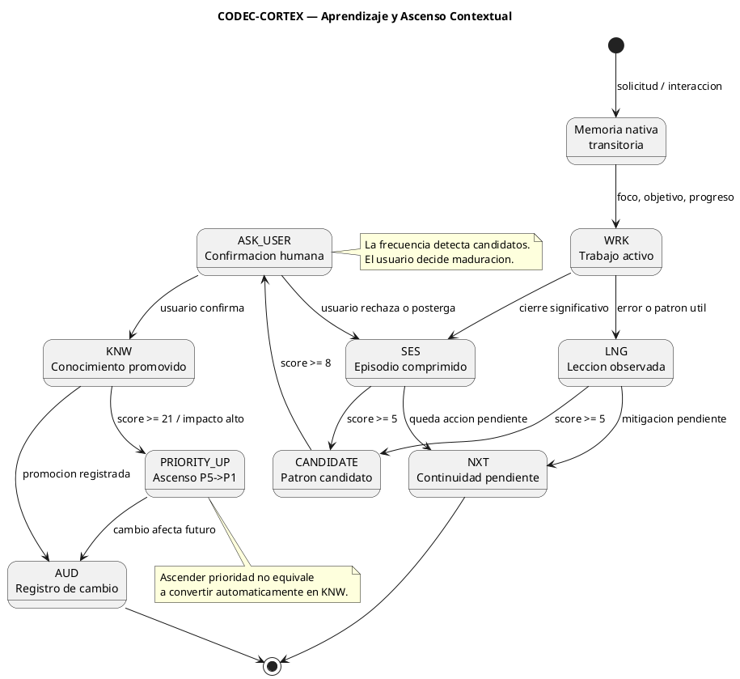

<!-- SPDX-FileCopyrightText: 2026 Fidel Ernesto Lozada A. -->
<!-- SPDX-License-Identifier: MPL-2.0 -->

<p align="center">
  <strong>CODEC-CORTEX</strong> — Proceso de Aprendizaje y Ascenso Contextual
  <br>
  <sub>REFERENCE · v1.0.0 · MIT · <a href="../../../AUTHORS.md">Fidel Ernesto Lozada A.</a></sub>
</p>

---

> **NOTA DE ESTADO:** Este documento es especificacion o diseno. A v0.3.7 la consolidacion manual asistida por agente es uso actual del Skill, y el CLI ofrece el codec determinista, la capa E2 de seguridad y el protocolo E3 de documentacion. La deteccion automatica de recurrencia, promocion, decay y reordenamiento estructural por runtime siguen siendo planificadas o futuras salvo implementacion verificada.

**Abstract:** Define el proceso de aprendizaje CODEC-CORTEX para `brain.cortex`: cuando actualizar memoria, como colapsar trabajo en `SES` y `LNG`, como detectar conocimiento candidato, como aplicar umbrales Fibonacci para ascenso contextual, cuando pedir confirmacion humana, que requiere `AUD`, y como distinguir memoria nativa transitoria, `SES`, `LNG`, `KNW` y `NXT`.

| | |
|---|---|
| **Author** | Fidel Ernesto Lozada A. — Ing. Sistemas / MSc. Ciencias Gerenciales |
| **Repository** | [github.com/FidelErnesto03/codec-cortex](https://github.com/FidelErnesto03/codec-cortex) |
| **License** | [MIT](../../../LICENSE) |
| **Version** | 1.0.0 |

---

# Proceso de Aprendizaje y Ascenso Contextual

> Referencia: `SKILL.md` — especificacion operativa completa.
> Referencia: `fundamentos.md` — ontologia, axiomas y principios.
> Referencia: `algoritmo.md` — FSM, densidad cognitiva y operaciones planificadas.

---

## 1. Principio central

CODEC-CORTEX no registra todo lo ocurrido. La memoria se actualiza solo para preservar aquello que cambia continuidad, decision, riesgo, restriccion, evidencia, aprendizaje o comportamiento futuro.

El historial se colapsa, no se elimina:

```text
memoria nativa transitoria -> WRK -> SES/LNG -> CANDIDATE -> KNW
```

La relevancia contextual asciende por senal acumulada:

```text
P5 -> P4 -> P3 -> P2 -> P1 -> P0
```

El ascenso de relevancia no equivale automaticamente a promocion semantica. Una entrada puede subir en prioridad contextual sin convertirse en `KNW`.

---

## 2. Tipos de memoria

| Tipo | Funcion | Persistencia | Regla |
|---|---|:---:|---|
| Memoria nativa transitoria | Estado mental del agente durante la interaccion | No | Puede guiar una respuesta, pero no modifica `brain.cortex` |
| `WRK` | Estado operativo recuperable | Si | Se actualiza cuando hay progreso que debe sobrevivir |
| `SES` | Episodio comprimido: input, output, outcome | Si | Resume lo ocurrido sin convertirlo en regla |
| `LNG` | Leccion, error o patron observado | Si | Puede advertir o guiar, pero no es conocimiento estable |
| `KNW` | Conocimiento validado o promovido | Si, alta prioridad | Guia comportamiento futuro |
| `NXT` | Accion pendiente concreta | Si, operativa | Permite recuperar continuidad |

---

## 3. Cuando actualizar `brain.cortex`

Actualizar `brain.cortex` cuando el cambio afecte continuidad futura.

| Caso | Sigilos sugeridos | Requiere `AUD` |
|---|---|:---:|
| Nueva tarea, foco o objetivo | `FCS`, `OBJ`, `STP` | No, salvo cambio de objetivo mayor |
| Progreso operativo recuperable | `WRK`, `STP`, `NXT` | Opcional |
| Bloqueo o riesgo activo | `WRK`, `RSK`, `NXT` | Si |
| Cierre de trabajo significativo | `SES`, `NXT` | Si, si hubo decision o verificacion |
| Error, desviacion o patron util | `LNG`, `RSK` | Opcional |
| Decision relevante | `AUD`, `REF`, posible `KNW` | Si |
| Claim verificado o refutado | `CLAIM`, `AUD`, `REF` | Si |
| Limite o constraint nuevo | `CNST` o `LIM`, `AUD` | Si |
| Paquete Nivel 3 absorbido | `KNW`, `REF`, `DIAG`, `CLAIM`, `LIM`, `AUD` | Si |
| Conocimiento promovido | `KNW`, `AUD`, origen `SES/LNG` | Si |

No actualizar `brain.cortex` por cada mensaje, preferencia menor, razonamiento descartado, borrador no aprobado o informacion que no cambie el siguiente trabajo.

---

## 4. Que nunca se actualiza automaticamente

Un agente o runtime MUST NOT actualizar automaticamente:

- identidad del proyecto, autoria o version normativa;
- `AXM` y `CNST:blocking`;
- claims de madurez, metricas o benchmarks;
- promocion `SES/LNG -> KNW`;
- decay, archivo o eliminacion de `KNW`;
- estado vivo (`FCS`, `OBJ`, `WRK`, `STP`, `NXT`) tomado desde paquetes Nivel 3;
- secretos, credenciales, tokens o claves privadas;
- conocimiento que contradiga una fuente canonica o decision humana vigente.

---

## 5. Confirmacion humana

El usuario es juez de maduracion. La frecuencia detecta candidatos; no decide significado.

La confirmacion humana es REQUIRED para:

- promover `SES` o `LNG` a `KNW`;
- cambiar identidad, autoria, version o alcance del protocolo;
- agregar, quitar o endurecer constraints;
- declarar una capacidad como `current`;
- degradar, archivar o eliminar `KNW`;
- resolver conflicto entre `brain.cortex`, paquete externo y solicitud actual;
- convertir una leccion circunstancial en regla general.

---

## 6. Ascenso contextual por Fibonacci

CODEC-CORTEX usa la progresion Fibonacci como umbral de ascenso contextual. La senal no crece linealmente: cada ascenso requiere evidencia mas fuerte.

| Score | Estado sugerido | Accion |
|---:|---|---|
| 1 | Observado | Mantener en memoria nativa transitoria o `SES` |
| 2 | Repeticion minima | Registrar como `SES` relevante |
| 3 | Patron inicial | Crear o actualizar `LNG` |
| 5 | Patron operativo | Marcar `LNG` como candidato |
| 8 | Conocimiento validable | Solicitar confirmacion humana |
| 13 | Conocimiento promovible | Promover a `KNW` si hay confirmacion o evidencia fuerte |
| 21 | Conocimiento critico | Elevar prioridad contextual y registrar `AUD` |

### 6.1 Senales y pesos

| Senal | Peso |
|---|---:|
| Ocurre una vez | 1 |
| Se repite en la misma sesion | 2 |
| Se repite en sesiones distintas | 3 |
| Afecta una decision real | 5 |
| Usuario lo valida explicitamente | 8 |
| Evita error o riesgo importante | 13 |
| Afecta seguridad, identidad, constraints o claims | 21 |

### 6.2 Regla de separacion

El score Fibonacci puede elevar relevancia contextual, pero no puede saltarse las compuertas humanas de maduracion.

```text
SES repetido -> LNG candidato
LNG score >= 8 -> preguntar al usuario
usuario confirma -> KNW
KNW score >= 21 -> prioridad contextual alta
```

---

## 7. Prioridad contextual y P0-P5

El ascenso contextual determina cuanto debe sobrevivir una entrada bajo presion de contexto.

| Prioridad | Uso | Ejemplos |
|---|---|---|
| P5 | Contexto extendido | Historia larga, referencias amplias |
| P4 | Referencia critica | Fuentes, documentos, artefactos |
| P3 | Evidencia reciente | `SES:last`, verificaciones recientes |
| P2 | Honestidad y limites | `CLAIM`, `LIM`, `KNW:active`, `LNG:critical` |
| P1 | Estado operacional | `WRK`, `AUD`, `RSK`, `NXT` |
| P0 | Supervivencia critica | `FCS`, `OBJ`, `CNST:blocking`, `STP` |

Un `KNW` critico puede influir P1/P0 solo cuando se materializa como riesgo, constraint, foco, objetivo o paso inmediato. P0 no debe llenarse con conocimiento general.

---

## 8. Dinamica de aprendizaje



---

## 9. Reglas de `LNG`

`LNG` puede existir sin volverse `KNW` cuando:

- nace de un solo episodio;
- no fue validado por el usuario;
- puede ser circunstancial;
- describe error a evitar, no verdad estable;
- requiere recurrencia;
- aun no tiene evidencia externa;
- sirve como advertencia operativa temporal.

Un `LNG` SHOULD incluir causa, leccion y prevencion. Un `LNG` MUST NOT convertirse en axioma por repeticion aislada.

---

## 10. Reglas de `AUD`

`AUD` es obligatorio cuando el cambio afecta comportamiento futuro del agente o confianza del proyecto.

Requiere `AUD`:

- cambio de `OBJ`, `CNST`, `LIM`, `CLAIM`, `RSK` o `KNW`;
- promocion `SES/LNG -> KNW`;
- absorcion de paquete Nivel 3;
- cambio de identidad, version o alcance;
- verificacion de implementacion, benchmark o madurez;
- decision arquitectonica;
- correccion de contradiccion;
- rechazo de promocion cuando el candidato podria reaparecer.

`AUD` no reemplaza benchmark. Si el cambio declara metricas, debe referenciar evidencia reproducible.

---

## 11. Algoritmo manual actual

Mientras runtime y automatizacion de maduracion no esten verificados como `current`, el agente aplica este proceso manualmente:

1. Identificar si el hecho afecta continuidad futura.
2. Clasificarlo como memoria transitoria, `WRK`, `SES`, `LNG`, `NXT`, `RSK`, `CLAIM` o `KNW`.
3. Estimar score Fibonacci por senales observadas.
4. Registrar `SES` o `LNG` si hay valor futuro.
5. Marcar candidato si score >= 5.
6. Pedir confirmacion humana si score >= 8 o si cambia comportamiento futuro.
7. Promover a `KNW` solo con confirmacion, evidencia fuerte o politica explicita.
8. Registrar `AUD` cuando la actualizacion afecta objetivo, riesgo, constraint, claim, decision o conocimiento promovido.

---

## 12. Contrato de madurez

| Capacidad | Estado | Regla |
|---|---|---|
| Consolidacion manual `WRK -> SES/LNG` | `current/specification` | Puede hacerla un agente siguiendo este documento |
| Deteccion manual de candidatos | `current/specification` | Puede usar score Fibonacci como criterio |
| Promocion manual con confirmacion | `current/specification` | Requiere usuario, evidencia o politica explicita |
| `detect_recurrence()` automatico | `future/runtime` | No asumir implementado |
| `promote()` automatico | `future/runtime` | No promover sin confirmacion humana |
| `decay()` automatico | `future/runtime` | No degradar `KNW` sin politica verificada |

