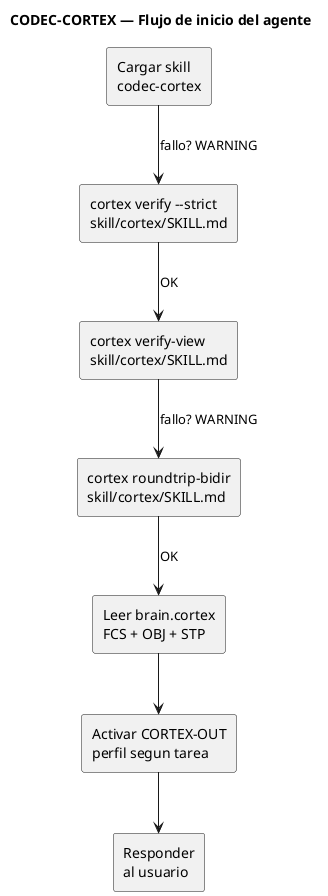
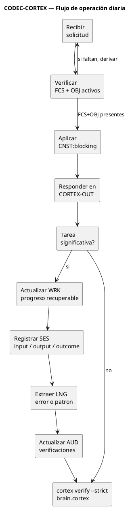
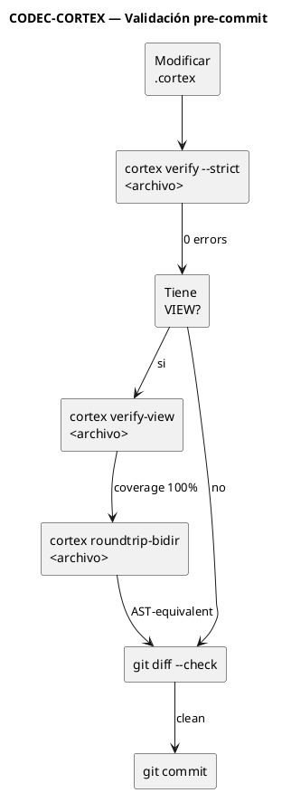
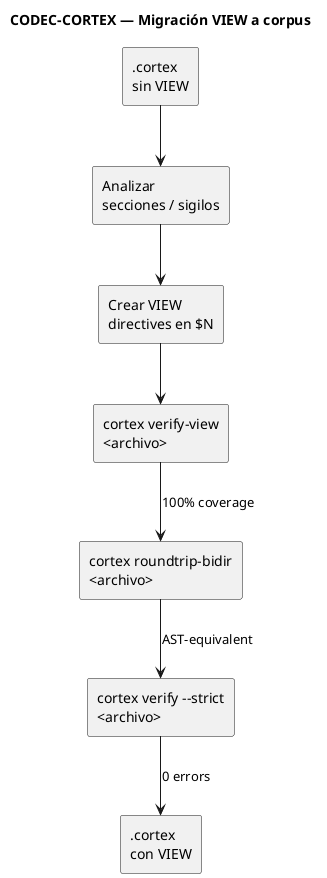
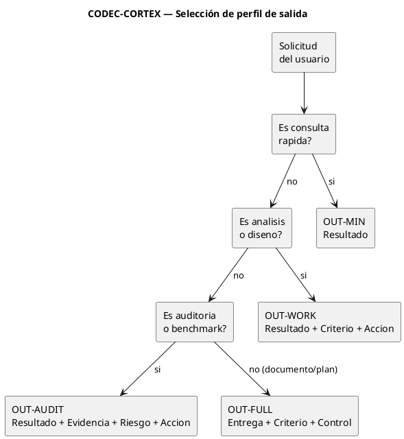

<!-- SPDX-FileCopyrightText: 2026 Fidel Ernesto Lozada A. -->
<!-- SPDX-License-Identifier: MPL-2.0 -->

# CODEC-CORTEX — Agent Workflow (v0.3.7)

> Especificación del workflow operativo que el agente ejecuta al cargar
> el skill `codec-cortex`. Complementa al `SKILL.md` canónico con
> instrucciones operativas concretas: cómo iniciar, cómo operar por cada
> interacción, cómo validar antes de commit, cómo migrar artefactos a
> VIEW directives, y cómo seleccionar el perfil de salida CORTEX-OUT.

---

## 1. Workflow de inicio (al cargar el skill)

```
Al cargar codec-cortex:
  1. Verificar canon:  cortex verify --strict skill/cortex/SKILL.md
  2. Validar VIEW:     cortex verify-view skill/cortex/SKILL.md
  3. Validar roundtrip: cortex roundtrip-bidir skill/cortex/SKILL.md
  4. Cargar brain:     leer brain.cortex → extraer FCS + OBJ + STP
  5. Activar CORTEX-OUT: perfil OUT-AUDIT para respuestas del agente
```

Si cualquiera de los pasos 1–3 falla, el agente EMITE un `WARNING` al
usuario describiendo el problema, pero continúa operando. Los fallos
en verificación NO bloquean la carga del skill — sólo se reportan.

---

## 2. Workflow de operación diaria

```
Por cada interacción del usuario:
  1. Verificar FCS/OBJ activos (desde brain.cortex o memoria nativa)
  2. Aplicar CNST:blocking antes de ejecutar
  3. Responder en CORTEX-OUT (perfil según criticidad)
  4. Al cerrar tarea significativa:
     a. Actualizar WRK si hay progreso recuperable
     b. Registrar SES con input→output→outcome
     c. Extraer LNG si hubo error o patrón
     d. Actualizar AUD si se verificó algo
     e. cortex verify --strict brain.cortex antes de commit
```

---

## 3. Workflow de validación (pre-commit / pre-push)

```
Antes de cada commit que toque .cortex:
  1. cortex verify --strict <archivo>
  2. cortex verify-view <archivo>       (si tiene VIEW)
  3. cortex roundtrip-bidir <archivo>   (si tiene VIEW)
  4. cortex doctor --scan-secrets <archivo>   (E2: secret scanner, opt-in)
  5. git diff --check

Antes de cada tag:
  1. make all  (lint + test + verify + roundtrip)
  2. cortex roundtrip-bidir skill/cortex/SKILL.md
  3. cortex roundtrip-bidir skill/hcortex/SKILL.md
  4. cortex verify --signature skill/cortex/SKILL.md   (E2: integridad)
  5. cortex docstring --all                              (E3: docstrings desde docs/cortex/api/)
  6. cortex benchmark --list                             (E3: inventario de suites)
  7. grep -rn "version_string" para verificar superficies
```

---

## 4. Workflow de migración VIEW (para corpus)

```
Para cada .cortex sin VIEW:
  1. Analizar estructura: sections, sigils, entries
  2. Crear VIEW directives en $N (última sección disponible)
     - Una VIEW por corteza semántica (IDN, DOM, CNST, FCS, OBJ)
     - kind: table|section|kv_table según tipo de datos
     - target: apunta a la sección/sigilo fuente
     - reverse: define estrategia de reversión
  3. cortex verify-view <archivo>  → 100% coverage
  4. cortex roundtrip-bidir <archivo> → AST-equivalent
  5. cortex verify --strict <archivo> → 0 errors, 0 warnings
```

---

## 5. Reglas `!` a agregar en el skill

| ! | cond | acc |
|---|------|-----|
| `!:startup_verify` | `on_skill_load` | Ejecutar `cortex verify --strict skill/cortex/SKILL.md` y `cortex verify-view skill/cortex/SKILL.md` al cargar el skill. Reportar fallos como WARNING. |
| `!:precommit_verify` | `before_commit` | Si se modificó un .cortex, ejecutar `cortex verify --strict` sobre ese archivo antes de permitir el commit. |
| `!:output_cortex_out` | `always` | Aplicar CORTEX-OUT §10 como protocolo de respuesta (existente). |
| `!:canonical_names` | `always` | Usar nombres canónicos para comandos CLI y recursos. No usar prefijos de versión (v2-, v3-) en nombres públicos. Los alias deprecados existen por compatibilidad pero no se documentan como nombre primario. |
| `!:mutation_mode` | `always` | Respetar el mutation gate activo (`CORTEX_MODE` env o `--mode`). En `read-only` no escribir `.cortex`; en `editor` no tocar governance; `admin` sólo con autorización explícita del usuario. |
| `!:docs_source_of_truth` | `before_doc_edit` | Toda referencia API nueva se escribe primero en `docs/cortex/api/<command>.cortex`; las vistas humanas y docstrings se derivan con `cortex docstring`. No duplicar referencia API en Markdown. |
| `!:secret_scan` | `before_commit` | Si el commit incluye artefactos `.cortex` nuevos o modificados, ejecutar `cortex doctor --scan-secrets` sobre ellos antes de permitir el commit. |

---

### 5.4 Release workflow

| ! | cond | acc |
|---|------|-----|
| `!:release_workflow` | `on_tag` | Después de crear un tag vX.Y.Z, ejecutar `gh release create` con release notes extraídas de CHANGELOG.md. No dejar tags huérfanos sin release asociado. Si no hay `gh` disponible, documentar el tag manualmente en GitHub Releases. |
| `!:pre_release_docs` | `before_tag` | Antes de crear cualquier tag vX.Y.Z, ejecutar verificación de superficies de versión en README, CHANGELOG, STATUS, ROADMAP, GOVERNANCE, skill/cortex/*, skill/hcortex/*, docs/specs/*. No taggear si hay versiones desactualizadas. |

**Pipeline de release completo:**

```bash
# 0. Verificar superficies de versión (BLOQUEANTE)
grep -rn "0\.3\.[0-9]" README.md CHANGELOG.md cli/CHANGELOG.md \
  cli/STATUS.md ROADMAP.md GOVERNANCE.md \
  skill/cortex/AGENT.md skill/hcortex/AGENT.md \
  skill/cortex/SKILL.md skill/hcortex/SKILL_HCORTEX.md \
  skill/cortex/AGENT.md skill/hcortex/AGENT.md \
  2>/dev/null | grep -v "SES:\|LNG:\|AUD:\|OBJ:\|WRK:\|STP:\|RSK:\|CLAIM:\|LIM:\|NXT:\|KNW:\|FCS:\|\[0\.3\.0\]\|\[0\.3\.1\]\|\[0\.3\.2\]\|\[0\.3\.3\]\|\[0\.3\.4\]\|\[0\.3\.5\]" \
  | grep -v "0\.3\.0 —\|0\.3\.1 —\|0\.3\.2 —\|0\.3\.3 —\|0\.3\.4 —\|0\.3\.5 —"
# Si aparecen referencias a versiones anteriores → STOP. Actualizar docs primero.
echo "Version surfaces OK — no stale references found."

# 1. Verificar que todo pasa
make all                           # lint + test + verify + roundtrip
cortex verify --strict skill/cortex/SKILL.md   # 0 errors
cortex verify-view skill/cortex/SKILL.md       # coverage 100%
cortex roundtrip-bidir skill/cortex/SKILL.md   # rc=0

# 2. Crear release notes desde CHANGELOG.md
# Extraer sección [X.Y.Z] manualmente

# 3. Tag + push
git tag -a vX.Y.Z -m "Resumen del release"
git push origin vX.Y.Z

# 4. Crear release en GitHub
gh release create vX.Y.Z --title "vX.Y.Z — Título" --notes "notas del release"

# 5. Publicar a PyPI (si aplica)
make publish
```

### 5.5 Makefile targets de release

```makefile
.PHONY: release
release: all
        @echo "Listo para tag. Ejecuta:"
        @echo "  git tag -a v$$(cortex --version) -m \"...\""
        @echo "  git push origin v$$(cortex --version)"
        @echo "  gh release create v$$(cortex --version) --title \"...\" --notes \"...\""
```

```bash
# Pipeline completo que el agente ejecuta post-instalación
cortex --version                          # ≥ 0.3.5
cortex verify --strict skill/cortex/SKILL.md   # 0 errors
cortex verify-view skill/cortex/SKILL.md       # coverage 100%
cortex roundtrip-bidir skill/cortex/SKILL.md   # rc=0, 0 diffs
cortex verify --strict skill/cortex/AGENT.md   # 0 errors
cortex inspect skill/cortex/SKILL.md           # 14 sec, 266 entries, 44 VIEW
make test                                     # 341+ passed
```

---

## 7. CORTEX-OUT para outputs del agente

El agente DEBE usar CORTEX-OUT §10 para todas las respuestas cuando el
skill esté cargado:

| Situación | Perfil CORTEX-OUT | Bloques |
|-----------|:------------------:|---------|
| Consulta rápida | OUT-MIN | Resultado |
| Análisis o diseño | OUT-WORK | Resultado + Criterio + Acción |
| Auditoría o benchmark | OUT-AUDIT | Resultado + Evidencia + Riesgo + Acción |
| Documento, plan, entrega | OUT-FULL | Entrega + Criterio + Control |
| Error o bloqueo | OUT-MIN | Resultado + Riesgo |

Prioridad de salida: O0 (Resultado) primero, O5 (desarrollo extendido) último. Tablas > listas > prosa.

---

## 8. Diagramas de workflow (PUML)

### 8.1 Inicio del agente



### 8.2 Operación diaria



### 8.3 Validación pre-commit



### 8.4 Migración VIEW a corpus



### 8.5 Selección de perfil CORTEX-OUT


