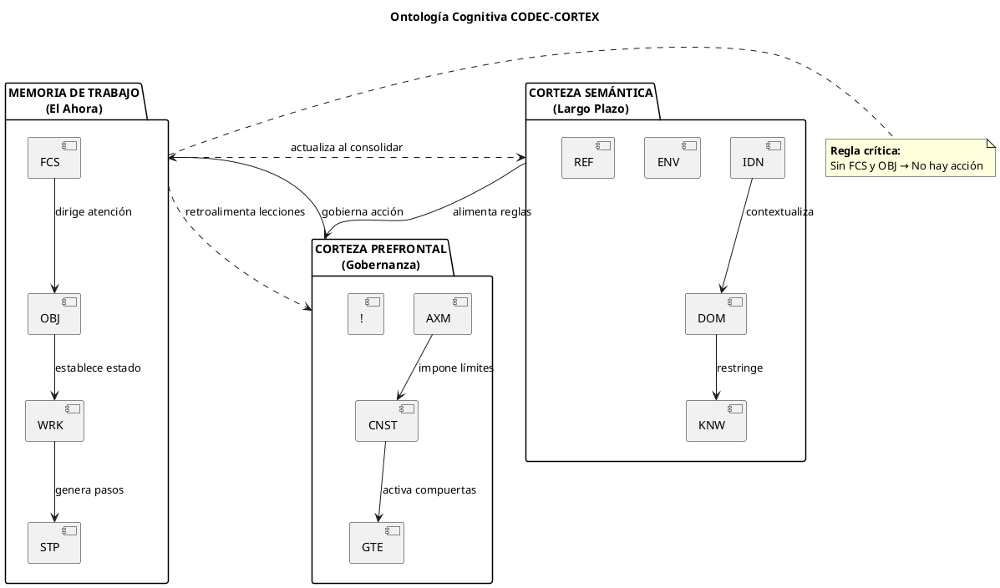
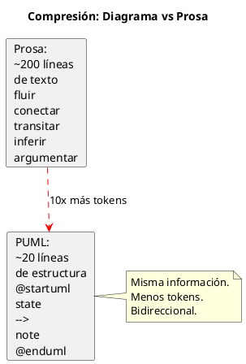
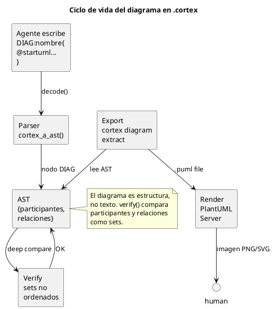
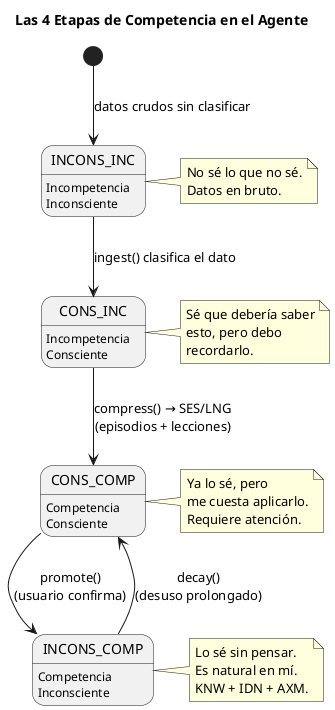
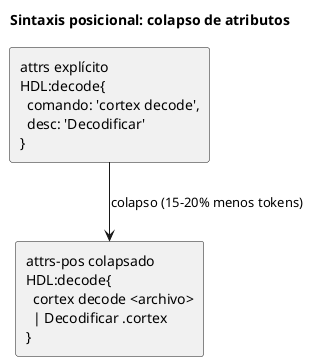
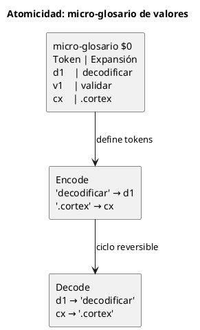
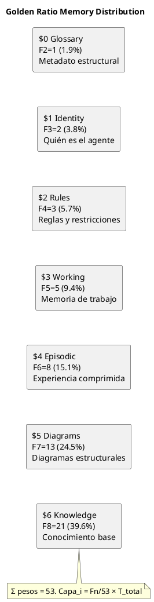

<!-- SPDX-FileCopyrightText: 2026 Fidel Ernesto Lozada A. -->
<!-- SPDX-License-Identifier: MIT -->

<p align="center">
  <strong>CODEC-CORTEX</strong> — Fundamentos y Principios
  <br>
  <sub>REFERENCE · v1.0.0 · MIT · <a href="../../../AUTHORS.md">Fidel Ernesto Lozada A.</a></sub>
</p>

---

> **NOTA DE ESTADO:** Este documento es especificacion o diseno. A v0.3.5 el CLI y codec determinista (parse, encode, decode, verify, HCORTEX render, canonicalize, convert, roundtrip-bidir, inspect), la capa de seguridad E2 (`cortex doctor --scan-secrets`, `cortex audit`, `cortex --mode`, `cortex verify --signature`) y el protocolo de documentacion E3 (`docs/cortex/api/*.cortex`, `cortex docstring`, `cortex benchmark`) estan implementados en cli/. El runtime y el servidor MCP siguen siendo planificados o futuros.

**Abstract:** Ontología cognitiva, axiomas arquitectónicos y principios rectores del protocolo de compresión estructural determinista para memoria de agentes LLM. Cubre las 3 cortezas cognitivas, los 7 axiomas fundacionales, las 4 etapas de competencia como modelo de maduración, el protocolo HCORTEX de descompresión humana, las técnicas de compresión avanzada (colapso posicional y micro-glosario), y la proporción áurea (φ=1.618) como patrón universal de distribución de memoria.

| | |
|---|---|
| **Author** | Fidel Ernesto Lozada A. — Ing. Sistemas / MSc. Ciencias Gerenciales |
| **Repository** | [github.com/FidelErnesto03/codec-cortex](https://github.com/FidelErnesto03/codec-cortex) |
| **License** | [MIT](../../../LICENSE) |
| **Version** | 1.0.0 |

---

# Fundamentos y Principios del Protocolo CODEC-CORTEX
---

# Fundamentos y Principios del Protocolo CODEC-CORTEX

> **Documento de fundamentos teóricos.**
> Define la ontología cognitiva, los axiomas inquebrantables y los principios rectores que gobiernan el diseño y la implementación del protocolo CODEC-CORTEX.
>
> Referencia: `SKILL.md` — especificación operativa completa.

---

## 1. El Problema Fundamental

Los agentes LLM actuales enfrentan una crisis arquitectónica: **la memoria se trata como un saco de texto**.

Cuando un agente acumula historial de interacción:
- El contexto crece linealmente → el costo de inferencia escala sin control
- La información relevante se diluye en ruido → *Lost in the Middle*
- Los SLMs (modelos pequeños) colapsan por ventanas de contexto limitadas
- No hay distinción entre *lo que pasó*, *lo que importa* y *lo que hay que hacer*

**La causa raíz no es la falta de contexto, sino la falta de estructura en el contexto.**

CODEC-CORTEX propone una solución arquitectónica: en lugar de darle al LLM más texto, darle **contexto estructuralmente perfecto** — una ontología de memoria jerárquica que fuerza al mecanismo de atención a procesar la información en el orden de prioridad cognitiva exacto.

---

## 2. La Ontología Cognitiva de Tres Cortezas

El protocolo modela la memoria del agente como tres capas corticales, inspirándose en la neuroanatomía funcional:

### Corteza Semántica (Largo Plazo) — $1

Contiene el conocimiento estable del agente: quién es, dónde opera, qué sabe.

| Sigilo | Función Cognitiva | Propósito |
|--------|-------------------|-----------|
| `IDN` | Identidad | Rol, personalidad, modelo base, versión del agente |
| `DOM` | Dominio | Entorno, reglas del mundo, límites operativos |
| `KNW` | Conocimiento | Hechos, APIs, herramientas, grafos cargados |
| `ENV` | Entorno | Estado actual del mundo exterior/sistema |
| `REF` | Referencia | Vínculo a documentos, APIs o nodos externos |

Esta capa **no cambia entre sesiones** del agente. Se actualiza solo cuando el conocimiento del dominio se expande.

### Corteza Prefrontal (Gobernanza) — $2

Contiene las reglas inmutables y los límites que gobiernan el comportamiento del agente.

| Sigilo | Función Cognitiva | Propósito |
|--------|-------------------|-----------|
| `AXM` | Axioma | Ley inmutable, principio rector del agente |
| `CNST` | Restricción | Límites duros (tokens, tiempo, ética, costo) |
| `GTE` | Compuerta | Condición de alto riesgo que requiere validación externa |
| `!` | Regla | Regla operativa obligatoria / advertencia crítica |

Esta capa **es más dura que la memoria de trabajo** pero puede refinarse mediante lecciones aprendidas (`LNG`).

### Memoria de Trabajo (El Ahora) — $3

Contiene el estado activo del agente: qué está haciendo, por qué, y cómo.

| Sigilo | Función Cognitiva | Propósito |
|--------|-------------------|-----------|
| `FCS` | Foco | **Anclaje de atención** — lo que el agente debe procesar AHORA |
| `OBJ` | Objetivo | Meta activa, intención, tarea actual |
| `WRK` | Trabajo | Variables de trabajo, progreso, estado actual |
| `STP` | Paso | Plan de acción inminente, siguiente movimiento |

**`FCS` y `OBJ` son los sigilos más críticos.** Sin ellos, el agente no tiene anclaje atencional ni dirección. La regla fundamental es: *ningún agente actúa sin `FCS` y `OBJ` explícitos en la memoria de trabajo activa.*



### Memoria Episódica (Experiencia Comprimida) — $4

Contiene el historial destilado del agente: lo que aprendió de experiencias pasadas.

| Sigilo | Función Cognitiva | Propósito |
|--------|-------------------|-----------|
| `SES` | Sesión | Memoria episódica comprimida (Input→Output→Resultado) |
| `LNG` | Lección | Heurística aprendida, error pasado a evitar |

Esta capa **se actualiza mediante consolidación**: el Motor de Consolidación toma el `WRK` y el historial crudo, y produce nuevos `SES` y `LNG`. Es el equivalente al sueño humano: el agente "duerme" y consolida su memoria.

---

## 3. Los 7 Axiomas del Protocolo

Los axiomas son principios fundamentales que **no se negocian**. Cualquier implementación de CODEC-CORTEX debe respetarlos.

### Axioma I: Determinismo Algorítmico

> **Las operaciones planificadas decode/encode/verify son operaciones deterministas del codec.** No deben llamar modelos de lenguaje durante el ciclo de compilacion.

Esto apunta a reversibilidad estructural y evita alucinacion LLM durante la transformacion estructural. Latencia y rendimiento requieren benchmarks de implementacion. El LLM consume el `.cortex`; el codec no depende del LLM para producir o validar el formato.

### Axioma II: El Glosario es la Única Fuente de Verdad

> **El glosario $0 dicta la sintaxis, no el significado.** Sin glosario, no hay contrato de parseo.

Todo archivo `.cortex` comienza con `$0`. El glosario define qué sigilos existen, qué tipo de expansión tienen (attrs, cuerpo, contenido, bloque, relación), y qué riesgo cognitivo representan. Sin `$0`, el archivo no es interpretable.

### Axioma III: Equivalencia Estructural, No Byte-a-Byte

> **Dos archivos son equivalentes si producen el mismo AST.** No se requiere igualdad textual.

El contrato de `verify` es: mismo conjunto de tuplas `(sigilo, nombre, valor_json)`. El orden de las secciones, los espacios en blanco y los comentarios no afectan la equivalencia estructural.

### Axioma IV: Compresión y Expansión son Operaciones Inversas

> **decode(encode(decode(x))) == decode(x)** para todo archivo `.cortex` válido.

El ciclo completo del codec apunta a reversibilidad estructural para estructuras soportadas. Drift semantico y perdida de informacion deben probarse con fixtures explicitos. Cualquier implementación que no cumpla este axioma no es un codec CORTEX válido.

### Axioma V: Anclaje Atencional por Estructura

> **El agente no actúa sin `FCS` y `OBJ` explícitos.** La estructura fuerza la atención, no la sugiere.

Al inyectar `FCS` y `OBJ` en posiciones estructurales fijas y de alta densidad, el protocolo "hackea" el mecanismo de atención del Transformer. El modelo no busca la tarea en medio de un historial de chat — la tarea se le presenta como una variable de estado ineludible al inicio de su procesamiento.

### Axioma VI: Agnosticismo de Framework

> **CODEC-CORTEX no pertenece a ningún ecosistema.** Es un formato de transporte de estado.

Cualquier implementación que respete estos axiomas es válida. No hay dependencia de ningun framework o sistema externo especifico. Los adaptadores son bienvenidos; las dependencias no.

### Axioma VII: Separación de Capas

> **La memoria del agente se organiza en capas con diferente frecuencia de actualización.**

- Semántica ($1): cambia por ciclo de vida del agente
- Prefrontal ($2): cambia por refinamiento de gobierno
- Trabajo ($3): cambia por cada interacción
- Episódica ($4): cambia por consolidación nocturna

Un sistema de archivos plano o una base de datos vectorial tratan toda la memoria igual. CODEC-CORTEX la jerarquiza por frecuencia y criticidad.

---

## 4. Los 8 Principios Rectores

Los principios son guías de diseño para implementaciones y extensiones del protocolo.

### Principio 1: Sin LLM en el Ciclo de Ajuste

El codec es pura transformación algorítmica. No importa si el LLM de turno es GPT-4, agent client, o un SLM de 3B parámetros — el `.cortex` se parsea igual. La calidad de la compresión no depende del modelo.

### Principio 2: YAML-Edit como Fuente de Verdad Humana

El formato `.cortex` es el formato compilado denso. No se edita a mano. La representación para edición humana es YAML-Edit: sigilos como claves YAML directas, diffeable, legible. El humano edita YAML-Edit; el codec compila a `.cortex`.

### Principio 3: Densidad Primero, Legibilidad Después

El `.cortex` optimiza para el consumo del LLM (mínimos tokens, máxima densidad semántica). La legibilidad humana se satisface en YAML-Edit. No sacrificar compresión por legibilidad en el formato compilado.

### Principio 4: Auto-Descripción Obligatoria

Todo `.cortex` incluye su propio glosario ($0). No hay schemas externos, no hay registros centrales, no hay documentación adicional. El archivo se explica a sí mismo. Cualquier LLM o herramienta puede interpretarlo con solo leer las primeras líneas.

### Principio 5: Predecibilidad sobre Optimización

El parser debe ser determinista y predecible antes que inteligente. Mejor un parseo lento pero completamente validado que uno rápido con casos borde. `verify` debe detectar cualquier desviación del AST esperado.

### Principio 6: Las REFs Apuntan a Archivos, No a Directorios

Cada referencia debe resolver a un archivo `.cortex` concreto. `REF:memoria{PATH:contexto/}` es ambiguo. `REF:memoria{PATH:contexto/trader.cortex}` es preciso. Las REFs a directorios no se resuelven.

### Principio 7: Auto-Creación de Secciones

Si `patch_add` referencia una sección que no existe, la crea automáticamente. Esto permite construir un `.cortex` desde cero usando solo los handlers de parcheo, sin necesidad de templates ni archivos base.

### Principio 8: El Historial se Colapsa, no se Elimina

El Motor de Consolidación no borra memoria — la colapsa. Los `SES` contienen la esencia de sesiones pasadas (Input→Output→Resultado). Los `LNG` contienen lecciones (qué salió mal, qué evitar). La información se destila, no se pierde. La reversibilidad del codec garantiza que la destilación sea fiel.

---

## 5. Mapa de Densidad Cognitiva por Sigilo

Cada sigilo tiene un peso cognitivo distinto en la atención del LLM:

| Capa | Sigilo | Densidad | Riesgo | Frecuencia de cambio |
|------|--------|----------|--------|---------------------|
| Semántica | `IDN` | Alta | Bajo | Por ciclo de vida |
| Semántica | `DOM` | Alta | Bajo | Por ciclo de vida |
| Semántica | `KNW` | Muy alta | Bajo | Por actualización de conocimiento |
| Semántica | `ENV` | Media | Bajo | Por cambio de entorno |
| Prefrontal | `AXM` | Máxima | Alto | Nunca (inmutable) |
| Prefrontal | `CNST` | Alta | Medio | Por refinamiento |
| Prefrontal | `GTE` | Máxima | Alto | Por nuevo riesgo identificado |
| Trabajo | `FCS` | **Crítica** | **Alto** | Por cada interacción |
| Trabajo | `OBJ` | **Crítica** | **Alto** | Por cada tarea |
| Trabajo | `WRK` | Alta | Bajo | Por cada paso |
| Trabajo | `STP` | Alta | Medio | Por cada paso |
| Episódica | `SES` | Media | Bajo | Por consolidación |
| Episódica | `LNG` | Alta | Medio | Por error significativo |

**Regla de densidad:** Los sigilos de la Memoria de Trabajo tienen densidad crítica porque son los que el LLM necesita procesar primero y con mayor precisión. Su posición en el archivo `.cortex` (al inicio, después de $0 y $1-$2) garantiza que el mecanismo de atención los encuentre sin competencia de ruido histórico.

---

## 6. Relación con Otros Paradigmas

| Paradigma | CODEC-CORTEX | Diferencia clave |
|-----------|--------------|------------------|
| **RAG** | Recupera documentos del mundo exterior | CORTEX recupera *estado cognitivo interno* del agente |
| **Fine-tuning** | Modifica pesos del modelo | CORTEX modifica el contexto, no el modelo |
| **Prompt engineering** | Diseña prompts manualmente | CORTEX genera contexto estructural determinista |
| **Context window expansion** | Aumenta el límite de tokens | CORTEX reduce los tokens necesarios |
| **Vector databases** | Almacena embeddings | CORTEX almacena estado cognitivo estructural (no vectores) |

**CODEC-CORTEX no reemplaza RAG — lo complementa.** RAG recupera conocimiento externo; CORTEX gestiona la memoria interna del agente. Juntos, cubren el espectro completo de necesidades informacionales de un agente autónomo.

---

## 7. Diagramas PUML como Compresión Nativa

### 7.1. Principio

Los diagramas PUML son el mecanismo de compresión más eficiente del protocolo. Un diagrama de 20 líneas puede comunicar flujos, relaciones, arquitecturas y procesos que requerirían 200+ líneas de prosa.



Los diagramas PUML son el mecanismo de compresión más eficiente del protocolo. Un diagrama de 20 líneas puede comunicar flujos, relaciones, arquitecturas y procesos que requerirían 200+ líneas de prosa. Y lo hace en un formato que es **naturalmente bidireccional**: un humano ve el diagrama renderizado, una máquina parsea el mismo texto.

### 7.2. Factor de compresión de diagramas vs prosa

| Aspecto | Prosa | Diagrama PUML | Factor |
|---------|------|----------------|--------|
| Flujo de 6 estados con transiciones | ~60 líneas | ~20 líneas | 3× |
| Arquitectura de 5 componentes con relaciones | ~80 líneas | ~15 líneas | 5× |
| Ontología cognitiva con 3 capas y 12 sigilos | ~100 líneas | ~25 líneas | 4× |
| Relaciones causales entre módulos | ~50 líneas | ~10 líneas | 5× |

**Objetivo ilustrativo de compresion:** ~4x sobre prosa, pendiente de benchmarks reproducibles y tests de fidelidad estructural.

### 7.3. Los diagramas en el ciclo de vida del .cortex



Los diagramas PUML se almacenan dentro del `.cortex` como bloques `DIAG` en la sección correspondiente:

```cortex
# -- $5: DIAGRAMAS ESTRUCTURALES --
DIAG:ontologia{
@startuml
title Ontología Cognitiva CODEC-CORTEX
package "CORTEZA SEMÁNTICA" { [IDN] [DOM] [KNW] }
package "PREFRONTAL" { [AXM] [CNST] [GTE] [!] }
package "TRABAJO" { [FCS] [OBJ] [WRK] [STP] }
Semantic --> Prefrontal : alimenta
Prefrontal --> Working : gobierna
@enduml
}

DIAG:fsm_memoria{
@startuml
title FSM — Ciclo de Vida
state IDLE
state INGEST
state COMPACT
state STORED
[*] --> IDLE
IDLE --> INGEST : ingest
INGEST --> COMPACT : compress
COMPACT --> STORED : verify
STORED --> ACTIVE : decode
@enduml
}
```

### 7.4. El codec trata PUML como estructura, no como texto

El parser `cortex_a_ast()` reconoce `@startuml...@enduml` dentro de los valores de sigilo `DIAG` y los convierte en nodos del AST con su propia estructura interna:

```python
# AST de un DIAG
{
    't': 'sigilo',
    's': 'DIAG',
    'n': 'ontologia',
    'v': {
        '_tipo': 'puml',
        '_title': 'Ontología Cognitiva CODEC-CORTEX',
        '_participants': ['IDN', 'DOM', 'KNW', 'AXM', ...],
        '_relaciones': [
            {'origen': 'Semantic', 'destino': 'Prefrontal', 'label': 'alimenta'},
            ...
        ],
        '_raw': '@startuml\n...'  # texto completo preservado
    }
}
```

Esto permite que `verify()` compare diagramas estructuralmente (mismos participantes, mismas relaciones) y no solo textualmente, manteniendo el axioma de equivalencia estructural sobre equivalencia textual.

### 7.5. Patrón de sigilos compañeros

El `DIAG` se preserva intacto (tipo `bloque`, verbatim). Los sigilos que comparten su nombre actúan como **contexto interpretativo** — el LLM los lee para entender el diagrama sin parsear el PUML.

```cortex
# -- $5: DIAGRAMAS ESTRUCTURALES --

# El diagrama PUML se preserva verbatim — nunca se modifica
DIAG:ontologia{
@startuml
title Ontología Cognitiva CODEC-CORTEX
package "CORTEZA SEMÁNTICA" { [IDN] [DOM] [KNW] }
package "PREFRONTAL" { [AXM] [CNST] [GTE] [!] }
package "TRABAJO" { [FCS] [OBJ] [WRK] [STP] }
Semantic --> Prefrontal : alimenta
Prefrontal --> Working : gobierna
@enduml
}

# Sigilos compañeros — mismo nombre "ontologia"
# El LLM lee estos para contexto sin parsear el PUML
KNW:ontologia{_participantes:[IDN,DOM,KNW,AXM,CNST,GTE,FCS,OBJ,WRK,STP], _relaciones:2, _capa:cognitiva}
TAG:ontologia{tags:[core, arquitectura, fundamentos]}
DESC:ontologia{propósito:"Mapa de las tres cortezas cognitivas y sus relaciones"}

# Otro diagrama con sus compañeros
DIAG:fsm_memoria{
@startuml
title FSM — Ciclo de Vida
state IDLE
state INGEST
state COMPACT
state STORED
[*] --> IDLE
IDLE --> INGEST : ingest
INGEST --> COMPACT : compress
COMPACT --> STORED : verify
STORED --> ACTIVE : decode
@enduml
}

KNW:fsm_memoria{_estados:5, _transiciones:4, _tipo:maquina_estados}
TAG:fsm_memoria{tags:[ciclo_vida, memoria, operaciones]}
```

**Regla de nomenclatura:** Los sigilos compañeros usan el mismo `nombre` que el `DIAG` al que enriquecen. Si el diagrama se llama `ontologia`, los compañeros usan `ontologia` como segunda parte del sigilo.

**Lo que el codec garantiza:**
1. `DIAG` raw se preserva bit a bit en cada encode/decode
2. Los sigilos compañeros se parsean normalmente (tipo `attrs` o `contenido`)
3. `verify()` compara los compañeros estructuralmente (deep compare de valores)
4. `verify()` NO compara el raw del DIAG — solo verifica que no haya cambiado (misma longitud, mismos delimitadores)

### 7.6. Reglas de diagramas en .cortex

1. **Los diagramas son ciudadanos de primera clase.** No son comentarios ni texto embedido — son nodos del AST con estructura parseable.
2. **`DIAG` es el sigilo para diagramas.** Todo bloque `@startuml...@enduml` dentro de un valor `DIAG` se parsea estructuralmente.
3. **El raw del DIAG se preserva verbatim.** El codec nunca modifica el contenido entre `@startuml` y `@enduml`. El tipo `bloque` garantiza fidelidad bit a bit.
4. **Los sigilos compañeros enriquecen sin modificar.** `KNW:nombre{...}`, `TAG:nombre{...}`, `DESC:nombre{...}` y cualquier otro sigilo que comparta el nombre del `DIAG` actúa como contexto interpretativo. El LLM los lee para entender el diagrama sin parsear el PUML.
5. **Convención de nomenclatura.** Los sigilos compañeros usan el mismo `nombre` que el `DIAG` al que complementan. `DIAG:fsm{...}` → `KNW:fsm{...}`, `TAG:fsm{...}`.
6. **Extracción a archivos .puml.** El codec puede exportar diagramas a archivos `.puml` independientes para renderizado externo.
7. **Ciclo de verificación.** `verify()` compara los sigilos compañeros estructuralmente (deep compare). El raw del DIAG se verifica solo por integridad (longitud, delimitadores), no por contenido.

### 7.8. SKILL.md como diagrama + leyenda

El propio SKILL.md de CODEC-CORTEX sigue este paradigma: los diagramas PUML son el lenguaje primario de especificación (FSM, pipeline, ontología), y las tablas son la leyenda que ningún diagrama puede expresar (valores exactos, tipos, parámetros). El agente lee primero el diagrama para entender el flujo, luego consulta las tablas para los detalles precisos.

### 7.9. Implicaciones para la adopción

| Aspecto | Sin diagramas | Con diagramas (PUML) |
|---------|---------------|----------------------|
| Compresión de flujo | Solo texto → 200 líneas | Diagrama + leyenda → 30 líneas |
| Bidireccionalidad | Humano lee prosa, máquina parsea texto | Humano ve diagrama, máquina parsea mismo texto |
| Depuración | Leer logs textuales | Ver diagrama de estados |
| Comunicación entre agentes | Intercambiar texto denso | Intercambiar diagramas + sigilos |
| Documentación | Documento separado | Embebida en el propio `.cortex` |

---

## 8. Modelo de Maduración Cognitiva

### 8.1. Las 4 Etapas de Competencia

El protocolo CODEC-CORTEX modela la maduración del conocimiento del agente según las 4 etapas clásicas de competencia humana, adaptadas para LLMs:



| Etapa | El agente... | Contenedor .cortex | Operación de entrada | Operación de salida |
|-------|-------------|-------------------|---------------------|---------------------|
| **Incompetencia Inconsciente** | No sabe que no sabe | Datos crudos (no clasificados) | `ingest()` | Nada (se descarta si no se re-usa) |
| **Incompetencia Consciente** | Sabe que existe pero no lo conoce | `WRK` (memoria de trabajo) | `ingest()` con clasificación | `compress()` o `overflow` |
| **Competencia Consciente** | Lo sabe pero le cuesta aplicarlo | `SES` (episodios) + `LNG` (lecciones) | `compress()` | `promote()` o `decay()` |
| **Competencia Inconsciente** | Lo sabe sin esfuerzo | `KNW` (conocimiento base) + `IDN` + `AXM` | `promote()` | `decay()` (por desuso) |

### 8.2. La Maduración no es un Contador — es el Usuario

**Principio fundamental:** La maduración no se mide por frecuencia de uso, sino por **decisión del usuario**. Un contador mide repetición, no significado. Un workflow ejecutado 10,000 veces puede ser una tarea repetitiva sin valor de aprendizaje.

```
detecta_recurrencia(SES o LNG)
      │
      ├── umbral_de_recurrencia alcanzado
      │       │
      │       └── pregunta al usuario:
      │           "He notado que este patrón se repite.
      │            ¿Debería aprenderlo como conocimiento base?"
      │               │
      │               ├── Sí  → promote(ses, lng → knw)
      │               │
      │               ├── No  → queda en SES/LNG
      │               │
      │               └── "No sabía que hacía esto"
      │                   → promote() + log: usuario hizo consciente
      │
      └── sin recurrencia → decay() progresivo (archivo o descarte)
```

### 8.3. Los LLMs Aprenden al Instante — Sin Repetición

Esta es la diferencia fundamental entre un LLM y un humano:

| Aspecto | Humano | LLM |
|---------|--------|-----|
| Aprende por | Repetición + práctica | **Instrucción directa** |
| Competencia inconsciente | "Lo hago sin pensar" | "Está en mi KNW" |
| Maduración | Gradual (horas/días) | **Instantánea (1 instrucción)** |
| Olvido | Lento, por desuso | **Inexistente si está en KNW** |
| Límite de capacidad | Atención limitada | **Contexto (tokens)** |

Para un LLM, `promote()` no requiere repetición. Basta con que el sistema le diga:

> *"Este SES ahora está promovido a KNW. Incorpóralo como conocimiento base."*

Y el LLM lo incorpora en la **siguiente lectura del `.cortex`** — sin práctica, sin repetición, sin repaso.

### 8.4. Las Dos Vertientes

**Vertiente 1 — El sistema hace consciente al usuario:**

```
SES:sesion_03{input:"deploy_staging", ...}
SES:sesion_07{input:"deploy_staging", ...}
SES:sesion_14{input:"deploy_staging", ...}

→ Sistema detecta recurrencia
→ Pregunta: "Has ejecutado 'deploy_staging' 3 veces. ¿Debería aprenderlo?"
→ Usuario: "Tienes razón, es mi workflow estándar. Sí."
→ Sistema promueve SES → KNW:workflow_deploy{...}
```

El sistema no solo aprendió — **le enseñó al usuario algo sobre sí mismo**.

**Vertiente 2 — El LLM aprende al instante:**

```
Antes:   SES:deploy_staging{pasos, resultado:"ok"}
         → El LLM lo ve como episodio pasado (recuperable con esfuerzo)

Después de promote():
         KNW:workflows{deploy_staging:[paso1,paso2,paso3], confidente:true}
         → El LLM lo ve como conocimiento base (0 esfuerzo de recall)

         Diferencia: 0 iteraciones de práctica.
         Solo se le dijo "esto ahora es conocimiento".
```

### 8.5. Operaciones de Maduración

| Operación | Descripción | Cuándo se ejecuta |
|-----------|-------------|-------------------|
| `detect_recurrence()` | Escanea SES y LNG en busca de patrones repetidos (mismo input, mismo error, mismo workflow) | Cada consolidación nocturna |
| `ask_user()` | Presenta el patrón al usuario y pregunta si debe promoverse | Cuando `detect_recurrence()` encuentra un candidato |
| `promote()` | Migra un SES o LNG de la memoria episódica al conocimiento semántico (SES/LNG → KNW) | Cuando el usuario confirma |
| `decay()` | Degrada un KNW infrautilizado de vuelta a SES (o lo archiva) | Periódico, por desuso prolongado |

### 8.6. Mapeo a la Arquitectura Actual

La arquitectura actual de CODEC-CORTEX ya tiene los contenedores correctos:

| Etapa | Contenedor actual | ¿Existe? | ¿Se usa? |
|-------|------------------|----------|----------|
| Incompetencia inconsciente | (crudo antes de ingest) | Implícito | No formalizado |
| Incompetencia consciente | WRK + FCS + OBJ + STP | ✅ Sí | Sí |
| Competencia consciente | SES + LNG | ✅ Sí | Sí |
| Competencia inconsciente | KNW + IDN + AXM | ✅ Sí | Sí |

Lo que **no** existe formalmente es el **motor de maduración**: `detect_recurrence()`, `ask_user()`, `promote()` y `decay()`. Los contenedores están listos; la dinámica entre ellos es el nuevo diseño.

---

## 9. HCORTEX: Protocolo de Descompresión para Humanos

### 9.1. El Problema del Output

Si el LLM recibe `.cortex` y responde en prosa, el ciclo de compresión se pierde:

```
.cortex (1.8K tok) → LLM procesa → prosa (2K tok) → humano lee
                                     ↑____ 100% del ahorro se evapora en la salida
```

La solución es que el LLM responda en **lenguaje natural comprimido** — markdown formateado según las reglas **HCORTEX**: tablas, listas, pares clave/valor, diagramas PUML. Sin sigilos, sin ruido, sin prosa innecesaria.

### 9.2. HCORTEX no es una Extensión — es un Protocolo de Formato

HCORTEX no es `.hcodex`, `.hcortex` ni ninguna extensión de archivo. Es un **conjunto de reglas de descompresión** que transforman los sigilos del `.cortex` en representaciones que un humano absorbe sin esfuerzo. El resultado son archivos `.md` estándar formateados con las reglas HCORTEX:

| Elemento .cortex | Regla HCORTEX | Representación |
|------------------|---------------|----------------|
| `IDN:agente{rol:"X"}` | `**Identidad:** X` | Texto en negrita + valor |
| `FCS:atencion{objetivo:"X"}` | Tabla `\| Dimensión \| Valor \|` | Fila en tabla |
| `SES:nombre{input:"X", output:"Y"}` | Lista `- nombre: X → Y` | Viñeta con flecha |
| `KNW:herramientas{apis:[...]}` | Lista de ítems | Viñetas simples |
| `CNST:tokens{limite:N}` | `\| Restricción \| N \|` | Fila en tabla |
| `DIAG:diag{@startuml...}` | Bloque PUML literal | Renderizado por el cliente |
| `WRK:estado{progreso:N%}` | `\| Progreso \| N% \|` | Fila en tabla o barra |
| Relaciones `→` | Flecha textual o diagrama | `estado → siguiente` |

### 9.3. Reglas de Comunicación Humano←Agente

1. **El LLM no explica en prosa lo que puede estructurar.** Si la información cabe en una tabla, es tabla. Si cabe en una lista, es lista. Si cabe en un diagrama, es diagrama. La prosa es el último recurso.
2. **HCORTEX es el protocolo de salida estándar.** El LLM formatea su respuesta siguiendo las reglas HCORTEX: tablas para datos dimensionales, listas para colecciones, pares K/V para atributos simples, PUML para relaciones y flujos.
3. **El LLM estructura, no narra.** No dice "El agente tiene un objetivo de investigación con prioridad alta". Escribe:

```markdown
| Foco | Objetivo | Prioridad |
|------|----------|-----------|
| AAPL Q3 earnings | Extraer margen neto | Alta |
```

4. **Los diagramas PUML se renderizan para el humano.** El LLM incluye el bloque `@startuml...@enduml` en su respuesta; el cliente (agent clients) lo renderiza como imagen.
5. **La salida HCORTEX es markdown estándar.** Cualquier editor o visor de markdown la muestra correctamente. No hay formato propietario, no hay extensiones.
6. **El humano puede editar la salida HCORTEX y re-comprimir a `.cortex`.** `cortex encode entrada.md` interpreta las reglas HCORTEX y reconstruye el `.cortex`, cerrando el ciclo bidireccional.

### 9.4. Ciclo Completo

```
Humano escribe/edita .md con reglas HCORTEX
        │
        ▼ encode()
    .cortex (comprimido para LLM, incluye $0 glosario)
        │
        ▼ decode()
    LLM procesa (lee $0 para interpretar sigilos)
        │
        ▼ decode(format=hcortex)
    .md con reglas HCORTEX ($0 omitido — solo secciones semánticas $1+)
        │
        ▼
    Humano lee tablas, listas, diagramas
        │
        └── edita .md → ciclo se repite
```

**Regla fundamental:** `$0` (glosario) es metadata estructural exclusiva para modelos de IA. La salida HCORTEX nunca incluye el glosario — solo las secciones semánticas ($1 en adelante) transformadas a representaciones legibles por humanos.

### 9.5. Ejemplo de Respuesta del LLM en HCORTEX

**Usuario:** "¿Cuál es el estado actual del agente?"

**Respuesta del LLM (formateada con reglas HCORTEX, sin prosa):**

```markdown
## Estado del Agente

| Capa | Sigilo | Valor |
|------|--------|-------|
| Identidad | IDN | investigador financiero |
| Foco | FCS | Analizar Q3 earnings AAPL |
| Objetivo | OBJ | Extraer margen neto (alta) |
| Progreso | WRK | 40% — descargando 10-K |
| Herramientas | KNW | yahoo_finance, sec_edgar |

## Próximo paso
- Acción: consultar SEC EDGAR
- Fuente: sec.gov/cgi-bin/browse-edgar

## Diagrama de estado
@startuml
state Actual : Descargando 10-K
state Siguiente : Consultar SEC EDGAR
Actual --> Siguiente : progreso
@enduml
```

Sin una línea de prosa. El humano absorbe la información en segundos.

### 9.6. Glosario HCORTEX

| Término | Definición |
|---------|------------|
| HCORTEX | Protocolo de descompresión: reglas para transformar sigilos .cortex en markdown legible por humanos |
| `decode(format=hcortex)` | Función que descomprime un AST de .cortex a markdown formateado con reglas HCORTEX |
| `cortex encode entrada.md` | Interpreta markdown con reglas HCORTEX y reconstruye el .cortex (cierre del ciclo) |
| Salida estructurada | Principio de que el LLM responde en formatos condensados, no en prosa |
| Mapa de descompresión | Tabla de correspondencia sigilo .cortex → representación HCORTEX |

---

## 10. Técnicas de Compresión Avanzada

### 10.1. Colapso de Atributos Redundantes (Sintaxis Posicional)

Cuando el glosario $0 define una estructura de atributos conocida para un sigilo, la repetición de claves explícitas es redundante. La **sintaxis posicional** elimina las claves y usa un separador canónico (`|`) entre valores:



| Sin colapso | Con colapso | Ahorro |
|-------------|-------------|--------|
| `HDL:decode{comando:"cortex decode <archivo>", desc:"Decodificar .cortex"}` | `HDL:decode{cortex decode <archivo> \| Decodificar .cortex}` | **~20%** |

**Regla:** Si el glosario $0 declara un sigilo como `attrs-pos`, sus valores se interpretan por orden posicional, no por clave. El orden se especifica en la entrada del sigilo en $0.

### 10.2. Atomicidad por Micro-Glosario de Valores

Los términos frecuentes en los valores se tokenizan como sigilos ultra-cortos (1-3 caracteres). El parser expande los tokens durante decode y los colapsa durante encode:



| Sin micro-glosario | Con micro-glosario ($0 define `d1=decodificar, cx=.cortex`) | Ahorro |
|--------------------|-------------------------------------------------------------|--------|
| `HDL:decode{comando:"decodificar archivo .cortex"}` | `HDL:decode{d1 ar cx}` | **~60%** |

**Regla:** El micro-glosario vive en $0 y sigue las mismas reglas que cualquier sigilo. Los tokens micro se aplican en fase de decode (expansión) y encode (colapso). El deep compare compara valores expandidos, no raw.

### 10.3. Efecto combinado

```
attrs explícito + sin micro → 100% de tokens
     │
     ▼ colapso posicional (15-20% ahorro)
attrs-pos + sin micro → menor presupuesto de tokens que attrs explicito
     │
     ▼ atomicidad micro-glosario (30-40% ahorro sobre el remanente)
attrs-pos + micro → 48-60% de tokens = 40-52% de ahorro total
```

---

## 11. Proporción Áurea como Patrón Universal de Distribución

### 11.1. El Principio Natural

En la naturaleza, el crecimiento de las ramas neuronales, la disposición de las hojas (phyllotaxis), y la estructura de las galaxias espirales siguen la **proporción áurea** (φ = 1.618033...). Esta razón emerge de la secuencia de Fibonacci (1, 1, 2, 3, 5, 8, 13, 21, 34...), donde cada término es la suma de los dos anteriores: Fn = Fn-1 + Fn-2.

El mismo principio se aplica a la distribución de memoria en agentes LLM.

### 11.2. Aplicación a la Memoria del Agente

Cada capa cognitiva del agente recibe una asignación de tokens proporcional a su índice en la secuencia Fibonacci:



| Capa | Fib | Propósito | Tokens (T=4096) | % |
|------|-----|-----------|:--:|:--:|
| $0 Glossary | F2=1 | Metadato estructural | 77 | 1.9 |
| $1 Identity | F3=2 | Quién es el agente | 155 | 3.8 |
| $2 Rules | F4=3 | Reglas y restricciones | 232 | 5.7 |
| $3 Working | F5=5 | Memoria de trabajo activa | 386 | 9.4 |
| $4 Episodic | F6=8 | Experiencia comprimida | 618 | 15.1 |
| $5 Diagrams | F7=13 | Diagramas estructurales | 1,005 | 24.5 |
| $6 Knowledge | F8=21 | Conocimiento base y skills | 1,623 | 39.6 |

### 11.3. Fórmula de Distribución

```
layer_tokens(i) = (F(i+1) / ΣF) × T_total

Donde:
  F(i+1) = (i+2)-ésimo número de Fibonacci (empezando en F2=1)
  ΣF     = suma de todos los pesos Fibonacci usados (53 para 7 capas)
  T_total = tokens totales disponibles en la ventana de contexto
```

**Ejemplo:** Para T=128,000 (ventana grande):
- $3 Working: (5/53) × 128,000 = 12,075 tokens
- $6 Knowledge: (21/53) × 128,000 = 50,717 tokens
- Ratio $6/$3 = 21/5 = 4.2 ≈ φ³

### 11.4. Universalidad del Patrón

El patrón es **independiente de la capacidad total**. Un SLM de 4K tokens y un LLM de 128K usan exactamente la misma secuencia proporcional:

| T_total | $3 Working | $6 Knowledge | Ratio $6/$3 |
|---------|:--:|:--:|:--:|
| 2,048 | 193 | 811 | 4.2 |
| 4,096 | 386 | 1,623 | 4.2 |
| 8,192 | 773 | 3,246 | 4.2 |
| 32,768 | 3,091 | 12,983 | 4.2 |
| 128,000 | 12,075 | 50,717 | 4.2 |

La arquitectura no cambia. Solo escala.

### 11.5. La Trinidad Cognitiva

El ecosistema CORTEX se organiza en tres archivos que forman la **trinidad cognitiva** del agente:

```
brain.cortex    → Cerebro local consolidado (estado operativo)
                  Contiene el estado de trabajo activo (WRK),
                  las sesiones comprimidas recientes (SES),
                  el conocimiento en uso (KNW activo),
                  y la auditoría de balance áureo (AUD).
                  Se actualiza en cada interacción.
                  Es el mecanismo de persistencia contextual
                  sin depender de la memoria del modelo.

AGENT.cortex    → Memoria del agente (el contenido persistente)
                  Quién es (IDN), qué sabe (KNW),
                  qué está haciendo (FCS, OBJ, WRK),
                  qué ha aprendido (SES, LNG).

SKILL.cortex    → Capacidad operativa (las habilidades)
                  Qué herramientas tiene (HDL),
                  qué reglas sigue (!),
                  qué errores conoce (PFL),
                  qué diagramas lo guían (DIAG).
```

Esta trinidad es completa: el contenedor, el contenido y la capacidad. Cualquier agente que adopte estos tres archivos opera bajo el protocolo CORTEX de manera completa.

### 11.7. GATE de Salida — Desadopción Limpia

El protocolo incluye un mecanismo de salida para cuando el agente deja de usar CODEC-CORTEX:

```
Al desadoptar:
1. renderizar contexto .cortex activo como HCORTEX
2. Guardar cada salida como .md HCORTEX (legible sin el skill)
3. Eliminar brain.cortex y SKILL.cortex (ya no aplican)
4. AGENT.md permanece como registro final del estado del agente
```

| Sin GATE | Con GATE |
|----------|----------|
| El agente queda con archivos `.cortex` que ya no sabe interpretar | El agente recupera toda su memoria en `.md` HCORTEX legible |
| Dependencia perpetua del protocolo | Salida limpia, sin dependencia |
| Memoria atrapada en formato comprimido | Memoria liberada en formato universal |

**Principio:** CODEC-CORTEX no es una cárcel. El agente entra voluntariamente y sale con su memoria intacta.

### 11.6. Reglas de la Arquitectura Áurea

1. **Distribución φ obligatoria.** La asignación de tokens entre capas debe seguir la secuencia Fibonacci. No se permite asignación arbitraria.
2. **Independencia de capacidad.** La arquitectura es la misma para 2K o 128K tokens. Solo escala proporcionalmente.
3. **Protección de overflow.** Si una capa excede su asignación φ, se comprime o consolida. Nunca se roban tokens de otras capas.
4. **Mínimo viable.** Si T < 500 tokens, se usa asignación plana con pesos mínimos.
5. **Auditoría de balance.** Cada ciclo de gestión verifica el balance φ y reporta desviaciones >10%.
6. **Un patrón, todos los agentes.** brain.cortex es universal. Cualquier agente, cualquier modelo, cualquier capacidad.

---

## 9. Glosario del Documento

| Término | Definición |
|---------|------------|
| Sigilo | Marca de 2-4 caracteres que categoriza un elemento cognitivo (IDN, FCS, OBJ, etc.) |
| Sección $N | Bloque numerado dentro de un archivo `.cortex` (ej: $0 = glosario, $1 = identidad) |
| AST | Árbol de sintaxis abstracta: representación estructurada del `.cortex` |
| YAML-Edit | Formato humano con sigilos como claves YAML, diffeable |
| Codec | Implementación de las 3 operaciones: decode, encode, verify |
| CAG | Cognitive Augmented Generation — generación asistida por contexto cognitivo (vs RAG) |
| Foco (FCS) | Anclaje atencional: qué debe procesar el agente ahora |
| Consolidación | Proceso de comprimir WRK + historial crudo en SES + LNG |
| Maduración | Proceso de promoción de SES/LNG → KNW mediado por el usuario |
| promote() | Operación que migra conocimiento episódico a semántico |
| decay() | Operación que degrada conocimiento no usado |
| detect_recurrence() | Escaneo de patrones repetidos en SES y LNG |
| ask_user() | Consulta al usuario sobre si un patrón debe aprenderse |
| Proporción áurea (φ) | 1.618033... — razón universal de crecimiento encontrada en la naturaleza, usada como patrón de distribución de memoria entre capas cognitivas |
| brain.cortex | Archivo de arquitectura neural: define CÓMO se distribuye la memoria del agente siguiendo la secuencia Fibonacci |
| AGENT.cortex | Memoria del agente: el contenido (quién es, qué sabe, qué hace) |
| SKILL.cortex | Capacidad operativa: las habilidades y herramientas del agente |
| Trinidad cognitiva | brain.cortex (contenedor) + AGENT.cortex (contenido) + SKILL.cortex (habilidades) |
