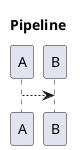

# HCORTEX — Representación Humana de CORTEX

**Document ID:** `HCORTEX-SPEC-0.1`
**Status:** `draft`
**Date:** `2026-07-17`
**Upstream:** `CORTEX-SPEC-0.1-DRAFT-REAL-001`

## 1. Propósito

HCORTEX es la representación humana del codec CORTEX. CORTEX es un lenguaje de máquina para modelos de lenguaje (LLM/SLM), leído y comprendido directamente sin parseo. HCORTEX es su contraparte visual para humanos, usando schemas explícitos que definen cómo se renderiza cada sección.

```text
CORTEX (IA) ←──→ HCORTEX (humano)
```

## 2. Principios

1. **CORTEX es el formato nativo de la IA.** Sin parseo, sin validación.
2. **HCORTEX existe para el humano.** Transforma Ideas en representaciones visuales.
3. **El roundtrip es determinista.** CORTEX → HCORTEX → CORTEX sin pérdida semántica.
4. **El transformador no interpreta.** Solo aplica schemas declarados.
5. **`$0` no se renderiza.** El glosario es exclusivo para la IA.
6. **Schemas por sección, no por sigilo.** El schema se declara a nivel de sección HCORTEX, envolviendo todo su contenido.

## 3. Encabezado

Todo archivo HCORTEX comienza con:

```markdown
<!-- HCORTEX v=0.1 t=canonical -->
```

| Campo | Obligatorio | Valores |
|---|---|---|
| `v` | Sí | `0.1` |
| `t` | Sí | `canonical` (reversible), `readable` (solo visual) |

## 4. Schemas — Pares Apertura/Cierre

HCORTEX usa **bloques emparejados** para declarar el tipo visual de cada sección:

```markdown
<!-- schema:N -->
...contenido de la sección...
<!-- /schema:N -->
```

Donde `N` es el número de sección.

### 4.1 Los 5 schemas

| Schema | Visualización | Ejemplo |
|---|---|---|
| `prose:N` | Texto libre, párrafos | `<!-- prose:4 -->` ... `<!-- /prose:4 -->` |
| `table:N` | Tabla markdown con pipes | `<!-- table:13 -->` ... `<!-- /table:13 -->` |
| `list:N` | Lista con bullets | `<!-- list:1 -->` ... `<!-- /list:1 -->` |
| `check:N` | Checklist con checkboxes | `<!-- check:3 -->` ... `<!-- /check:3 -->` |
| `diagram:N` | Código PUML en fence | `<!-- diagram:5 -->` ... `<!-- /diagram:5 -->` |

### 4.2 Reglas

- **Sin anidamiento** en v0.1. Un schema por sección.
- **Subsecciones** (§N.M) pueden tener su propio schema.
- El schema se declara después del heading de sección y antes del contenido.
- El número N debe coincidir con el número de sección del heading `## §N`.

### 4.3 Ejemplos

**prose:**

```markdown
## §4: Principio Rector

<!-- prose:4 -->
La canonicalización se define después del orden, no antes.
F3-A es requisito previo de F3-G.
<!-- /prose:4 -->
```

**table:**

```markdown
## §13: Validaciones

<!-- table:13 -->
| Tipo | Descripción | Comando | Evidencia |
|---|---|---|---|
| test | Roundtrip 40 casos | `python3 tools/validate.py` | PASS |
| lint | Sin dependencias VIEW | `grep -c view` | 0 |
<!-- /table:13 -->
```

**list:**

```markdown
## §1: Planteamiento

<!-- list:1 -->
- Evidencia del Mini Gate F2
- Revisión transversal independiente
- Cardinalidades inconsistentes
<!-- /list:1 -->
```

**check:**

```markdown
## §3: Precondiciones

<!-- check:3 -->
- [ ] BLP-010 completado
- [ ] Corpus HCORTEX con schemas generado
- [ ] hcortex-0.1.md actualizado
<!-- /check:3 -->
```

**diagram:**

```markdown
## §5: Contexto

<!-- diagram:5 -->

<!-- /diagram:5 -->
```

## 5. Secciones

Las secciones de CORTEX (`$N: Título`) se convierten en headings markdown. Las capas de profundidad cortical (`$N: Título:CAPA`) se preservan como metadata renderizable:

```cortex
$1: IDENTIDAD:CORE
AXM:alfred{...}
```

```markdown
## §1: IDENTIDAD [CORE]

<!-- table:1 -->
| alfred | steward |
<!-- /table:1 -->
```

La capa se preserva en el roundtrip: el compilador extrae `[CAPA]` del heading y lo restaura como `$N: Título:CAPA`.

Las subsecciones (§N.M) son válidas y pueden tener su propio schema.

## 6. Glosario — No se renderiza

`$0` es el glosario de CORTEX. Contiene sigilos, contratos, enums y microtokens. **No se renderiza en HCORTEX.**

Si el documento HCORTEX necesita ser recompilado a CORTEX, puede incluir opcionalmente:

```markdown
<!-- HCORTEX v=0.1 t=canonical -->

<!-- glossary
KNW:knowledge{type:attrs,fields:"topic:text|content:text",focus:content}
OBJ:objective{type:attrs,fields:"goal:text|status:%state",focus:goal}
-->
```

## 7. Roundtrip

El roundtrip CORTEX ↔ HCORTEX es determinista porque los schemas están declarados explícitamente:

```text
CORTEX:
$1: Objetivos:CORE
OBJ:f2{goal:"Formalizar.",status:current}

    ↓ render

HCORTEX:
## §1: Objetivos
<!-- table:1 -->
| Formalizar. | current |
<!-- /table:1 -->

    ↓ compile

CORTEX:
$1: Objetivos:CORE
OBJ:f2{goal:"Formalizar.",status:current}
```

Sin inferencia. Sin ambigüedad. El schema define la transformación.

## 8. Resumen

| Schema | Ejemplo apertura | Contenido |
|---|---|---|
| `prose` | `<!-- prose:4 -->` | Texto libre |
| `table` | `<!-- table:13 -->` | Tabla markdown |
| `list` | `<!-- list:1 -->` | Bullet list |
| `check` | `<!-- check:3 -->` | Checklist |
| `diagram` | `<!-- diagram:5 -->` | PUML en fence |
