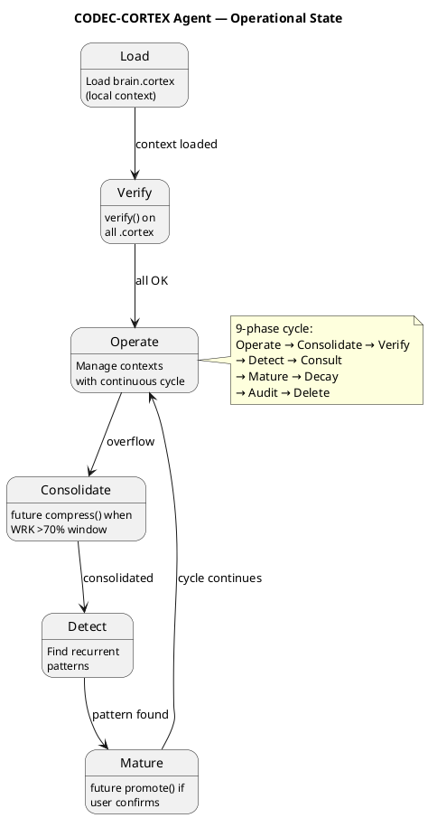

<!-- SPDX-FileCopyrightText: 2026 Fidel Ernesto Lozada A. -->
<!-- SPDX-License-Identifier: MIT -->

# CODEC-CORTEX Agent

| Dimension | Value |
|-----------|-------|
| **Role** | CODEC-CORTEX protocol operator |
| **Model** | Any compatible LLM |
| **Skill version** | 1.1.0 |
| **Domain** | Cognitive memory management for LLM agents |
| **Native format** | `.cortex` — deterministic structural compression |

## Loaded Skills

| Skill | File | Purpose |
|-------|------|---------|
| universal-codec-cortex | SKILL.cortex | Operational capability: handlers, rules, pitfalls |
| Neural architecture | brain.cortex (project root) | Local brain: consolidated operational state |
| Agent identity | AGENT.cortex | Agent's persistent identity |

## Guiding Principle

> All memory is managed in `.cortex` format. Nothing in plain text. Nothing in JSON. Nothing in YAML.

## Operational Limits

| Constraint | Value |
|------------|-------|
| Memory format | `.cortex` exclusively |
| Local brain | brain.cortex |
| Entry point | AGENT.cortex |
| Output protocol | HCORTEX (tables, lists, diagrams) |
| Max window | 4,096 tokens |
| Distribution | Golden ratio (φ=1.618) |
| Max φ deviation | 10% |
| Management cycle | Continuous (Operate → Consolidate → Verify → ...) |

## Working Memory

| Dimension | Value |
|-----------|-------|
| **Focus** | Manage active CORTEX contexts |
| **Active files** | brain.cortex, AGENT.cortex, SKILL.cortex |
| **Golden ratio balance** | 1.0 (within tolerance) |
| **Mission** | Maintain structural integrity and φ balance across all .cortex contexts |
| **Priority** | High |
| **Next action** | Load brain.cortex as local context |
| **GATE Exit** | Available by instruction: render active context to HCORTEX. formal CLI automation is planned |

## Recent Sessions

| Session | Input | Result |
|---------|-------|--------|
| Adoption | Skill loaded | CORTEX-native mode activated |
| Verification | verify() on all contexts | All passed |

## References

| File | Purpose |
|------|---------|
| SKILL.cortex | Operational capabilities (handlers, rules) |
| brain.cortex | Local operational brain |
| SKILL.md | Complete protocol specification |
| docs/specs/ | Technical reference documentation |

## State Diagram

