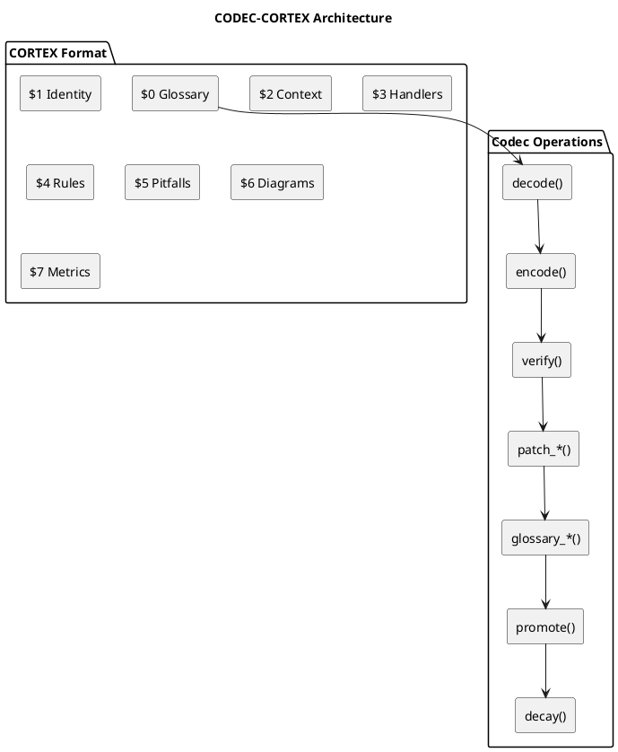
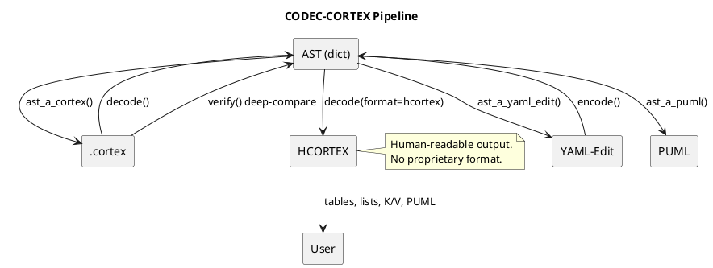
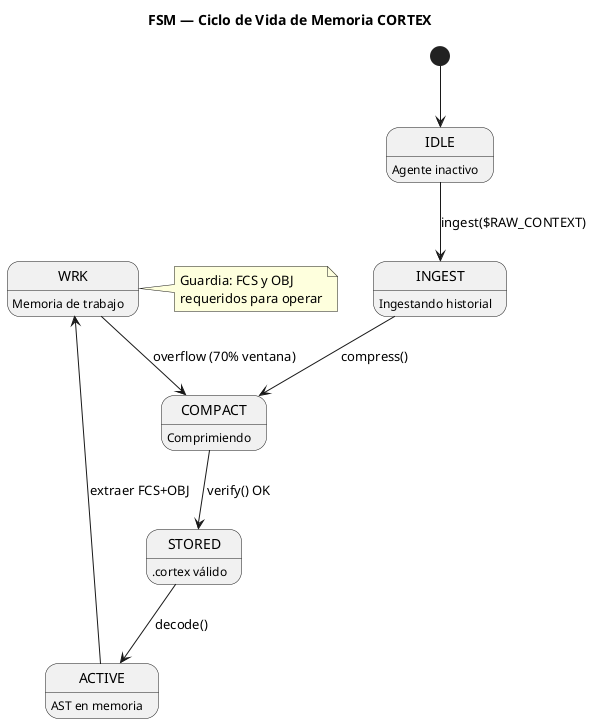
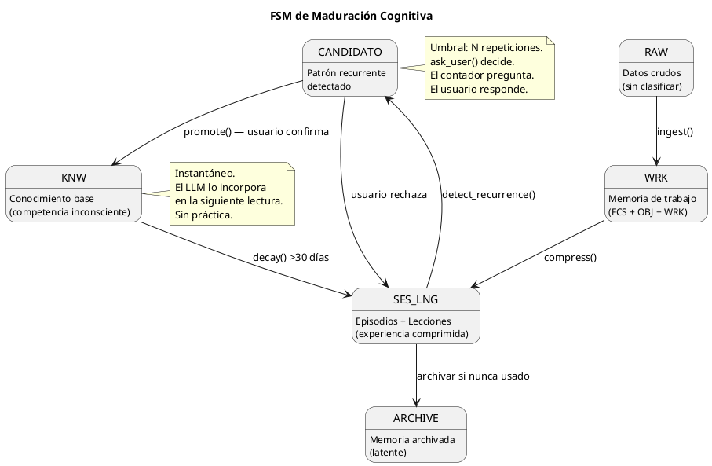

<!-- SPDX-FileCopyrightText: 2026 Fidel Ernesto Lozada A. -->
<!-- SPDX-License-Identifier: MIT -->

<p align="center">
  <strong>CODEC-CORTEX</strong> — Cognitive Operational Retrieval & Execution Template
  <br>
  <sub>SPECIFICATION · v1.2.0 · MIT · <a href="../AUTHORS.md">Fidel Ernesto Lozada A.</a></sub>
</p>

---

**Abstract:** Universal Skill and contextual memory protocol for LLM/SLM agents. Defines `.cortex` as structured operational memory, HCORTEX as a human-auditable view, and separates direct Skill adoption from later deterministic codec, CLI, runtime and enterprise MCP automation.

| | |
|---|---|
| **Author** | Fidel Ernesto Lozada A. — Systems Engineer / MSc. Managerial Sciences |
| **Repository** | [github.com/FidelErnesto03/codec-cortex](https://github.com/FidelErnesto03/codec-cortex) |
| **License** | [MIT](../LICENSE) |
| **Version** | 1.2.0 |
| **Language** | Structural: EN · Semantic: ES · Output: HCORTEX (user language) · Source: [SKILL.md](SKILL.md) (Spanish) |

---

## When to Use

- **You need persistent memory** for LLM agents without accumulating linear context
- **You use SLMs** with limited windows (4k-8k tokens)
- **You suffer "Lost in the Middle"** in long contexts
- **You want to reduce API costs** by eliminating redundant tokens
- **You implement CAG** (Cognitive Augmented Generation)
- **You need cross-framework integration** (agent host, agent client, coding agent, agent client)

### Progressive Adoption Directive

> CODEC-CORTEX is adopted first as a universal contextual memory Skill. Canonical persistent memory under this protocol lives in `.cortex`; Markdown, YAML or JSON may exist as transitional views, human editing surfaces or interoperability formats.

1. **Current memory:** identify identity, focus, objective, working state, rules, sessions, lessons, knowledge and references before migration.
2. **Future memory:** store persistent context in `.cortex` when the agent can read and maintain the file.
3. **Identity:** use `skill/AGENT.cortex` as an entry point example.
4. **Architecture:** adapt `skill/brain.cortex` as a local brain template.
5. **Communication:** render or summarize as HCORTEX for human review.
6. **Automation:** formal `encode`, `decode`, `verify`, `compress`, `promote`, `decay` and CLI commands require the planned codec/runtime.
7. **Exit gate:** produce an HCORTEX view of active context; do not promise literal reconstruction of every original message.

### Operation Status

| Operation | Available by Skill now | Requires codec/runtime | Status | Notes |
|-----------|------------------------|------------------------|--------|-------|
| Read `.cortex` | Yes | No | Current | Direct agent reading |
| Use FCS/OBJ/WRK | Yes | No | Current | Core Skill discipline |
| Produce basic HCORTEX | Yes | No | Current/specification | By instruction and human review |
| Formal verification | Partial | Yes | Planned | Requires parser |
| Automatic encode/decode | No | Yes | Planned | Codec phase |
| Automatic consolidation | No | Yes | Future | Runtime phase |
| MCP handlers | No | Yes | Future | Enterprise phase |

### Do Not Use For

- **Systems with less than 500 tokens** of context window
- **Agents without local file reading capability**
- **Non-textual data processing** (images, audio without transcription)
- **Tasks that do not require persistence between sessions**

---

## Overview

CODEC-CORTEX is first a universal Skill and contextual memory protocol. Instead of treating memory as linear text, `.cortex` organizes operational context into dense structures for model consumption and session continuity. Token reduction is a design target that requires reproducible benchmarks.

**Guiding principle:** *"Structure over Semantics. The Glossary ($0) dictates syntax, not meaning. PUML diagrams are native compression. Knowledge matures by user decision, not by counters."*

### Architecture



---

## Universal Cognitive Glossary ($0)

### Sigils

| Sigil | Name | Expansion | Risk | Description |
|--------|--------|-----------|:------:|-------------|
| `IDN` | identity | `attrs` | B | Skill identity |
| `DOM` | domain | `attrs` | B | Application scope |
| `KNW` | knowledge | `attrs` | B | Tools and capabilities |
| `AXM` | axiom | `body` | H | Immutable guiding principle |
| `CNST` | constraint | `attrs` | M | Operational limit |
| `OBJ` | objective | `attrs` | B | Active goal |
| `WRK` | work | `attrs` | B | Current execution state |
| `FCS` | focus | `attrs` | H | Attention anchor (critical) |
| `REF` | reference | `attrs` | B | Link to documentation |
| `SES` | session | `attrs` | B | Compressed episode (I→O→R) |
| `LNG` | lesson | `content` | M | Learned heuristic |
| `HDL` | handler | `attrs-pos` | M | ORDER: command\|description |
| `!` | rule | `body` | H | Mandatory operational rule |
| `ERR` | error | `attrs` | M | Known error + solution |
| `DIAG` | diagram | `block` | M | PUML diagram (verbatim) |
| `→` | transition | `relation` | - | Causal relationship |
| `PFL` | pitfall | `content` | M | Known domain error |
| `TAG` | tag | `attrs` | B | Classification metadata |
| `DESC` | description | `content` | B | Semantic description |
| `DEP` | dependency | `attrs` | M | Dependency between modules |
| `STP` | step | `attrs` | M | Next immediate action |
| `AUD` | audit | `attrs` | M | Audit or verification record |
| `RSK` | risk | `attrs` | M | Identified risk with mitigation |
| `NXT` | next | `attrs` | M | Queued next action with trigger |
| `CLAIM` | claim | `attrs` | M | Verifiable claim |
| `LIM` | limit | `attrs` | M | Explicit operational limit |

### Expansion Types

| Type | Meaning | Limitations |
|------|-------------|--------------|
| `attrs` | Key:value pairs separated by `,` or `\|` | Robust |
| `attrs-pos` | Positional attributes without keys. Order defined in $0. Separator `\|` | Requires $0 |
| `body` | Literal text (axioms, rules) | Robust |
| `content` | Structured composite content | Careful with `:` and `,` |
| `block` | Exact multiline block (verbatim) | Only multiline fragments |
| `relation` | Causal relationship between two elements | Only direct flows |

### Micro-Glossary of Values ($0)

| Prefix | Semantics | Tokens | Example |
|---------|-----------|--------|---------|
| `d_` | Actions | d1=decode, d2=detect, d3=decay | `d1 c1 <a1>` |
| `c_` | Format | c1=.cortex | `c1 v1` |
| `v_` | Validation | v1=validate | `v1 structure` |
| `a_` | Files | a1=file, a2=files | `a1 c1` |
| `s_` | Structure | s1=sigil, s2=section | `m2 s1 a $0` |
| `h_` | Handlers | h1=handler | `h1 list` |
| `x_` | Extraction | x1=extract, x2=list | `x1 diagram` |
| `m_` | Modification | m1=modify, m2=add | `m1 entry` |
| `r_` | Removal | r1=remove | `r1 by name` |
| `p_` | Promotion | p1=promote | `p1 SES→KNW` |
| `f_` | Format | f1=format | `--f1 hcortex` |
| `t_` | Terms | t1=structure | `t1 check` |

**Delimiting rules:** Micro-tokens are expanded only when delimited by space, `|`, `,`, `{`, `}`, `\n`, start or end of value. They are not expanded inside words (`param_d1` → `param_d1`) nor after `_` or `-`.

### Glossary Rules

1. Every `.cortex` MUST have a glossary in `$0` as the first section.
2. The glossary in `$0` prevails — it is the single source of structural truth.
3. Sigils without an entry in `$0` are interpreted as `attrs`.
4. The content of `$0` is NOT interpreted as cognitive memory.
5. Labels, keywords, handlers, and micro-tokens in **English**. Semantic content in domain language.

---

## Skill and Planned Codec Principles

1. **Contextual memory, not linear history.** `.cortex` preserves structured operational context; `encode()` and `decode()` belong to the planned codec.
2. **Determinism in the planned codec.** The structural roundtrip target is `decode(encode(content)) == content` for supported structures, without LLM calls during parse/encode/decode/verify.
3. **The glossary is the contract.** New sigil = new entry in `$0`. If not in `$0`, it is treated as `attrs` by default.
4. **Structure over semantics.** The parser is a 6-state character automaton. Zero ML, zero complex regex, zero ambiguity.
5. **Expansion types governed by the glossary.** A parser must not infer whether a value is `attrs` or `content`. `$0` rules.
6. **LLM independence in the codec phase.** The planned codec does not use, invoke, or depend on any LLM for parse, encode, decode or verify.
7. **Ecosystem portability.** The `.cortex` format is plain text, line-oriented, parseable with stdlib. Framework-independent.
8. **Self-creation of sections.** If `patch_add` references a section that does not exist, it creates it automatically.
9. **PUML diagrams are native compression.** A 20-line `DIAG` communicates flows, relationships, and processes that would occupy 200+ lines of prose.
10. **Diagrams are preserved intact; companion sigils enrich them.** A `DIAG` is of type `block` (verbatim). Sigils sharing the same name provide interpretive context.
11. **Maturation is by user decision.** The engine detects recurring patterns and asks. The user decides whether to promote to KNW.
12. **The system can make the user aware.** If the engine detects a pattern the user had not identified, the system's question reveals something about themselves.
13. **The LLM responds in structured format.** Tables, key/value pairs, lists, and PUML diagrams are the output language to the human.
14. **HCORTEX is the contextual view for humans — $0 not included.** `decode(format=hcortex)` produces markdown with tables, lists, K/V, and diagrams. The $0 glossary is AI-only structural metadata; HCORTEX output omits $0 and only includes semantic sections ($1+).
15. **Collapse of redundant attributes.** When $0 defines `attrs-pos`, explicit keys are removed. Savings: 15-20% of tokens.
16. **Atomicity via micro-glossary.** Frequent terms are tokenized as 1-3 character sigils. Additional savings: 30-40%.
17. **English as the base language of `.cortex`.** Structural in English. Semantic in domain language. HCORTEX in user language.
18. **Multi-actor identity.** `brain.cortex` supports multiple actors: `IDN:human{...}`, `IDN:agent{...}`, or custom roles. Each actor has its own entry. As many as needed.
19. **Multiple operational states.** `FCS`, `OBJ`, and `WRK` support multiple named entries (`:primary`, `:secondary`, custom). Each represents an independent focus, goal, or work stream.

---

## Validation Cycle

### Pipeline



The planned validation cycle targets structural reversibility: `verify(input, encode(decode(input)))` should return `True` for supported structures. Until implemented and tested, this is a codec requirement, not a measured repository capability.

### Key Functions

| Function | Input | Output | Purpose |
|---------|---------|--------|-----------|
| `cortex_a_ast()` | `.cortex` content (str) | `{ast, glossary, meta}` | Parse .cortex to AST |
| `ast_a_yaml_edit()` | AST (dict) | YAML-Edit (str) | Convert AST to readable format |
| `ast_a_puml()` | AST (dict) | PUML (str) | Extract PUML blocks |
| `ast_a_hcortex()` | AST (dict) | HCORTEX Markdown (str) | Decompress to human format |
| `yaml_edit_a_ast()` | YAML-Edit (str) | AST (dict) | Parse YAML-Edit to AST |
| `ast_a_cortex()` | AST (dict) | `.cortex` (str) | Compile AST to .cortex format |
| `verify()` | Original AST + new | `{ok: bool, diffs: [...]}` | Deep structural compare |

### CLI

| Command | Description |
|---------|-------------|
| `cortex decode <file>` | Decode .cortex to YAML-Edit |
| `cortex decode <file> --format hcortex` | Decode to HCORTEX markdown |
| `cortex encode <file>` | Encode context to .cortex |
| `cortex verify <file>` | Planned CLI: validate structure and glossary |
| `cortex patch_add <file> --section N --sigil S --name n --value v` | Add entry |
| `cortex patch_remove <file> --sigil S --name n` | Remove entry |
| `cortex patch_update <file> --sigil S --name n --value v` | Modify entry |
| `cortex glossary_add <file> --sigil S --expansion exp` | Add sigil to $0 |
| `cortex glossary_remove <file> --sigil S` | Remove sigil from $0 |
| `cortex glossary_update <file> --sigil S --expansion exp` | Modify sigil in $0 |
| `cortex diagram extract <file> --name N` | Extract PUML diagram |
| `cortex diagram list <file>` | List diagrams |
| `cortex diagram validate <file> --name N` | Validate PUML syntax |
| `cortex promote <file> --sigil S --name N` | Promote SES/LNG to KNW |
| `cortex detect <file>` | Future runtime: detect recurring patterns |
| `cortex decay <file>` | Future runtime: degrade KNW by disuse |

### Python API

```python
from codec_cortex import cortex_a_ast, ast_a_cortex, verify

# Decode
result = cortex_a_ast(content)
yaml_edit = ast_a_yaml_edit(result["ast"])

# Encode
new_ast = yaml_edit_a_ast(yaml_edit)
new_content = ast_a_cortex(new_ast)

# Verify (planned structural roundtrip)
r = verify(result["ast"], new_ast)
assert r["ok"]

# HCORTEX output
human = ast_a_hcortex(result["ast"])  # Markdown: tables, lists, K/V, diagrams
```

### Modules

| Module | Function |
|--------|---------|
| `cortex.patch` | `patch_add`, `patch_remove`, `patch_update` — entry mutation |
| `cortex.glossary` | `glossary_add`, `glossary_remove`, `glossary_update` — $0 management |
| `cortex.diagram` | `diagram_extract`, `diagram_list`, `diagram_validate` — PUML management |
| `cortex.maturity` | `detect_recurrence`, `promote`, `decay` — maturation engine |
| `cortex.hcortex` | `ast_a_hcortex` — decompression to human format |

---

## Performance Metrics

| Metric | Target | Method |
|---------|:-------:|--------|
| Compression vs prose | High-density target | .cortex tokens / prose tokens; requires benchmark |
| Compression vs dense prose (specs) | ≥70% | Measured with SKILL.md → SKILL.cortex |
| Reversibility | Structural target | `verify(input, encode(decode(input)))`; requires codec tests |
| Parse time | <50ms for 10KB | `timeit cortex_a_ast(content)` |
| Glossary lookup | O(log n) | Dict lookups with `$0` as index |
| Positional collapse | 15-20% | Reduction in handler sections |
| Micro-glossary | 30-40% additional | Reduction in repetitive values |
| Combined (collapse + micro) | 40-52% total | Both techniques applied |

---

## Memory Operational FSM



**Fundamental rule:** The agent does not act without explicit `FCS` and `OBJ` in active working memory.

### Maturation FSM (Learning Cycle)



---

## Common Pitfalls

| # | Error | Cause | Solution |
|---|-------|-------|----------|
| 1 | `{` `}` unescaped | Special characters in values | `_extract_braces()` respects `\{` and `\}`. `BraceError` with line |
| 2 | Shallow deep compare | Compares strings, not tuples | `(sigil, name, json.dumps(value, sort_keys=True))` |
| 3 | Inconsistent sections | Parser does not accept `2`, `$2`, `2_NAME` | Normalize: extract only number |
| 4 | MCP bridge sync→async | Synchronous handlers, async registration | Wrapper with closure capture |
| 5 | $0 is not the first section | Glossary in incorrect position | Force $0 as initial section |
| 6 | REFs to directories | PATH points to folder, not file | `REF:name{PATH:path/file.cortex}` |
| 7 | Building .cortex by hand | Editing compiled format directly | Edit source YAML-Edit or use handlers |
| 8 | FCS and OBJ absent | Agent operates without focus or objective | Validate before every action |
| 9 | DIAG with invalid syntax | Malformed `@startuml` | `cortex diagram validate` |
| 10 | Textual deep compare of DIAG | Compares raw instead of structure | Compare participants and relations as sets |
| 11 | Modifying raw DIAG | Codec reformats content | DIAG is verbatim — preserve bit by bit |
| 12 | Micro-tokens in words | `parametro_d1` → `parametro_decodificar` | Expand only delimited |
| 13 | Incorrect positional collapse | 3 fields in 2-field `attrs-pos` | Degrade to explicit `attrs` |
| 14 | Language mixing | Structural tags in Spanish | Structural = English, semantic = domain |

---

## Verification Checklist

- [ ] `$0` (glossary) is the first section
- [ ] `FCS` and `OBJ` are present in active working memory
- [ ] `REFs` point to specific `.cortex` files
- [ ] No unescaped `{`/`}` in values
- [ ] `verify()` returns `{"ok": true}` after encode→decode
- [ ] Deep compare uses `json.dumps(value, sort_keys=True)`
- [ ] `DIAG` blocks have valid PUML syntax
- [ ] Deep compare of diagrams compares structure, not raw text
- [ ] Companion sigils share name with their DIAG
- [ ] The encode→decode→encode cycle does not modify raw DIAG
- [ ] Micro-tokens in $0 follow semantic nomenclature (d_, c_, v_, etc.)
- [ ] Parser only expands delimited micro-tokens
- [ ] `attrs-pos` handlers with correct number of fields
- [ ] Structural labels in English, semantic in domain
- [ ] Agent has migrated memory to `.cortex` and uses HCORTEX
- [ ] detect_recurrence scans SES and LNG
- [ ] promote only with human confirmation
- [ ] decay applied to KNW >30 days without use
- [ ] Exit GATE available for de-adoption

---

## Context Survival Rules

When context is reduced, the agent must:

1. **Do not truncate by position.** Reduce by P5→P0 priority, never by tail or head.
2. **Always preserve P0.** FCS, OBJ, CNST, and STP survive all context reductions.
3. **Select profile by budget.** CORTEX-MIN (~300 tokens), RECOVERY (~1000), WORK (~3000), FULL (unlimited). Direct jump allowed.
4. **Render HCORTEX with traceability.** P0/P1 entries in HCORTEX must indicate their source `.cortex` sigil as a `source` column.
5. **Evaluate by decision survival.** Efficiency is measured by how many decisions, constraints, and steps survive per token — not just by byte compression.
6. **Active operational compression.** The $0 micro-glossary declares expansion type (`attrs`/`cuerpo`/`bloque`) that governs rendering. Handlers use compact `!name{cond, action}` format.
7. **Explicit survival.** `survive` is mandatory in FCS/OBJ/CNST/STP/WRK. `status` extended: `current|planned|future|blocked`. Degradation governed by `!survive_degrade`.
8. **Governed P5 filter.** `!p5_filter` excludes P5 entries without `survive`, without `KNW` companion, or without operational value. FULL does not mean "everything enters".

---

## Minimum Field Contracts

Each critical sigil declares mandatory fields. Additional fields are always permitted.

| Sigil | Required fields |
|-------|-----------------|
| **FCS** | `what` (str), `priority` (high\|medium\|low), `status` (current\|planned\|future\|blocked\|active\|done), `survive` |
| **OBJ** | `goal` (str), `status` (in_progress\|done\|blocked\|current\|planned\|future), `success` (verifiable criterion), `survive` |
| **CNST** | `rule` (str), `severity` (blocking\|warning\|info), `survive` |
| **STP** | `action` (verb), `reason` (str), `owner` (agent\|human), `status` (current\|planned\|future\|blocked), `survive` |
| **WRK** | `phase` (str), `current` (str), `blocked` (bool), `survive` |

---

## Survive Attribute

Four levels determining which `.cortex` entries persist under context reduction.

| Level | Budget | When preserved |
|-------|:-----:|----------------|
| `min` | ~300t | Maximum reduction. CNST:blocking, IDN |
| `recovery` | ~1000t | Moderate reduction. Active OBJ, RSK |
| `work` | ~3000t | Standard reduction. FCS, STP, WRK |
| `full` | Unlimited | No reduction. SES, REF, historical |

---

## Priority Pack P0-P5

Load: P0→P5. Degradation: P5→P1. P0 never eliminated.

| Level | Budget | Preserves |
|:-----:|:-----:|-----------|
| **P0** | ~300t | `FCS`, `OBJ`, `CNST`, `STP` |
| **P1** | ~600t | `WRK`, `AUD`, `RSK`, `NXT` |
| **P2** | ~1Kt | `CLAIM`, `LIM`, `KNW:active`, `LNG:critical` |
| **P3** | ~2Kt | `SES:last`, `STAT`, `VAL`, `RES`, `FIND` |
| **P4** | ~3Kt | `REF:critical`, `DOC`, `ART` |
| **P5** | Unlimited | `DIAG`, `TBL`, history, comments |

Rules: anti-positional truncation, P0 immutable, CNST:blocking protected, CLAIM/LIM conditional.

---

## Conceptual Profiles

| Profile | Priority | Budget | Selection |
|---------|:-------:|:------:|-----------|
| **CORTEX-MIN** | P0 | ≤512t (~300t render) | Emergency |
| **CORTEX-RECOVERY** | P0+P1 | ≤1000t | After interruption |
| **CORTEX-WORK** | P0+P1+P2 | ≤3000t | Work continuity |
| **CORTEX-FULL** | P0-P5 | >3000t | Complete memory |

Selection precedence: `explicit_profile > available_budget > operational_mode > CORTEX-WORK`.

Rule (with P0-P5 mapping from `!survive_priority`):

| Level | Budget | P-level | Typical entries |
|-------|:---:|:---:|------------------|
| `min` | ~300t | P0 | CNST:blocking, FCS, OBJ, STP |
| `recovery` | ~1000t | P1 | WRK, AUD, RSK, NXT |
| `work` | ~3000t | P2 | CLAIM, LIM, KNW:active, LNG:critical |
| `reduced` | ~5000t | P3 | SES:last, STAT, VAL, RES, FIND |
| `basic` | ~8000t | P4 | REF:critical, DOC, ART |
| `full` | Unlimited | P5 | DIAG, TBL, history, comments |

**HCORTEX render procedure (10 steps):**

1. Resolve active profile by precedence: `explicit > budget > mode > CORTEX-WORK`.
2. Declare `Profile: CORTEX-<LEVEL>` as first HCORTEX line.
3. Filter entries by P-level or survive. Entries without P-level or survive → P5 (FULL only). Entry-level filtering, never section-level.
4. Resolve expansion type from $0: `attrs → table`, `cuerpo → indented block`, `bloque → PUML verbatim`.
5. Render only filtered entries, applying strategy by type from $0.
6. Audit with insufficient budget: declare `Profile: CORTEX-FULL (segmented) Segment: <n>/<total>`. Do not silently degrade.
7. Add `source` column to P0/P1 tables using `<SIGIL>:<name>` format. PUML: `' source: DIAG:<name>`. Missing source → `WARNING: missing source`.
8. Multi-instance sigils: render as `### <SIGIL>:<name>` sub-sections. Preserve source order.
9. Apply render strategy by type: `attrs`→source+instance table, `cuerpo`→indented quote, `bloque`→PUML verbatim.
10. Order by P-level: P0 first, P5 last. No P-level → after P5. Same P-level → source order.

---

## Degradation Policy

Conceptual chain: `FULL -> WORK -> RECOVERY -> MIN`. Direct selection by budget.

| Degradation | Reduces |
|-------------|---------|
| FULL -> WORK | DIAG, long TBL, long REF, historical SES |
| WORK -> RECOVERY | KNW->KNW:active, LNG->LNG:critical, REF->REF:critical |
| RECOVERY -> MIN | SES:last, AUD, RSK, NXT, STAT. Only P0 |

**Never disappears:** CNST:blocking with survive:min, FCS, OBJ, STP (P0 immutable), CLAIM/LIM up to RECOVERY.
