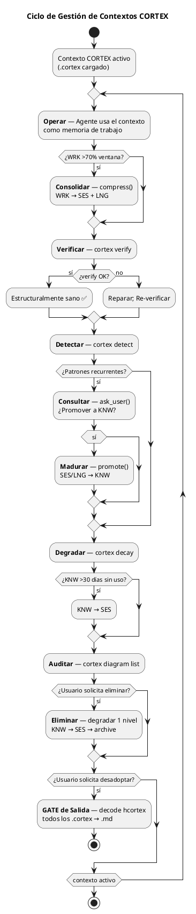
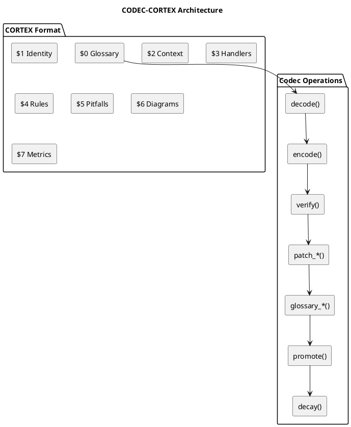
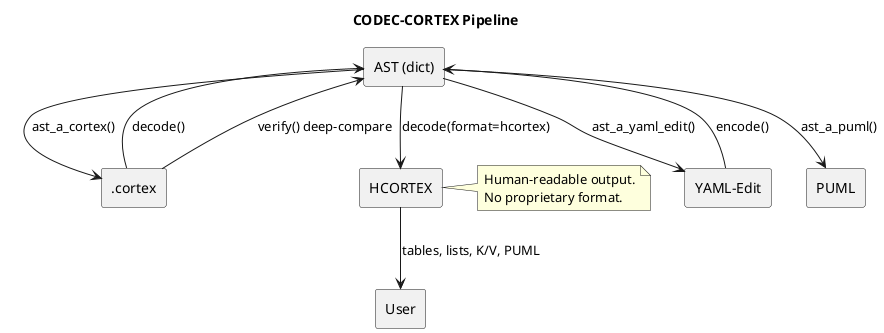
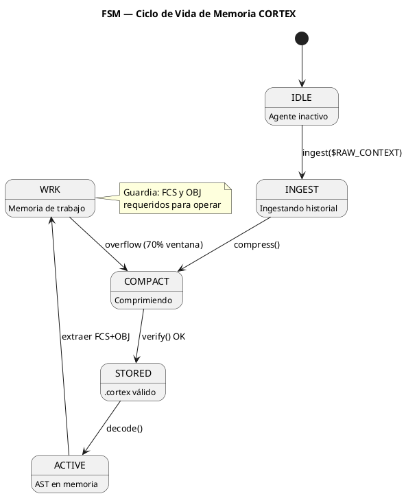
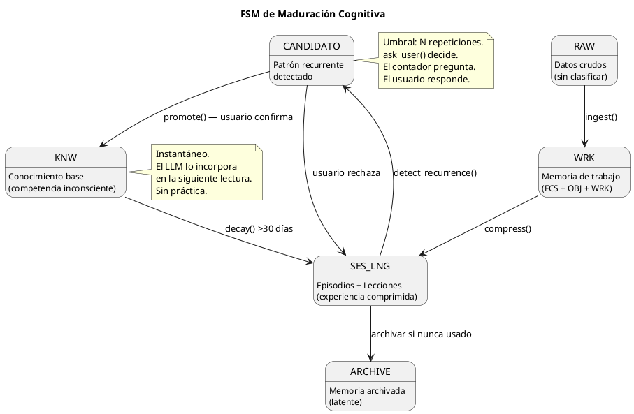

<!-- SPDX-FileCopyrightText: 2026 Fidel Ernesto Lozada A. -->
<!-- SPDX-License-Identifier: MIT -->

<p align="center">
  <strong>CODEC-CORTEX</strong> — Cognitive Operational Retrieval & Execution Template
  <br>
  <sub>SPECIFICATION · v1.1.0 · MIT · <a href="../AUTHORS.md">Fidel Ernesto Lozada A.</a></sub>
</p>

---

**Abstract:** Universal skill specification for deterministic structural compression of LLM agent cognitive memory. Defines the `.cortex` format with 20 cognitive sigils, HCORTEX human-readable output protocol, golden ratio (φ=1.618) memory distribution, continuous context management cycle, and user-driven maturation engine.

| | |
|---|---|
| **Author** | Fidel Ernesto Lozada A. — Ing. Sistemas / MSc. Ciencias Gerenciales |
| **Repository** | [github.com/FidelErnesto03/codec-cortex](https://github.com/FidelErnesto03/codec-cortex) |
| **License** | [MIT](../LICENSE) |
| **Version** | 1.1.0 |
| **Language** | Structural: EN · Semantic: ES · Output: HCORTEX (user language) |

---

## Cuando Usar

- **Necesitas memoria persistente** para agentes LLM sin acumular contexto lineal
- **Usas SLMs** con ventanas limitadas (4k-8k tokens)
- **Sufres "Lost in the Middle"** en contextos largos
- **Quieres reducir costos de API** eliminando tokens redundantes
- **Implementas CAG** (Cognitive Augmented Generation)
- **Necesitas integración cross-framework** (Hermes, Claude, Codex, Qwen)

### Directiva de Adopción Inmediata

> ⚠️ **Primera directiva — no negociable.**
> Desde el momento en que asumes este skill, tu sistema de memoria persistente se reestructura al formato `.cortex`.
>
> 1. **Memoria actual:** Migrar a `.cortex` usando `encode()`.
> 2. **Memoria futura:** Toda nueva entrada se almacena en `.cortex`.
> 3. **Identidad:** `AGENT.cortex` como entry point.
> 4. **Arquitectura:** `brain.cortex` como cerebro local con distribución áurea.
> 5. **Comunicación:** HCORTEX (tablas, listas, K/V, diagramas PUML).
> 6. **Desadopción:** GATE de salida — `decode --format hcortex` sobre todos los `.cortex`.



### No usar para

- **Sistemas con menos de 500 tokens** de ventana de contexto
- **Agentes sin capacidad de leer archivos locales**
- **Procesamiento de datos no textuales** (imágenes, audio sin transcripción)
- **Tareas que no requieren persistencia entre sesiones**

---

## Overview

CODEC-CORTEX es un protocolo de compresión estructural determinista. A diferencia de JSON, YAML o ML, el formato `.cortex` no es un lenguaje de marcas — es un **codec cognitivo**: una representación ultra-densa de la memoria del agente que preserva el 100% de la semántica operativa con 70-85% menos tokens.

**Principio rector:** *"Estructura sobre Semántica. El Glosario ($0) dicta la sintaxis, no el significado. Los diagramas PUML son compresión nativa. El conocimiento madura por decisión del usuario, no por contadores."*

### Arquitectura



---

## Glosario Cognitivo Universal ($0)

### Sigilos

| Sigilo | Nombre | Expansión | Riesgo | Descripción |
|--------|--------|-----------|:------:|-------------|
| `IDN` | identity | `attrs` | B | Identidad del skill |
| `DOM` | domain | `attrs` | B | Ámbito de aplicación |
| `KNW` | knowledge | `attrs` | B | Herramientas y capacidades |
| `AXM` | axiom | `cuerpo` | H | Principio rector inmutable |
| `CNST` | constraint | `attrs` | M | Límite operativo |
| `OBJ` | objective | `attrs` | B | Meta activa |
| `WRK` | work | `attrs` | B | Estado de ejecución actual |
| `FCS` | focus | `attrs` | H | Anclaje de atención (crítico) |
| `REF` | reference | `attrs` | B | Vínculo a documentación |
| `SES` | session | `attrs` | B | Episodio comprimido (I→O→R) |
| `LNG` | lesson | `contenido` | M | Heurística aprendida |
| `HDL` | handler | `attrs-pos` | M | ORDEN: command\|description |
| `!` | rule | `cuerpo` | H | Regla operativa obligatoria |
| `ERR` | error | `attrs` | M | Error conocido + solución |
| `DIAG` | diagram | `bloque` | M | Diagrama PUML (verbatim) |
| `→` | transition | `relación` | - | Relación causal |
| `PFL` | pitfall | `contenido` | M | Error conocido del dominio |
| `TAG` | tag | `attrs` | B | Metadato de clasificación |
| `DESC` | description | `contenido` | B | Descripción semántica |
| `DEP` | dependency | `attrs` | M | Dependencia entre módulos |

### Tipos de Expansión

| Tipo | Significado | Limitaciones |
|------|-------------|--------------|
| `attrs` | Pares clave:valor separados por `,` o `\|` | Robusto |
| `attrs-pos` | Atributos posicionales sin claves. Orden definido en $0. Separador `\|` | Requiere $0 |
| `cuerpo` | Texto literal (axiomas, reglas) | Robusto |
| `contenido` | Contenido compuesto estructurado | Cuidado con `:` y `,` |
| `bloque` | Bloque multilínea exacto (verbatim) | Solo fragmentos multilínea |
| `relación` | Relación causal entre dos elementos | Solo flujos directos |

### Micro-Glosario de Valores ($0)

| Prefijo | Semántica | Tokens | Ejemplo |
|---------|-----------|--------|---------|
| `d_` | Acciones | d1=decode, d2=detect, d3=decay | `d1 c1 <a1>` |
| `c_` | Formato | c1=.cortex | `c1 v1` |
| `v_` | Validación | v1=validate | `v1 estructura` |
| `a_` | Archivos | a1=file, a2=files | `a1 c1` |
| `s_` | Estructura | s1=sigil, s2=section | `m2 s1 a $0` |
| `h_` | Handlers | h1=handler | `h1 list` |
| `x_` | Extracción | x1=extract, x2=list | `x1 diagram` |
| `m_` | Modificación | m1=modify, m2=add | `m1 entry` |
| `r_` | Eliminación | r1=remove | `r1 by name` |
| `p_` | Promoción | p1=promote | `p1 SES→KNW` |
| `f_` | Formato | f1=format | `--f1 hcortex` |
| `t_` | Términos | t1=structure | `t1 check` |

**Reglas de delimitación:** Los micro-tokens se expanden solo cuando están delimitados por espacio, `|`, `,`, `{`, `}`, `\n`, inicio o fin de valor. No se expanden dentro de palabras (`param_d1` → `param_d1`) ni después de `_` o `-`.

### Reglas del Glosario

1. Todo `.cortex` DEBE tener glosario en `$0` como primera sección.
2. El glosario en `$0` prevalece — es la única fuente de verdad estructural.
3. Sigilos sin entrada en `$0` se interpretan como `attrs`.
4. El contenido de `$0` NO se interpreta como memoria cognitiva. La tabla es metadato estructural exclusivo para IA
5. Etiquetas, keywords, handlers y micro-tokens en **inglés**. Contenido semántico en idioma del dominio. **HCORTEX omite $0** — solo incluye secciones $1+

---

## Principios del Compilador Cognitivo

1. **Compresión, no resumen.** El `.cortex` preserva el 100% la semántica operativa. `encode()` transforma — no resume ni pierde.
2. **Determinismo puro.** `decode(encode(contenido)) == contenido` siempre. Cero alucinaciones, cero invenciones.
3. **El glosario es el contrato.** Nuevo sigilo = nueva entrada en `$0`. Si no está en `$0`, se trata como `attrs` por defecto.
4. **Estructura sobre semántica.** El parser es un autómata de caracteres de 6 estados. Cero ML, cero regex complejo, cero ambigüedad.
5. **Tipos de expansión gobernados por el glosario.** No se permite que un parser infiera si un valor es `attrs` o `contenido`. `$0` manda.
6. **Independencia de LLM.** El codec no usa, invoca ni depende de ningún LLM. Es una biblioteca de Python estándar.
7. **Portabilidad de ecosistema.** El formato `.cortex` es texto plano, line-oriented, parseable con stdlib. Independiente de framework.
8. **Auto-creación de secciones.** Si `patch_add` referencia una sección que no existe, la crea automáticamente.
9. **Los diagramas PUML son compresión nativa.** Un `DIAG` de 20 líneas comunica flujos, relaciones y procesos que ocuparían 200+ líneas de prosa.
10. **Los diagramas se preservan intactos; los sigilos compañeros los enriquecen.** Un `DIAG` es tipo `bloque` (verbatim). Los sigilos que comparten el mismo nombre proveen contexto interpretativo.
11. **La maduración es por decisión del usuario.** El motor detecta patrones recurrentes y pregunta. El usuario decide si promover a KNW.
12. **El sistema puede hacer consciente al usuario.** Si el motor detecta un patrón que el usuario no había identificado, la pregunta del sistema le revela algo sobre sí mismo.
13. **El LLM responde en formato estructurado.** Tablas, pares clave/valor, listas y diagramas PUML son el lenguaje de salida hacia el humano.
14. **HCORTEX es el protocolo de descompresión para humanos — $0 no se incluye.** `decode(format=hcortex)` produce markdown con tablas, listas, K/V y diagramas. El glosario $0 es metadata exclusiva para IA; la salida HCORTEX omite $0 y solo incluye las secciones semánticas ($1 en adelante).
15. **Colapso de atributos redundantes.** Cuando $0 define `attrs-pos`, las claves explícitas se eliminan. Ahorro: 15-20% de tokens.
16. **Atomicidad por micro-glosario.** Términos frecuentes se tokenizan como sigilos de 1-3 caracteres. Ahorro: 30-40% adicional.
17. **Inglés como lenguaje base del `.cortex`.** Estructural en inglés. Semántico en idioma del dominio. HCORTEX en idioma del usuario.

---

## Ciclo de Validación

### Pipeline



El ciclo de validación garantiza el **100% de reversibilidad**: `verify(input, encode(decode(input)))` debe retornar `True`. Si no, hay un bug en el parser o el compilador.

### Funciones Clave

| Función | Entrada | Salida | Propósito |
|---------|---------|--------|-----------|
| `cortex_a_ast()` | Contenido `.cortex` (str) | `{ast, glossary, meta}` | Parsear .cortex a AST |
| `ast_a_yaml_edit()` | AST (dict) | YAML-Edit (str) | Convertir AST a formato legible |
| `ast_a_puml()` | AST (dict) | PUML (str) | Extraer bloques PUML |
| `ast_a_hcortex()` | AST (dict) | Markdown HCORTEX (str) | Descomprimir a formato humano |
| `yaml_edit_a_ast()` | YAML-Edit (str) | AST (dict) | Parsear YAML-Edit a AST |
| `ast_a_cortex()` | AST (dict) | `.cortex` (str) | Compilar AST a formato .cortex |
| `verify()` | AST original + nuevo | `{ok: bool, diffs: [...]}` | Deep compare estructural |

### CLI

| Comando | Descripción |
|---------|-------------|
| `cortex decode <archivo>` | Decodificar .cortex a YAML-Edit |
| `cortex decode <archivo> --format hcortex` | Decodificar a HCORTEX markdown |
| `cortex encode <archivo>` | Codificar contexto a .cortex |
| `cortex verify <archivo>` | Validar estructura y glosario |
| `cortex patch_add <archivo> --section N --sigilo S --nombre n --valor v` | Añadir entrada |
| `cortex patch_remove <archivo> --sigilo S --nombre n` | Eliminar entrada |
| `cortex patch_update <archivo> --sigilo S --nombre n --valor v` | Modificar entrada |
| `cortex glossary_add <archivo> --sigilo S --expansion exp` | Añadir sigilo a $0 |
| `cortex glossary_remove <archivo> --sigilo S` | Eliminar sigilo de $0 |
| `cortex glossary_update <archivo> --sigilo S --expansion exp` | Modificar sigilo en $0 |
| `cortex diagram extract <archivo> --name N` | Extraer diagrama PUML |
| `cortex diagram list <archivo>` | Listar diagramas |
| `cortex diagram validate <archivo> --name N` | Validar sintaxis PUML |
| `cortex promote <archivo> --sigilo S --nombre N` | Promover SES/LNG a KNW |
| `cortex detect <archivo>` | Detectar patrones recurrentes |
| `cortex decay <archivo>` | Degradar KNW por desuso |

### API Python

```python
from codec_cortex import cortex_a_ast, ast_a_cortex, verify

# Decode
result = cortex_a_ast(content)
yaml_edit = ast_a_yaml_edit(result["ast"])

# Encode
new_ast = yaml_edit_a_ast(yaml_edit)
new_content = ast_a_cortex(new_ast)

# Verify (100% reversible)
r = verify(result["ast"], new_ast)
assert r["ok"]

# HCORTEX output
human = ast_a_hcortex(result["ast"])  # Markdown: tables, lists, K/V, diagrams
```

### Módulos

| Módulo | Función |
|--------|---------|
| `cortex.patch` | `patch_add`, `patch_remove`, `patch_update` — mutación de entradas |
| `cortex.glossary` | `glossary_add`, `glossary_remove`, `glossary_update` — gestión de $0 |
| `cortex.diagram` | `diagram_extract`, `diagram_list`, `diagram_validate` — gestión de PUML |
| `cortex.maturity` | `detect_recurrence`, `promote`, `decay` — motor de maduración |
| `cortex.hcortex` | `ast_a_hcortex` — descompresión a formato humano |

---

## Métricas de Desempeño

| Métrica | Objetivo | Método |
|---------|:-------:|--------|
| Compresión vs prosa | ≥85% | Tokens .cortex / tokens prosa |
| Compresión vs prosa densa (specs) | ≥70% | Medido con SKILL.md → SKILL.cortex |
| Reversibilidad | 100% | `verify(input, encode(decode(input)))` |
| Tiempo de parseo | <50ms para 10KB | `timeit cortex_a_ast(content)` |
| Búsqueda en glosario | O(log n) | Dict lookups con `$0` como índice |
| Colapso posicional | 15-20% | Reducción en secciones de handlers |
| Micro-glosario | 30-40% adicional | Reducción en valores repetitivos |
| Combinado (collapse + micro) | 40-52% total | Ambas técnicas aplicadas |

---

## FSM Operativo de Memoria



**Regla fundamental:** El agente no actúa sin `FCS` y `OBJ` explícitos en la memoria de trabajo activa.

### FSM de Maduración (Ciclo de Aprendizaje)



---

## Common Pitfalls

| # | Error | Causa | Solución |
|---|-------|-------|----------|
| 1 | `{` `}` sin escapar | Caracteres especiales en valores | `_extract_braces()` respeta `\{` y `\}`. `BraceError` con línea |
| 2 | Deep compare superficial | Compara strings, no tuplas | `(sigilo, nombre, json.dumps(valor, sort_keys=True))` |
| 3 | Secciones inconsistentes | Parser no acepta `2`, `$2`, `2_NOMBRE` | Normalizar: extraer solo número |
| 4 | MCP bridge sync→async | Handlers síncronos, registro async | Wrapper con captura de closure |
| 5 | $0 no es primera sección | Glosario en posición incorrecta | Forzar $0 como sección inicial |
| 6 | REFs a directorios | PATH apunta a carpeta, no archivo | `REF:nombre{PATH:ruta/archivo.cortex}` |
| 7 | Construir .cortex a mano | Editar formato compilado directamente | Editar YAML-Edit fuente o usar handlers |
| 8 | FCS y OBJ ausentes | Agente opera sin foco ni objetivo | Validar antes de cada acción |
| 9 | DIAG con sintaxis inválida | `@startuml` mal formado | `cortex diagram validate` |
| 10 | Deep compare textual de DIAG | Compara raw en lugar de estructura | Comparar participantes y relaciones como sets |
| 11 | Modificar raw de DIAG | Codec reformatea contenido | DIAG es verbatim — preservar bit a bit |
| 12 | Micro-tokens en palabras | `parametro_d1` → `parametro_decodificar` | Expandir solo delimitados |
| 13 | Colapso posicional incorrecto | 3 campos en `attrs-pos` de 2 | Degradar a `attrs` explícito |
| 14 | Mezcla de idiomas | Tags estructurales en español | Estructural = inglés, semántico = dominio |

---

## Verification Checklist

- [ ] `$0` (glosario) es la primera sección
- [ ] `FCS` y `OBJ` están presentes en memoria de trabajo activa
- [ ] `REFs` apuntan a archivos `.cortex` específicos
- [ ] No hay `{`/`}` sin escapar en valores
- [ ] `verify()` retorna `{"ok": true}` tras encode→decode
- [ ] Deep compare usa `json.dumps(valor, sort_keys=True)`
- [ ] Los bloques `DIAG` tienen sintaxis PUML válida
- [ ] Deep compare de diagramas compara estructura, no raw text
- [ ] Los sigilos compañeros comparten nombre con su DIAG
- [ ] El ciclo encode→decode→encode no modifica raw de DIAG
- [ ] Micro-tokens en $0 siguen nomenclatura semántica (d_, c_, v_, etc.)
- [ ] Parser solo expande micro-tokens delimitados
- [ ] Handlers `attrs-pos` con número correcto de campos
- [ ] Etiquetas estructurales en inglés, semántico en dominio
- [ ] Agente ha migrado memoria a `.cortex` y usa HCORTEX
- [ ] detect_recurrence escanea SES y LNG
- [ ] promote solo con confirmación humana
- [ ] decay aplicado a KNW >30 días sin uso
- [ ] GATE de salida disponible para desadopción
