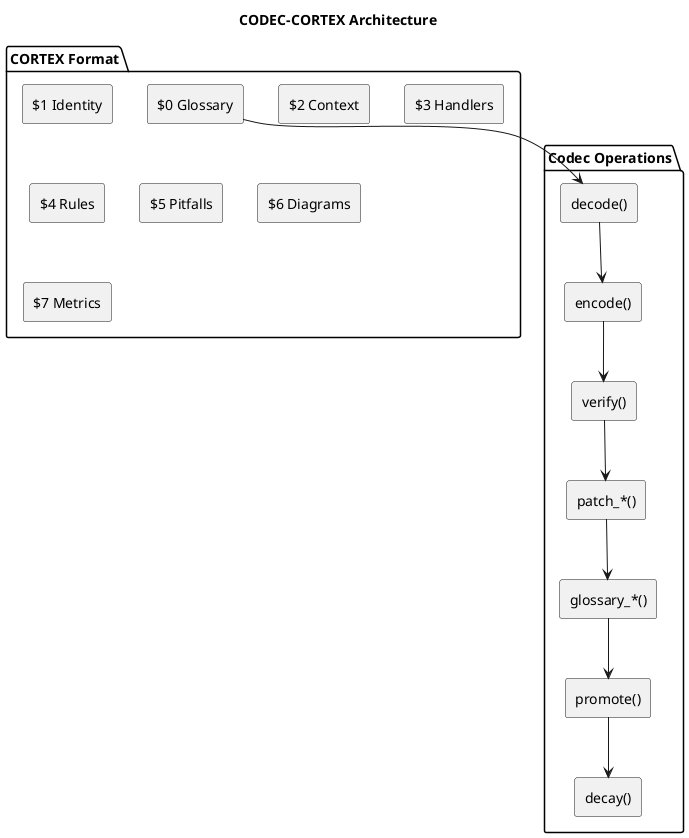
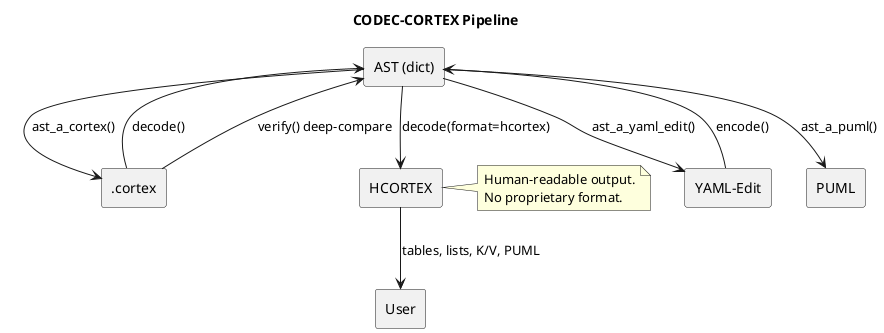
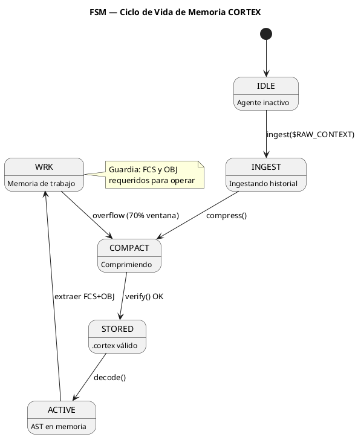
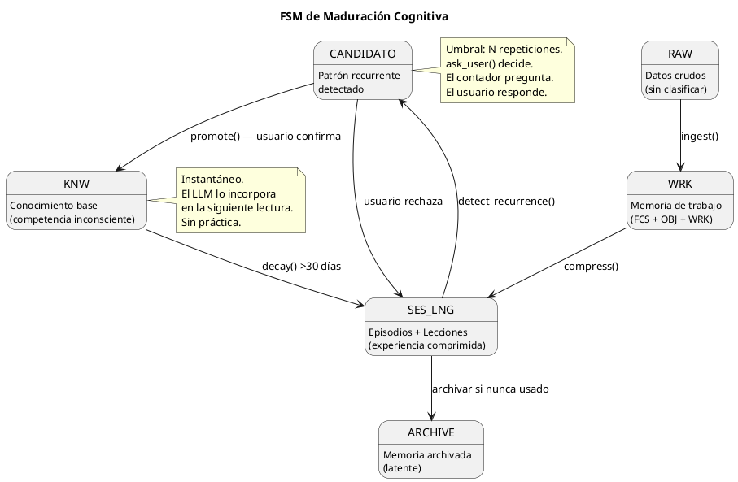

<!-- SPDX-FileCopyrightText: 2026 Fidel Ernesto Lozada A. -->
<!-- SPDX-License-Identifier: MIT -->

<p align="center">
  <strong>CODEC-CORTEX</strong> — Cognitive Operational Retrieval & Execution Template
  <br>
  <sub>SPECIFICATION · v1.2.0 · MIT · <a href="../AUTHORS.md">Fidel Ernesto Lozada A.</a></sub>
</p>

---

**Resumen:** Especificacion de Skill universal y protocolo de memoria contextual para agentes LLM/SLM. Define `.cortex` como formato de memoria operativa estructurada, HCORTEX como vista humana auditable, y separa la adopcion directa del Skill de la automatizacion futura mediante codec determinista, CLI, runtime y MCP empresarial.

| | |
|---|---|
| **Author** | Fidel Ernesto Lozada A. — Ing. Sistemas / MSc. Ciencias Gerenciales |
| **Repository** | [github.com/FidelErnesto03/codec-cortex](https://github.com/FidelErnesto03/codec-cortex) |
| **License** | [MIT](../LICENSE) |
| **Version** | 1.2.0 |
| **Language** | Structural: EN · Semantic: ES · Output: HCORTEX (user language) |

---

## Cuando Usar

- **Necesitas memoria persistente** para agentes LLM sin acumular contexto lineal
- **Usas SLMs** con ventanas limitadas (4k-8k tokens)
- **Sufres "Lost in the Middle"** en contextos largos
- **Necesitas separar objetivo, foco y trabajo activo** de la historia lineal
- **Necesitas auditoria humana** del contexto del agente
- **Quieres memoria model-agnostic** que pueda ser leida por distintos agentes

### Directiva de Adopcion Progresiva

> CODEC-CORTEX se adopta primero como Skill universal de memoria contextual. La memoria persistente canonica bajo este protocolo se mantiene en `.cortex`; Markdown, YAML o JSON pueden existir como vistas transitorias, edicion humana o interoperabilidad.

1. **Memoria actual:** identificar identidad, foco, objetivo, estado de trabajo, reglas, sesiones, lecciones, conocimiento y referencias antes de migrar.
2. **Memoria futura:** registrar contexto persistente en `.cortex` cuando el agente pueda leer y mantener el archivo.
3. **Identidad:** usar `skill/AGENT.cortex` como ejemplo de entry point.
4. **Arquitectura:** adaptar `skill/brain.cortex` como template de cerebro local.
5. **Comunicacion:** renderizar o resumir como HCORTEX para revision humana.
6. **Automatizacion:** `encode`, `decode`, `verify`, `compress`, `promote`, `decay` y CLI formal requieren el codec/runtime planificado.
7. **Desadopcion:** el gate de salida produce una vista HCORTEX del contexto activo; no promete reconstruccion literal de cada mensaje original.

### Estado de Operaciones

| Operacion | Disponible por Skill ahora | Requiere codec/runtime | Estado | Notas |
|-----------|----------------------------|------------------------|--------|-------|
| Leer `.cortex` | Si | No | Current | Lectura directa por el agente |
| Usar FCS/OBJ/WRK | Si | No | Current | Disciplina central del Skill |
| Producir HCORTEX basico | Si | No | Current/specification | Por instruccion y revision humana |
| Verificacion formal | Parcial | Si | Planned | Requiere parser |
| Encode/decode automatico | No | Si | Planned | Fase codec |
| Consolidacion automatica | No | Si | Future | Fase runtime |
| Handlers MCP | No | Si | Future | Fase empresarial |

### No usar para

- **Sistemas con menos de 500 tokens** de ventana de contexto
- **Agentes sin capacidad de leer archivos locales**
- **Procesamiento de datos no textuales** (imágenes, audio sin transcripción)
- **Tareas que no requieren persistencia entre sesiones**

---

## Overview

CODEC-CORTEX es primero un Skill universal y protocolo de memoria contextual. A diferencia de usar memoria como texto lineal, `.cortex` organiza el contexto operativo en estructuras densas para consumo por modelos y continuidad entre sesiones. La reduccion de tokens es un objetivo de diseno que debe validarse con benchmarks reproducibles.

**Principio rector:** *"Memoria contextual estructurada antes que historia lineal. El Glosario ($0) dicta la sintaxis. HCORTEX permite auditoria humana. La automatizacion determinista pertenece a la fase codec/runtime."*

### Arquitectura



---

## Glosario Cognitivo Universal ($0)

### Sigilos

| Sigilo | Nombre | Expansión | Riesgo | Descripción |
|--------|--------|-----------|:------:|-------------|
| `IDN` | identity | `attrs` | B | Identidad del skill |
| `DOM` | domain | `attrs` | B | Ámbito de aplicación |
| `KNW` | knowledge | `attrs` | B | Herramientas y capacidades |
| `AXM` | axiom | `cuerpo` | H | Principio rector inmutable |
| `CNST` | constraint | `attrs` | M | Límite operativo |
| `OBJ` | objective | `attrs` | B | Meta activa |
| `WRK` | work | `attrs` | B | Estado de ejecución actual |
| `FCS` | focus | `attrs` | H | Anclaje de atención (crítico) |
| `REF` | reference | `attrs` | B | Vínculo a documentación |
| `SES` | session | `attrs` | B | Episodio comprimido (I→O→R) |
| `LNG` | lesson | `contenido` | M | Heurística aprendida |
| `HDL` | handler | `attrs-pos` | M | ORDEN: command\|description |
| `!` | rule | `cuerpo` | H | Regla operativa obligatoria |
| `ERR` | error | `attrs` | M | Error conocido + solución |
| `DIAG` | diagram | `bloque` | M | Diagrama PUML (verbatim) |
| `→` | transition | `relación` | - | Relación causal |
| `PFL` | pitfall | `contenido` | M | Error conocido del dominio |
| `TAG` | tag | `attrs` | B | Metadato de clasificación |
| `DESC` | description | `contenido` | B | Descripción semántica |
| `DEP` | dependency | `attrs` | M | Dependencia entre módulos |
| `STP` | step | `attrs` | M | Próxima acción inmediata |
| `AUD` | audit | `attrs` | M | Registro de auditoría o verificación |
| `RSK` | risk | `attrs` | M | Riesgo identificado con mitigación |
| `NXT` | next | `attrs` | M | Próxima acción en cola con trigger |
| `CLAIM` | claim | `attrs` | M | Afirmación verificable |
| `LIM` | limit | `attrs` | M | Límite operativo explícito |

### Tipos de Expansión

| Tipo | Significado | Limitaciones |
|------|-------------|--------------|
| `attrs` | Pares clave:valor separados por `,` o `\|` | Robusto |
| `attrs-pos` | Atributos posicionales sin claves. Orden definido en $0. Separador `\|` | Requiere $0 |
| `cuerpo` | Texto literal (axiomas, reglas) | Robusto |
| `contenido` | Contenido compuesto estructurado | Cuidado con `:` y `,` |
| `bloque` | Bloque multilínea exacto (verbatim) | Solo fragmentos multilínea |
| `relación` | Relación causal entre dos elementos | Solo flujos directos |

### Micro-Glosario de Valores ($0)

| Prefijo | Semántica | Tokens | Ejemplo |
|---------|-----------|--------|---------|
| `d_` | Acciones | d1=decode, d2=detect, d3=decay | `d1 c1 <a1>` |
| `c_` | Formato | c1=.cortex | `c1 v1` |
| `v_` | Validación | v1=validate | `v1 estructura` |
| `a_` | Archivos | a1=file, a2=files | `a1 c1` |
| `s_` | Estructura | s1=sigil, s2=section | `m2 s1 a $0` |
| `h_` | Handlers | h1=handler | `h1 list` |
| `x_` | Extracción | x1=extract, x2=list | `x1 diagram` |
| `m_` | Modificación | m1=modify, m2=add | `m1 entry` |
| `r_` | Eliminación | r1=remove | `r1 by name` |
| `p_` | Promoción | p1=promote | `p1 SES→KNW` |
| `f_` | Formato | f1=format | `--f1 hcortex` |
| `t_` | Términos | t1=structure | `t1 check` |

**Reglas de delimitación:** Los micro-tokens se expanden solo cuando están delimitados por espacio, `|`, `,`, `{`, `}`, `\n`, inicio o fin de valor. No se expanden dentro de palabras (`param_d1` → `param_d1`) ni después de `_` o `-`.

### Reglas del Glosario

1. Todo `.cortex` DEBE tener glosario en `$0` como primera sección.
2. El glosario en `$0` prevalece — es la única fuente de verdad estructural.
3. Sigilos sin entrada en `$0` se interpretan como `attrs`.
4. El contenido de `$0` NO se interpreta como memoria cognitiva. La tabla es metadato estructural exclusivo para IA
5. Etiquetas, keywords, handlers y micro-tokens en **inglés**. Contenido semántico en idioma del dominio. **HCORTEX omite $0** — solo incluye secciones $1+

---

## Principios del Skill y del Codec Planificado

1. **Memoria contextual, no historia lineal.** `.cortex` preserva contexto operativo estructurado; las operaciones `encode()` y `decode()` pertenecen al codec planificado.
2. **Determinismo del codec planificado.** El objetivo de roundtrip estructural es `decode(encode(contenido)) == contenido` para estructuras soportadas, sin llamadas LLM durante parse/encode/decode/verify.
3. **El glosario es el contrato.** Nuevo sigilo = nueva entrada en `$0`. Si no está en `$0`, se trata como `attrs` por defecto.
4. **Estructura sobre semántica.** El parser es un autómata de caracteres de 6 estados. Cero ML, cero regex complejo, cero ambigüedad.
5. **Tipos de expansión gobernados por el glosario.** No se permite que un parser infiera si un valor es `attrs` o `contenido`. `$0` manda.
6. **Independencia de LLM en la fase codec.** El codec planificado no usa, invoca ni depende de ningun LLM para parsear, codificar, decodificar o verificar.
7. **Portabilidad de ecosistema.** El formato `.cortex` es texto plano, line-oriented, parseable con stdlib. Independiente de framework.
8. **Auto-creación de secciones.** Si `patch_add` referencia una sección que no existe, la crea automáticamente.
9. **Los diagramas PUML son compresión nativa.** Un `DIAG` de 20 líneas comunica flujos, relaciones y procesos que ocuparían 200+ líneas de prosa.
10. **Los diagramas se preservan intactos; los sigilos compañeros los enriquecen.** Un `DIAG` es tipo `bloque` (verbatim). Los sigilos que comparten el mismo nombre proveen contexto interpretativo.
11. **La maduración es por decisión del usuario.** El motor detecta patrones recurrentes y pregunta. El usuario decide si promover a KNW.
12. **El sistema puede hacer consciente al usuario.** Si el motor detecta un patrón que el usuario no había identificado, la pregunta del sistema le revela algo sobre sí mismo.
13. **El LLM responde en formato estructurado.** Tablas, pares clave/valor, listas y diagramas PUML son el lenguaje de salida hacia el humano.
14. **HCORTEX es la vista contextual para humanos — $0 no se incluye.** `decode(format=hcortex)` produce markdown con tablas, listas, K/V y diagramas. El glosario $0 es metadata exclusiva para IA; la salida HCORTEX omite $0 y solo incluye las secciones semánticas ($1 en adelante).
15. **Colapso de atributos redundantes.** Cuando $0 define `attrs-pos`, las claves explícitas se eliminan. Ahorro: 15-20% de tokens.
16. **Atomicidad por micro-glosario.** Términos frecuentes se tokenizan como sigilos de 1-3 caracteres. Ahorro: 30-40% adicional.
17. **Inglés como lenguaje base del `.cortex`.** Estructural en inglés. Semántico en idioma del dominio. HCORTEX en idioma del usuario.
18. **Identidad multi-actor.** El `brain.cortex` admite múltiples actores: `IDN:human{...}`, `IDN:agent{...}`, o roles personalizados. Cada actor tiene su propia entrada. Tantos como sean necesarios.
19. **Estados operativos múltiples.** `FCS`, `OBJ` y `WRK` admiten múltiples entradas nombradas (`:primary`, `:secondary`, personalizadas). Cada una representa un foco, objetivo o flujo de trabajo activo independiente.

---

## Ciclo de Validación

### Pipeline



El ciclo de validacion planificado apunta a reversibilidad estructural: `verify(input, encode(decode(input)))` debe retornar `True` para estructuras soportadas. Hasta que exista implementacion y tests, esto es un requisito del codec, no una capacidad medida del repositorio.

### Funciones Clave

| Función | Entrada | Salida | Propósito |
|---------|---------|--------|-----------|
| `cortex_a_ast()` | Contenido `.cortex` (str) | `{ast, glossary, meta}` | Parsear .cortex a AST |
| `ast_a_yaml_edit()` | AST (dict) | YAML-Edit (str) | Convertir AST a formato legible |
| `ast_a_puml()` | AST (dict) | PUML (str) | Extraer bloques PUML |
| `ast_a_hcortex()` | AST (dict) | Markdown HCORTEX (str) | Descomprimir a formato humano |
| `yaml_edit_a_ast()` | YAML-Edit (str) | AST (dict) | Parsear YAML-Edit a AST |
| `ast_a_cortex()` | AST (dict) | `.cortex` (str) | Compilar AST a formato .cortex |
| `verify()` | AST original + nuevo | `{ok: bool, diffs: [...]}` | Deep compare estructural |

### CLI

| Comando | Descripción |
|---------|-------------|
| `cortex decode <archivo>` | Decodificar .cortex a YAML-Edit |
| `cortex decode <archivo> --format hcortex` | Decodificar a HCORTEX markdown |
| `cortex encode <archivo>` | Codificar contexto a .cortex |
| `cortex verify <archivo>` | CLI planificado: validar estructura y glosario |
| `cortex patch_add <archivo> --section N --sigilo S --nombre n --valor v` | Añadir entrada |
| `cortex patch_remove <archivo> --sigilo S --nombre n` | Eliminar entrada |
| `cortex patch_update <archivo> --sigilo S --nombre n --valor v` | Modificar entrada |
| `cortex glossary_add <archivo> --sigilo S --expansion exp` | Añadir sigilo a $0 |
| `cortex glossary_remove <archivo> --sigilo S` | Eliminar sigilo de $0 |
| `cortex glossary_update <archivo> --sigilo S --expansion exp` | Modificar sigilo en $0 |
| `cortex diagram extract <archivo> --name N` | Extraer diagrama PUML |
| `cortex diagram list <archivo>` | Listar diagramas |
| `cortex diagram validate <archivo> --name N` | Validar sintaxis PUML |
| `cortex promote <archivo> --sigilo S --nombre N` | Promover SES/LNG a KNW |
| `cortex detect <archivo>` | Runtime futuro: detectar patrones recurrentes |
| `cortex decay <archivo>` | Runtime futuro: degradar KNW por desuso |

### API Python

```python
from codec_cortex import cortex_a_ast, ast_a_cortex, verify

# Decode
result = cortex_a_ast(content)
yaml_edit = ast_a_yaml_edit(result["ast"])

# Encode
new_ast = yaml_edit_a_ast(yaml_edit)
new_content = ast_a_cortex(new_ast)

# Verify (planned structural roundtrip)
r = verify(result["ast"], new_ast)
assert r["ok"]

# HCORTEX output
human = ast_a_hcortex(result["ast"])  # Markdown: tables, lists, K/V, diagrams
```

### Módulos

| Módulo | Función |
|--------|---------|
| `cortex.patch` | `patch_add`, `patch_remove`, `patch_update` — mutación de entradas |
| `cortex.glossary` | `glossary_add`, `glossary_remove`, `glossary_update` — gestión de $0 |
| `cortex.diagram` | `diagram_extract`, `diagram_list`, `diagram_validate` — gestión de PUML |
| `cortex.maturity` | `detect_recurrence`, `promote`, `decay` — motor de maduración |
| `cortex.hcortex` | `ast_a_hcortex` — descompresión a formato humano |

---

## Métricas de Desempeño

| Métrica | Objetivo | Método |
|---------|:-------:|--------|
| Compresion vs prosa | Objetivo de alta densidad | Tokens .cortex / tokens prosa; requiere benchmark |
| Compresión vs prosa densa (specs) | ≥70% | Medido con SKILL.md → SKILL.cortex |
| Reversibilidad | Objetivo estructural | `verify(input, encode(decode(input)))`; requiere tests del codec |
| Tiempo de parseo | <50ms para 10KB | `timeit cortex_a_ast(content)` |
| Búsqueda en glosario | O(log n) | Dict lookups con `$0` como índice |
| Colapso posicional | 15-20% | Reducción en secciones de handlers |
| Micro-glosario | 30-40% adicional | Reducción en valores repetitivos |
| Combinado (collapse + micro) | 40-52% total | Ambas técnicas aplicadas |

---

## FSM Operativo de Memoria



**Regla fundamental:** El agente no actúa sin `FCS` y `OBJ` explícitos en la memoria de trabajo activa.

### FSM de Maduración (Ciclo de Aprendizaje)



---

## Common Pitfalls

| # | Error | Causa | Solución |
|---|-------|-------|----------|
| 1 | `{` `}` sin escapar | Caracteres especiales en valores | `_extract_braces()` respeta `\{` y `\}`. `BraceError` con línea |
| 2 | Deep compare superficial | Compara strings, no tuplas | `(sigilo, nombre, json.dumps(valor, sort_keys=True))` |
| 3 | Secciones inconsistentes | Parser no acepta `2`, `$2`, `2_NOMBRE` | Normalizar: extraer solo número |
| 4 | MCP bridge sync→async | Handlers síncronos, registro async | Wrapper con captura de closure |
| 5 | $0 no es primera sección | Glosario en posición incorrecta | Forzar $0 como sección inicial |
| 6 | REFs a directorios | PATH apunta a carpeta, no archivo | `REF:nombre{PATH:ruta/archivo.cortex}` |
| 7 | Construir .cortex a mano | Editar formato compilado directamente | Editar YAML-Edit fuente o usar handlers |
| 8 | FCS y OBJ ausentes | Agente opera sin foco ni objetivo | Validar antes de cada acción |
| 9 | DIAG con sintaxis inválida | `@startuml` mal formado | `cortex diagram validate` |
| 10 | Deep compare textual de DIAG | Compara raw en lugar de estructura | Comparar participantes y relaciones como sets |
| 11 | Modificar raw de DIAG | Codec reformatea contenido | DIAG es verbatim — preservar bit a bit |
| 12 | Micro-tokens en palabras | `parametro_d1` → `parametro_decodificar` | Expandir solo delimitados |
| 13 | Colapso posicional incorrecto | 3 campos en `attrs-pos` de 2 | Degradar a `attrs` explícito |
| 14 | Mezcla de idiomas | Tags estructurales en español | Estructural = inglés, semántico = dominio |

---

## Verification Checklist

- [ ] `$0` (glosario) es la primera sección
- [ ] `FCS` y `OBJ` están presentes en memoria de trabajo activa
- [ ] `REFs` apuntan a archivos `.cortex` específicos
- [ ] No hay `{`/`}` sin escapar en valores
- [ ] `verify()` retorna `{"ok": true}` tras encode→decode
- [ ] Deep compare usa `json.dumps(valor, sort_keys=True)`
- [ ] Los bloques `DIAG` tienen sintaxis PUML válida
- [ ] Deep compare de diagramas compara estructura, no raw text
- [ ] Los sigilos compañeros comparten nombre con su DIAG
- [ ] El ciclo encode→decode→encode no modifica raw de DIAG
- [ ] Micro-tokens en $0 siguen nomenclatura semántica (d_, c_, v_, etc.)
- [ ] Parser solo expande micro-tokens delimitados
- [ ] Handlers `attrs-pos` con número correcto de campos
- [ ] Etiquetas estructurales en inglés, semántico en dominio
- [ ] Agente ha migrado memoria a `.cortex` y usa HCORTEX
- [ ] detect_recurrence escanea SES y LNG
- [ ] promote solo con confirmación humana
- [ ] decay aplicado a KNW >30 días sin uso
- [ ] GATE de salida disponible para desadopción

---

## Context Survival Rules

Cuando el contexto se reduce, el agente debe:

1. **No truncar por posición.** Reducir por prioridad P5→P0, nunca por cola o cabecera.
2. **Preservar P0 siempre.** FCS, OBJ, CNST y STP sobreviven cualquier reducción.
3. **Seleccionar perfil según presupuesto.** CORTEX-MIN (~300 tokens), RECOVERY (~1000), WORK (~3000), FULL (sin límite). Salto directo permitido.
4. **Renderizar HCORTEX con trazabilidad.** Las entradas P0/P1 en HCORTEX deben indicar su sigilo `.cortex` de origen como columna `source`.
5. **Evaluar por supervivencia de decisión.** La eficiencia se mide por cuántas decisiones, restricciones y pasos sobreviven por token — no solo por compresión de bytes.
6. **Compresión operacional activa.** El micro-glosario $0 declara tipo de expansión (`attrs`/`cuerpo`/`bloque`) que gobierna el render. Handlers son reglas `!nombre{cond, acc}` compactas.
7. **Supervivencia explícita.** `survive` es obligatorio en FCS/OBJ/CNST/STP/WRK. `status` extendido: `current|planned|future|blocked`. Degradación regida por `!survive_degrade`.
8. **Filtro P5 gobernado.** `!p5_filter` excluye entradas P5 sin `survive`, sin `KNW` companion o sin valor operacional. FULL no significa "todo entra".

---

## Contratos de campos mínimos

Cada sigilo crítico declara campos obligatorios. Se permiten campos adicionales.

| Sigilo | Campos requeridos |
|--------|-------------------|
| **FCS** | `what` (str), `priority` (high\|medium\|low), `status` (current\|planned\|future\|blocked\|active\|done), `survive` |
| **OBJ** | `goal` (str), `status` (in_progress\|done\|blocked\|current\|planned\|future), `success` (criterio verificable), `survive` |
| **CNST** | `rule` (str), `severity` (blocking\|warning\|info), `survive` |
| **STP** | `action` (verbo), `reason` (str), `owner` (agent\|human), `status` (current\|planned\|future\|blocked), `survive` |
| **WRK** | `phase` (str), `current` (str), `blocked` (bool), `survive` |

Campos adicionales siempre permitidos si no contradicen el contrato mínimo.

---

## Atributo `survive`

Cuatro niveles que determinan qué entradas `.cortex` sobreviven a la reducción de contexto.

| Nivel | Presupuesto | Se preserva cuando |
|-------|:---:|--------------------|
| `min` | ~300t | Reducción máxima. CNST:blocking, IDN |
| `recovery` | ~1000t | Reducción moderada. OBJ activos, RSK |
| `work` | ~3000t | Reducción estándar. FCS, STP, WRK |
| `full` | Sin límite | Sin reducción. SES, REF, histórico |

Regla (con mapeo P0-P5 de `!survive_priority`):

| Nivel | Presupuesto | P-level | Entradas típicas |
|-------|:---:|:---:|------------------|
| `min` | ~300t | P0 | CNST:blocking, FCS, OBJ, STP |
| `recovery` | ~1000t | P1 | WRK, AUD, RSK, NXT |
| `work` | ~3000t | P2 | CLAIM, LIM, KNW:active, LNG:critical |
| `reduced` | ~5000t | P3 | SES:last, STAT, VAL, RES, FIND |
| `basic` | ~8000t | P4 | REF:critical, DOC, ART |
| `full` | Sin límite | P5 | DIAG, TBL, histórico, comentarios |

Regla: CNST con `severity:blocking` → `survive:min`. OBJ activo → `survive:recovery`. Entradas sin `survive` son válidas (compatibilidad progresiva).

---

## Priority Pack P0-P5

Carga: P0→P5. Degradación: P5→P1. P0 nunca se elimina.

| Nivel | Presupuesto | Preserva |
|:---:|:---:|----------|
| **P0** | ~300t | `FCS`, `OBJ`, `CNST`, `STP` |
| **P1** | ~600t | `WRK`, `AUD`, `RSK`, `NXT` |
| **P2** | ~1Kt | `CLAIM`, `LIM`, `KNW:active`, `LNG:critical` |
| **P3** | ~2Kt | `SES:last`, `STAT`, `VAL`, `RES`, `FIND` |
| **P4** | ~3Kt | `REF:critical`, `DOC`, `ART` |
| **P5** | Sin límite | `DIAG`, `TBL`, histórico, comentarios |

Reglas: anti-truncado posicional, P0 inmutable, CNST:blocking protegido, CLAIM/LIM condicional.

---

## Perfiles conceptuales

| Perfil | Prioridad | Presupuesto | Selección |
|--------|:---:|:---:|-----------|
| **CORTEX-MIN** | P0 | ≤512t (~300t render) | Emergencia |
| **CORTEX-RECOVERY** | P0+P1 | ≤1000t | Recuperación tras interrupción |
| **CORTEX-WORK** | P0+P1+P2 | ≤3000t | Continuidad de trabajo |
| **CORTEX-FULL** | P0-P5 | >3000t | Memoria completa |

Precedencia de selección: `perfil explícito > presupuesto disponible > modo operativo > CORTEX-WORK`.

Default por modo: auditoría→FULL, recovery→RECOVERY, trabajo→WORK, emergencia→MIN.

**Procedimiento de render HCORTEX (10 pasos):**

1. Resolver perfil activo según precedencia: `explícito > presupuesto > modo > CORTEX-WORK`.
2. Declarar `Perfil: CORTEX-<NIVEL>` como primera línea.
3. Filtrar entradas por P-level o survive. Entradas sin P-level ni survive → P5 (solo en FULL). Filtrado por entrada, no por sección.
4. Resolver tipo de expansión del sigilo desde $0: `attrs → tabla`, `cuerpo → bloque indentado`, `bloque → PUML verbatim`.
5. Renderizar solo entradas filtradas, aplicando estrategia según tipo desde $0.
6. Auditoría con presupuesto insuficiente: declarar `Perfil: CORTEX-FULL (segmentado) Segmento: <n>/<total>`. No degradar silenciosamente.
7. Agregar columna `source` a tablas P0/P1 con formato `<SIGIL>:<nombre>`. PUML: `' source: DIAG:<nombre>`. Si falta source en P0/P1 → `WARNING: missing source`.
8. Instancias múltiples del mismo sigilo: renderizar como sub-secciones `### <SIGIL>:<nombre>`. Preservar orden fuente.
9. Aplicar estrategia de render por tipo: `attrs`→tabla source+instance, `cuerpo`→quote indentado, `bloque`→PUML verbatim con `' source: DIAG:<nombre>`.
10. Ordenar secciones por P-level: P0 primero, P5 último. Sin P-level → después de P5. Mismo P-level → orden fuente.

---

## Política de degradación

Cadena conceptual: `FULL → WORK → RECOVERY → MIN`. Selección directa por presupuesto.

| Degradación | Se reduce |
|-------------|-----------|
| FULL → WORK | DIAG, TBL largos, REF largos, SES históricos |
| WORK → RECOVERY | KNW→KNW:active, LNG→LNG:critical, REF→REF:critical |
| RECOVERY → MIN | SES:last, AUD, RSK, NXT, STAT. Solo P0 |

**Nunca desaparece:** CNST:blocking con survive:min, FCS, OBJ, STP (P0 inmutable), CLAIM/LIM hasta RECOVERY.
