<!-- SPDX-License-Identifier: MPL-2.0 -->
<!-- Copyright (c) 2026 Fidel Ernesto Lozada A. -->

<!-- CODEC-CORTEX
internal_encoding: HCORTEX
source_artifact: skill/cortex/SKILL.md
source_version: 1.3.0
status: specification
reversible: true
view_schema: 1
view_coverage: 100
mode: full
-->

# CODEC-CORTEX — Especificación Canónica del Skill (HCORTEX)

> **Estado:** v0.3.7 · 2026-07-01 · MIT · Fidel Ernesto Lozada A.
>
> **Usar cuando:** Eres un agente que necesita operar bajo el protocolo de memoria CODEC-CORTEX, o un humano auditando la especificación del protocolo.
>
> **NO usar para:** Conversación de propósito general (usar CORTEX-OUT), memoria de runtime (usar `brain.cortex`), o distribución de paquetes externos (usar paquetes `*.cortex`).

---

<!-- VIEW:identidad_skill kind="kv_table" target="$1:IDN:project" reverse="row_to_attrs" title="Identidad del Proyecto" fields="dimension,valor" status:current -->

## §1 Identidad

| Campo | Valor |
|-------|-------|
| Nombre | CODEC-CORTEX |
| Autor | Fidel Ernesto Lozada A. |
| Versión del skill | 1.3.0 |
| Licencia | MIT |
| Versión del proyecto | v0.3.7 |
| Repositorio | github.com/FidelErnesto03/codec-cortex |
| Dominio | Protocolo de memoria contextual para agentes LLM/SLM |
| Idioma estructural | EN |
| Idioma semántico | Idioma del dominio o usuario |
| Salida para humanos | HCORTEX=render de memoria; CORTEX-OUT=respuesta conversacional |

<!-- /VIEW:identidad_skill -->

<!-- VIEW:referencias_skill kind="table" target="$1:REF:*" reverse="rows_to_entries" title="Referencias de Artefactos" fields="ruta,rol,formato" status:current -->

### Referencias de artefactos

| Ruta | Rol | Formato |
|------|-----|--------|
| `skill/cortex/SKILL.md` | Especificación canónica del protocolo (CORTEX) | CORTEX |
| `brain.cortex` | Estado vivo de trabajo | CORTEX |
| `*.cortex` | Paquetes de contexto transportables | CORTEX |
| `STATUS.md` | Registro de verdad | MD |
| `cli/` | Implementación del CLI | Python |

<!-- /VIEW:referencias_skill -->

<!-- VIEW:brain_cortex kind="prose" target="$3:KNW:brain_location" reverse="body_to_cuerpo" title="Ubicación Canónica de brain.cortex" status:current -->

### brain.cortex

| Propiedad | Valor |
|-----------|-------|
| **Ubicación canónica** | Raíz del proyecto (`./brain.cortex`) |
| **Formato** | CORTEX (`internal_encoding: CORTEX`) |
| **Propósito** | Estado vivo del proyecto: foco activo, objetivos, trabajo, sesiones, lecciones, auditoría |
| **Carga** | `agent_init` → leer si existe; si no, crear desde cero |
| **Persistencia** | Agente escribe en cada `session_close` |
| **Verificación** | `cortex verify --strict brain.cortex` antes de commit |
| **Relación con SKILL** | SKILL.md es el canon de instalación (reglas); brain.cortex es el estado operativo (datos) |

<!-- /VIEW:brain_cortex -->

---

<!-- VIEW:activacion_skill kind="table" target="$2:KNW:trigger" reverse="rows_to_entries" title="Activación del Skill" fields="condicion,accion" status:current -->

## §2 Activación

### Cuándo cargar este skill

| Condición | Acción |
|-----------|--------|
| El agente necesita memoria estructurada persistente | Cargar e inicializar `brain.cortex` |
| El agente recibe un archivo `.cortex` del usuario o herramienta | Leer, validar e integrar |
| El agente debe rastrear foco, objetivos, trabajo y lecciones | Activar ciclo FCS/OBJ/WRK/SES/LNG |
| El agente debe producir respuestas auditables | Usar protocolo CORTEX-OUT |
| El agente opera bajo presión de contexto | Aplicar Survival Core P0-P5 |

### Cuándo NO cargar este skill

| Condición | Alternativa |
|-----------|-------------|
| Pregunta/respuesta única sin necesidad de memoria | No se necesita skill |
| Interacción solo conversacional | Solo CORTEX-OUT (sin archivos `.cortex`) |
| Integración con servidor MCP externo | Futura fase enterprise |
| Automatización de promoción de memoria en runtime | Futura fase runtime |

<!-- /VIEW:activacion_skill -->

---

<!-- VIEW:sigilos_canonicos kind="table" target="$0:canonical_sigils" reverse="rows_to_entries" title="Sigilos Canónicos" fields="sigilo,tipo,riesgo,corteza,descripcion" status:current -->

## §3 Sigilos Canónicos

| Sigilo | Tipo | Riesgo | Corteza | Descripción |
|:------:|:----:|:------:|:-------:|-------------|
| IDN | attrs | B | Semántica | Identidad de proyecto/artefacto |
| DOM | attrs | B | Semántica | Alcance, dominio, contexto |
| KNW | attrs | B | Semántica | Conocimiento base o promovido |
| REF | attrs | B | Semántica | Referencia a doc/archivo/repo |
| TAG | attrs | B | Semántica | Metadatos de clasificación |
| ! | attrs | H | Prefrontal | Regla operacional compacta |
| AXM | cuerpo | H | Prefrontal | Principio no negociable |
| CNST | attrs | H | Prefrontal | Restricción dura o límite |
| CLAIM | attrs | M | Prefrontal | Afirmación verificable |
| LIM | attrs | M | Prefrontal | Límite de uso o madurez |
| AUD | attrs | M | Prefrontal | Registro de auditoría |
| RSK | attrs | M | Prefrontal | Riesgo con mitigación |
| FCS | attrs | H | Trabajo | Anclaje de atención activo |
| OBJ | attrs | H | Trabajo | Meta con criterio de éxito |
| WRK | attrs | B | Trabajo | Estado de ejecución actual |
| STP | attrs | M | Trabajo | Próxima acción inmediata |
| NXT | attrs | M | Trabajo | Acción en cola con disparador |
| SES | attrs | M | Episódica | Episodio comprimido I/O/R |
| LNG | attrs | M | Episódica | Lección aprendida o patrón |
| DIAG | bloque | M | Episódica/Visual | Diagrama PUML o bloque verbatim |
| HDL | attrs-pos | M | Semántica | Descriptor de operación |
| PFL | attrs | M | Prefrontal | Antipatrón conocido |
| DEP | attrs | M | Semántica | Dependencia entre módulos |
| DESC | cuerpo | B | Semántica | Descripción textual estructurada |
| ERR | attrs | M | Prefrontal | Error conocido con causa y solución |
| VIEW | attrs | B | Semántica | Directiva de render HCORTEX |

<!-- /VIEW:sigilos_canonicos -->

<!-- VIEW:sistema_tipos kind="kv_table" target="$0:type_decls" reverse="row_to_attrs" title="Declaraciones de Tipo" fields="tipo,formato,regla" status:current -->

### Sistema de tipos

| Tipo | Formato | Regla |
|:----:|---------|-------|
| attrs | Pares clave:valor o clave:"valor" dentro de `{}` | DEBE usar pares |
| cuerpo | Texto literal entre `{}` | DEBE ser literal |
| bloque | Multilínea verbatim entre `{}` | DEBE preservar bit a bit |
| attrs-pos | Valores posicionales separados por `\|` | DEBE seguir orden del contrato $0 |
| relación | Forma causal `A -> B` | DEBE usar notación de flecha |

<!-- /VIEW:sistema_tipos -->

---

<!-- VIEW:contratos_posicionales kind="table" target="$0:contracts" reverse="rows_to_entries" title="Contratos Posicionales" fields="sigilo,contrato" status:current -->

## §4 Contratos Posicionales

| Sigilo | Contrato posicional |
|:------:|:--------------------:|
| HDL | `operación\|estado\|requiere\|notas` |
| FCS | `qué\|prioridad\|estado\|survive` |
| OBJ | `meta\|estado\|éxito\|survive` |
| WRK | `fase\|actual\|bloqueado\|survive` |
| STP | `acción\|razón\|responsable\|estado\|survive` |
| CNST | `regla\|severidad\|survive` |
| CLAIM | `afirmación\|evidencia\|estado` |
| LIM | `límite\|alcance\|estado` |
| RSK | `riesgo\|impacto\|mitigación\|estado\|survive` |
| AUD | `evento\|evidencia\|resultado\|fecha` |
| SES | `entrada\|salida\|resultado\|fecha` |
| LNG | `tipo\|causa\|lección\|prevención` |
| KNW | `tema\|contenido\|estado` |
| DIAG | Bloque PUML verbatim válido |

<!-- /VIEW:contratos_posicionales -->

---

<!-- VIEW:microtokens kind="table" target="$0:microtokens" reverse="rows_to_entries" title="Microtokens" fields="token,expansion,categoria" status:current -->

## §5 Microtokens

| Token | Expansión | Categoría |
|:-----:|:----------|:---------:|
| cur | current | Estado |
| pln | planned | Estado |
| fut | future | Estado |
| blk | blocked | Estado |
| min | minimum | Supervivencia |
| rec | recovery | Supervivencia |
| wrk | work | Supervivencia |
| full | full | Supervivencia |
| ok | success | Resultado |
| fail | failure | Resultado |
| part | partial | Resultado |
| d1 | decode | Codec |
| d2 | detect | Maduración |
| d3 | decay | Maduración |
| c1 | .cortex | Formato |
| c2 | HCORTEX | Formato |
| v1 | validate | Verificación |
| v2 | verify | Verificación |
| a1 | file | Operando |
| a2 | files | Operando |
| s1 | sigil | Protocolo |
| s2 | section | Estructura |
| h1 | handler | Handler |
| x1 | extract | Diagrama |
| x2 | list | Listado |
| m1 | modify | Mutación |
| m2 | add | Creación |
| r1 | remove | Eliminación |
| p1 | promote | Maduración |
| f1 | format | Formateo |
| t1 | structure | Estructura |

<!-- /VIEW:microtokens -->

<!-- VIEW:enumeraciones kind="kv_table" target="$0:enum_state" reverse="row_to_attrs" title="Enum: state" fields="enumeracion,valores" status:current -->

### Valores de enumeración

| Enumeración | Valores |
|:-----------:|---------|
| state | `current`, `specification`, `planned`, `future`, `experimental`, `deprecated`, `blocked`, `done` |
| severity | `blocking`, `warning`, `info` |
| priority | `high`, `medium`, `low` |
| risk_level | `B`, `M`, `H` |
| delimiters | espacio, `\|`, `,`, `{}`, salto de línea, inicio-valor, fin-valor |

<!-- /VIEW:enumeraciones -->

---

<!-- VIEW:axioma_canon kind="prose" target="$2:AXM:canon" reverse="body_to_cuerpo" title="Axioma Canónico" status:current -->

## §6 Conocimiento Base

### Axioma canónico

> SKILL gobierna. brain opera. package inyecta. HCORTEX explica. CORTEX-OUT responde con densidad. codec automatiza cuando exista. runtime madura cuando exista. MCP expone empresarialmente cuando exista.

<!-- /VIEW:axioma_canon -->

<!-- VIEW:axioma_guia kind="prose" target="$2:AXM:guiding" reverse="body_to_cuerpo" title="Axioma Guía" status:current -->

### Axioma guía

> El protocolo no registra todo lo ocurrido. La memoria se actualiza solo para preservar aquello que cambia continuidad, decisiones, riesgos, restricciones, evidencia, aprendizaje o comportamiento futuro.

<!-- /VIEW:axioma_guia -->

<!-- VIEW:diagrama_operativo kind="puml" target="$6:DIAG:agent_lifecycle" reverse="verbatim_to_bloque" title="Ciclo de Vida Operativo del Agente" status:current -->

### Diagrama operativo del agente

```puml
@startuml
skinparam backgroundColor transparent
skinparam activity {
  BackgroundColor transparent
  BorderColor #333333
  FontColor #333333
}

start
:agent_init;
:Leer skill/cortex/SKILL.md (CORTEX);
:Identificar reglas, handlers y contratos;

if (¿brain.cortex existe?) then (sí)
  :Leer brain.cortex;
else (no)
  :Inicializar memoria nativa transitoria\nen formato CORTEX;
endif

if (¿FCS y OBJ explícitos?) then (sí)
  :Usar estado activo existente;
else (no)
  :Derivar FCS/OBJ provisionales\ndesde instrucciones actuales;
  :Mantener en memoria nativa CORTEX transitoria;
endif

:Aplicar CNST:blocking;
:Seleccionar perfil CORTEX\n(MIN|RECOVERY|WORK|FULL);

:Inicializar ciclo de aprendizaje;

while (Ciclo de interacción)
  :pre_action;

  if (¿Usuario contradice\nCNST:blocking?) then (sí)
    :Detener o explicar\nincompatibilidad;
    break
  else (no)
  endif

  :Verificar FCS activo en CORTEX;
  :Verificar OBJ activo en CORTEX;
  :Verificar LIM relevantes;
  :Verificar RSK activos;

  if (¿Presupuesto de contexto\ninsuficiente?) then (sí)
    :Degradar P5 → P1\n(P0 nunca se elimina);
    :Reordenar por survive;
  else (no)
  endif

  :Ejecutar acción;

  if (¿Actuación sobre\narchivos CORTEX?) then (sí)
    if (¿CLI disponible y\nmenos costoso?) then (sí)
      :Usar cortex add/update/delete\nen vez de edición manual;
    else (no)
      :Editar brain.cortex\ndirectamente (formato CORTEX);
    endif
  endif

  :Registrar sesión en memoria nativa\nCORTEX si hubo I/O relevante;

  if (¿Se detectó patrón\nrecurrente?) then (sí)
    if (Score ≥ 1?) then (sí)
      :Crear SES en brain.cortex;
      if (Score ≥ 3?) then (sí)
        :Crear LNG en brain.cortex;
        if (Score ≥ 8?) then (sí)
          :Solicitar confirmación humana\npara promoción a KNW;
          if (¿Confirmado?) then (sí)
            :Crear KNW en brain.cortex;
          endif
        endif
      endif
    endif
  endif

  :Responder con CORTEX-OUT\n(OUT-MIN|WORK|AUDIT|FULL|ERROR);
endwhile

:session_close;

if (¿Hubo I/O relevante\nen la sesión?) then (sí)
  :Producir SES\n(input, output, outcome, date);
endif

if (¿Se identificó patrón\no error recurrente?) then (sí)
  :Producir LNG\n(tipo, causa, lección, prevención);
endif

if (¿Se verificó algo?) then (sí)
  :Producir AUD\n(evento, evidencia, resultado, fecha);
endif

if (¿Queda riesgo activo?) then (sí)
  :Producir RSK\n(riesgo, impacto, mitigación, estado);
endif

if (¿Queda acción pendiente?) then (sí)
  :Producir NXT\n(acción, razón, responsable, estado);
endif

:Sincronizar brain.cortex\n(commit si aplica);

if (¿Humano necesita\nauditoría?) then (sí)
  :Sugerir: cortex convert\n--from cortex --to hcortex\nbrain.cortex;
endif

stop
@enduml
```

<!-- /VIEW:diagrama_operativo -->

<!-- VIEW:proposito_skill kind="prose" target="$2:DESC:purpose" reverse="body_to_cuerpo" title="Propósito" status:current -->

### Propósito

CODEC-CORTEX reemplaza la historia lineal con estado cognitivo estructurado, auditable y gobernable. Siete componentes:

<!-- /VIEW:proposito_skill -->

<!-- VIEW:componentes_skill kind="table" target="$2:KNW:components" reverse="rows_to_entries" title="Componentes del Sistema" fields="num,componente,rol" status:current -->

| # | Componente | Rol |
|:-:|-----------|-----|
| 1 | **Mente** (`skill/cortex/SKILL.md`) | Reglas, ontología, contratos, algoritmos en codificación CORTEX |
| 2 | **Cerebro** (`brain.cortex` + nativa) | Estado vivo |
| 3 | **Paquetes** (`*.cortex`) | Payloads transportables |
| 4 | **Autocontención** (`$0`) | Glosario local mínimo para arranque seguro |
| 5 | **HCORTEX** | Vista humana de la memoria |
| 6 | **CORTEX-OUT** | Respuesta conversacional eficiente |
| 7 | **Codec / Runtime / MCP** | Automatización plan/future, nunca asumida si no existe |

<!-- /VIEW:componentes_skill -->

<!-- VIEW:cortezas_cognitivas kind="table" target="$2:KNW:cortices" reverse="rows_to_entries" title="Cortezas Cognitivas" fields="corteza,sigilos,funcion" status:current -->

### Cortezas cognitivas

| Corteza | Sigilos | Función |
|:-------:|---------|---------|
| Prefrontal | `!`, AXM, CNST, CLAIM, LIM, AUD, RSK, PFL, ERR | Gobernanza, restricciones, auditoría, riesgo |
| Trabajo | FCS, OBJ, WRK, STP, NXT | Estado operativo activo |
| Episódica | SES, LNG, DIAG | Historia comprimida y patrones |
| Semántica | IDN, DOM, KNW, REF, TAG, HDL, DEP, DESC | Identidad, conocimiento, referencias |

<!-- /VIEW:cortezas_cognitivas -->

<!-- VIEW:niveles_madurez kind="table" target="$2:KNW:level_matrix" reverse="rows_to_entries" title="Niveles de Madurez" fields="nivel,estado_vivo,fcs_obj_requerido,wrk_permitido" status:current -->

### Niveles de madurez

| Nivel | Estado vivo | FCS/OBJ requerido | WRK permitido |
|:-----:|:-----------:|:-----------------:|:-------------:|
| L1 | ❌ Prohibido | ❌ | ❌ |
| L2 | ✅ | ✅ Obligatorio | ✅ |
| L3 | ✅ Operacional | ✅ | ✅ Activo |

<!-- /VIEW:niveles_madurez -->

---

<!-- VIEW:reglas_estructurales kind="numbered_list" target="$4:!:type_strict,$4:!:section_normalize,$4:!:id_format,$4:!:micro_delimit,$4:!:extend_glossary" reverse="items_to_ordered_entries" title="Reglas Estructurales" status:current -->

## §7 Reglas Operacionales (`!`)

### Reglas estructurales

1. `!:type_strict` — attrs DEBE usar clave/valor; attrs-pos DEBE seguir orden exacto; DIAG DEBE preservarse bit a bit; parser NO DEBE inferir tipos por heurística
2. `!:section_normalize` — Parser DEBERÍA aceptar `2`, `$2`, `$2:CONTEXT` y normalizar internamente a `$2`
3. `!:id_format` — Instancias en snake_case; sigilos en MAYÚSCULAS salvo `!`
4. `!:micro_delimit` — Microtokens se expanden solo por delimitador; NO DEBEN expandirse dentro de palabras
5. `!:extend_glossary` — Nuevo sigilo → registrar en $0 antes del primer uso; NO redefinir silenciosamente

<!-- /VIEW:reglas_estructurales -->

<!-- VIEW:reglas_hcortex kind="numbered_list" target="$4:!:hcortex_expand,$4:!:hcortex_source,$4:!:hcortex_multi,$4:!:hcortex_order" reverse="items_to_ordered_entries" title="Reglas de Render HCORTEX" status:current -->

### Reglas de render HCORTEX

1. `!:hcortex_expand` — attrs→tabla, cuerpo→bloque indentado, bloque→verbatim. Tipo desde $0, no por heurística
2. `!:hcortex_source` — P0/P1 attrs→columna source con SIGIL:name; falta source→WARNING
3. `!:hcortex_multi` — Múltiples instancias del mismo sigilo → sub-secciones `### SIGIL:name`
4. `!:hcortex_order` — Ordenar P0→P5; sin P-level→después de P5; nunca truncar por posición

<!-- /VIEW:reglas_hcortex -->

<!-- VIEW:reglas_workflow kind="numbered_list" target="$4:!:canonical_names,$4:!:startup_verify,$4:!:precommit_verify,$4:!:output_cortex_out,$4:!:mutation_mode,$4:!:docs_source_of_truth,$4:!:secret_scan" reverse="items_to_ordered_entries" title="Reglas de Workflow Operativo" status:current -->

### Reglas de workflow operativo

1. `!:canonical_names` — Sin prefijos de versión (v2-, v3-) en nombres públicos
2. `!:startup_verify` — Ejecutar `cortex verify --strict` al cargar el skill; advertir si falla, continuar
3. `!:precommit_verify` — Antes de commit .cortex, ejecutar `cortex verify --strict <archivo>`
4. `!:output_cortex_out` — Respuestas del agente usan perfil CORTEX-OUT según criticidad
5. `!:mutation_mode` — Respetar `--mode read-only|editor|admin` y env `$CORTEX_MODE`
6. `!:docs_source_of_truth` — Ayuda CLI deriva de `docs/cortex/api/*.cortex`
7. `!:secret_scan` — Ejecutar `cortex doctor --scan-secrets` antes de commitear

<!-- /VIEW:reglas_workflow -->

<!-- VIEW:reglas_supervivencia kind="numbered_list" target="$8:!:survive_priority,$8:!:survive_degrade,$10:!:degrade_context" reverse="items_to_ordered_entries" title="Reglas de Supervivencia" status:current -->

### Reglas de supervivencia

1. `!:survive_priority` — P0→min, P1→rec, P2→wrk, P3→reduced, P4→basic, P5→full
2. `!:survive_degrade` — Degradar P5→P1, P0 nunca se elimina; expandir invierte
3. `!:degrade_context` — Si presupuesto insuficiente → `Perfil: CORTEX-LEVEL (segmentado) Segmento:n/total`

<!-- /VIEW:reglas_supervivencia -->

<!-- VIEW:reglas_out kind="numbered_list" target="$12:!:out_independence,$12:!:out_density,$12:!:out_action,$12:!:out_honesty,$12:!:out_adaptive,$12:!:out_no_parse" reverse="items_to_ordered_entries" title="Reglas CORTEX-OUT" status:current -->

### Reglas CORTEX-OUT

1. `!:out_independence` — CORTEX-OUT DEBE permanecer fuera del pipeline .cortex→AST→HCORTEX
2. `!:out_density` — DEBERÍA eliminar relleno y recapitulación innecesaria
3. `!:out_action` — DEBERÍA priorizar resultado, criterio, riesgo, acción
4. `!:out_honesty` — NO DEBE ocultar incertidumbre o límites relevantes
5. `!:out_adaptive` — DEBERÍA ajustar extensión según intención y criticidad
6. `!:out_no_parse` — NO DEBE tratarse como .cortex; sin sigilos, sin $0

<!-- /VIEW:reglas_out -->

<!-- VIEW:reglas_densidad kind="numbered_list" target="$11:!:d1,$11:!:d2,$11:!:d3,$11:!:d4,$11:!:d5,$11:!:d6,$11:!:d7,$11:!:d8,$11:!:d9,$11:!:d10,$11:!:d11,$11:!:d12" reverse="items_to_ordered_entries" title="Reglas de Densidad" status:current -->

### Reglas de densidad (formato de salida HCORTEX)

1. `!:d1` — Minimizar prosa; usar solo cuando tabla/lista/diagrama no capturen la información
2. `!:d2` — Tablas por defecto para info multi-atributo del mismo dominio
3. `!:d3` — Listas con viñetas para conjuntos paralelos; numeradas para secuencia/prioridad
4. `!:d4` — Arquitectura/secuencia/decisión/flujo→PlantUML; 20 líneas PUML reemplazan 200+ prosa
5. `!:d5` — Sin ASCII art; usar PUML en su lugar
6. `!:d6` — Una idea por bloque; no mezclar temas
7. `!:d7` — Jerarquía visual estricta: Título→Perfil→secciones P0→P5→anexos
8. `!:d8` — Eliminar muletillas ("cabe destacar", "como se puede observar")
9. `!:d9` — Cross-reference ("Ver también: §X") en vez de repetir contenido
10. `!:d10` — Estado/prioridad/severidad como columnas estándar con valores del glosario
11. `!:d11` — Sin cursiva; **negrita** solo para énfasis estructural
12. `!:d12` — Definir sigilos donde se usan por primera vez, no en glosario separado

<!-- /VIEW:reglas_densidad -->

---

<!-- VIEW:handlers kind="table" target="$3:HDL:*" reverse="rows_to_entries" title="Handlers Operacionales" fields="handler,estado,requiere,descripcion" status:current -->

## §8 Handlers

| Handler | Estado | Requiere | Descripción |
|---------|:------:|----------|-------------|
| `agent_init` | specification | SKILL.md, brain.cortex | Leer SKILL.md (CORTEX o HCORTEX); identificar reglas Nivel 1; leer brain.cortex si existe. Si FCS+OBJ explícitos → usar estado activo; si no → derivar provisional desde instrucciones, mantener en memoria nativa transitoria. Aplicar CNST, seleccionar perfil CORTEX, actuar o responder. |
| `pre_action` | specification | brain.cortex o anclajes | Verificar FCS activo/provisional, OBJ, CNST:blocking, LIM, claims, RSK, STP. Si usuario contradice CNST:blocking → detener o explicar incompatibilidad. |
| `absorb_pkg` | specification | package.cortex, brain.cortex | Recibir paquete; validar $0 o herencia de glosario; identificar propósito, fuente, alcance. Si contiene estado vivo → advertir, no absorber WRK/FCS/OBJ como vivo sin confirmación. Clasificar por corteza; resolver conflictos con brain.cortex; integrar KNW/REF/DIAG/CLAIM/LIM útiles; registrar AUD. |
| `session_close` | specification | brain.cortex | Producir/actualizar SES (entrada, salida, resultado, fecha). Producir LNG si hubo error o patrón. Producir AUD si se verificó algo. Producir RSK si queda riesgo activo. Producir NXT si queda acción pendiente. Producir HCORTEX de cierre si humano necesita auditoría. |
| `hcortex_render` | specification | .cortex o AST, perfil activo | Render de 10 pasos: resolver perfil; declarar `Perfil:`; filtrar por survive; resolver tipo desde $0; renderizar; agregar source; manejar multi-instancia; ordenar P0→P5. |
| `recovery_missing_0` | specification | .cortex sin $0 | No ejecutar decisiones operativas basadas en ese archivo; leer solo en modo recuperación. Identificar sigilos aparentes; reconstruir $0 mínimo local; marcar ambigüedades como RSK o AUD; solicitar confirmación humana; reemitir archivo reparado. |

<!-- /VIEW:handlers -->

---

<!-- VIEW:constraints_separadores kind="table" target="$5:CNST:*" reverse="rows_to_entries" title="Constraints de Separadores" fields="constraint,severidad,regla" status:current -->

## §9 Constraints

| Constraint | Severidad | Regla |
|------------|:---------:|-------|
| Separación Nivel 1 | blocking | L1 NO DEBE almacenar estado vivo de sesión. FCS/OBJ/WRK/STP/NXT prohibidos como estado activo en archivos de skill; permitidos solo como contrato/ejemplo marcado `example`/`template`/`non_operational`. |
| Separación Nivel 2 | blocking | L2 DEBE contener foco y objetivo para operación persistente. DEBE validar FCS y OBJ antes de actuar. Para tareas acotadas sin brain.cortex PUEDE operar con anclajes provisionales en memoria nativa transitoria. |
| Separación Nivel 3 | blocking | L3 (paquetes) NO DEBE inyectar WRK/FCS/OBJ como estado operativo sin confirmación humana. |
| Separación HCORTEX | warning | HCORTEX es .cortex→AST→Markdown. CORTEX-OUT es razonamiento→respuesta. NO DEBE confundirse. |
| Separación runtime | warning | Runtime (promote, decay, detect_recurrence) es futuro; NO DEBE asumirse maduración automatizada existente. |

<!-- /VIEW:constraints_separadores -->

<!-- VIEW:limites_operacionales kind="table" target="$5:LIM:*" reverse="rows_to_entries" title="Límites Operacionales" fields="limite,alcance,estado" status:current -->

### Límites

| Límite | Alcance | Estado |
|--------|---------|:------:|
| attrs-pos con orden posicional roto | Parser rechaza; fallback a attrs | current |
| Claims de madurez sin evidencia | NO DEBE declarar `current` sin evidencia reproducible | current |

<!-- /VIEW:limites_operacionales -->

<!-- VIEW:riesgos_operacionales kind="callout" target="$5:RSK:attrs_pos_broken" reverse="callout_to_risk" title="Riesgos Operacionales" status:current -->

### Riesgos

> **Riesgo:** attrs-pos roto
> **Impacto:** Parser produce AST incorrecto
> **Mitigación:** Fallback a attrs; WARNING emitido

<!-- /VIEW:riesgos_operacionales -->

---

<!-- VIEW:atributo_survive kind="kv_table" target="$8:KNW:survive_levels" reverse="row_to_attrs" title="Atributo Survive" fields="nivel,etiqueta,presupuesto,comportamiento" status:current -->

## §10 Survival Core

### Atributo `survive`

| Nivel | Etiqueta | Presupuesto | Comportamiento |
|:-----:|----------|:-----------:|----------------|
| 4 | full | máximo | Preservado bajo todos los perfiles |
| 3 | work | ~3Kt | Preservado bajo WORK y FULL |
| 2 | recovery | ~1.5Kt | Preservado bajo RECOVERY, WORK y FULL |
| 1 | min | ~500t | Solo cargado bajo CORTEX-MIN |

<!-- /VIEW:atributo_survive -->

<!-- VIEW:priority_pack kind="table" target="$8:KNW:p_levels" reverse="rows_to_entries" title="Priority Pack P0-P5" fields="nivel,presupuesto,preserva,degradacion" status:current -->

### Priority Pack P0-P5

| Nivel | Presupuesto | Preserva | Degradación |
|:-----:|:-----------:|----------|:-----------:|
| P0 | ~300t | FCS, OBJ, CNST, STP | Nunca se elimina |
| P1 | ~600t | WRK, AUD, RSK, NXT | Degradado al agotar presupuesto |
| P2 | ~1Kt | CLAIM, LIM, KNW:active, LNG:critical | Degradado al agotar presupuesto |
| P3 | ~2Kt | SES:last, STAT, VAL, RES, FIND | Degradado al agotar presupuesto |
| P4 | ~3Kt | REF:critical, DOC, ART | Degradado al agotar presupuesto |
| P5 | Sin límite | DIAG, TBL, referencias largas, histórico | Degradado primero |

<!-- /VIEW:priority_pack -->

<!-- VIEW:degradacion kind="numbered_list" target="$10:!:degrade_context" reverse="items_to_ordered_entries" title="Política de Degradación" status:current -->

### Política de degradación

1. Eliminar todas las entradas P5
2. Eliminar todas las entradas P4
3. Eliminar todas las entradas P3
4. Eliminar entradas P2 no críticas
5. Si aún excede presupuesto, eliminar P1 no esenciales
6. P0 + CNST:blocking siempre sobreviven

<!-- /VIEW:degradacion -->

---

<!-- VIEW:perfiles_skill kind="table" target="$9:KNW:profile_min,$9:KNW:profile_recovery,$9:KNW:profile_work,$9:KNW:profile_full" reverse="rows_to_entries" title="Perfiles" fields="perfil,presupuesto,p_levels,adecuado_para" status:current -->

## §11 Perfiles

| Perfil | Presupuesto | P-levels | Adecuado para |
|--------|:-----------:|:--------:|---------------|
| CORTEX-MIN | ~500t | P0 + CNST:blocking + survive:min | Presupuesto extremo, directiva única |
| CORTEX-RECOVERY | ~2Kt | P0–P2 + survive:recovery | Reanudar desde SES comprimido |
| CORTEX-WORK | ~4Kt | P0–P3 + survive:work | Operación diaria |
| CORTEX-FULL | ~8Kt | P0–P5 + survive:full | Auditoría, revisión, sesión completa |

<!-- /VIEW:perfiles_skill -->

---

<!-- VIEW:hcortex_definicion kind="prose" target="$11:DESC:hcortex_def" reverse="body_to_cuerpo" title="Definición HCORTEX" status:current -->

## §12 Protocolo HCORTEX

### Definición

HCORTEX es el protocolo de render humano de memoria `.cortex` a Markdown. Objetivo: comprensión, auditoría y edición asistida. NO es reconstrucción textual literal, NO es persistencia canónica, NO es respuesta conversacional (eso es CORTEX-OUT).

<!-- /VIEW:hcortex_definicion -->

<!-- VIEW:modos_render kind="table" target="$11:KNW:hc_modes" reverse="rows_to_entries" title="Modos de Render HCORTEX" fields="modo,source_visible,para" status:current -->

### Modos de render

| Modo | Source visible | Para |
|:----:|:--------------:|------|
| READABLE | No | Lectura ejecutiva limpia |
| AUDIT | Sí | Trazabilidad y depuración |
| RECOVERY | No (solo P0-P2) | Reconexión tras pérdida de contexto |
| FULL | Sí | Exportación amplia y gate de salida |

<!-- /VIEW:modos_render -->

<!-- VIEW:constraints_hcortex kind="table" target="$11:CNST:hc_c1,$11:CNST:hc_c2,$11:CNST:hc_c3,$11:CNST:hc_c4,$11:CNST:hc_c5,$11:CNST:hc_c6" reverse="rows_to_entries" title="Constraints HCORTEX" fields="id,regla" status:current -->

### Constraints HCORTEX

| ID | Regla |
|:--:|-------|
| C1 | DEBE declarar `Perfil: CORTEX-LEVEL` como primera línea |
| C2 | DEBE declarar `Mode:` como segunda línea |
| C3 | Tablas DEBEN incluir columna source para entradas P0/P1 |
| C4 | Bloques PUML DEBEN ser verbatim; sin modificación |
| C5 | NO DEBE contener sintaxis de sigilos (`$0`, `{...}`) |
| C6 | DEBE declarar `reversible: true\|false` |

<!-- /VIEW:constraints_hcortex -->

---

<!-- VIEW:out_definicion kind="prose" target="$12:DESC:out_def" reverse="body_to_cuerpo" title="Definición CORTEX-OUT" status:current -->

## §13 Protocolo CORTEX-OUT

### Definición

CORTEX-OUT es el protocolo de salida conversacional. Nombre canónico: CORTEX-OUT. HCORTEX-OUT NO DEBE usarse como nombre canónico.

CORTEX-OUT NO participa en: decode, encode, verify, AST, $0, contratos de sigilos, roundtrip, persistencia canónica.

<!-- /VIEW:out_definicion -->

<!-- VIEW:out_axioma kind="prose" target="$12:AXM:out_guiding" reverse="body_to_cuerpo" title="Axioma Rector CORTEX-OUT" status:current -->

### Axioma rector

> La comunicación saliente debe maximizar utilidad cognitiva por token sin ocultar incertidumbre, riesgo, límites, evidencia crítica ni restricciones de seguridad.

<!-- /VIEW:out_axioma -->

<!-- VIEW:bloques_salida kind="table" target="$12:KNW:out_blocks" reverse="rows_to_entries" title="Bloques Canónicos de Salida" fields="bloque,contenido,cuando" status:current -->

### Bloques canónicos de salida

| Bloque | Contenido | Cuándo |
|--------|-----------|:------:|
| Resultado | Respuesta directa / veredicto | Siempre si hay conclusión |
| Criterio | Juicio técnico | Análisis o revisión |
| Evidencia | Hechos verificables | Auditoría o benchmark |
| Riesgo | Problemas o límites | Decisiones críticas |
| Acción | Próximo paso | Continuidad necesaria |
| Límite | Qué no se sabe | Incertidumbre |
| Entrega | Artefacto final | OUT-FULL o reutilizable |
| Control | Qué se modificó | Cierre de trabajos largos |

<!-- /VIEW:bloques_salida -->

<!-- VIEW:perfiles_out kind="table" target="$12:KNW:out_profile_min,$12:KNW:out_profile_work,$12:KNW:out_profile_audit,$12:KNW:out_profile_full,$12:KNW:out_profile_full" reverse="rows_to_entries" title="Perfiles de Salida" fields="perfil,bloques,cuando" status:current -->

### Perfiles de salida

| Perfil | Bloques | Cuándo |
|--------|---------|:------:|
| OUT-MIN | Resultado + Acción | Presupuesto <500t |
| OUT-WORK | Resultado + Criterio + Acción + Límite | Respuesta operativa |
| OUT-AUDIT | Todos + trazabilidad | Verificación o auditoría |
| OUT-FULL | Todos expandidos | Reporte completo de sesión |
| OUT-ERROR | Código error + causa + recuperación | Error o advertencia |

<!-- /VIEW:perfiles_out -->

---

<!-- VIEW:directivas_view kind="table" target="$13:VIEW:*" reverse="rows_to_entries" title="Directivas VIEW" fields="view,seccion,kind,target,reverse" status:current -->

## §14 Directivas VIEW del HCORTEX SKILL

| VIEW | Section | Kind | Target | Reverse |
|:----:|:-------:|:----:|--------|:-------:|
| `identidad_skill` | §1 | kv_table | `$1:IDN:project` | row_to_attrs |
| `referencias_skill` | §1 | table | `$1:REF:*` | rows_to_entries |
| `activacion_skill` | §2 | table | `$2:KNW:trigger` | rows_to_entries |
| `sigilos_canonicos` | §3 | table | `$0:canonical_sigils` | rows_to_entries |
| `sistema_tipos` | §3 | kv_table | `$0:type_decls` | row_to_attrs |
| `contratos_posicionales` | §4 | table | `$0:contracts` | rows_to_entries |
| `microtokens` | §5 | table | `$0:microtokens` | rows_to_entries |
| `enumeraciones` | §5 | kv_table | `$0:enum_state` | row_to_attrs |
| `axioma_canon` | §6 | prose | `$2:AXM:canon` | body_to_cuerpo |
| `axioma_guia` | §6 | prose | `$2:AXM:guiding` | body_to_cuerpo |
| `proposito_skill` | §6 | prose | `$2:DESC:purpose` | body_to_cuerpo |
| `brain_cortex` | §1 | prose | `$3:KNW:brain_location` | body_to_cuerpo |
| `componentes_skill` | §6 | table | `$2:KNW:components` | rows_to_entries |
| `cortezas_cognitivas` | §6 | table | `$2:KNW:cortices` | rows_to_entries |
| `niveles_madurez` | §6 | table | `$2:KNW:level_matrix` | rows_to_entries |
| `reglas_estructurales` | §7 | numbered_list | `$4:!:type_*` | items_to_ordered_entries |
| `reglas_hcortex` | §7 | numbered_list | `$4:!:hcortex_*` | items_to_ordered_entries |
| `reglas_workflow` | §7 | numbered_list | `$4:!:canonical_names` | items_to_ordered_entries |
| `reglas_supervivencia` | §7 | numbered_list | `$8:!:survive_*` | items_to_ordered_entries |
| `reglas_out` | §7 | numbered_list | `$12:!:out_*` | items_to_ordered_entries |
| `reglas_densidad` | §7 | numbered_list | `$11:!:d*` | items_to_ordered_entries |
| `handlers` | §8 | table | `$3:HDL:*` | rows_to_entries |
| `constraints_separadores` | §9 | table | `$5:CNST:*` | rows_to_entries |
| `limites_operacionales` | §9 | table | `$5:LIM:*` | rows_to_entries |
| `riesgos_operacionales` | §9 | callout | `$5:RSK:*` | callout_to_risk |
| `atributo_survive` | §10 | kv_table | `$8:KNW:survive_levels` | row_to_attrs |
| `priority_pack` | §10 | table | `$8:KNW:p_levels` | rows_to_entries |
| `degradacion` | §10 | numbered_list | `$10:!:degrade_context` | items_to_ordered_entries |
| `perfiles_skill` | §11 | table | `$9:KNW:profile_*` | rows_to_entries |
| `hcortex_definicion` | §12 | prose | `$11:DESC:hcortex_def` | body_to_cuerpo |
| `modos_render` | §12 | table | `$11:KNW:hc_modes` | rows_to_entries |
| `constraints_hcortex` | §12 | table | `$11:CNST:hc_c*` | rows_to_entries |
| `out_definicion` | §13 | prose | `$12:DESC:out_def` | body_to_cuerpo |
| `out_axioma` | §13 | prose | `$12:AXM:out_guiding` | body_to_cuerpo |
| `bloques_salida` | §13 | table | `$12:KNW:out_blocks` | rows_to_entries |
| `perfiles_out` | §13 | table | `$12:KNW:out_profile_*` | rows_to_entries |
| `directivas_view` | §14 | table | `$13:VIEW:*` | rows_to_entries |

<!-- /VIEW:directivas_view -->

---

## Checklist de verificación

Antes de considerar este skill alineado, confirmar:

- [ ] Los 26 sigilos documentados con tipo, riesgo, corteza, descripción
- [ ] Los 5 tipos documentados con reglas de formato
- [ ] Los 14 contratos posicionales documentados
- [ ] Los 31 microtokens documentados
- [ ] Las 4 enumeraciones documentadas con valores válidos
- [ ] Los 6 handlers documentados con estado, requiere, descripción
- [ ] Las 36 reglas `!` documentadas con ámbito y descripción
- [ ] Todos los niveles P0-P5 documentados con presupuestos y reglas
- [ ] Los 4 perfiles documentados
- [ ] Los 4 modos de render HCORTEX documentados
- [ ] Los 5 perfiles CORTEX-OUT documentados
- [ ] Las 35 directivas VIEW con kind, target, reverse
- [ ] `cortex verify --strict` pasa con 0 errores (tras alinear CORTEX)
