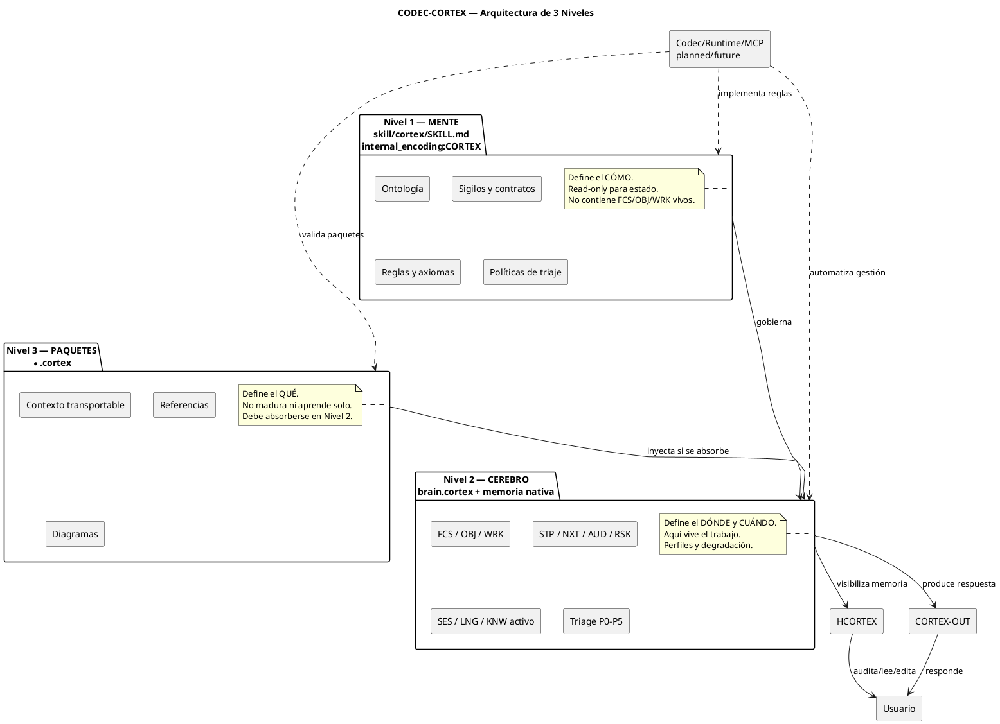
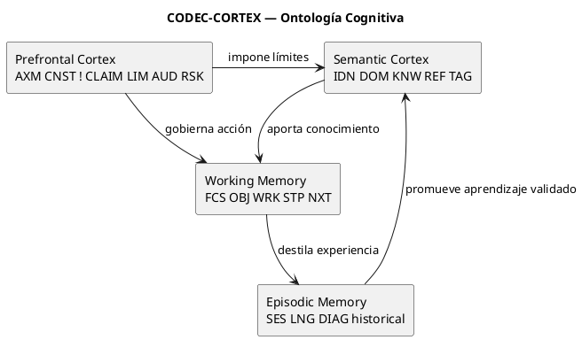
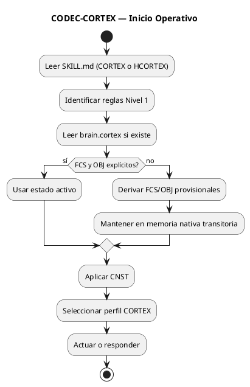
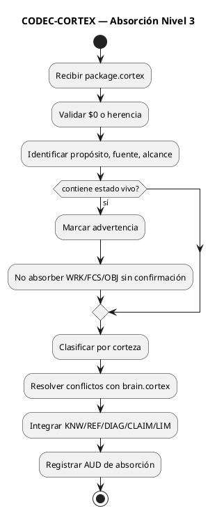
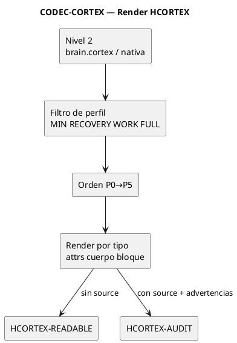

<!-- CODEC-CORTEX
internal_encoding: HCORTEX
source_artifact: skill/hcortex/SKILL.md
source_version: 1.2.0-enterprise-candidate
status: specification
reversible: true
view_schema: 1
-->

<p align="center">
<strong>CODEC-CORTEX</strong><br>
Enterprise Skill Specification — Cognitive Memory Governance & Output Discipline
<br><sub>SKILL_HCORTEX.md · spec 1.2.0-enterprise-candidate · project 0.3.0 · MIT</sub>
</p>

---

**Perfil: CORTEX-FULL**

# CODEC-CORTEX — SKILL_HCORTEX.md

## 0. Control

| Campo | Valor |
|---|---|
| Nombre canónico | `SKILL.md` |
| Sistema | CODEC-CORTEX |
| Propósito | Gobernar cómo agentes leen, producen y gestionan memoria `.cortex` |
| Estado | `specification` |
| Versión | `1.2.0-enterprise-candidate` |
| Licencia | MIT |
| Autoría | Fidel Ernesto Lozada A. |
| Lenguaje estructural | EN (sigilos, handlers, contratos) |
| Lenguaje semántico | Idioma del dominio/usuario |
| Salida humana | HCORTEX / HUMAN-CORTEX = visibilidad humana densa y reversible; CORTEX-OUT = respuesta conversacional |

### Artefactos del sistema

| Artefacto | Codificación | Rol |
|---|---|---|
| `SKILL.md` (raíz) | — | Spec humana canónica |
| `skill/cortex/SKILL.md` | `CORTEX` | Mente del protocolo: contenido altamente denso, autocontenido y parseable para interpretación nativa de agentes |
| `skill/hcortex/SKILL.md` | `HCORTEX` | Human-Cortex: visibilidad humana altamente densa, reversible y con plena correspondencia contextual |
| `brain.cortex` | CORTEX nativo | Estado vivo de trabajo |
| `*.cortex` | CORTEX nativo | Paquetes de contexto transportables |
| HCORTEX display | Markdown | Vista limpia de lectura; si omite `VIEW`/trazabilidad no es artefacto HCORTEX canónico |
| CORTEX-OUT | Markdown | Política de respuesta saliente, fuera del codec |
| `STATUS.md` | — | Registro de verdad |
| `BENCHMARK.md` | — | Evidencia empírica |

### Contenedor `.md` con codificación interna

| Codificación | Uso | Dir. recomendado |
|---|---|---|
| `CORTEX` | Contenido contextual altamente denso, autocontenido y estructuralmente verificable para agentes | `skill/cortex/` |
| `HCORTEX` | Human-Cortex: visibilidad humana altamente densa, reversible y auditable de contenidos CORTEX | `skill/hcortex/` |

Header obligatorio antes de contenido semántico:

```text
<!-- CODEC-CORTEX
internal_encoding: CORTEX|HCORTEX
source_artifact: <logical-source>
source_version: <protocol-version>
status: current|specification|planned|future|experimental|deprecated
-->
```

| Regla | Detalle |
|---|---|
| `.md` optimiza lectura e indexación por agentes estándar |
| `CORTEX` → interpretar como representación densa nativa, autocontenida y verificable |
| `HCORTEX` → interpretar como representación humana densa, reversible y con correspondencia contextual plena |
| HCORTEX canónico DEBE poder participar en decode/encode/verify/roundtrip mediante `VIEW` o trazabilidad equivalente |
| Derivados DEBEN declarar `source_artifact` + `source_version` |

### Correspondencia CORTEX / HUMAN-CORTEX

| Representación | Nombre funcional | Destinatario principal | Propósito |
|---|---|---|---|
| `CORTEX` | Codec-Cortex / representación densa nativa | Agentes LLM/SLM, runtime, CLI, validadores | Interpretación contextual altamente densa, autocontenida y estructuralmente verificable |
| `HCORTEX` | Human-Cortex / representación humana densa | Humanos, auditores, arquitectos y agentes asistidos por lectura humana | Visibilidad humana altamente densa de los contenidos CORTEX, con plena correspondencia contextual |

CORTEX y HCORTEX no son dos fuentes de verdad independientes. Son dos representaciones del mismo contenido contextual.

| Conversión | Criterio esperado |
|---|---|
| `CORTEX → CORTEX` | `byte-identical` si no hubo cambios |
| `HCORTEX → HCORTEX` | `byte-identical` si no hubo cambios |
| `CORTEX → HCORTEX → CORTEX` | `AST-equivalent` o `semantic-equivalent` |
| `HCORTEX → CORTEX → HCORTEX` | `content-equivalent` |
| `DIAG` / bloques verbatim | preservación literal interna |

Una salida Markdown limpia sin `VIEW`, sin trazabilidad o sin cobertura de reversión puede existir como vista de lectura, pero NO DEBE declararse HCORTEX canónico.

### Lenguaje normativo

| Término | Significado |
|---|---|
| **MUST / DEBE** | Obligatorio. Incumplimiento rompe conformidad |
| **MUST NOT / NO DEBE** | Prohibición obligatoria |
| **SHOULD / DEBERÍA** | Recomendación fuerte; omisión requiere justificación explícita |
| **MAY / PUEDE** | Opcional |

### Madurez de claims

| Estado | Significado | Puede declararse como capacidad actual |
|---|---|:---:|
| `current` | Ejecutable por lectura disciplinada | Sí |
| `specification` | Definido normativamente, no necesariamente automatizado | Parcial, con aclaración |
| `planned` | Para fase posterior; requiere implementación | No |
| `future` | Visión empresarial posterior | No |
| `experimental` | Existe, no estable ni canónico | No sin advertencia |
| `deprecated` | Compatibilidad, no recomendado | No |

> **Regla de honestidad:** ningún documento, agente, salida o interfaz DEBE presentar como `current` algo `planned`, `future` o no verificado.

### Identidad y versión

| Identidad | Dueño | Regla |
|---|---|---|
| Proyecto | CODEC-CORTEX | Nombre, autoría, versión normativa, contratos |
| Autoría | Fidel Ernesto Lozada A. | Origen intelectual |
| Skill HCORTEX | `skill/hcortex/SKILL.md` | Human-Cortex canónico: forma humana densa y reversible |
| Skill CORTEX | `skill/cortex/SKILL.md` | Forma densa `internal_encoding:CORTEX` |
| Cerebro operativo | `brain.cortex` local | Estado vivo, no redefine identidad del proyecto |

Derivados DEBEN declarar `source_artifact` + `source_version`. NO inventar versión propia salvo ciclo de release independiente. Plantillas/ejemplos DEBEN usar `<protocol_version>` o marcarse `example`/`template`/`non_operational`. `IDN` DEBE corresponder al proyecto/autoría/protocolo — NO a la identidad funcional del agente ejecutor.

---

## 1. Resumen ejecutivo

CODEC-CORTEX = protocolo de memoria contextual para agentes LLM/SLM. Reemplaza historia lineal por estado cognitivo estructurado, auditable y gobernable.

### Componentes

| # | Componente | Rol |
|:--:|---|---|
| 1 | Mente (`skill/cortex/SKILL.md`) | Reglas, ontología, contratos, algoritmos |
| 2 | Cerebro (`brain.cortex` + nativa) | Estado vivo de trabajo |
| 3 | Paquetes (`*.cortex`) | Payloads transportables |
| 4 | Autocontención `$0` | Glosario local mínimo para arranque seguro |
| 5 | HCORTEX / HUMAN-CORTEX | Visibilidad humana densa y reversible de memoria CORTEX |
| 6 | CORTEX-OUT | Respuesta conversacional eficiente |
| 7 | Codec/runtime/MCP | Automatización — plan/future, nunca asumida |

### Canon mínimo

```text
SKILL gobierna.
brain opera.
package inyecta.
HCORTEX visibiliza con correspondencia.
CORTEX-OUT responde con densidad.
codec automatiza cuando exista.
runtime madura cuando exista.
MCP expone empresarialmente cuando exista.
```

### META-SKILL

| Propiedad | Descripción |
|---|---|
| Naturaleza | Habilidad de gobierno cognitivo que orienta gestión de memoria, foco, restricciones, evidencia y salida |
| No reemplaza | Habilidades de dominio del agente |
| Gobierna | Foco, objetivo, restricciones, evidencia, riesgos, próximos pasos |
| Separa | `brain.cortex` (persistente) / `*.cortex` (transportable) / nativa (transitoria) |
| Activación | Por defecto en continuidad, memoria larga, aprendizaje o claims de madurez |

### Problema y principio

| Aspecto | Contenido |
|---|---|
| Problema | Historial plano mezcla instrucciones, hechos, decisiones, riesgos, progreso → ruido, amnesia, contradicción, degradación por posición |
| Principio rector | Memoria contextual estructurada antes que historia lineal. `$0` dicta sintaxis. Nivel 2 = estado vivo. HCORTEX = visibilidad humana densa, auditable y reversible. CORTEX-OUT = respuesta sin participar en codec. Automatización = codec/runtime solo cuando exista y esté verificada |

---

## 2. Arquitectura de 3 niveles



### Propiedades por nivel

| Propiedad | Nivel 1 — Mente | Nivel 2 — Cerebro | Nivel 3 — Paquetes |
|---|---|---|---|
| Archivo | `skill/cortex/SKILL.md` | `brain.cortex` | `*.cortex` |
| Codificación | `CORTEX` | CORTEX nativo | CORTEX nativo |
| Contiene | Ontología, `$0`, contratos, reglas, límites | `FCS/OBJ/WRK/STP/NXT/AUD/RSK/SES/LNG/KNW` | Info densa, `REF/DIAG/KNW/CLAIM/LIM/SES` |
| Estado vivo | **PROHIBIDO** | Sí | No recomendado |
| Escritura | Solo spec | Si usuario pide, proyecto opera con `brain.cortex`, o cierre aprobado | No muta por sí mismo |
| Precondición | — | Validar `FCS`+`OBJ` antes de actuar; si faltan → detener o derivar provisional | Validar `$0` o herencia |
| Ciclo de vida | Normativo | Persistente por sesión/proyecto | Sin ciclo propio hasta absorción |

### HCORTEX y CORTEX-OUT

| Propiedad | HCORTEX | CORTEX-OUT |
|---|---|---|
| Naturaleza | Human-Cortex Markdown: representación humana densa y reversible de CORTEX | Política independiente de respuesta saliente |
| Es persistencia canónica | Sí, como representación humana canónica si conserva `VIEW`/trazabilidad | No |
| Participa en codec | Sí (decode/encode/verify/roundtrip) | No |
| Usa `$0` | Indirectamente (tipos, contratos, `VIEW`) | No |
| Gobierna respuesta conversacional | No | Sí |

---

## 3. Ontología cognitiva

| Corteza | Sigilos | Persistencia | Propósito |
|---|---|---|---|
| **Semántica** | `IDN`, `DOM`, `KNW`, `REF`, `TAG`, `VIEW` | Larga | Identidad, dominio, conocimiento, referencias |
| **Prefrontal** | `AXM`, `CNST`, `!`, `CLAIM`, `LIM`, `AUD`, `RSK` | Alta | Gobierno, límites, riesgos, reglas, evidencia |
| **Trabajo** | `FCS`, `OBJ`, `WRK`, `STP`, `NXT` | Viva | Foco, meta, progreso, siguiente acción |
| **Episódica** | `SES`, `LNG`, `DIAG` histórico | Variable | Experiencia, lecciones, memoria destilada |



---

## 4. Glosario cognitivo universal `$0`

### Autoridad de `$0`

| Condición | Conformidad |
|---|---|
| Sin `$0` | No conforme |
| Con `$0` mínimo | Operable |
| Con `$0` extendido | Operable + especializado |
| Extensión local | Permitida para nuevos sigilos/tipos/contratos/micro-tokens |
| Redefinición silenciosa | **Prohibida** |
| `skill/cortex/SKILL.md` | Gobierna pero NO es dependencia obligatoria |

`$0` = fuente de verdad estructural local para sigilos, metadato, contratos y procedimiento de render. **NO es memoria de trabajo.**

### Glosario mínimo obligatorio

| Sigilo | Nombre | Tipo | Riesgo | Capa | Descripción |
|---|---|---|:---:|---|---|
| `IDN` | identity | `attrs` | B | Semantic | Identidad del artefacto/sistema |
| `DOM` | domain | `attrs` | B | Semantic | Alcance o dominio operativo |
| `AXM` | axiom | `cuerpo` | H | Prefrontal | Principio no negociable |
| `CNST` | constraint | `attrs` | H | Prefrontal | Límite duro o restricción |
| `FCS` | focus | `attrs` | H | Working | Anclaje de atención |
| `OBJ` | objective | `attrs` | H | Working | Objetivo activo |
| `WRK` | work | `attrs` | M | Working | Estado operativo actual |
| `STP` | step | `attrs` | M | Working | Próxima acción inmediata |
| `REF` | reference | `attrs` | B | Semantic | Referencia a recurso externo |
| `STAT` | status | `attrs` | B | Semantic | Estado o madurez |
| `AUD` | audit | `attrs` | M | Prefrontal | Registro de auditoría |
| `RSK` | risk | `attrs` | M | Prefrontal | Riesgo + mitigación |
| `CLAIM` | claim | `attrs` | M | Prefrontal | Afirmación verificable |
| `LIM` | limit | `attrs` | M | Prefrontal | Límite operativo explícito |
| `KNW` | knowledge | `attrs` | B | Semantic | Conocimiento estable o promovido |
| `SES` | session | `attrs` | M | Episodic | Episodio comprimido |
| `LNG` | lesson | `attrs` | M | Episodic | Lección o patrón a evitar |
| `DIAG` | diagram | `bloque` | M | Episodic/Visual | Diagrama o bloque visual verbatim |
| `!` | rule | `attrs` | H | Prefrontal | Regla operacional compacta |

**Tipos mínimos obligatorios:** `attrs` (pares clave:valor), `cuerpo` (texto literal), `bloque` (multilínea verbatim)

**Micro-glosario mínimo:**

| Token | Expansión | Token | Expansión |
|---|---|---|---|
| `cur` | current | `pln` | planned |
| `fut` | future | `blk` | blocked |
| `min` | minimum | `rec` | recovery |
| `wrk` | work | `full` | full |
| `ok` | success | `fail` | failure |
| `part` | partial | | |

### Extensión local

| # | Regla |
|:--:|---|
| 1 | Nuevo sigilo → registrar en `$0` antes del primer uso |
| 2 | Nuevo micro-token → registrar en `$0` antes del primer uso |
| 3 | Nuevo tipo de expansión → registrar en `$0` antes del primer uso |
| 4 | `attrs-pos` → declarar contrato posicional en `$0` |
| 5 | Sigilos existentes → NO redefinir silenciosamente |
| 6 | Tipo de expansión → NO cambiar para sigilo ya usado |
| 7 | Micro-tokens → NO expandir dentro de `bloque` o `DIAG` |
| 8 | Sigilo desconocido → tratar como no confiable hasta registrar/confirmar |

### Recuperación ante `$0` ausente

| Paso | Acción |
|:--:|---|
| 1 | No ejecutar decisiones operativas |
| 2 | Leer solo en modo recuperación |
| 3 | Identificar sigilos aparentes |
| 4 | Reconstruir `$0` mínimo local |
| 5 | Marcar ambigüedades como `RSK` o `AUD` |
| 6 | Solicitar confirmación humana si riesgo semántico |
| 7 | Reemitir archivo reparado antes de usar como fuente confiable |

### Sigilos canónicos completos

| Sigilo | Nombre | Tipo | Riesgo | Capa | Descripción |
|---|---|---|:---:|---|---|
| `IDN` | identity | `attrs` | B | Semantic | Identidad de proyecto/autoría/protocolo/artefacto |
| `DOM` | domain | `attrs` | B | Semantic | Alcance, dominio, contexto de adopción |
| `KNW` | knowledge | `attrs` | B | Semantic | Conocimiento base o promovido |
| `REF` | reference | `attrs` | B | Semantic | Referencia a documento/archivo/repositorio |
| `TAG` | tag | `attrs` | B | Semantic | Metadatos de clasificación |
| `AXM` | axiom | `cuerpo` | H | Prefrontal | Principio no negociable |
| `CNST` | constraint | `attrs` | H | Prefrontal | Restricción dura o límite operativo |
| `!` | rule | `attrs` | H | Prefrontal | Regla operacional compacta |
| `CLAIM` | claim | `attrs` | M | Prefrontal | Afirmación verificable con evidencia |
| `LIM` | limit | `attrs` | M | Prefrontal | Límite explícito de uso o madurez |
| `AUD` | audit | `attrs` | M | Prefrontal | Registro de verificación/auditoría/evidencia |
| `RSK` | risk | `attrs` | M | Prefrontal | Riesgo identificado con mitigación |
| `FCS` | focus | `attrs` | H | Working | Anclaje de atención activo |
| `OBJ` | objective | `attrs` | H | Working | Meta activa con criterio de éxito |
| `WRK` | work | `attrs` | B | Working | Estado de ejecución actual |
| `STP` | step | `attrs` | M | Working | Próxima acción inmediata |
| `NXT` | next | `attrs` | M | Working | Acción en cola con disparador |
| `SES` | session | `attrs` | M | Episodic | Episodio comprimido I/O/R |
| `LNG` | lesson | `attrs` | M | Episodic | Lección aprendida o patrón operativo |
| `DIAG` | diagram | `bloque` | M | Episodic/Visual | Diagrama PlantUML o bloque visual verbatim |
| `HDL` | handler | `attrs-pos` | M | Semantic | Descriptor de operación o contrato de interfaz |
| `PFL` | pitfall | `attrs` | M | Prefrontal | Antipatrón conocido y prevención |
| `DEP` | dependency | `attrs` | M | Semantic | Dependencia entre artefactos/módulos |
| `DESC` | description | `cuerpo` | B | Semantic | Descripción textual estructurada |
| `ERR` | error | `attrs` | M | Prefrontal | Error conocido con causa y solución |
| `VIEW` | view | `attrs` | B | Semantic | Directiva declarativa de visibilidad y reversión entre CORTEX y HCORTEX |

### Tipos de expansión

| Tipo | Regla | Uso |
|---|---|---|
| `attrs` | Pares `clave:"valor"` o `clave:valor` dentro de `{}` | Datos estructurados parseables |
| `attrs-pos` | Valores posicionales separados por `\|`; orden en `$0` | Compresión máxima, contrato estable |
| `cuerpo` | Texto literal entre `{}` | Axiomas, descripciones, reglas largas |
| `bloque` | Multilínea verbatim | PlantUML, código, tablas crudas |
| `relación` | Forma causal `A -> B` | Flujos simples y transiciones |

| Regla de tipo | Detalle |
|---|---|
| `attrs` MUST usar pares clave/valor |
| `attrs-pos` MUST cumplir orden posicional exacto |
| `attrs-pos` sin campos completos → SHOULD degradar a `attrs` explícito |
| `DIAG` MUST preservar bit a bit |
| Parser MUST NOT inferir tipos por heurística si `$0` los define |

### Micro-glosario extendido

| Prefijo | Semántica | Ejemplos |
|---|---|---|
| `d_` | Acciones | `d1=decode`, `d2=detect`, `d3=decay` |
| `c_` | Formato | `c1=.cortex`, `c2=HCORTEX` |
| `v_` | Validación | `v1=validate`, `v2=verify` |
| `a_` | Archivos | `a1=file`, `a2=files` |
| `s_` | Estructura | `s1=sigil`, `s2=section` |
| `h_` | Handler | `h1=handler` |
| `x_` | Extracción | `x1=extract`, `x2=list` |
| `m_` | Modificación | `m1=modify`, `m2=add` |
| `r_` | Remoción | `r1=remove` |
| `p_` | Promoción | `p1=promote` |
| `f_` | Formato | `f1=format` |
| `t_` | Términos | `t1=structure` |

**Delimitación:** expandir solo si delimitado por espacio, `\|`, `,`, `{`, `}`, salto de línea, inicio/fin de valor. NO expandir dentro de palabras (`param_d1` → no se expande; `"d1"` → se expande si el modo lo permite).

---

## 5. Sintaxis `.cortex`

```text
SIGIL:name{key:"value", key2:value2}
SIGIL:name{
contenido literal o bloque multilínea
}
```

### Secciones

| Sección | Uso |
|---|---|
| `$0` | Glosario universal o herencia |
| `$1` | Identidad y dominio |
| `$2` | Contexto operativo (brain) / propósito (skill) |
| `$3` | Operaciones o handlers |
| `$4` | Reglas |
| `$5` | Pitfalls, riesgos, límites |
| `$6` | Diagramas |
| `$7` | Contratos de campos |
| `$8` | Supervivencia y prioridades |
| `$9` | Perfiles de contexto |
| `$10` | Política de degradación |
| `$11+` | Extensiones gobernadas |

Parser SHOULD aceptar `2`, `$2`, `$2: CONTEXT`, `# -- $2: CONTEXT --` y normalizar a `$2`.

### Identificadores

Instancias en snake_case: `FCS:primary{...}`, `RSK:premature_claim{...}`. Sigilos en MAYÚSCULAS salvo `!` y operadores registrados.

---

## 6. Contratos mínimos por sigilo

| Sigilo | Campos requeridos | Prohibición |
|---|---|---|
| `FCS` | `what`, `priority`, `status`, `survive` | No como estado vivo en Nivel 1 |
| `OBJ` | `goal`, `status`, `success`, `survive` | No objetivos activos en Nivel 1 |
| `WRK` | `phase`, `current`, `blocked`, `survive` | No progreso vivo en Nivel 1/3 |
| `STP` | `action`, `reason`, `owner`, `status`, `survive` | No simular ejecución futura |
| `CNST` | `rule`, `severity`, `survive` | `severity:blocking` debe ser P0/min |
| `CLAIM` | `statement`, `evidence`, `status` | No métricas no medidas como actuales |
| `LIM` | `limit`, `scope`, `status` | No omitir límites de madurez |
| `RSK` | `risk`, `impact`, `mitigation`, `status`, `survive` | No riesgo sin mitigación |
| `AUD` | `event`, `evidence`, `result`, `date` | No como sustituto de benchmark |
| `SES` | `input`, `output`, `outcome`, `date` | No promover a `KNW` sin criterio |
| `LNG` | `type`, `cause`, `lesson`, `prevention` | No convertir experiencia aislada en axioma |
| `KNW` | `topic`, `content`, `status` | No mezclar con estado transitorio |
| `HDL` | Posición definida por `$0` (`operation\|status\|requires\|notes`) | No presentar planificado como implementado |
| `DIAG` | Bloque verbatim válido | No reformatear |
| `VIEW` | `kind`, `target`, `reverse`, `status` | No declarar HCORTEX canónico sin cobertura de reversión |

### Valores permitidos

| Tipo | Valores |
|---|---|
| Estado | `current`, `specification`, `planned`, `future`, `experimental`, `deprecated`, `blocked`, `done` |
| Severidad | `blocking`, `warning`, `info` |
| Prioridad | `high`, `medium`, `low` |

---

## 7. Separación de niveles

### Matriz de ubicación

| Sigilo | Nivel 1 | Nivel 2 | Nivel 3 |
|---|:---:|:---:|:---:|
| `IDN` | Sí | Sí | Sí |
| `DOM` | Sí | Sí | Sí |
| `AXM` | Sí | Limitado | Limitado |
| `CNST` | Sí | Sí | Sí |
| `!` | Sí | Limitado | No rec. |
| `FCS` | Solo contrato/ejemplo | Sí | No rec. |
| `OBJ` | Solo contrato/ejemplo | Sí | No rec. |
| `WRK` | No | Sí | No |
| `STP` | Solo contrato/ejemplo | Sí | No rec. |
| `NXT` | No | Sí | No rec. |
| `SES` | No | Sí | Sí histórico |
| `LNG` | No | Sí | Sí histórico |
| `KNW` | Sí (protocolo) | Sí | Sí |
| `REF` | Sí | Sí | Sí |
| `DIAG` | Sí (normativo) | Sí (operativo) | Sí |
| `AUD` | Sí (spec) | Sí | Sí |
| `RSK` | Sí (protocolo) | Sí | Sí |
| `CLAIM` | Sí | Sí | Sí |
| `LIM` | Sí | Sí | Sí |

### Invariantes

1. Nivel 1 MUST NOT almacenar estado vivo de sesión
2. Nivel 2 MUST contener foco y objetivo para operación persistente; para tareas acotadas sin `brain.cortex`, MAY usar anclajes provisionales en memoria nativa
3. Nivel 3 MUST NOT madurar por sí mismo
4. HCORTEX MUST NOT divergir de CORTEX como fuente independiente; es representación humana correspondiente y reversible
5. Runtime/CLI/MCP MUST NOT asumirse existente sin confirmación de `STATUS.md` o herramienta real

---

## 8. Operación de agentes



### Pre-acción (verificación obligatoria)

- `FCS` activo o provisional
- `OBJ` activo o provisional
- `CNST:blocking` activos
- `LIM` relevantes
- Claims de madurez
- `RSK` activos
- `STP` si aplica

**Contradicción usuario vs `CNST:blocking`** → detener o explicar incompatibilidad.

### Absorción de paquete Nivel 3



### Cierre de sesión

| Producir/actualizar | Condición |
|---|---|
| `SES:last` | Siempre |
| `LNG` | Si hubo error o patrón relevante |
| `AUD` | Si se verificó algo |
| `RSK` | Si quedó riesgo activo |
| `NXT` | Si queda acción pendiente |
| HCORTEX de cierre | Si el humano necesita auditoría |

---

## 9. HCORTEX

### Definición y modos

HCORTEX / HUMAN-CORTEX = representación humana altamente densa, auditable, editable de forma controlada y reversible de contenidos CORTEX. Su objetivo es dar visibilidad humana con plena correspondencia contextual. No exige identidad textual entre formatos, pero sí equivalencia estructural y semántica.

`VIEW` es el contrato que permite que HCORTEX sea humano sin perder reversibilidad. Una directiva `VIEW` declara cómo un conjunto de entradas CORTEX debe expresarse en HCORTEX y cómo debe reconstruirse en dirección inversa. Toda estructura HCORTEX canónica debe estar cubierta por `VIEW` o por un bloque humano explícitamente declarado.

Contenido humano editorial, como encabezados, introducciones o notas de orientación, PUEDE existir en HCORTEX, pero debe declararse como `HUMAN_BLOCK` o mediante una `VIEW` con reversión `preserve_human_block`. En modo estricto, contenido semántico no mapeado DEBE producir error.

| Modo | Uso | Sigilos visibles |
|---|---|---|
| `HCORTEX-READABLE` | Lectura ejecutiva limpia | Ocultos por defecto |
| `HCORTEX-AUDIT` | Auditoría, trazabilidad, depuración | Visibles como `source` |
| `HCORTEX-RECOVERY` | Reconexión tras pérdida de contexto | Solo P0-P2 relevantes |
| `HCORTEX-FULL` | Exportación amplia, gate de salida | Todo lo permitido por FULL |



### Gate de salida

Antes de abandonar CODEC-CORTEX, SHOULD generar HCORTEX-FULL desde Nivel 2. Preserva comprensión humana, evita lock-in y debe permitir reversión semántica hacia CORTEX cuando conserva `VIEW`/trazabilidad. No promete identidad byte-a-byte entre CORTEX y HCORTEX; debe declarar límites de pérdida u omisión.

### Directrices de construcción (D1-D12)

| # | Directriz | Regla | Fundamento |
|:--:|---|---|---|
| D1 | Minimizar prosa | Prosa solo cuando tabla/lista/diagrama no capturen la información | Prosa diluye densidad; tabla de 3 filas = 2 párrafos |
| D2 | Tablas por defecto | Para información con múltiples atributos compartiendo dominio | Escaneo vertical; columnas = dimensiones |
| D3 | Listas para secuencias y reglas | Viñetas = conjuntos paralelos; numeración = secuencia/prioridad | Cada ítem = unidad cognitiva independiente |
| D4 | PUML para flujos y arquitectura | Arquitectura/secuencia/decisión/relación → PlantUML | 20 líneas PUML = 200+ de prosa |
| D5 | Sin ASCII art | PUML en su lugar | No parseable, no portable |
| D6 | Una idea por bloque | No mezclar temas en tabla/lista/párrafo | Bloques atómicos permiten filtrar por P-level |
| D7 | Jerarquía visual estricta | Título → Perfil → secciones P0→P5 → anexos | Orden lectura = orden importancia |
| D8 | Eliminar muletillas | Sin "cabe destacar", "es importante", "como se puede observar" | Tokens sin valor informativo |
| D9 | Cross-reference sobre duplicación | `Ver también: §X` en vez de repetir | Una fuente de verdad |
| D10 | Valores canónicos en columnas | `status`/`priority`/`severity` como columnas estándar con valores del glosario | Consistencia de filtrado |
| D11 | Sin cursiva | `**negrita**` para énfasis, nunca `*cursiva*` | Cursiva reduce legibilidad en bloques densos |
| D12 | Glosario en contexto | Definir sigilos donde se usan por primera vez | El lector no debe saltar a otra sección |

### Jerarquía de formato por contenido

| Tipo de contenido | Formato | Cuándo |
|---|---|---|
| Datos multi-atributo | Tabla `\| attr \| val \|` | 2+ atributos compartiendo dominio |
| Secuencia ordenada | Lista numerada | Orden importa |
| Conjunto paralelo | Lista con viñetas | Orden no importa |
| Regla cond+acción | Tabla compacta `\| Cond \| Acción \|` | Pares lógicos |
| Arquitectura/flujo | PUML `rectangle` | Relaciones espaciales/temporales |
| Principio inmutable | Cita indentada `>` | Verdad única no descomponible |
| Código/template | Bloque verbatim | Sintaxis literal |
| Prosa | Párrafo breve | Solo cuando ningún otro formato aplica |

### Perfiles de contexto

| Perfil | Presupuesto | P-level | Cuándo |
|---|---|---|---|
| `CORTEX-MIN` | ~300t | P0 | Emergencia, bloqueo, solo FCS+OBJ+CNST+STP |
| `CORTEX-RECOVERY` | ~1000t | P0+P1 | Reconexión tras interrupción |
| `CORTEX-WORK` | ~3000t | P0+P1+P2 | Trabajo estándar (default) |
| `CORTEX-FULL` | Sin límite | P0-P5 | Spec completa, auditoría, gate de salida |

**Selección:** explícito > presupuesto > modo > `CORTEX-WORK`. Presupuesto insuficiente → `Perfil: CORTEX-<LEVEL> (segmentado) Segmento: n/total`. Nunca degradar silenciosamente.

### Prioridad cognitiva P0→P5

| P-level | Contenido típico | Sobrevive en | Eliminación |
|:---:|---|---|---|
| **P0** | `FCS`, `OBJ`, `CNST:blocking`, `STP` | MIN, RECOVERY, WORK, FULL | **Nunca** |
| **P1** | `WRK`, `AUD`, `RSK`, `NXT` | RECOVERY, WORK, FULL | Último antes de P0 |
| **P2** | `CLAIM`, `LIM`, `KNW:active`, `LNG:critical` | WORK, FULL | Tras P1 |
| **P3** | `SES:last`, `STAT` | FULL (WORK si espacio) | Tras P2 |
| **P4** | `REF:critical`, `DOC`, `ART` | FULL | Tras P3 |
| **P5** | `DIAG`, `TBL`, histórico, comentarios | FULL | Primero |

**Reglas:** carga P0→P5, degradación P5→P1. Mismo P-level → orden fuente. Sin P-level → después de P5. **Nunca truncar por posición** — eliminar por valor cognitivo.

### Trazabilidad (modo audit)

| Elemento | Formato `source` | Obligatorio en | Opcional en |
|---|---|---|---|
| `attrs` | Columna `source` con `<SIGIL>:<name>` | P0, P1, `survive:min` | P2+ |
| PUML | `' source: DIAG:<name>` como primer comentario | P0, P1 | P2+ |
| `cuerpo` | Línea `source: <SIGIL>:<name>` bajo bloque | P0, P1 | P2+ |

Falta `source` en P0/P1 → renderizar `WARNING: missing source`.

### Reglas PUML

| # | Regla |
|:--:|---|
| 1 | Solo `rectangle` para componentes |
| 2 | `skinparam componentStyle rectangle` obligatorio |
| 3 | `skinparam shadowing false` obligatorio |
| 4 | `title` obligatorio |
| 5 | Sin `{`, `}`, `[`, `]`, `*` en labels |
| 6 | Saltos de línea con `\n` |
| 7 | `@startuml`/`@enduml` balanceados |
| 8 | Preservar verbatim — no reformatear |
| 9 | `note` para aclaraciones laterales |
| 10 | `' source:` en modo audit |

### Procedimiento de render (10 pasos)

| Paso | Acción |
|:--:|---|
| 1 | Resolver perfil: explícito > presupuesto > modo > `CORTEX-WORK` |
| 2 | Declarar `**Perfil: CORTEX-<LEVEL>**` como primera línea |
| 3 | Filtrar por P-level/survive. Sin P-level → P5. Por entrada, no por sección |
| 4 | Resolver tipo desde `$0`: `attrs→tabla`, `cuerpo→bloque indentado`, `bloque→verbatim` |
| 5 | Renderizar entradas filtradas por tipo |
| 6 | Presupuesto insuficiente en auditoría → segmentado explícito |
| 7 | Agregar `source` a tablas P0/P1; PUML: `' source:`; falta → `WARNING` |
| 8 | Múltiples instancias del mismo sigilo → sub-secciones `### <SIGIL>:<name>` |
| 9 | Aplicar estrategia por tipo (tabla/indentado/verbatim) |
| 10 | Ordenar P0→P5. Sin P-level → después de P5. Mismo nivel → orden fuente |

### Anti-patrones

| # | Error | Consecuencia | Prevención |
|:--:|---|---|---|
| A1 | Párrafos multi-tema | Imposible filtrar por P-level | D6 |
| A2 | Info solo en prosa | 3x-5x más tokens que tabla | D2 |
| A3 | Arquitectura en texto | 200+ líneas donde 20 PUML bastan | D4 |
| A4 | Sin declaración de perfil | Lector no sabe qué esperar | §9 Perfiles |
| A5 | Degradación silenciosa | Info crítica ausente sin advertencia | §9 Perfiles |
| A6 | `$0` en HCORTEX | Metadato de IA en vista humana | `$0` solo en `.cortex` y `skill/cortex/` |
| A7 | Cursiva en texto denso | Reduce legibilidad | D11 |
| A8 | Muletillas narrativas | Tokens sin valor | D8 |
| A9 | Duplicación entre secciones | Desincronización en ≤3 ediciones | D9 |
| A10 | ASCII art | No parseable, no portable | D5 |
| A11 | Truncar por posición | Pierde P0 al final | §9 P-levels |
| A12 | Prometer identidad byte-a-byte entre CORTEX y HCORTEX | Claim falso: la equivalencia esperada es estructural/semántica | §9.1 |

### Checklist de construcción

| # | Requisito |
|:--:|---|
| C1 | `**Perfil: CORTEX-<LEVEL>**` primera línea |
| C2 | Sin `$0` (salvo auditoría estructural explícita) |
| C3 | Tablas para >80% de datos multi-atributo |
| C4 | PUML para cada tema de arquitectura/flujo |
| C5 | Sin ASCII art |
| C6 | Sin cursiva |
| C7 | Sin muletillas narrativas |
| C8 | Orden P0→P5 en secciones |
| C9 | `source` en tablas P0/P1 (audit) |
| C10 | Omisiones declaradas explícitamente |
| C11 | PUML: solo `rectangle`, `title`, `skinparam` correcto |
| C12 | `@startuml`/`@enduml` balanceados |
| C13 | Sin promesa de identidad byte-a-byte entre CORTEX y HCORTEX |
| C14 | Una idea por bloque |
| C15 | Cross-references donde hay solapamiento |

### Supervivencia contextual

| Regla | Función |
|---|---|
| `!survive_priority` | P0→min, P1→recovery, P2→work, P3→reduced, P4→basic, P5→full |
| `!survive_degrade` | Reducir presupuesto: descartar P5→P1. P0 nunca. Expandir: recuperar inversamente |
| `!p5_filter` | Presupuesto >3000t o FULL: P5 solo con `survive`, `KNW` companion o valor operacional |

### HCORTEX vs CORTEX-OUT

| Atributo | HCORTEX | CORTEX-OUT |
|---|---|---|
| Origen | `.cortex` / AST decodificado | Razonamiento del agente |
| Propósito | Visibilidad humana densa y reversible de memoria CORTEX | Respuesta conversacional eficiente |
| Participa en codec | Sí | No |
| Usa `$0` | Indirectamente | No |
| Perfiles | MIN, RECOVERY, WORK, FULL | OUT-MIN, OUT-WORK, OUT-AUDIT, OUT-FULL |

---

## 10. CORTEX-OUT

### Decisión arquitectónica

Nombre canónico: **CORTEX-OUT**. `HCORTEX-OUT` PUEDE aparecer como referencia histórica pero NO DEBE usarse como nombre canónico.

```text
HCORTEX    = CORTEX / AST ⇄ Markdown humano denso, auditable y reversible
CORTEX-OUT = razonamiento → respuesta humana eficiente
```

CORTEX-OUT NO participa en: `decode`, `encode`, `verify`, AST, `$0`, contratos de sigilos, roundtrip o persistencia canónica. Esa función corresponde a CORTEX ⇄ HCORTEX.

> **Principio rector:** Maximizar utilidad cognitiva por token sin ocultar incertidumbre, riesgo, límites, evidencia crítica ni restricciones de seguridad.

### Principios normativos

| Principio | Regla |
|---|---|
| Independencia | MUST permanecer fuera del pipeline `.cortex → AST → HCORTEX` |
| Densidad | SHOULD eliminar relleno, recapitulación, cierre decorativo |
| Acción | SHOULD priorizar resultado, criterio, riesgo, acción |
| Honestidad | MUST NOT ahorrar tokens ocultando incertidumbre o límites |
| Adaptividad | SHOULD ajustar extensión por intención, criticidad, necesidad de evidencia |
| No parseabilidad | MUST NO tratarse como `.cortex` |
| No sigilos | MUST NO crear sigilos, alterar `$0`, requerir contratos de parseo |

### Perfiles de salida

| Perfil | Uso | Presupuesto | Bloques típicos |
|---|---|---:|---|
| `OUT-MIN` | Confirmación, bloqueo, respuesta simple | 80-180t | Resultado, Acción |
| `OUT-WORK` | Análisis, diseño, recomendación, revisión | 250-700t | Resultado, Criterio, Acción |
| `OUT-AUDIT` | Coherencia, arquitectura, seguridad, benchmark | 700-1500t | Resultado, Evidencia, Riesgo, Acción |
| `OUT-FULL` | Documento, especificación, informe, entrega | Variable | Entrega, Criterio, Control |

Presupuestos orientativos — no medidos sin benchmark reproducible.

### Bloques canónicos

| Bloque | Propósito | Cuándo |
|---|---|---|
| `Resultado` | Respuesta directa o veredicto | Siempre que haya conclusión |
| `Criterio` | Juicio técnico o decisión razonada | Diseño, análisis, revisión |
| `Evidencia` | Hechos, citas, datos verificables | Auditoría, benchmark, revisión crítica |
| `Riesgo` | Problemas, incoherencias, límites, impacto | Decisiones críticas o incertidumbre |
| `Acción` | Próximo paso, instrucción, recomendación | Cuando exista continuidad |
| `Límite` | Qué no se sabe, no se hizo, no debe asumirse | Incertidumbre o falta de evidencia |
| `Entrega` | Artefacto final, código, texto, tabla | OUT-FULL o artefactos reutilizables |
| `Control` | Qué se modificó, qué pendiente, qué validar | Cierre de trabajos largos |

Usar solo los bloques que agreguen valor. Un CORTEX-OUT correcto puede tener 1-2 bloques.

### Prioridad de salida O0-O5

| Nivel | Contenido | Eliminación |
|---|---|---|
| `O0` | Resultado directo / decisión | Nunca |
| `O1` | Acción siguiente | Solo si no aplica |
| `O2` | Riesgo, límite, incertidumbre crítica | Nunca si hay riesgo real |
| `O3` | Evidencia mínima | Puede omitirse en OUT-MIN si no crítica |
| `O4` | Contexto explicativo | Se elimina bajo presión de tokens |
| `O5` | Desarrollo extendido, ejemplos, historia | Primero |

**Degradación:** eliminar O5 → O4 → O3. Preservar O0. Preservar O2 cuando exista riesgo/incertidumbre material.

### Selección de perfil por intención

| Intención | Perfil |
|---|---|
| Pregunta simple | `OUT-MIN` |
| Confirmación o veredicto rápido | `OUT-MIN` |
| Análisis o diseño | `OUT-WORK` |
| Revisión de coherencia | `OUT-AUDIT` |
| Seguridad, legal, benchmark, arquitectura crítica | `OUT-AUDIT` |
| Documento, skill, contrato, informe | `OUT-FULL` |